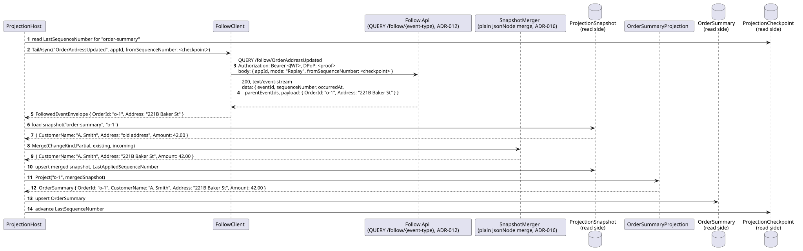
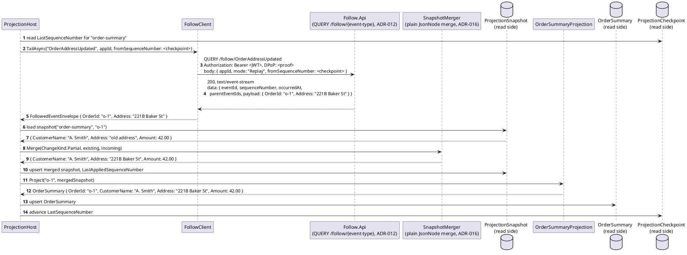
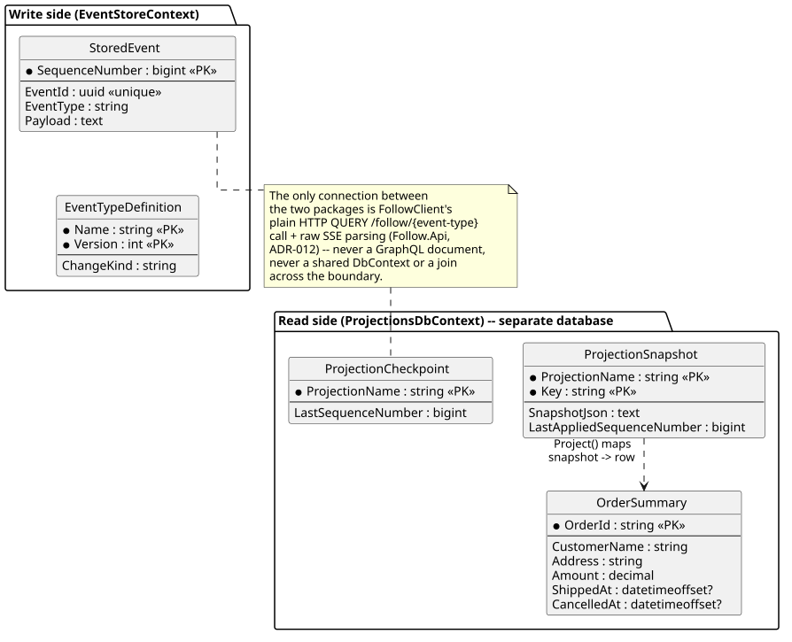
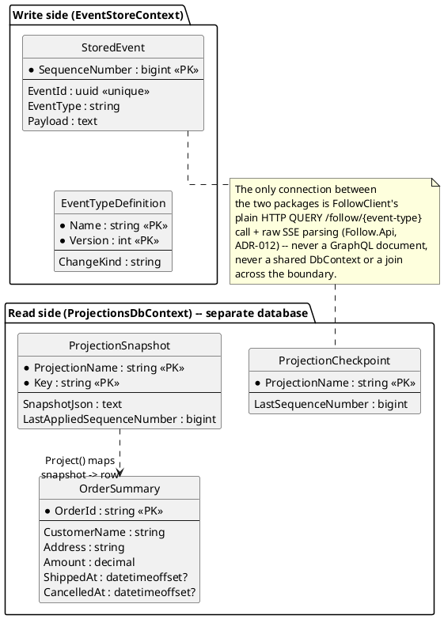

# Feature: CQRS read-model projections (worked example — Orders)

> **Corrected this pass, against the actual `ProjectionHost` code (a
> read-only drift audit flagged both claims below as inaccurate).**
> `ProjectionHost`'s `FollowClient`
> (`src/EventStore.Projections.Host/FollowClient.cs`) does **not** go
> through the GraphQL Gateway at all — it issues a plain, header-based
> HTTP `QUERY /follow/{event-type}` request (`EventStore.Follow.Api`,
> `ADR-012`'s `QUERY` method) with a hand-built JSON body
> `{ appId, mode: "Replay", fromSequenceNumber }`, and parses the response
> as raw Server-Sent Events (`data: {...}\n\n` lines) directly off the
> `HttpResponseMessage` stream — there is no GraphQL document, subscription
> field, or HotChocolate execution anywhere in this path. `ADR-037` moved
> *ad hoc, externally-facing* Follow traffic onto a GraphQL Subscription
> (see [`follow-subscribe.md`](follow-subscribe.md)), but the older bare
> `QUERY /follow/{event-type}` REST+SSE endpoint it was meant to replace is
> still live in the code and is exactly what this internal, first-party
> caller actually uses — the sequence and ER diagrams below describe that
> real transport instead. Partial merges are done by
> `SnapshotMerger.MergePatch`
> (`src/EventStore.Projections.Host/SnapshotMerger.cs`), a plain
> `JsonNode`-based merge with no `Optional<T>` type anywhere in
> `EventStore.Projections.*` — it is **semantically equivalent** to
> `ADR-022`'s three-state (Unspecified/Specified(null)/Specified(value))
> rule (an absent key is left alone, a present `null` clears the field, a
> present value overwrites it), not literally implemented via the
> `Optional<T>` wrapper type, which is a strongly-typed-DTO concern
> elsewhere in this design that this `JsonNode` merge never needed. Every
> `RequiredReadClaim` reference is `RequiredClaims` (`ADR-050`).
> **Corrected, not fixed**: the prior banner claimed a registration
> missing `changeKind` now persists with `202` + `SchemaStatus: invalid`
> rather than a `400` (`ADR-023`) — that's wrong. `ADR-013`'s Problem
> Details table strikes through only the *publish*-time
> `validation-failed`/`unknown-schema-version` rows; the
> `change-kind-required` *registration*-time row is never struck through,
> so `PUT /registry/{event-type}` without `changeKind` still genuinely
> rejects with `400`, exactly as the scenario below already showed —
> `ADR-023`'s persist-everything posture never applied to schema
> registration, only to publish.

Context: design in `../09-cqrs-read-models.md`; decision records `ADR-015`
(projections as Follow consumers), `ADR-016` (`ChangeKind`, centralized
merge, refined by `ADR-022`'s `Optional<T>` per-property patches — see
this doc's own banner above for how that shows up, or rather doesn't,
in `ProjectionHost`'s actual merge code), and `ADR-037` (GraphQL as the
sole *externally-facing* query layer) in `../07-adrs.md`. Builds on
[`follow-subscribe.md`](follow-subscribe.md) for the general Follow
contract, but `ProjectionHost` itself is a first-party, internal caller of
the older, still-live `QUERY /follow/{event-type}` REST+SSE endpoint
(`EventStore.Follow.Api`), not a GraphQL Subscription client — this doc
writes real HTTP request/SSE-response shapes below, not GraphQL documents.

## The example domain

Four event types, chosen specifically to show both `ChangeKind` values and
the read model they build:

| Event type | `ChangeKind` | Carries |
|---|---|---|
| `OrderPlaced` | `Full` | Everything known about a new order: `OrderId`, `CustomerName`, `Address`, `Amount` |
| `OrderAddressUpdated` | `Partial` | Just `OrderId` and the new `Address` |
| `OrderShipped` | `Partial` | Just `OrderId` and `ShippedAt` |
| `OrderCancelled` | `Partial` | Just `OrderId` and `CancelledAt` |

One projection, `OrderSummaryProjection`, keys all four by `OrderId` and
maintains one read-model row per order:

```csharp
public class OrderSummaryProjection : IProjection<OrderSummary>
{
    public string Name => "order-summary";
    public IReadOnlyCollection<string> EventTypes { get; } =
        ["OrderPlaced", "OrderAddressUpdated", "OrderShipped", "OrderCancelled"];

    public string GetKey(string eventType, JsonNode payload) => payload["OrderId"]!.GetValue<string>();

    public OrderSummary Project(string key, JsonNode mergedState) => new()
    {
        OrderId = key,
        CustomerName = mergedState["CustomerName"]?.GetValue<string>(),
        Address = mergedState["Address"]?.GetValue<string>(),
        Amount = mergedState["Amount"]?.GetValue<decimal>(),
        ShippedAt = mergedState["ShippedAt"]?.GetValue<DateTimeOffset?>(),
        CancelledAt = mergedState["CancelledAt"]?.GetValue<DateTimeOffset?>(),
    };
}
```

Note what `Project` does *not* do: no merge logic, no `ChangeKind` branch,
no `Optional<T>` unwrapping, no knowledge of which event just arrived — by
the time `ProjectionHost` calls it, `mergedState` already reflects every
field any prior event for this `OrderId` contributed, per `ADR-016`,
refined by `ADR-022`'s `Optional<T>`-aware fold below.

## Sequence diagram — one event's trip from Follow to the read model





`Amount`, omitted from `OrderAddressUpdated`'s payload, survives the merge
unchanged — `SnapshotMerger.MergePatch`'s plain `foreach (var (key, value)
in patchObject)` loop only ever visits keys actually present in the
incoming payload, so an absent key is left untouched automatically. This
is the same outcome `ADR-022`'s `Optional<T>`-aware three-state rule
describes (refining `ADR-016`'s original whole-payload-merge wording), but
reached here without the wrapper type itself — see this doc's own banner
above. See the "explicit null clears a field" scenario below for the
present-but-`null` case this same loop handles differently (a present key
whose value is JSON `null` enumerates with a `null` CLR reference, so
`result[key] = value` clears it, matching `Specified(null)`).

## Data model (ER diagram) — the write/read boundary





## Salt (UI mockup)

Not applicable — the read model is queried directly (a plain SQL `SELECT`
against `OrderSummary`, or a thin read-only API over it, out of scope
here); there is no UI surface in this design.

## Gherkin

```gherkin
Feature: CQRS read-model projections (Orders example)
  As a system building query-optimized read models from the event stream
  I want a projection to correctly apply Full and Partial events
  So that a read model reflects the current state of an order without ever querying the write side directly

  # ProjectionHost authenticates as its own client (e.g. "projections-client",
  # scope events:follow) -- see auth.md's seeded-clients table.

  Background:
    Given the event type "OrderPlaced" version 1 is registered with ChangeKind "Full"
    And the event type "OrderAddressUpdated" version 1 is registered with ChangeKind "Partial"
    And the event type "OrderShipped" version 1 is registered with ChangeKind "Partial"
    And the event type "OrderCancelled" version 1 is registered with ChangeKind "Partial"
    And the "order-summary" projection is running, subscribed to all four event types

  Scenario: A Full event establishes the read model row from scratch
    When an "OrderPlaced" event is published with body:
      """
      { "OrderId": "o-1", "CustomerName": "A. Smith", "Address": "10 Downing St", "Amount": 42.00 }
      """
    Then eventually the "OrderSummary" row for "o-1" should equal:
      """
      { "OrderId": "o-1", "CustomerName": "A. Smith", "Address": "10 Downing St", "Amount": 42.00, "ShippedAt": null, "CancelledAt": null }
      """

  Scenario: A Partial event merges onto existing state, leaving untouched fields alone
    Given an "OrderPlaced" event was published for "o-1" with body { "OrderId": "o-1", "CustomerName": "A. Smith", "Address": "10 Downing St", "Amount": 42.00 }
    When an "OrderAddressUpdated" event is published with body:
      """
      { "OrderId": "o-1", "Address": "221B Baker St" }
      """
    Then eventually the "OrderSummary" row for "o-1" should have Address "221B Baker St"
    And the "OrderSummary" row for "o-1" should still have CustomerName "A. Smith" and Amount 42.00

  Scenario: Multiple independent Partial events each merge without clobbering the others' fields
    Given an "OrderPlaced" event was published for "o-1" with body { "OrderId": "o-1", "CustomerName": "A. Smith", "Address": "10 Downing St", "Amount": 42.00 }
    When an "OrderShipped" event is published with body { "OrderId": "o-1", "ShippedAt": "2026-01-05T10:00:00Z" }
    And an "OrderCancelled" event is published with body { "OrderId": "o-1", "CancelledAt": "2026-01-06T10:00:00Z" }
    Then eventually the "OrderSummary" row for "o-1" should have both ShippedAt "2026-01-05T10:00:00Z" and CancelledAt "2026-01-06T10:00:00Z"
    And Address should still be "10 Downing St"

  Scenario: An explicit null in a Partial event's payload clears the field, unlike an absent one
    Given an "OrderPlaced" event was published for "o-1" with body { "OrderId": "o-1", "CustomerName": "A. Smith", "Address": "10 Downing St", "Amount": 42.00 }
    When an "OrderAddressUpdated" event is published with body:
      """
      { "OrderId": "o-1", "Address": null }
      """
    Then eventually the "OrderSummary" row for "o-1" should have Address equal to null
    And the "OrderSummary" row for "o-1" should still have CustomerName "A. Smith" and Amount 42.00
    # Specified(null) clears the property outright -- a different outcome
    # from simply omitting Address (the "leaving untouched fields alone"
    # scenario above), which leaves the prior value in place instead
    # (ADR-022, refining ADR-016's original whole-payload-merge rule,
    # which deliberately didn't support an explicit clear at all).

  Scenario: A masked/absent field in a Partial event's payload is ignored on merge, not overlaid as a placeholder
    Given "OrderAddressUpdated" is registered with a Read-direction entry in RequiredClaims of "clearance:secret"
    And the "order-summary" projection's client lacks the "clearance:secret" claim
    And an "OrderPlaced" event was published for "o-1" with body { "OrderId": "o-1", "CustomerName": "A. Smith", "Address": "10 Downing St", "Amount": 42.00 }
    When an "OrderAddressUpdated" event is published with body { "OrderId": "o-1", "Address": "221B Baker St" }
    Then the projection cannot see that event at all (RequiredClaims gates connect time, ADR-050)
    And the "OrderSummary" row for "o-1" should still have Address "10 Downing St", unchanged
    # Masked/absent is treated as Unspecified, never as Specified(null) --
    # the scenario immediately above is the one case that DOES clear the
    # field; this is deliberately not that case (ADR-022's own note that
    # masking's "treat as absent" guidance is unchanged by Optional<T>).

  Scenario: Registering an event type without ChangeKind is rejected
    When I PUT to "/registry/OrderRefunded" with a body that omits "changeKind"
    Then the response status should be 400
    # Registration is a control-plane action, not a publish -- ADR-023's
    # persist-everything posture never applied to it, and ADR-013's
    # change-kind-required row is never struck through. Still a real 400.

  Scenario: Full rebuild from scratch reproduces the same end state as incremental application
    Given an "OrderPlaced" event was published for "o-1" with body { "OrderId": "o-1", "CustomerName": "A. Smith", "Address": "10 Downing St", "Amount": 42.00 }
    And an "OrderAddressUpdated" event was published for "o-1" with body { "OrderId": "o-1", "Address": "221B Baker St" }
    And an "OrderShipped" event was published for "o-1" with body { "OrderId": "o-1", "ShippedAt": "2026-01-05T10:00:00Z" }
    And the "order-summary" projection has incrementally applied all three events
    When the "order-summary" projection's read-model table and snapshots are truncated, its checkpoint reset to 0, and it is restarted
    Then eventually the "OrderSummary" row for "o-1" should exactly match the state before the rebuild

  Scenario: Incremental resume after downtime delivers no gap and no duplicate
    Given an "OrderPlaced" event was published for "o-1" and the "order-summary" projection processed it, advancing its checkpoint
    And the "order-summary" projection is then stopped
    And an "OrderShipped" event is published for "o-1" while the projection is stopped
    When the "order-summary" projection is restarted
    Then it resumes with a fresh QUERY /follow/OrderShipped request, body { appId, mode: "Replay", fromSequenceNumber: <its last checkpoint> }
    And the "OrderShipped" event is applied exactly once
    And no event already reflected in the OrderSummary row is re-applied in a way that would be observable (idempotent upsert)
```
