# Feature: Device input integration (`IDeviceInputSource`)

Context: `ADR-070`
(`../adrs/adr-070-device-input-integration.md`) adds a new
extensibility seam, `IDeviceInputSource` (`../extensibility-points.md`'s
row for it), letting the MVVM client (`ADR-039`,
[`mvvm-client.md`](mvvm-client.md)) read from a connected physical
device with no network round trip — the property offline capture needs.
Real browser platform capability was researched before designing
anything bespoke (this project's standing convention): **WebUSB**
(~76% global support), **Web Serial** (~72%), and **WebHID** (~27%, the
weakest) are Chromium-only, and **Web Bluetooth** has zero support in
Firefox or Safari at all (Mozilla has explicitly declined it; WebKit
ships none of its code). One small adapter exists per hardware
interface — `WebUsbInputSource`, `WebHidInputSource`,
`WebSerialInputSource`, `WebBluetoothInputSource` — plus
`NativeBridgeInputSource`, which talks to a local companion application
over a `localhost` WebSocket, for Firefox/Safari or any device whose
interface none of the four browser APIs reach. Which adapter applies is
dictated by the physical device's own interface, not a deployment-wide
pick, and multiple adapters are routinely active at once in the same
client (the same multi-simultaneous-implementation shape `ADR-057`'s
`IErasureKeyStore` already established for a different seam). All four
browser APIs require a secure context and an explicit user gesture that
triggers a native device-picker dialog — the browser platform's own
consent mechanism, not something this framework layers on top.

**Out of scope, deliberately, with a pointer to where each is covered
instead**: captured readings feed `ADR-039`'s existing durable client
outbox completely unchanged — this doc does not re-derive the
outbox's queue/flush/durability mechanics; see
[`mvvm-client.md`](mvvm-client.md) for that. Server-side mapping to a
Streaming Channel is shown below only at the choice-point level — the
channel/sample data shape itself (`TelemetryChannel`/`TelemetrySample`)
is fully covered in [`streaming-channels.md`](streaming-channels.md) and
`../data/streaming-and-attachments.md`, not repeated here. The
non-authoritative-capture trust axis (`AuthorityStatus`, `ADR-035`) is
exercised below only at the one decision point relevant to a captured
device reading — the full mechanic (`authorityDecision` events,
`RejectionBehavior`, the annotate-vs-compensate fork) is
[`non-authoritative-capture.md`](non-authoritative-capture.md)'s own
concern. Self-attested device identity via DID/UCAN (`ADR-036`) is
named as a possibility but not re-derived here.

## Sequence diagram — capturing via a browser Web Hardware API adapter

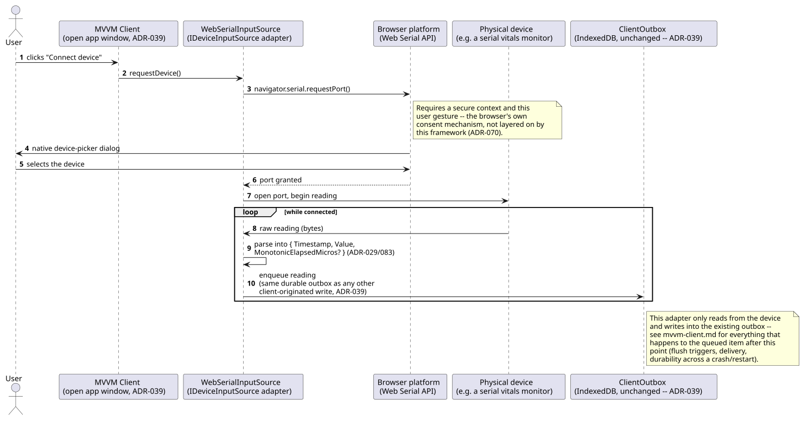

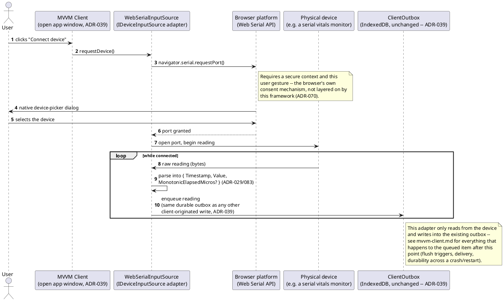

## Sequence diagram — Firefox/Safari fallback via a native bridge companion app

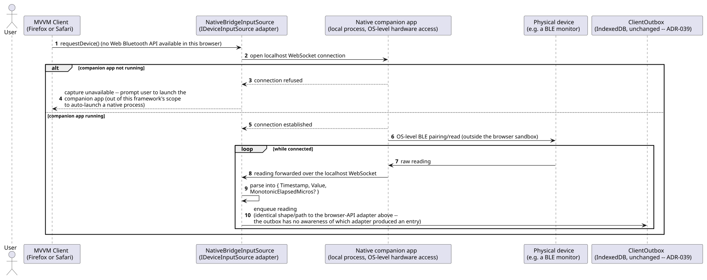

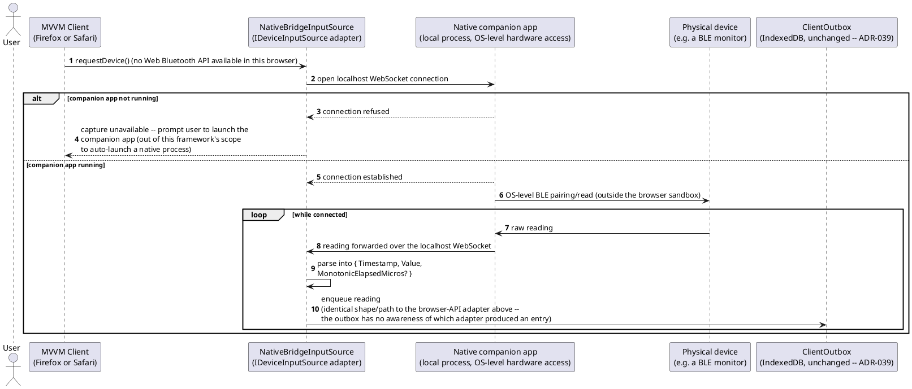

The companion app is a real, separate piece of software this framework
does not build for the deployer — `ADR-070` names it as "the same shape
real BLE-health-device bridges already use," not a mechanism invented
here.

## Sequence diagram — server-side mapping choice and non-authoritative default

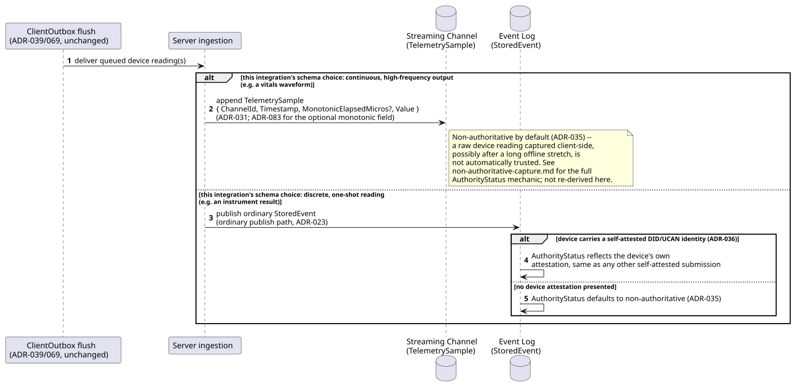

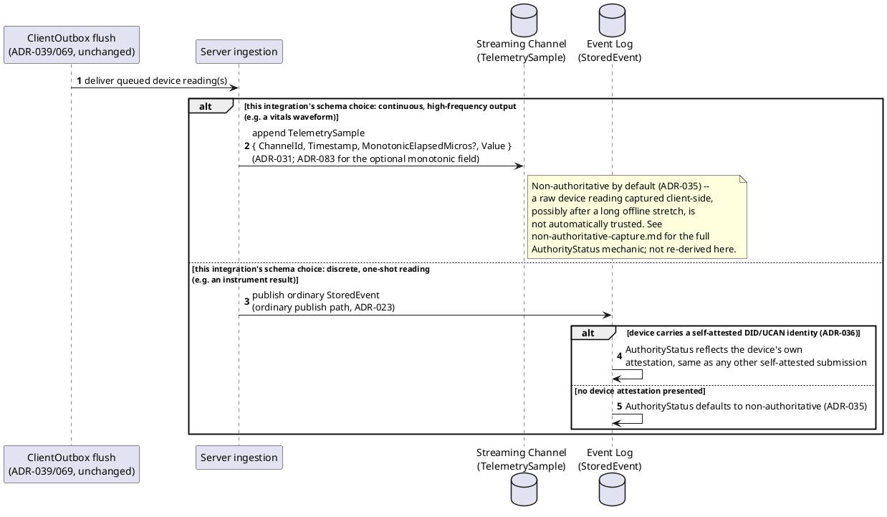

Which branch a given integration takes is a per-integration schema
choice `ADR-070` states explicitly, not a framework-wide rule — the
same reading type is never split across both paths.

## Data model (ER diagram)

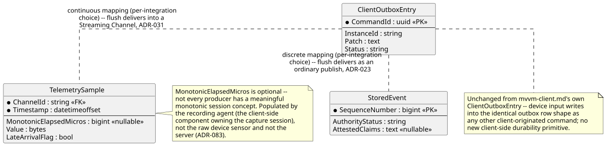

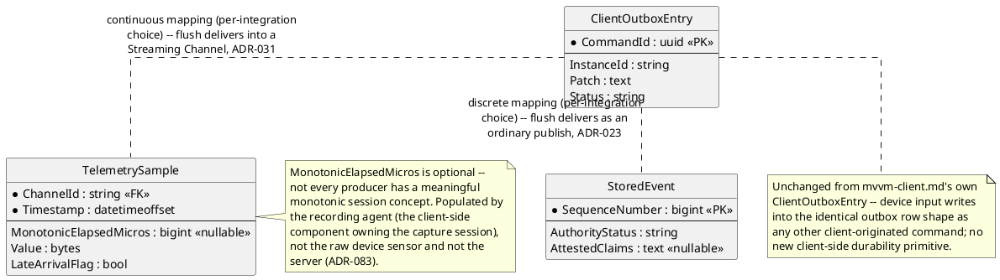

Full `TelemetrySample`/`StoredEvent` column sets are in
`../data/streaming-and-attachments.md` and `../data/event-log.md`
respectively — this diagram shows only the two mapping destinations a
device-sourced reading can reach.

## Salt (UI mockup)

A real UI surface exists here — the MVVM client itself
(`ADR-039`) — shown as a 4-screen flow: connect a device, the
browser's own native picker (acknowledged, not designed by this
framework), a live connected-devices dashboard, and a reading's
diagnostic detail view (the concrete surface for `ADR-083`'s clock-lie
comparison).

**Screen 1: Connect a Device** — the user picks which adapter to try;
this list is populated from whichever `IDeviceInputSource`
implementations are registered for this client build.

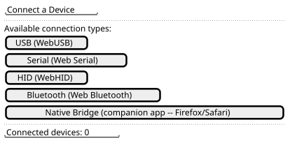

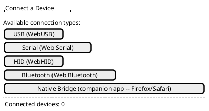

Clicking a connection-type button triggers that adapter's
`requestDevice()` call, which hands control to the browser platform —
screen 2.

**Screen 2: Browser-native device picker (not this framework's UI)** —
shown for completeness, since the sequence diagram above depends on it,
but its exact appearance is the browser's own, not designed here.

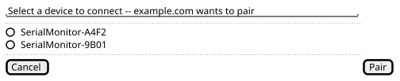

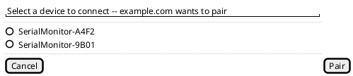

Selecting a device and confirming returns control to the MVVM client,
which now shows that device as connected — screen 3.

**Screen 3: Connected Devices dashboard** — one row per active adapter,
live readings streaming in, using the same generic flag convention
`mvvm-client.md` already establishes for `AuthorityStatus`.


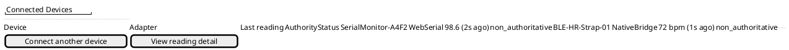

Selecting a reading's detail opens screen 4.

**Screen 4: Reading diagnostic detail** — the concrete surface where
`ADR-083`'s wall-clock-vs-monotonic comparison is visible; detection
itself is downstream application-level analysis (`ADR-083`), not a new
framework mechanism, but the two captured values are exactly what a
diagnostic view like this one would render side by side.


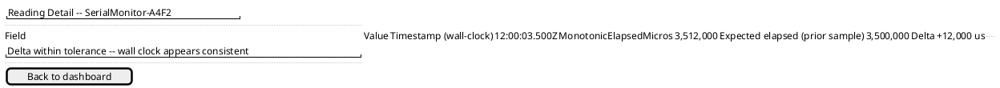

## Gherkin

```gherkin
Feature: Device input integration (IDeviceInputSource)
  As a user of the MVVM client
  I want to capture readings from connected physical devices, online or offline
  So that device data reaches the server durably regardless of which hardware
    interface or browser is in use

  Background:
    Given the event type "InstrumentReading" is registered as a discrete reading mapping
    And the channel "vitals-waveform-1" is registered as a continuous Streaming Channel mapping

  Scenario: Connecting a device via a browser Web Hardware API requires an explicit user gesture
    When the user clicks "Connect device" and selects "Serial (Web Serial)"
    Then the browser's native device-picker dialog should be shown
    And no device connection should be attempted without that user gesture

  Scenario: A captured reading feeds the existing durable outbox unchanged
    Given a WebSerialInputSource adapter is connected to "SerialMonitor-A4F2"
    When the device produces a reading
    Then the reading should be enqueued in the same ClientOutbox used by any other client-originated command
    And the reading should survive the app process restarting before the next flush
    # The outbox mechanics themselves are mvvm-client.md's concern -- this
    # scenario only checks device input feeds the same mechanism, unchanged.

  Scenario: Multiple adapters are active simultaneously in the same client
    Given a WebSerialInputSource adapter is connected to "SerialMonitor-A4F2"
    And a WebBluetoothInputSource adapter is connected to "BLE-HR-Strap-01"
    When both devices produce readings at the same time
    Then both readings should be enqueued independently
    And neither adapter's capture should block or interfere with the other's

  Scenario: Firefox falls back to the native bridge for a device Web Bluetooth cannot reach
    Given the client is running in Firefox, which has no Web Bluetooth support
    And a native companion app is running and reachable over a localhost WebSocket
    When the user connects "BLE-HR-Strap-01"
    Then the NativeBridgeInputSource adapter should be used instead of a browser Web Hardware API
    And the resulting reading should be enqueued in the outbox identically to a browser-API-captured reading

  Scenario: The native bridge fallback surfaces a clear state when the companion app isn't running
    Given the client is running in Safari, which has no Web Serial, WebHID, or Web Bluetooth support
    And no native companion app process is currently running
    When the user attempts to connect a device
    Then the client should report capture as unavailable
    And the user should be prompted to launch the companion app

  Scenario: A continuous device output maps to a Streaming Channel, not an ordinary event
    Given "vitals-waveform-1" is registered as a continuous Streaming Channel mapping
    When a connected device produces high-frequency waveform readings
    Then each reading should be appended as a TelemetrySample on channel "vitals-waveform-1"
    And no StoredEvent should be published per individual sample

  Scenario: A discrete device reading maps to an ordinary published event, not a Streaming Channel
    Given "InstrumentReading" is registered as a discrete reading mapping
    When a connected instrument produces a single one-shot result
    Then an ordinary StoredEvent should be published for that reading
    And no TelemetrySample should be appended for it

  Scenario: A device-captured reading defaults to non-authoritative
    Given a connected device carries no self-attested DID/UCAN identity
    When it produces a reading that is delivered to the server
    Then the resulting record's AuthorityStatus should default to non-authoritative
    # Full AuthorityStatus mechanics are non-authoritative-capture.md's own
    # concern -- this scenario only checks the device-input default.

  Scenario: A device with a self-attested identity carries its own attestation through
    Given a connected device presents a self-attested DID/UCAN identity (ADR-036)
    When it produces a reading that is delivered to the server
    Then the resulting record's AuthorityStatus should reflect that device's own attestation
    And it should not be forced to the default non-authoritative status

  Scenario: A recording agent captures a monotonic elapsed time alongside wall-clock Timestamp, enabling clock-lie detection
    Given a recording agent has started a session for channel "vitals-waveform-1"
    And it captures TelemetrySample readings with both wall-clock Timestamp and MonotonicElapsedMicros populated
    When a downstream analysis compares consecutive samples' claimed wall-clock deltas against their actual monotonic deltas
    And one sample's wall-clock delta diverges sharply from its monotonic delta
    Then that divergence should be flagged as a suspiciously inconsistent wall clock by the downstream analysis
    # Detection is application-level analysis over already-captured data
    # (ADR-083), not a new framework mechanism -- the framework's job is
    # only capturing both values side by side, shown in screen 4 above.
    # A fixed-rate sensor with no client-side recording-agent software has
    # nothing to report here, since MonotonicElapsedMicros is optional.
```
