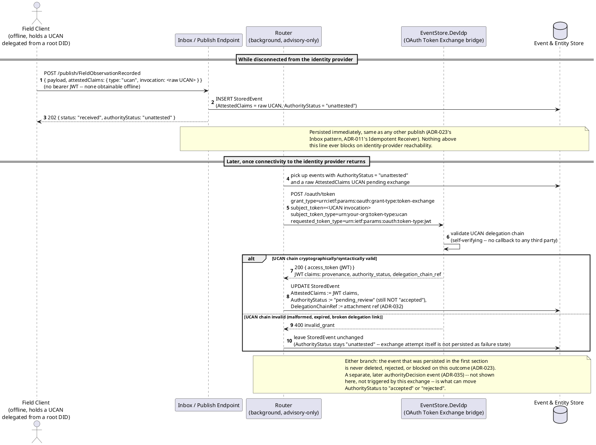
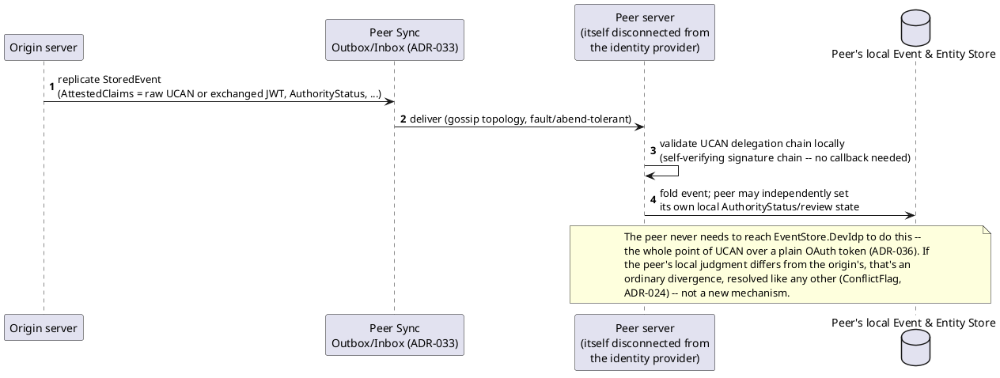

# Feature: DID/UCAN self-attested offline capture, exchanged for a bearer JWT (ADR-036)

Context: decision record [`ADR-036`](../adrs/adr-036-did-ucan-token-exchange.md)
in `../07-adrs.md`; the trust-axis fields this ADR's JWT claims populate —
`AttestedActorId`, `AttestedClaims`, `AuthorityStatus`, `AuthorityDecisionRef`
on `StoredEvent` — are defined in [`ADR-035`](../adrs/adr-035-non-authoritative-capture.md)
and `../data/event-log.md`; persist-first ingestion (`Inbox`/`Router` split,
never blocking on anything downstream) is `ADR-023`; peer replication of an
unattested event is `ADR-033`; `delegation_chain_ref` reuses `ADR-032`'s
content-addressed attachment storage rather than inlining the full chain.

This doc **complements [`auth.md`](auth.md), it doesn't duplicate it**.
`auth.md` covers the ordinary case: a known service client gets a bearer JWT
directly from `/connect/token` via `client_credentials`, and every request
carries that JWT from the start. This doc covers the case `auth.md`'s flows
cannot: an actor (typically a disconnected field client) who cannot reach
`EventStore.DevIdp` *at the moment the event is captured at all*. That actor
submits a self-attested UCAN invocation instead of a bearer JWT; the event
is persisted immediately regardless (`ADR-023`); the UCAN is only turned
into an ordinary bearer JWT later, server-side, once some server in the
system can reach the identity provider — via OAuth 2.0 Token Exchange
(RFC 8693), not via anything the disconnected client does itself. Once that
exchange succeeds, the resulting JWT is indistinguishable from any other
token `auth.md` already describes — this doc is entirely about how that JWT
comes to exist for an actor who couldn't get one the normal way, not about a
second authorization mechanism running in parallel.

## Sequence diagram — disconnected capture, then later token exchange



## Sequence diagram — a disconnected peer validates the same UCAN chain locally



## Data model (ER diagram)

Not applicable — this feature introduces no new persistent entity or
column. `AttestedActorId`, `AttestedClaims`, `AuthorityStatus`, and
`AuthorityDecisionRef` already exist on `StoredEvent` (`../data/event-log.md`),
added by `ADR-035`; this ADR's JWT claims (`provenance`, `authority_status`,
`delegation_chain_ref`) map directly onto those same fields rather than
adding new ones. `delegation_chain_ref` is a reference into `ADR-032`'s
existing content-addressed attachment store, not a new blob-storage column.

## Salt (UI mockup)

Not applicable — this is a server-side ingestion/token-exchange mechanism
with no UI surface of its own. (`ADR-039`'s client rendering of
`unattested`/`pending_review` flags is covered by `ADR-035`'s own
consequences, not by this doc.)

## Gherkin

```gherkin
Feature: DID/UCAN self-attested offline capture, exchanged for a bearer JWT
  As a disconnected field actor
  I want to submit an event with a self-attested UCAN instead of a bearer JWT
  So that capture never blocks on identity-provider reachability, while the
  claim can still be cryptographically exchanged and reviewed later

  # This file assumes ADR-023's persist-everything posture (202 + status
  # envelope, never a blocking 400 for content reasons) and ADR-035's
  # AuthorityStatus lifecycle throughout. See auth.md for the ordinary
  # client_credentials bearer-token flow this one supplements, not replaces.

  Background:
    Given the identity provider is EventStore.DevIdp, performing OAuth 2.0
      Token Exchange (RFC 8693) for self-attested UCANs (ADR-036)
    And the event type "FieldObservationRecorded" version 1 is registered with schema:
      """
      { "type": "object", "properties": { "Notes": { "type": "string" } }, "required": ["Notes"] }
      """
    And client "field-actor-1" holds a UCAN invocation delegated from a
      trusted root DID, proving capability to submit "FieldObservationRecorded" events

  Scenario: An event submitted with a raw UCAN while the identity provider is unreachable persists immediately
    Given the identity provider is unreachable from "field-actor-1"
    When I POST to "/publish/FieldObservationRecorded" with body:
      """
      { "payload": { "Notes": "well level nominal" }, "attestedClaims": { "type": "ucan", "invocation": "<raw UCAN invocation>" } }
      """
    Then the response status should be 202
    And the response body should have "status": "received"
    And the response body should have "authorityStatus": "unattested"
    And the event should be durably persisted before any token exchange is attempted

  Scenario: Once connectivity returns, the raw UCAN is exchanged for a bearer JWT carrying provenance, authority_status, and delegation_chain_ref claims
    Given a "FieldObservationRecorded" event "obs-1" was persisted while offline as above, with authorityStatus "unattested"
    And connectivity to EventStore.DevIdp has now been restored
    When the Router attempts attestation exchange for "obs-1" via
      "POST /oauth/token" with "grant_type=urn:ietf:params:oauth:grant-type:token-exchange"
      and "subject_token" set to the raw UCAN invocation
    Then EventStore.DevIdp should validate the UCAN delegation chain and return a JWT
      whose claims include "provenance", "authority_status", and "delegation_chain_ref"
    And the stored event "obs-1" should have its AttestedClaims updated from the JWT claims
    And the stored event "obs-1" should have its DelegationChainRef set to an ADR-032 attachment reference

  Scenario: A syntactically invalid UCAN fails exchange, but the event stays persisted and unattested
    Given a "FieldObservationRecorded" event "obs-2" was persisted while offline with a malformed UCAN invocation
    And connectivity to EventStore.DevIdp has now been restored
    When the Router attempts attestation exchange for "obs-2"
    Then EventStore.DevIdp should reject the exchange with "invalid_grant"
    And the stored event "obs-2" should remain in the store, unchanged
    And the stored event "obs-2"'s authorityStatus should remain "unattested"
    # Persist-everything (ADR-023) applies to the exchange outcome too --
    # a failed exchange never deletes or rejects the original event.

  Scenario: A successful token exchange does not by itself upgrade AuthorityStatus to accepted
    Given a "FieldObservationRecorded" event "obs-1" whose UCAN was successfully exchanged, per above
    Then the stored event "obs-1"'s authorityStatus should be "pending_review", not "accepted"
    And the stored event "obs-1"'s AuthorityDecisionRef should be null
    # Cryptographic validity of the exchange and authoritative approval
    # are kept deliberately separate (ADR-036) -- only an authorityDecision
    # event (ADR-035) can move authorityStatus to "accepted".

  Scenario: A separate authorityDecision event is what upgrades AuthorityStatus to accepted
    Given a "FieldObservationRecorded" event "obs-1" with authorityStatus "pending_review", per above
    When an authorized reviewer submits an authorityDecision event
      { "targetEventId": "obs-1", "decision": "accepted", "decidingActorId": "reviewer-1", "reason": "delegation chain matches known field roster" }
    Then the stored event "obs-1"'s authorityStatus should become "accepted"
    And the stored event "obs-1"'s AuthorityDecisionRef should point at the authorityDecision event

  Scenario: A receiving peer that is itself offline from the identity provider can still validate the UCAN chain locally
    Given peer server "region-b" received event "obs-1" (including its raw UCAN invocation) via Peer Sync (ADR-033)
    And "region-b" has no connectivity to EventStore.DevIdp
    When "region-b" validates the UCAN delegation chain locally
    Then validation should succeed without any call back to the identity provider
    # UCANs are self-verifying by construction (ADR-036) -- this is what
    # makes offline peer replication of attested claims possible at all;
    # a plain OAuth access token could not be validated this way.

  Scenario: Once exchanged, the resulting bearer JWT is treated identically to any other bearer token downstream
    Given a "FieldObservationRecorded" event "obs-1" whose UCAN was successfully exchanged for a bearer JWT, per above
    Then the Router and fold step should read authorityStatus off the event/JWT claims
      without parsing any UCAN- or DID-specific structure themselves
    # Encapsulation is the point (ADR-036): no downstream service needs to
    # understand what a UCAN or DID even is, same as auth.md's ordinary
    # client_credentials JWTs.
```
