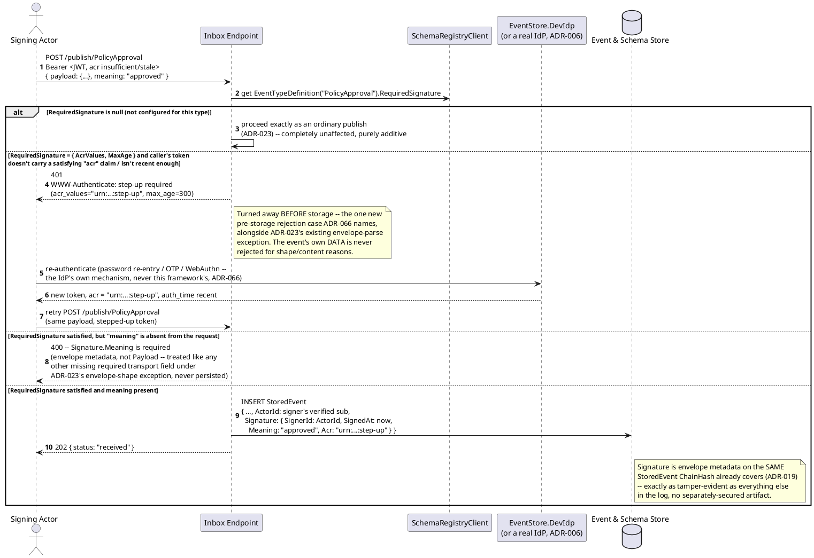
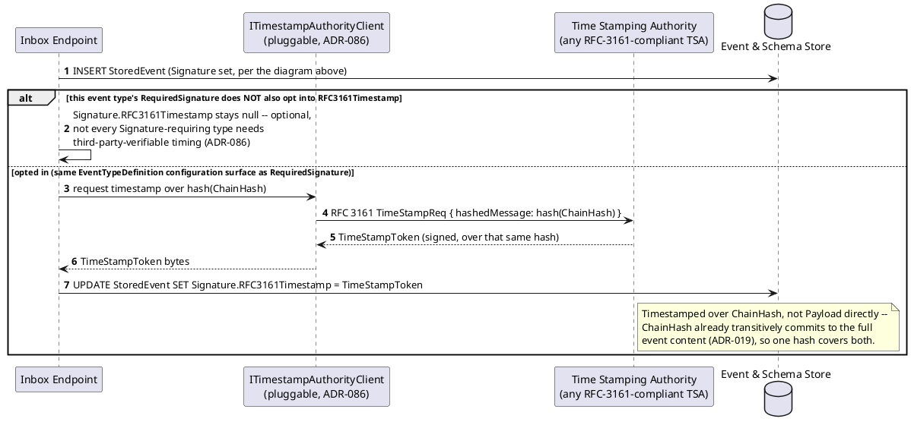
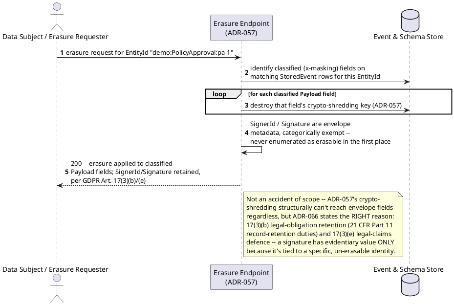
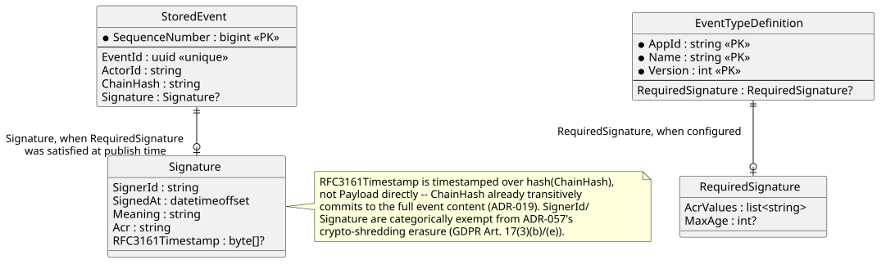
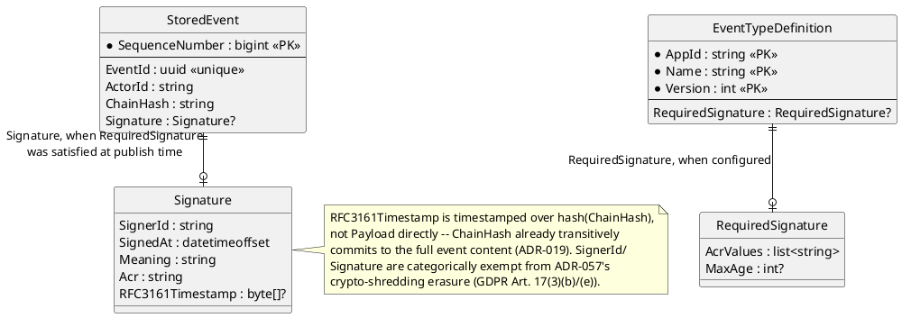
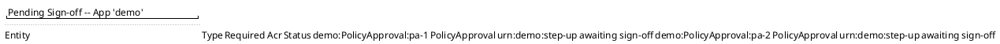
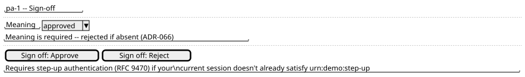
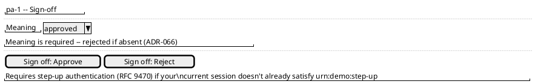
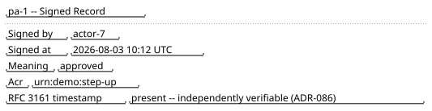
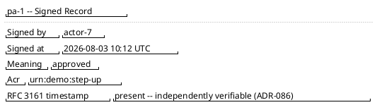

# Feature: Digital Sign-off (RFC 9470 step-up authentication + envelope `Signature`)

Context: decision record `ADR-066` in `../07-adrs.md` (`EventTypeDefinition.
RequiredSignature`, the RFC 9470 step-up challenge, the envelope `Signature`
object, the `ADR-057` erasure exemption) — folded in below as its own
section, `ADR-086` (RFC 3161 trusted timestamping of a `Signature`-bearing
event's `ChainHash`, via a pluggable `ITimestampAuthorityClient`). Data
model in [`../data/schema-registry.md`](../data/schema-registry.md)
(`EventTypeDefinition.RequiredSignature`) and
[`../data/event-log.md`](../data/event-log.md) (`StoredEvent.Signature`,
the `Signature` class including `RFC3161Timestamp`) — this doc shows only
the columns its own scenarios touch; full column lists live there.

This mechanism's *shared claim-checking primitive* — `HasClaim`,
`RequiredClaims`'s `{Direction, Claim}` list, `ADR-008`/`ADR-050` — is
covered in full in [`event-security.md`](event-security.md); ordinary
Bearer-token acquisition and scope enforcement in [`auth.md`](auth.md).
Neither file currently frames `RequiredSignature`/step-up itself beyond a
one-line pointer to the full column list (verified by re-reading both
before writing this doc) — this doc is the first place that mechanism gets
its own full treatment at the core-engine level; a fully worked domain
example already exists in
[`../domains/clinical-trials-device-telemetry/features/adverse-event-capture-and-review.md`](../domains/clinical-trials-device-telemetry/features/adverse-event-capture-and-review.md)
("PI's review decision, gated on step-up"), which this doc is the
mechanism-level counterpart to, not a repeat of.

This doc deliberately does **not** re-derive:
- **`RequiredClaims`/`HasClaim` and ordinary Bearer-token auth** (`ADR-006`,
  `ADR-008`/`ADR-050`) — see [`event-security.md`](event-security.md) and
  [`auth.md`](auth.md), cross-referenced above. `RequiredSignature` is a
  *different* dimension from both: an event type can require a claim
  (who may publish at all), a signature (a step-up-authenticated,
  attributable sign-off), or both, independently.
- **How an IdP actually implements step-up authentication itself**
  (password re-entry, TOTP, WebAuthn) — `ADR-066` is explicit that this is
  the IdP's job (`ADR-006`), never this framework's own code. This doc
  shows the RFC 9470 challenge/response *contract*, never a specific
  factor's UX.
- **The persist-everything publish pipeline and `ChainHash` tamper-evidence
  mechanics** (`ADR-023`, `ADR-019`) — see
  [`publish-event.md`](publish-event.md) and `../data/event-log.md`'s
  "Tamper evidence" section. `Signature` is envelope metadata on the same
  `StoredEvent` `ChainHash` already covers — this doc doesn't re-explain
  the chaining itself.
- **`ADR-057`'s crypto-shredding erasure mechanism in general** — see
  `event-security.md`'s masking section. This doc only shows the specific,
  reasoned *exemption* `SignerId`/`Signature` get from it, never the
  general per-entity-key/destroy-on-request mechanism.

## Sequence diagram — publish gated by `RequiredSignature` (RFC 9470 step-up)




## Sequence diagram — RFC 3161 timestamp obtained for a `Signature`-bearing event (`ADR-086`)




Verification needs no new mechanism this framework builds: an
`RFC3161Timestamp` is checked against the issuing TSA's own published
X.509 certificate chain by **any** off-the-shelf RFC 3161 verifier,
independent of this codebase — the same trust-chain verification
`ADR-006`'s auth stack already performs elsewhere, per `ADR-086`.

## Sequence diagram — an erasure request against a signed event's `SignerId` is refused (`ADR-057`/`ADR-066` exemption)




## Data model (ER diagram)





Full column lists are in `../data/schema-registry.md` and
`../data/event-log.md` — this diagram shows only what a sign-off publish
and its optional RFC 3161 timestamping actually read/write.

## Salt (UI mockup) — sign-off action across a pending queue, step-up, and the signed record

### Screen 1: Records pending sign-off




Clicking a row opens Screen 2 for that one record.

### Screen 2: Sign-off action





Clicking **Sign off: Approve** (or **Reject**) submits the publish; if the
caller's current token doesn't satisfy `RequiredSignature`, the client is
redirected through the IdP to step up before the request actually
completes (the sequence diagram above) — only then does the flow move to
Screen 3.

### Screen 3: Signed record





## Gherkin

```gherkin
Feature: Digital sign-off (RFC 9470 step-up authentication + envelope Signature)
  As a regulated deployment
  I want a designated event type to require a signed, step-up-authenticated sign-off before it counts as final
  And that signature to be independently timestamped and permanently un-erasable
  So that a signed record satisfies non-repudiation requirements like 21 CFR Part 11 §11.50

  # Every publish below carries an ordinary Bearer token with the
  # events:publish scope (auth.md) unless a scenario says otherwise --
  # RequiredSignature is an independent dimension from that scope check
  # and from RequiredClaims (event-security.md).

  Background:
    Given the event type "PolicyApproval" version 1 is registered with schema:
      """
      { "type": "object", "properties": { "PolicyId": { "type": "string" } }, "required": ["PolicyId"] }
      """
      with EntityIdField "$.PolicyId" and RequiredSignature { "AcrValues": ["urn:demo:step-up"], "MaxAge": 300 }
    And the event type "OrderPlaced" version 1 is registered with no RequiredSignature configured

  Scenario: An event type with no RequiredSignature is completely unaffected
    Given I have a Bearer token with acr "urn:demo:ordinary"
    When I POST to "/publish/OrderPlaced" with body:
      """
      { "payload": { "Amount": 150.00 } }
      """
    Then the response status should be 202
    And the stored event's Signature should be null
    # Purely additive -- ADR-066's own stated guarantee.

  Scenario: Publishing a signature-required event type without sufficient step-up is challenged, not stored
    Given I have a Bearer token with no "urn:demo:step-up" acr claim
    When I POST to "/publish/PolicyApproval" with body:
      """
      { "payload": { "PolicyId": "pa-1" }, "meaning": "approved" }
      """
    Then the response should be an RFC 9470 step-up challenge naming acr_values "urn:demo:step-up" and max_age 300
    And no "PolicyApproval" event should be persisted for "pa-1"
    # The one new pre-storage rejection case since ADR-023's persist-
    # everything posture, alongside the existing envelope-parse exception.

  Scenario: A missing Meaning is rejected as an incomplete envelope, never persisted with an advisory flag
    Given I have a Bearer token with acr "urn:demo:step-up", authenticated within the last 300 seconds
    When I POST to "/publish/PolicyApproval" with body:
      """
      { "payload": { "PolicyId": "pa-2" } }
      """
    Then the response status should be 400
    And no "PolicyApproval" event should be persisted for "pa-2"
    # Signature.Meaning is envelope metadata, not Payload -- its absence
    # is treated like any other missing required transport field under
    # ADR-023's envelope-shape exception, not a SchemaStatus: invalid
    # advisory flag on a stored event.

  Scenario: Signing off with a satisfying step-up token and a Meaning stores the Signature
    Given I have a Bearer token with acr "urn:demo:step-up", authenticated within the last 300 seconds, sub "actor-7"
    When I POST to "/publish/PolicyApproval" with body:
      """
      { "payload": { "PolicyId": "pa-1" }, "meaning": "approved" }
      """
    Then the response status should be 202
    And the stored event should carry Signature { SignerId: "actor-7", Meaning: "approved", Acr: "urn:demo:step-up" }
    And the stored event's SignedAt should be populated

  Scenario: A Signature-bearing event's tamper evidence uses the same hash chain as any other event, no new primitive
    Given a "PolicyApproval" event "pa-1" was signed and stored, per above
    When any single byte of that stored event's Signature.Meaning is altered directly in storage
    And the chain is replayed from SequenceNumber 1
    Then chain verification should detect a broken ChainHash starting at "pa-1"'s row
    # ChainHash already covers Signature as ordinary envelope metadata
    # on the same StoredEvent (ADR-019) -- no separately-secured artifact.

  Scenario: SignerId and Signature survive an erasure request that a Payload field does not
    Given a "PolicyApproval" event "pa-1" was signed by "actor-7", per above
    And "PolicyApproval" has a classified Payload field masked behind requiredClaim "clearance:pii"
    When an erasure request is submitted for entity "demo:PolicyApproval:pa-1"
    Then that classified Payload field's value should become unreadable ({"erased": true})
    And the stored event's SignerId should still equal "actor-7"
    And the stored event's Signature.Meaning should still equal "approved"
    # GDPR Art. 17(3)(b)/(e) exemption -- a deliberate, reasoned carve-out
    # (ADR-066), not an accident of where ADR-057's encryption reaches.

  Scenario: RFC3161Timestamp is optional per event type, independent of RequiredSignature itself
    Given "PolicyApproval" has RequiredSignature configured but does NOT opt into RFC3161Timestamp
    When a "PolicyApproval" event is signed and stored, per above
    Then the stored event's Signature.RFC3161Timestamp should be null
    # Not every Signature-requiring type needs third-party-verifiable
    # timing -- a deployment enables it per event type (ADR-086).

  Scenario: A RequiredSignature type that also opts into RFC3161Timestamp obtains one over the event's ChainHash
    Given "PolicyApproval" is configured to also opt into RFC3161Timestamp
    When a "PolicyApproval" event "pa-3" is signed and stored
    Then ITimestampAuthorityClient should have been called with a hash of "pa-3"'s ChainHash, not its Payload
    And the stored event's Signature.RFC3161Timestamp should be populated with the returned TimeStampToken

  Scenario: The RFC3161Timestamp is verifiable independently of this framework's own code
    Given a "PolicyApproval" event "pa-3" carries a populated Signature.RFC3161Timestamp, per above
    When that TimeStampToken is checked with any standard, off-the-shelf RFC 3161 verifier against the issuing TSA's published certificate chain
    Then verification should succeed without this framework's own code being involved at all
    # No new cryptographic primitive introduced -- the same X.509 trust-
    # chain verification ADR-006's auth stack already performs elsewhere.
```
