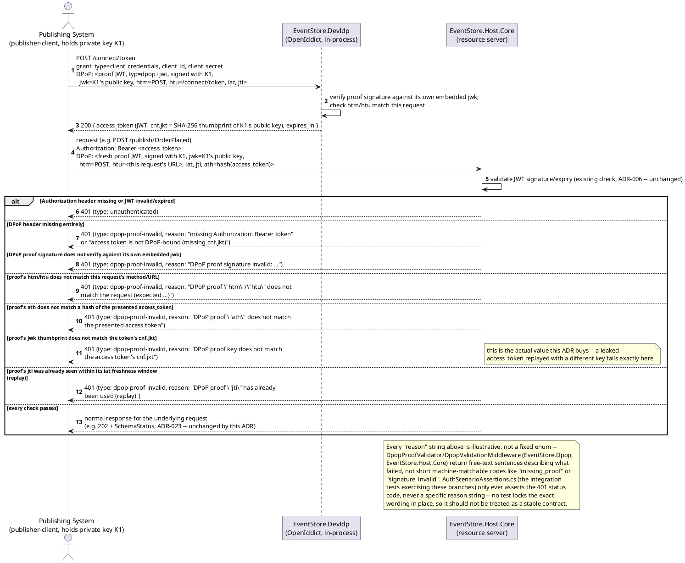
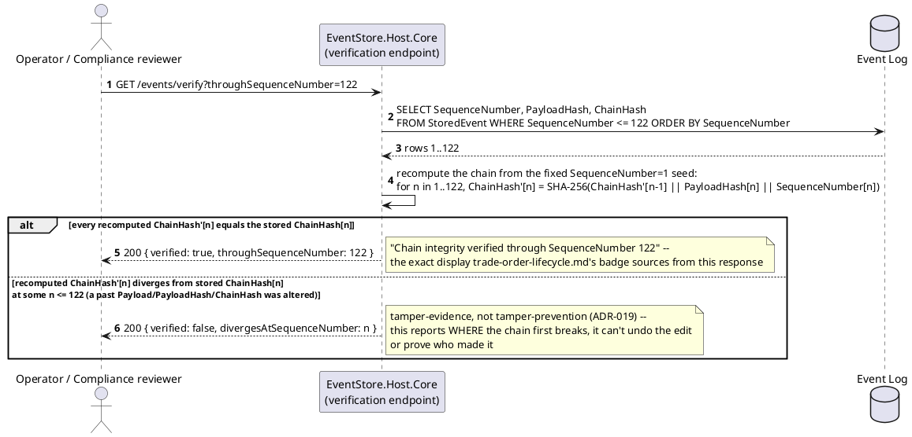
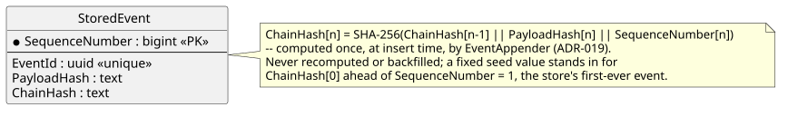
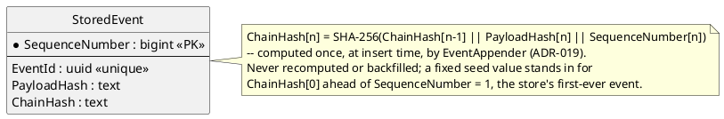

# Feature: DPoP-Bound Access Tokens and Hash-Chained Tamper Evidence

Context: two independent hardening additions, grouped in one doc because
`08-build-plan.md`'s "Hardening & Evolution" item names them together as
scope (alongside event upcasting, which has its own coverage — see that
item's text and `entity-concept.md`/`event-chains.md` for the upcast
mechanics not repeated here):

- **`ADR-017`** — every access token `EventStore.DevIdp` issues is
  DPoP-bound (RFC 9449), not a plain bearer token. This doc covers the
  proof-validation half of that decision: what happens on an API request
  once a DPoP-bound token already exists.
- **`ADR-019`** — every `StoredEvent` carries a `ChainHash`
  (`docs/data/event-log.md`), linking it to the immediately preceding
  event so that altering any past row is detectable by replaying the
  chain from `SequenceNumber = 1`.

This doc deliberately does **not** re-derive:
- The base OAuth2 Client Credentials token-acquisition flow, scope
  checking, RBAC claim flattening, or federated-IdP token exchange — all
  of that is [`auth.md`](auth.md)'s `Auth_TokenFlow_Sequence` and its
  sibling diagrams. The DPoP sequence diagram below is an *extension* of
  that same flow (the `POST /connect/token` and `Authorization: Bearer`
  steps are identical in shape), not a duplicate of it.
- The server-chosen nonce challenge RFC 9449 §8 describes — `ADR-017`
  explicitly puts this out of scope for v1 ("a dev/POC deployment with a
  small, fixed set of trusted clients, not a public browser-facing
  token-acquisition surface that needs defending against pre-generated-
  proof attacks"). No nonce exchange appears anywhere below.
- `PayloadHash`/idempotent-retry detection (`ADR-011`) — a related but
  different guarantee (content-equality on retry, not tamper evidence
  across the whole log). See `docs/data/event-log.md`'s "Publish
  idempotency" section.
- Archived-segment chain continuity (`ChainCheckpoint`, `ADR-089`) —
  that ADR's `{SequenceNumberRangeStart, SequenceNumberRangeEnd,
  ChainHashAtRangeEnd, ContentProviderKey, ContentProviderRef}` record is
  what lets ongoing verification skip over a detached, externalized
  segment without ever refetching it. This doc's scenarios only exercise
  the live, never-archived chain; `ADR-089` and `docs/data/event-log.md`
  own the archival-continuity shape itself.
- Any domain-specific display of chain-integrity status — the
  brokerage-domain `trade-order-lifecycle.md` feature doc already shows a
  "Chain integrity verified through SequenceNumber N" badge on one of its
  own screens, sourced from this doc's verification endpoint; that UI
  belongs to that domain doc, not here (see the Salt section below).

## Sequence diagram — DPoP-proof validation on an API request (`ADR-017`)

Token *acquisition* (the `POST /connect/token` call, `cnf.jkt` embedding)
is shown here only as far as needed to establish which key the later API
call must prove possession of — the full Client Credentials exchange
itself, including scope/claims, is `auth.md`'s `Auth_TokenFlow_Sequence`
and isn't repeated. What's new here is the DPoP proof this design adds
to both steps, and the resource-server checks against it.




## Sequence diagram — hash-chain verification (`ADR-019`)




## Data model (ER diagram)

DPoP contributes **no persisted entity** here, matching `auth.md`'s own
data-model note for the base token flow: client key pairs and the
`cnf.jkt` binding live entirely inside `EventStore.DevIdp`'s in-memory
OpenIddict store, never in `EventStoreContext`. The only columns this
doc's scenarios touch are `StoredEvent`'s existing hash-chain fields —
full column list in [`../data/event-log.md`](../data/event-log.md).





## Salt (UI mockup)

Not applicable — DPoP-proof validation is a request-level, machine-to-
machine check with no screen of its own (`EventStore.Host.Core`
middleware), and the verification endpoint is a plain `GET` with a JSON
response, not a UI. The one place this design *does* render chain
integrity on a screen is domain-specific, not core-engine: the
brokerage-domain `docs/domains/brokerage-capital-markets/features/trade-
order-lifecycle.md` feature doc's Screen 2 shows a "Chain integrity
verified through SequenceNumber N" badge with a "Re-verify now" action,
sourced from this doc's `GET /events/verify` endpoint exactly as the
second sequence diagram above returns it. Any future core-engine admin
console surfacing DPoP client key state or a store-wide verification
control belongs to `mvvm-client.md`/`ADR-039`'s eventual UI, not to this
doc.

## Gherkin

```gherkin
Feature: DPoP-Bound Access Tokens and Hash-Chained Tamper Evidence
  As the event store
  I want every access token bound to the client's private key (ADR-017) and
    every stored event linked into a verifiable hash chain (ADR-019)
  So that a leaked bearer token is unusable by itself, and any undetected
    alteration of past event data becomes detectable

  Background:
    Given client "publisher-client" has generated key pair "K1" and holds an
      access token with cnf.jkt bound to K1's public key
    And the event type "OrderPlaced" version 1 is registered with schema:
      """
      { "type": "object", "properties": { "OrderId": { "type": "string" }, "Amount": { "type": "number" } }, "required": ["OrderId", "Amount"] }
      """
    And events "e-1" through "e-5" have already been published and appended,
      forming an unbroken hash chain from SequenceNumber 1 through 5

  Scenario: A request with a valid DPoP proof bound to the token's cnf.jkt succeeds
    Given I have an access token for client "publisher-client" (cnf.jkt bound to K1)
    When I POST to "/publish/OrderPlaced" with a fresh DPoP proof signed by K1 (htm=POST, htu matching this request, ath matching the presented token)
    Then the response status should be 202
    # This is the normal path -- everything ADR-006/ADR-023 already
    # guarantee is unchanged; DPoP adds a second, coupled check alongside it.

  Scenario: A request missing the DPoP header entirely is rejected
    Given I have an access token for client "publisher-client" (cnf.jkt bound to K1)
    When I POST to "/publish/OrderPlaced" with Authorization: Bearer <token> and no DPoP header
    Then the response status should be 401
    And the problem type should be "dpop-proof-invalid"
    # The "reason" extension is implementation-defined free text (e.g.
    # "missing DPoP proof"), not a fixed short code -- see the note on
    # the sequence diagram above. Only the 401 status/problem type is a
    # stable, tested contract; AuthScenarioAssertions.cs never asserts
    # the exact reason string either.

  Scenario: A request with a DPoP proof signed by the wrong key is rejected
    Given I have an access token for client "publisher-client" (cnf.jkt bound to K1)
    And I hold a second, unrelated key pair "K2"
    When I POST to "/publish/OrderPlaced" with Authorization: Bearer <token> and a DPoP proof signed by K2 (htm/htu/ath otherwise all correct)
    Then the response status should be 401
    And the problem type should be "dpop-proof-invalid"
    # This is the scenario ADR-017 exists for: a leaked access_token, replayed
    # by an attacker holding a different key, still fails here even though
    # the bearer token itself is genuine and unexpired. (Free-text reason,
    # not a fixed code -- see note above.)

  Scenario: Replaying an already-used DPoP proof (same jti) is rejected
    Given I have an access token for client "publisher-client" (cnf.jkt bound to K1)
    And I successfully POSTed to "/publish/OrderPlaced" using a DPoP proof with jti "j-1"
    When I POST again to "/publish/OrderPlaced" reusing the exact same proof (jti "j-1")
    Then the response status should be 401
    And the problem type should be "dpop-proof-invalid"
    # Free-text reason, not a fixed code -- see note above.

  Scenario: Verifying an intact chain reports no divergence
    When I GET "/events/verify?throughSequenceNumber=5"
    Then the response status should be 200
    And the response body should report verified true through SequenceNumber 5

  Scenario: Verifying a chain after a direct database edit to a past Payload detects the tamper
    Given a test-only direct database edit altered "e-3"'s Payload without going through EventAppender
    # This bypasses the application entirely -- exactly the threat ADR-019
    # exists to make detectable, not preventable (StoredEvent.ChainHash[3]
    # on disk no longer matches what recomputing from PayloadHash[3] yields).
    When I GET "/events/verify?throughSequenceNumber=5"
    Then the response status should be 200
    And the response body should report verified false with divergesAtSequenceNumber 3
    # Every ChainHash from 3 through 5 is now provably wrong, but the endpoint
    # reports only the FIRST divergence point -- that's sufficient to know
    # where to start investigating (ADR-019's Consequences).
```
