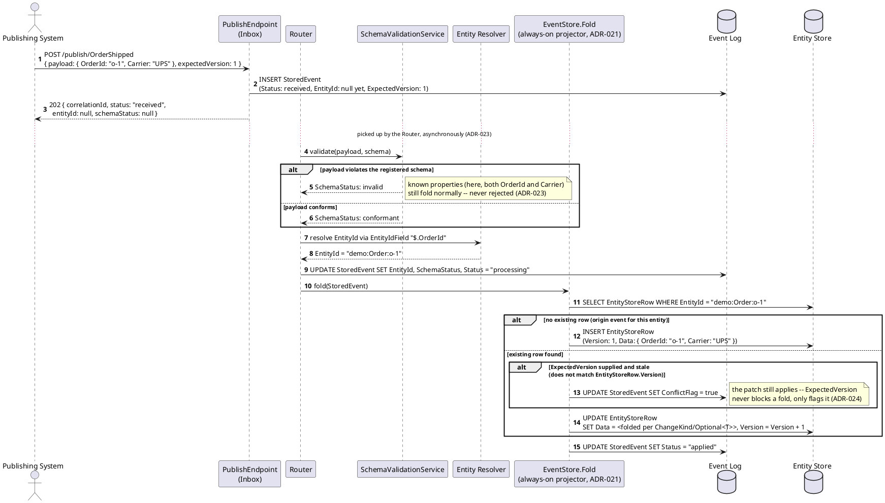
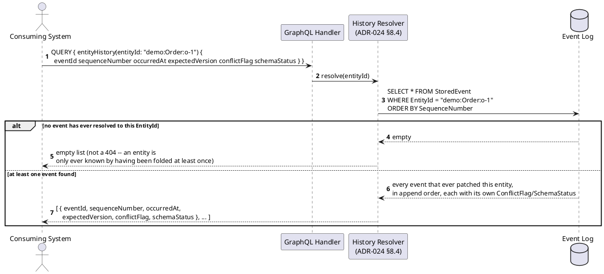
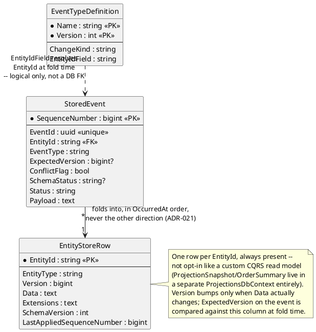

# Feature: Entities (`EntityId`, the always-on Entity Store, `ExpectedVersion`)

Context: decision record `ADR-021` (`EntityId`, the always-on Entity Store)
in `../07-adrs.md`, refined by `ADR-022` (`Optional<T>` property-level
patches), `ADR-023` (persist-everything ingestion — the `202` + status-
envelope shape every publish now returns), and `ADR-024` (`ExpectedVersion`
optimistic concurrency + `ConflictFlag`). Entity Store row shape is in
[`../data/entity-store.md`](../data/entity-store.md); the `EntityId`,
`ExpectedVersion`, `SchemaStatus`, and `ConflictFlag` columns on the event
itself are in [`../data/event-log.md`](../data/event-log.md).

This doc covers only what's specific to entities and the Entity Store.
It deliberately does **not** re-derive:
- `ChangeKind`'s general `Full`/`Partial` merge mechanics or the
  `Optional<T>` fold rule's three-state table — those are `ADR-016`/
  `ADR-022` and are exercised end-to-end in
  [`cqrs-projections.md`](cqrs-projections.md) against a *custom* read
  model. This doc shows the same `Full`/`Partial` distinction landing on
  the *default*, always-on Entity Store row instead — a different
  projection target, same source rule.
- `parentEventIds`/lineage (`ADR-005`, [`event-chains.md`](event-chains.md))
  — `EntityId` and `parentEventIds` are deliberately different axes
  (`ADR-021`'s Consequences): one says "this event patches entity X," the
  other says "this event is causally derived from events A, B, C." Neither
  subsumes the other, and this doc's scenarios never rely on parents.
- Claims/masking/`AuthorityStatus` gating — those are
  [`event-security.md`](event-security.md), [`masking.md`](masking.md),
  and the queued authority-rejection design; entities fold regardless of
  those advisory statuses, exactly as persist-everything (`ADR-023`)
  intends.
- Sharding, GraphQL transport, or peer-sync divergence resolution — those
  are `ADR-034`, `ADR-037`, `ADR-033`, layered on top of the same
  `Version`/`ConflictFlag` mechanism this doc exercises directly against
  the store, without a GraphQL Gateway or a second replica in the loop.

Every event type must declare an `EntityIdField` (a JSON path into its
`Payload`, e.g. `$.OrderId`) at registration time — see
[`schema-registry.md`](schema-registry.md) and `ADR-021`'s Consequences —
so this doc's Background registers it explicitly rather than assuming a
default; there isn't one.

## Sequence diagram — publish through to the Entity Store fold

Publish itself is unchanged in shape from
[`publish-event.md`](publish-event.md)'s `202` response (`ADR-023`); what's
new here is the asynchronous `Router` → `EventStore.Fold` path that turns a
persisted event into an Entity Store row. All four entity-specific branches
— brand-new entity, existing-entity update, stale `ExpectedVersion`, and a
schema-invalid payload — are shown as alternatives of the same fold step,
since they differ only in what the fold step decides, not in the request
shape.



## Sequence diagram — querying an entity's change history

`entityHistory(entityId, property)` is a direct read of the Event Log
filtered by `EntityId`, ordered by `SequenceNumber` — no new storage, and
no dependency on the Entity Store row itself (`ADR-024`). It travels over
the GraphQL Gateway (`ADR-037`) like every other read; `follow-
subscribe.md`/`event-chains.md` cover the Gateway's shared scope/claim
checks in depth and aren't repeated here.



## Data model (ER diagram)



Full column list for both entities is in
[`../data/event-log.md`](../data/event-log.md) and
[`../data/entity-store.md`](../data/entity-store.md) — this diagram shows
only what the fold step actually reads/writes.

## Salt (UI mockup)

Not applicable — the Entity Store is a fold target and read path with no
UI surface of its own; see `ADR-039`/`mvvm-client-architecture.md` for
where a UI eventually reads current-state entities from (the GraphQL
Gateway's `Entity Resolver`), out of scope for this doc.

## Gherkin

```gherkin
Feature: Entities (EntityId, the always-on Entity Store, ExpectedVersion)
  As the event store
  I want every published event to fold into exactly one versioned Entity Store row
  So that "current state of X" is always answerable without replaying raw events, and concurrent patches are flagged rather than silently lost

  # Every request in this file carries a Bearer token with the events:publish
  # scope unless a scenario says otherwise. See auth.md for authentication/
  # authorization behavior itself. EntityId format is {appId}:{entityType}:
  # {uniqueId} (ADR-021); scenarios below use appId "demo" throughout.

  Background:
    Given the event type "OrderPlaced" version 1 is registered with ChangeKind "Full" and EntityIdField "$.OrderId" and schema:
      """
      {
        "type": "object",
        "properties": { "OrderId": { "type": "string" }, "CustomerName": { "type": "string" }, "Amount": { "type": "number" } },
        "required": ["OrderId", "Amount"]
      }
      """
    And the event type "OrderShipped" version 1 is registered with ChangeKind "Partial" and EntityIdField "$.OrderId" and schema:
      """
      {
        "type": "object",
        "properties": { "OrderId": { "type": "string" }, "Carrier": { "type": "string" } },
        "required": ["OrderId", "Carrier"]
      }
      """

  Scenario: Publishing an event that resolves to a brand-new EntityId creates an Entity Store row
    When I POST to "/publish/OrderPlaced" with body:
      """
      { "payload": { "OrderId": "o-1", "CustomerName": "A. Smith", "Amount": 42.00 } }
      """
    Then the response status should be 202 with status "received"
    And eventually the stored event's status should become "applied" with EntityId "demo:Order:o-1"
    And an EntityStoreRow for "demo:Order:o-1" should exist with Version 1
    And its Data should equal { "OrderId": "o-1", "CustomerName": "A. Smith", "Amount": 42.00 }

  Scenario: Publishing a second event for the same EntityId updates the row and increments Version
    Given an "OrderPlaced" event was published for "o-1" with body { "OrderId": "o-1", "CustomerName": "A. Smith", "Amount": 42.00 }
    And its fold has completed, leaving EntityStoreRow "demo:Order:o-1" at Version 1
    When an "OrderShipped" event is published with body { "OrderId": "o-1", "Carrier": "UPS" }
    Then eventually the EntityStoreRow for "demo:Order:o-1" should be at Version 2
    And its Data should still have CustomerName "A. Smith" and Amount 42.00

  Scenario: A Full event's payload replaces the Entity Store row's Data wholesale
    Given an "OrderPlaced" event was published for "o-1" with body { "OrderId": "o-1", "CustomerName": "A. Smith", "Amount": 42.00 }
    When another "OrderPlaced" event (ChangeKind Full) is published with body { "OrderId": "o-1", "CustomerName": "A. Smith", "Amount": 99.00 }
    Then eventually the EntityStoreRow for "demo:Order:o-1" Data should equal exactly { "OrderId": "o-1", "CustomerName": "A. Smith", "Amount": 99.00 }
    # A Full payload is not Optional<T>-wrapped (ADR-022) -- every property present
    # replaces the prior snapshot outright, unlike the Partial merge below.

  Scenario: A Partial event's unknown property is folded into the Entity Store row's Extensions bag, not dropped
    Given an "OrderPlaced" event was published for "o-1" with body { "OrderId": "o-1", "CustomerName": "A. Smith", "Amount": 42.00 }
    When an "OrderShipped" event is published with body { "OrderId": "o-1", "Carrier": "UPS", "TrackingNumber": "1Z999" }
    Then eventually the EntityStoreRow for "demo:Order:o-1" Data should have Carrier "UPS"
    And its Extensions should contain { "TrackingNumber": "1Z999" }
    # TrackingNumber isn't in OrderShipped's registered schema -- ADR-022's
    # Extensions routing applies it anyway, matching ADR-023's persist-everything
    # posture rather than discarding the unrecognized field.

  Scenario: Publishing with a stale ExpectedVersion sets ConflictFlag but still persists and folds
    Given an "OrderPlaced" event was published for "o-1" with body { "OrderId": "o-1", "CustomerName": "A. Smith", "Amount": 42.00 }
    And an "OrderShipped" event was published and folded for "o-1", advancing EntityStoreRow "demo:Order:o-1" to Version 2
    When an "OrderShipped" event is published with body { "OrderId": "o-1", "Carrier": "FedEx" } and expectedVersion 1
    Then the response status should still be 202
    And eventually the stored event's ConflictFlag should be true
    And the EntityStoreRow for "demo:Order:o-1" should still advance to Version 3 with Carrier "FedEx"
    # ExpectedVersion never blocks or rejects a fold -- it only flags the later
    # event as conflicting (ADR-024). The earlier event is never retroactively touched.

  Scenario: Publishing without ExpectedVersion applies unconditionally, with no conflict detection
    Given an "OrderPlaced" event was published for "o-1" with body { "OrderId": "o-1", "CustomerName": "A. Smith", "Amount": 42.00 }
    When an "OrderShipped" event is published with body { "OrderId": "o-1", "Carrier": "UPS" } and no expectedVersion supplied
    Then eventually the stored event's ConflictFlag should be false
    And the EntityStoreRow for "demo:Order:o-1" should advance to Version 2
    # ExpectedVersion is opt-in (ADR-021/ADR-024) -- omitting it matches this
    # entity's fold behavior before ADR-024 existed at all: no check, no flag.

  Scenario: A schema-invalid publish persists with 202 and SchemaStatus invalid, and known properties still fold
    When I POST to "/publish/OrderPlaced" with body:
      """
      { "payload": { "OrderId": "o-1", "CustomerName": "A. Smith", "Amount": "not-a-number" } }
      """
    Then the response status should be 202, not 400
    And eventually the stored event's SchemaStatus should be "invalid"
    And the stored event's Status should still become "applied"
    And an EntityStoreRow for "demo:Order:o-1" should exist with OrderId and CustomerName folded normally
    # Amount fails schema validation, but OrderId/CustomerName are still known,
    # recognized properties -- ADR-023 folds what it can rather than rejecting
    # the whole payload over one bad field.

  Scenario: Querying an entity's change history returns every contributing event in order
    Given an "OrderPlaced" event "e-1" was published and folded for "o-1"
    And an "OrderShipped" event "e-2" was published and folded for "o-1" with expectedVersion 1, and no conflict
    And a second "OrderShipped" event "e-3" was published and folded for "o-1" with a stale expectedVersion, setting ConflictFlag
    When I query entityHistory(entityId: "demo:Order:o-1")
    Then the response should list "e-1", "e-2", "e-3" in that order
    And "e-3" alone should show conflictFlag true
```
