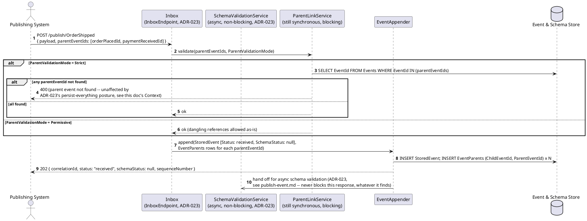
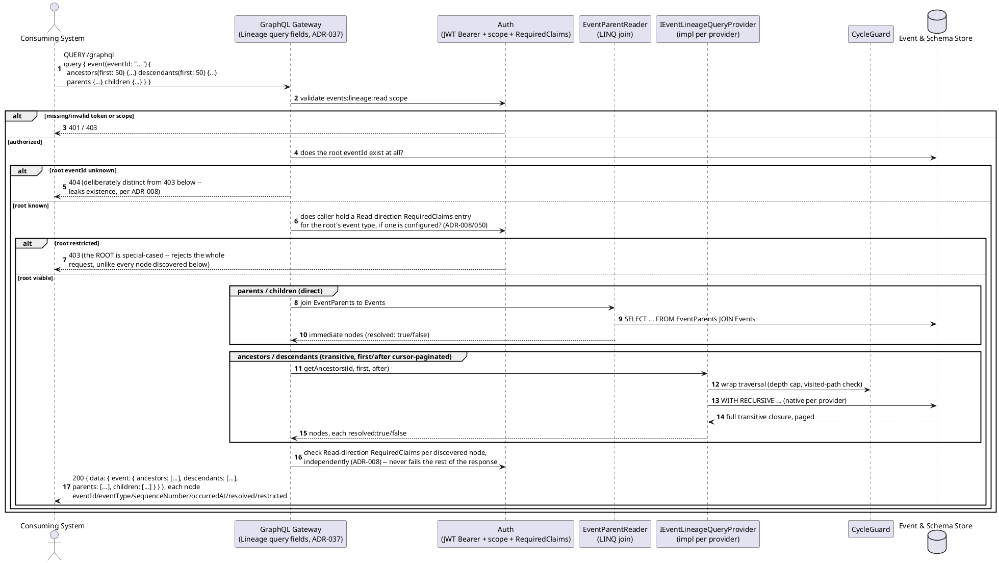
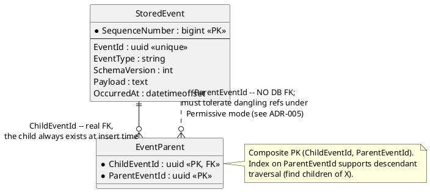

# Feature: Event chains (parent/child lineage across events)

Context: data model in `../02-data-model.md` and `../data/event-log.md`
("Event lineage"); API contract in `../03-api-contracts.md` ("Lineage API
— GraphQL query fields"); decision record `ADR-005` in `../07-adrs.md`.
Builds on [`publish-event.md`](publish-event.md) — this doc covers only
the parts specific to `parentEventIds` and the Lineage API. Lineage
traversal moved from four separate `QUERY /events/{id}/...` REST paths to
GraphQL query fields on a resolved `event(eventId: ...)` root (`ADR-037`)
— `first`/`after` cursor arguments (HotChocolate's `[UsePaging]`) replace
`$top`/`$skip` for `ancestors`/`descendants`; `parents`/`children` take no
pagination arguments, unchanged. The traversal *mechanics* — direct joins,
cycle-safe recursive CTEs, per-node `resolved`/`restricted` visibility —
are unchanged from the pre-`ADR-037` design, only the transport/syntax
moved. Publishing responses in this doc are `202`, not `201`
(`ADR-023`) — except the one blocking rejection this doc's own scenarios
cover: a Strict-mode publish naming a parent that doesn't resolve is
**still a genuine `400`**, verified against `docs/adrs/adr-013-problem-
details.md`'s error table (its `parent-not-found` row is not among the
two struck-through as superseded) and `ADR-023`'s own decision text
(unresolved `parentEventIds` is not in its list of now-persisted cases —
only `schemaVersion`/payload-shape/upcast/authority problems are). Out of
scope: `RequiredClaims`' own enforcement mechanics (`auth.md`,
[`event-security.md`](event-security.md)) — this doc treats visibility as
a given input to the traversal, not derives it.

## Sequence diagram — publishing with parents



## Sequence diagram — querying lineage



This diagram is claims-agnostic — it's the lineage mechanics only.
`restricted: true` (a node whose type the caller lacks a matching
`Read`-direction entry in `RequiredClaims` for, per `ADR-008`, generalized
from one fixed claim to an `OR`-matched list by `ADR-050`) is a second,
independent reason a node can be a leaf alongside `resolved: false`; see
[`event-security.md`](event-security.md) for that check and
`03-api-contracts.md` for the full response shape and the root-vs-
discovered-node distinction (the root fails the whole request with `403`;
every other node is checked independently and stubbed).

## Data model (ER diagram)



The asymmetry is the whole point of this diagram: `ChildEventId` is a real,
DB-enforced foreign key (the child row is always inserted in the same
transaction, so it always exists); `ParentEventId` deliberately has none,
because `Permissive`-mode event types must be able to insert a reference
that doesn't resolve yet. That asymmetry is also why cycles are possible
under `Permissive` mode and why traversal must be cycle-safe regardless of
which event type you start from (see the sequence diagram above and
`ADR-005`). It's also why a Strict-mode publish naming an unresolved
parent stays a real, blocking `400` even after `ADR-023`: `Strict` means
this event type promised the FK-like guarantee `EventParents.ChildEventId`
already gets for free, so letting a dangling reference through would
silently break that promise rather than just flag imperfect data.

## Salt (UI mockup)

Not applicable — lineage is a read API with no UI surface in scope.

## Gherkin

```gherkin
Feature: Event chains (parent/child lineage across events)
  As a publishing or consuming system
  I want to record that an event is causally parented off one or more prior events
  So that causal chains/DAGs can be reconstructed and queried later

  # Every request in this file carries a Bearer token with sufficient scope
  # (events:publish for publishing, events:lineage:read for the Lineage API,
  # registry:admin for registration) unless a scenario says otherwise.
  # See auth.md for authentication/authorization behavior itself.

  Background:
    Given the event type "OrderPlaced" version 1 is registered with schema:
      """
      { "type": "object", "properties": { "Amount": { "type": "number" } }, "required": ["Amount"] }
      """
    And the event type "PaymentReceived" version 1 is registered with schema:
      """
      { "type": "object", "properties": { "Amount": { "type": "number" } }, "required": ["Amount"] }
      """
    And the event type "OrderShipped" version 1 is registered with schema:
      """
      { "type": "object", "properties": { "Carrier": { "type": "string" } }, "required": ["Carrier"] }
      """

  Scenario: Publishing an origin event with no parents
    When I POST to "/publish/OrderPlaced" with body:
      """
      { "payload": { "Amount": 150.00 } }
      """
    Then the response status should be 202
    And the stored event should have no parent events

  Scenario: Publishing a child event parented off a single prior event of the same type
    Given an "OrderPlaced" event "order-1" was published with body { "Amount": 150.00 }
    When I POST to "/publish/OrderPlaced" with body:
      """
      { "payload": { "Amount": 150.00 }, "parentEventIds": ["order-1"] }
      """
    Then the response status should be 202
    And the stored event's parents should be exactly ["order-1"]

  Scenario: Publishing a child event parented off multiple prior events of different types
    Given an "OrderPlaced" event "order-1" was published with body { "Amount": 150.00 }
    And a "PaymentReceived" event "payment-1" was published with body { "Amount": 150.00 }
    When I POST to "/publish/OrderShipped" with body:
      """
      { "payload": { "Carrier": "UPS" }, "parentEventIds": ["order-1", "payment-1"] }
      """
    Then the response status should be 202
    And the stored event's parents should be exactly ["order-1", "payment-1"]

  Scenario: Strict parent validation rejects a publish referencing an unknown parent
    # Still a genuine, blocking 400 -- ADR-023's persist-everything posture does NOT
    # cover unresolved parentEventIds (see this doc's Context paragraph for the
    # verification against ADR-013's error table and ADR-023's own decision text).
    Given "OrderShipped" is registered with parent validation mode "Strict"
    When I POST to "/publish/OrderShipped" with body:
      """
      { "payload": { "Carrier": "UPS" }, "parentEventIds": ["00000000-0000-0000-0000-000000000000"] }
      """
    Then the response status should be 400
    And the response should state the parent event was not found
    And no event should be appended to the store

  Scenario: Permissive parent validation accepts a dangling parent reference
    Given "OrderShipped" is registered with parent validation mode "Permissive"
    When I POST to "/publish/OrderShipped" with body:
      """
      { "payload": { "Carrier": "UPS" }, "parentEventIds": ["00000000-0000-0000-0000-000000000000"] }
      """
    Then the response status should be 202
    When I QUERY "/graphql" with document:
      """
      query { event(eventId: "{eventId}") { parents { eventId resolved } } }
      """
    Then the response should list that parent with "resolved": false

  Scenario: Fetching immediate parents and children
    Given an "OrderPlaced" event "order-1" was published with body { "Amount": 150.00 }
    And an "OrderShipped" event "ship-1" was published with body { "Carrier": "UPS" } parented off "order-1"
    When I QUERY "/graphql" with document:
      """
      query { event(eventId: "order-1") { children { eventId } } }
      """
    Then the response's event.children should include "ship-1"
    When I QUERY "/graphql" with document:
      """
      query { event(eventId: "ship-1") { parents { eventId } } }
      """
    Then the response's event.parents should include "order-1"

  Scenario: Fetching the full ancestor chain across multiple hops
    Given an "OrderPlaced" event "order-1" was published with body { "Amount": 150.00 }
    And a "PaymentReceived" event "payment-1" was published with body { "Amount": 150.00 } parented off "order-1"
    And an "OrderShipped" event "ship-1" was published with body { "Carrier": "UPS" } parented off "payment-1"
    When I QUERY "/graphql" with document:
      """
      query { event(eventId: "ship-1") { ancestors(first: 50) { eventId } } }
      """
    Then the response's event.ancestors should include "payment-1" and "order-1"

  Scenario: Fetching lineage for an unknown event is rejected
    When I QUERY "/graphql" with document:
      """
      query { event(eventId: "00000000-0000-0000-0000-000000000000") { parents { eventId } } }
      """
    Then the response status should be 404

  Scenario: Ancestor traversal terminates even if a cycle exists across Permissive-mode events
    Given "OrderPlaced" and "PaymentReceived" are both registered with parent validation mode "Permissive"
    And an "OrderPlaced" event "order-1" was published with a dangling parentEventId "payment-1" that does not exist yet
    And a "PaymentReceived" event "payment-1" was published parented off "order-1"
    When I QUERY "/graphql" with document:
      """
      query { event(eventId: "order-1") { ancestors(first: 50) { eventId } } }
      """
    Then the response should complete without an infinite loop
    And the response's event.ancestors should include "payment-1" exactly once

  Scenario: first pages a large descendant list via GraphQL cursor pagination
    # first/after (HotChocolate's [UsePaging]) replaced $top/$skip when the
    # Lineage API moved to GraphQL (ADR-037) -- same underlying traversal,
    # cursor-style pagination arguments instead of an offset/limit pair.
    Given an "OrderPlaced" event "order-1" was published with body { "Amount": 150.00 }
    And 5 "OrderShipped" events were each published parented off "order-1"
    When I QUERY "/graphql" with document:
      """
      query { event(eventId: "order-1") { descendants(first: 2) { eventId } } }
      """
    Then the response's event.descendants should include exactly 2 nodes
    When I QUERY "/graphql" with document:
      """
      query { event(eventId: "order-1") { descendants(first: 50) { eventId } } }
      """
    Then the response's event.descendants should include all 5 nodes
```
