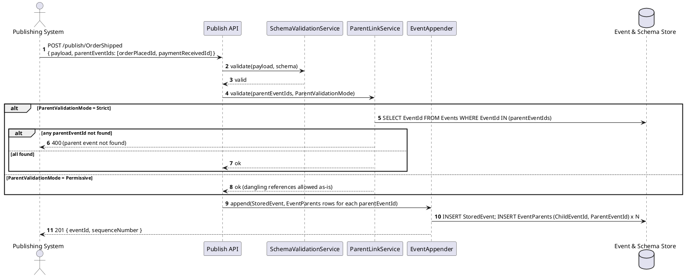
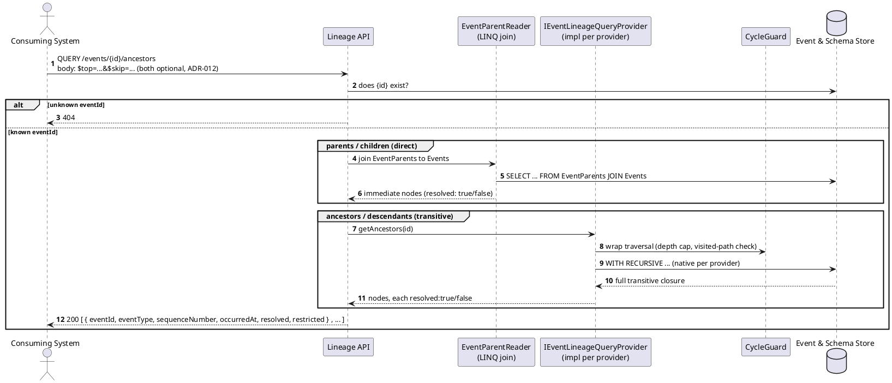
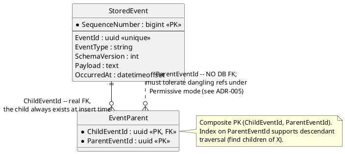

# Feature: Event chains (parent/child lineage across events)

Context: data model in `../02-data-model.md` ("Event lineage"); API contract
in `../03-api-contracts.md` ("Lineage API"); decision record `ADR-005` in
`../07-adrs.md`. Builds on [`publish-event.md`](publish-event.md) — this doc
covers only the parts specific to `parentEventIds` and the Lineage API.
Per `ADR-012`, all four Lineage endpoints are `QUERY`, not `GET`, with
optional `$top`/`$skip` pagination in the request body — this doc still
writes `GET /events/{id}/...` as shorthand where the method itself isn't
the point; read it as `QUERY` throughout.

## Sequence diagram — publishing with parents



## Sequence diagram — querying lineage



This diagram is claims-agnostic — it's the lineage mechanics only.
`restricted: true` (a node whose type the caller lacks `RequiredReadClaim`
for, per `ADR-008`) is a second, independent reason a node can be a leaf
alongside `resolved: false`; see [`event-security.md`](event-security.md)
for that check and `03-api-contracts.md` for the full response shape.

## Data model (ER diagram)



The asymmetry is the whole point of this diagram: `ChildEventId` is a real,
DB-enforced foreign key (the child row is always inserted in the same
transaction, so it always exists); `ParentEventId` deliberately has none,
because `Permissive`-mode event types must be able to insert a reference
that doesn't resolve yet. That asymmetry is also why cycles are possible
under `Permissive` mode and why traversal must be cycle-safe regardless of
which event type you start from (see the sequence diagram above and
`ADR-005`).

## Salt (UI mockup)

Not applicable — lineage is a read API with no UI surface in scope.

## Gherkin

```gherkin
Feature: Event chains (parent/child lineage across events)
  As a publishing or consuming system
  I want to record that an event is causally parented off one or more prior events
  So that causal chains/DAGs can be reconstructed and queried later

  # Every request in this file carries a Bearer token with sufficient scope
  # (events:publish for publishing, events:lineage:read for the Lineage API,
  # registry:admin for registration) unless a scenario says otherwise.
  # See auth.md for authentication/authorization behavior itself.

  Background:
    Given the event type "OrderPlaced" version 1 is registered with schema:
      """
      { "type": "object", "properties": { "Amount": { "type": "number" } }, "required": ["Amount"] }
      """
    And the event type "PaymentReceived" version 1 is registered with schema:
      """
      { "type": "object", "properties": { "Amount": { "type": "number" } }, "required": ["Amount"] }
      """
    And the event type "OrderShipped" version 1 is registered with schema:
      """
      { "type": "object", "properties": { "Carrier": { "type": "string" } }, "required": ["Carrier"] }
      """

  Scenario: Publishing an origin event with no parents
    When I POST to "/publish/OrderPlaced" with body:
      """
      { "payload": { "Amount": 150.00 } }
      """
    Then the response status should be 201
    And the stored event should have no parent events

  Scenario: Publishing a child event parented off a single prior event of the same type
    Given an "OrderPlaced" event "order-1" was published with body { "Amount": 150.00 }
    When I POST to "/publish/OrderPlaced" with body:
      """
      { "payload": { "Amount": 150.00 }, "parentEventIds": ["order-1"] }
      """
    Then the response status should be 201
    And the stored event's parents should be exactly ["order-1"]

  Scenario: Publishing a child event parented off multiple prior events of different types
    Given an "OrderPlaced" event "order-1" was published with body { "Amount": 150.00 }
    And a "PaymentReceived" event "payment-1" was published with body { "Amount": 150.00 }
    When I POST to "/publish/OrderShipped" with body:
      """
      { "payload": { "Carrier": "UPS" }, "parentEventIds": ["order-1", "payment-1"] }
      """
    Then the response status should be 201
    And the stored event's parents should be exactly ["order-1", "payment-1"]

  Scenario: Strict parent validation rejects a publish referencing an unknown parent
    Given "OrderShipped" is registered with parent validation mode "Strict"
    When I POST to "/publish/OrderShipped" with body:
      """
      { "payload": { "Carrier": "UPS" }, "parentEventIds": ["00000000-0000-0000-0000-000000000000"] }
      """
    Then the response status should be 400
    And the response should state the parent event was not found
    And no event should be appended to the store

  Scenario: Permissive parent validation accepts a dangling parent reference
    Given "OrderShipped" is registered with parent validation mode "Permissive"
    When I POST to "/publish/OrderShipped" with body:
      """
      { "payload": { "Carrier": "UPS" }, "parentEventIds": ["00000000-0000-0000-0000-000000000000"] }
      """
    Then the response status should be 201
    And GET "/events/{eventId}/parents" should list that parent as "resolved": false

  Scenario: Fetching immediate parents and children
    Given an "OrderPlaced" event "order-1" was published with body { "Amount": 150.00 }
    And an "OrderShipped" event "ship-1" was published with body { "Carrier": "UPS" } parented off "order-1"
    When I GET "/events/order-1/children"
    Then the response should include "ship-1"
    When I GET "/events/ship-1/parents"
    Then the response should include "order-1"

  Scenario: Fetching the full ancestor chain across multiple hops
    Given an "OrderPlaced" event "order-1" was published with body { "Amount": 150.00 }
    And a "PaymentReceived" event "payment-1" was published with body { "Amount": 150.00 } parented off "order-1"
    And an "OrderShipped" event "ship-1" was published with body { "Carrier": "UPS" } parented off "payment-1"
    When I GET "/events/ship-1/ancestors"
    Then the response should include "payment-1" and "order-1"

  Scenario: Fetching lineage for an unknown event is rejected
    When I GET "/events/00000000-0000-0000-0000-000000000000/parents"
    Then the response status should be 404

  Scenario: Ancestor traversal terminates even if a cycle exists across Permissive-mode events
    Given "OrderPlaced" and "PaymentReceived" are both registered with parent validation mode "Permissive"
    And an "OrderPlaced" event "order-1" was published with a dangling parentEventId "payment-1" that does not exist yet
    And a "PaymentReceived" event "payment-1" was published parented off "order-1"
    When I GET "/events/order-1/ancestors"
    Then the response should complete without an infinite loop
    And the response should include "payment-1" exactly once

  Scenario: $top and $skip page a large descendant list, omitting both still returns everything
    Given an "OrderPlaced" event "order-1" was published with body { "Amount": 150.00 }
    And 5 "OrderShipped" events were each published parented off "order-1"
    When I GET "/events/order-1/descendants?$top=2&$skip=1"
    Then the response should include exactly 2 descendants
    When I GET "/events/order-1/descendants"
    Then the response should include all 5 descendants
```
