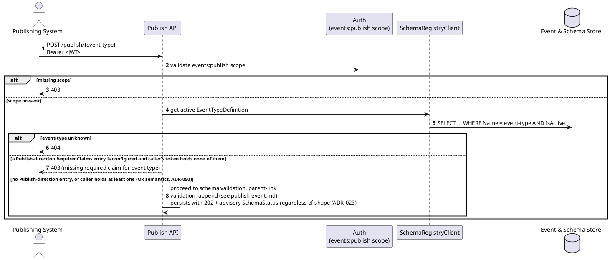
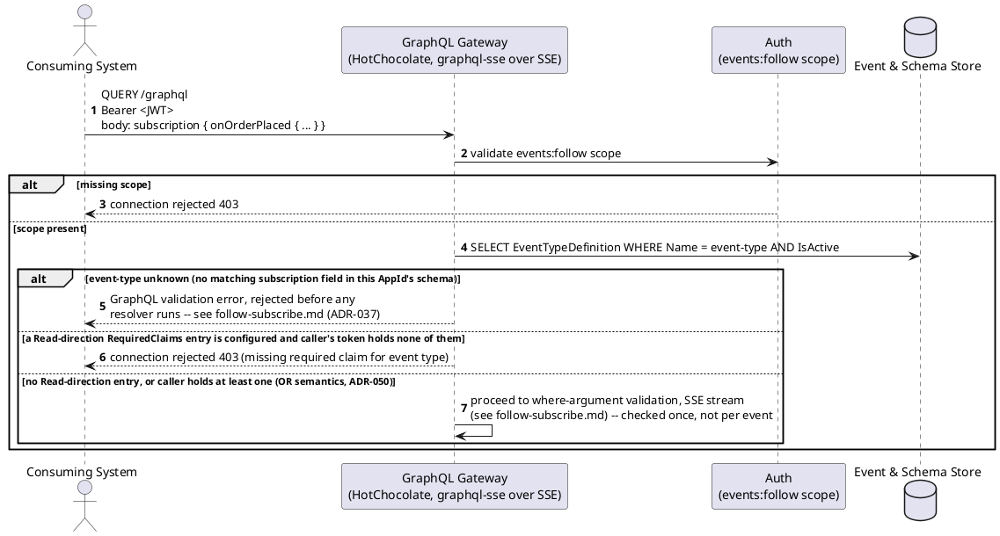
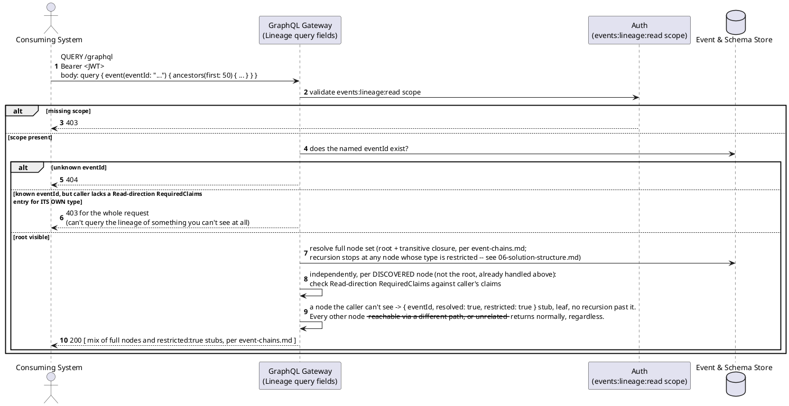
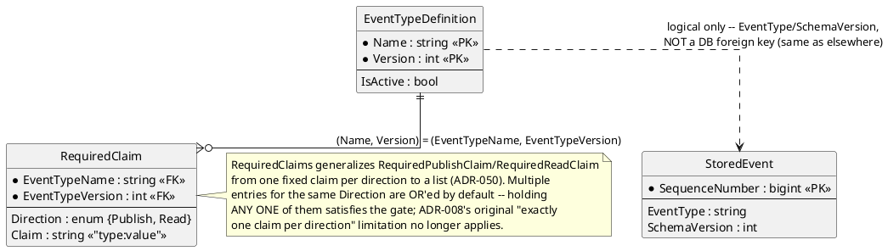

# Feature: Event-type security (required claims)

Context: data model fields in `../02-data-model.md` ("Event-type security");
API contract in `../03-api-contracts.md` ("Event-type security (required
claims)" and "`RequiredClaims` and the Lineage API"); decision record
`ADR-008` in `../07-adrs.md`, generalized from one fixed claim per
direction to an `OR`-matched list by `ADR-050`; implementation shape (why
this isn't a static policy) in `../06-solution-structure.md`. Builds on
[`publish-event.md`](publish-event.md), [`follow-subscribe.md`](follow-subscribe.md),
[`event-chains.md`](event-chains.md), and [`auth.md`](auth.md) — this doc
covers only what's specific to `RequiredClaims` (the `{Direction, Claim}`
list gating publish/read access per event type).

This is a second, independent authorization dimension from the scopes in
`auth.md`: scopes gate the *operation*; this feature gates the *event
type*. Both must pass. Follow and Lineage below are shown using their
actual GraphQL Subscription/Query syntax, carried over the HTTP `QUERY`
method (`ADR-012`/`ADR-037`) — not `GET` — since a `where`/`eventId`
argument can carry PII; the transport and surface change doesn't affect
any of the claim-checking logic this doc is about.

## Sequence diagram — publish gated by RequiredClaims (Publish direction)



## Sequence diagram — follow gated by RequiredClaims (Read direction)



## Sequence diagram — lineage: per-node visibility ("you can only see what you can see")



Only the root's own visibility is pass/fail (`403` if it exists but is
restricted). Every node the traversal *discovers* is independent —
lacking access to one ancestor never hides a sibling ancestor, a
descendant, or anything else the caller has rights to.

## Data model (ER diagram)



Full entity set is in `../02-data-model.md`. Nothing new is added to
`StoredEvent` or `EventParents` for this feature — the `RequiredClaims`
list lives entirely on `EventTypeDefinition`, checked against whichever
`StoredEvent` rows a request touches.

## Salt (UI mockup)

Not applicable — this is enforcement logic with no UI surface.

## Gherkin

```gherkin
Feature: Event-type security (required claims)
  As the event store
  I want a per-event-type list of required claims, OR'ed within each direction
  So that sensitive event types can restrict who may write or see their data,
  independently of the general events:publish/events:follow/events:lineage:read scopes

  Background:
    Given client "publisher-client" has scope "events:publish"
    And client "follower-client" has scopes "events:follow" and "events:lineage:read"
    And the event type "PatientAdmitted" version 1 is registered with schema:
      """
      { "type": "object", "properties": { "PatientId": { "type": "string" } }, "required": ["PatientId"] }
      """
    And "PatientAdmitted" requires RequiredClaims: [{Direction: Publish, Claim: "clearance:phi"}, {Direction: Read, Claim: "clearance:phi"}]
    And the event type "OrderPlaced" version 1 is registered with schema:
      """
      { "type": "object", "properties": { "Amount": { "type": "number" } }, "required": ["Amount"] }
      """

  Scenario: Publishing a claim-gated event type without the required claim is rejected
    Given I have a Bearer token for client "publisher-client" with no additional claims
    When I POST to "/publish/PatientAdmitted" with body:
      """
      { "payload": { "PatientId": "abc-123" } }
      """
    Then the response status should be 403
    And the response should state a required claim for the event type is missing

  Scenario: Publishing a claim-gated event type with the required claim succeeds
    Given I have a Bearer token for client "publisher-client" with claim "clearance" value "phi"
    When I POST to "/publish/PatientAdmitted" with body:
      """
      { "payload": { "PatientId": "abc-123" } }
      """
    Then the response status should be 202
    # 202, not 201 -- ADR-023's persist-everything posture; the claim check
    # itself is unaffected and still runs before storage, unlike a
    # schema/version problem, which now always persists (see publish-event.md).

  Scenario: Holding any one of multiple required claims for the same direction satisfies the gate (OR semantics, ADR-050)
    Given the event type "LabResultRecorded" version 1 is registered with schema:
      """
      { "type": "object", "properties": { "Value": { "type": "number" } }, "required": ["Value"] }
      """
    And "LabResultRecorded" requires RequiredClaims: [{Direction: Publish, Claim: "role:lab-tech"}, {Direction: Publish, Claim: "role:lab-supervisor"}]
    And I have a Bearer token for client "publisher-client" with claim "role" value "lab-supervisor"
    When I POST to "/publish/LabResultRecorded" with body:
      """
      { "payload": { "Value": 5.2 } }
      """
    Then the response status should be 202
    # Holding only the second of two OR'ed Publish-direction claims still
    # satisfies the gate -- ADR-008's original "exactly one claim per
    # direction" limitation no longer applies (ADR-050).

  Scenario: Publish and read claims are independent
    Given "OrderShipped" version 1 is registered requiring RequiredClaims: [{Direction: Publish, Claim: "role:warehouse"}]
    And I have a Bearer token for client "follower-client" with no additional claims
    When I open a GraphQL Subscription connection with document:
      """
      subscription { onOrderShipped { eventId } }
      """
    Then the connection should be accepted
    When I POST to "/publish/OrderShipped" with body:
      """
      { "payload": {} }
      """
    Then the response status should be 403

  Scenario: Connecting to follow a claim-gated event type without the required claim is rejected
    Given I have a Bearer token for client "follower-client" with no additional claims
    When I open a GraphQL Subscription connection with document:
      """
      subscription { onPatientAdmitted { patientId } }
      """
    Then the connection should be rejected with 403

  Scenario: Connecting to follow a claim-gated event type with the required claim succeeds
    Given I have a Bearer token for client "follower-client" with claim "clearance" value "phi"
    When I open a GraphQL Subscription connection with document:
      """
      subscription { onPatientAdmitted { patientId } }
      """
    Then the connection should be accepted

  Scenario: An unclaimed event type is unaffected
    Given I have a Bearer token for client "follower-client" with no additional claims
    When I open a GraphQL Subscription connection with document:
      """
      subscription { onOrderPlaced { amount } }
      """
    Then the connection should be accepted

  Scenario: A lineage query on a restricted root is rejected entirely
    Given an "OrderPlaced" event "order-1" was published with body { "Amount": 150.00 }
    And a "PatientAdmitted" event "admit-1" was published with body { "PatientId": "abc-123" } parented off "order-1"
    And I have a Bearer token for client "follower-client" with no additional claims
    When I query:
      """
      query { event(eventId: "admit-1") { ancestors(first: 50) { eventId eventType resolved restricted } } }
      """
    Then the response status should be 403

  Scenario: A lineage query on a visible root still succeeds when a discovered node is restricted, stubbed not failed
    Given an "OrderPlaced" event "order-1" was published with body { "Amount": 150.00 }
    And a "PatientAdmitted" event "admit-1" was published with body { "PatientId": "abc-123" } parented off "order-1"
    And I have a Bearer token for client "follower-client" with no additional claims
    When I query:
      """
      query { event(eventId: "order-1") { descendants(first: 50) { eventId eventType resolved restricted } } }
      """
    Then the response status should be 200
    And the response should include "admit-1" as { "resolved": true, "restricted": true } with no eventType, sequenceNumber, or occurredAt

  Scenario: A lineage query succeeds and shows full detail once the caller holds every required claim
    Given an "OrderPlaced" event "order-1" was published with body { "Amount": 150.00 }
    And a "PatientAdmitted" event "admit-1" was published with body { "PatientId": "abc-123" } parented off "order-1"
    And I have a Bearer token for client "follower-client" with claim "clearance" value "phi"
    When I query:
      """
      query { event(eventId: "order-1") { descendants(first: 50) { eventId eventType resolved restricted } } }
      """
    Then the response status should be 200
    And the response should include "admit-1" fully, not stubbed

  Scenario: Lacking access to a parent does not hide an otherwise-visible child
    Given a "PatientAdmitted" event "admit-1" was published with body { "PatientId": "abc-123" }
    And an "OrderPlaced" event "order-1" was published with body { "Amount": 150.00 } parented off "admit-1"
    And I have a Bearer token for client "follower-client" with no additional claims
    When I query:
      """
      query { event(eventId: "order-1") { ancestors(first: 50) { eventId eventType resolved restricted } } }
      """
    Then the response status should be 200
    And the response should include "admit-1" as { "resolved": true, "restricted": true }
    When I query:
      """
      query { event(eventId: "order-1") { parents { eventId eventType resolved restricted } } }
      """
    Then the response status should be 200
    # order-1 itself is fully visible even though its own parent is restricted --
    # visibility of a node never depends on the visibility of its neighbors.
    # parents has no first argument, unlike ancestors/descendants -- it has
    # no recursion depth to bound (03-api-contracts.md).

  Scenario: A restricted-but-existing event is distinguishable from an unknown one (403 vs 404)
    Given I have a Bearer token for client "follower-client" with no additional claims
    When I query:
      """
      query { event(eventId: "00000000-0000-0000-0000-000000000000") { parents { eventId } } }
      """
    Then the response status should be 404
    Given a "PatientAdmitted" event "admit-1" was published with body { "PatientId": "abc-123" }
    When I query:
      """
      query { event(eventId: "admit-1") { parents { eventId } } }
      """
    Then the response status should be 403
    # 403, not 404 -- ADR-008 deliberately leaks that admit-1 exists rather
    # than hiding it behind a uniform 404 for both cases.
```
