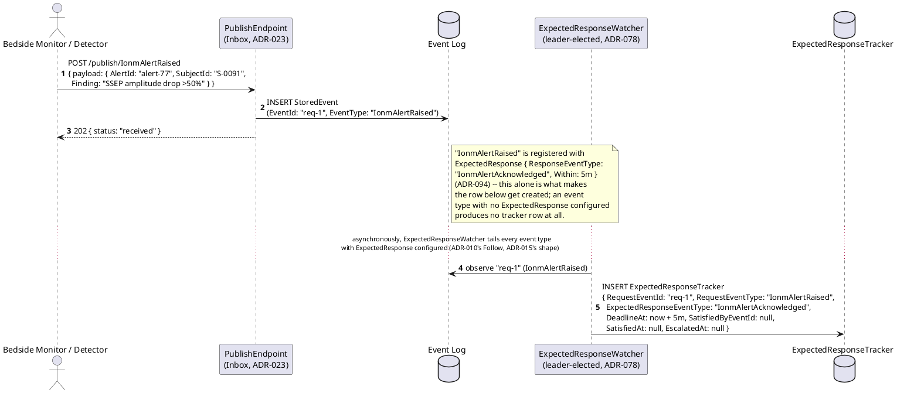
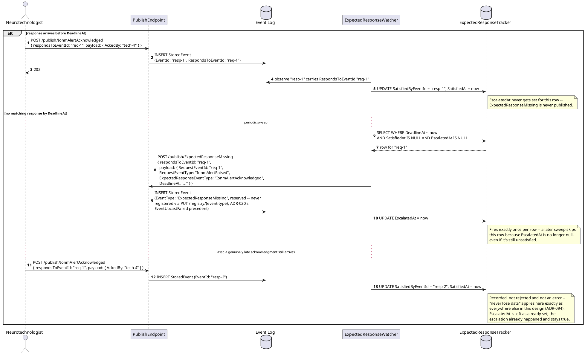
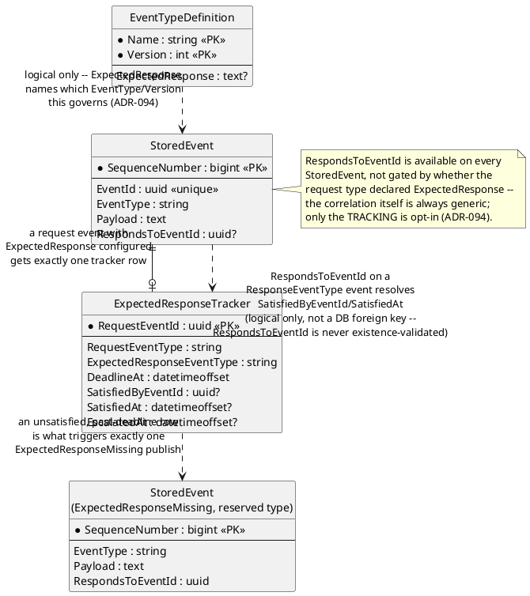
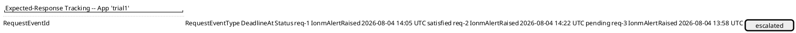
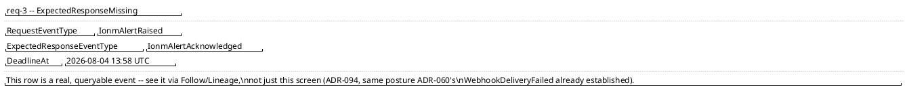

# Feature: Expected-Response Tracking

Context: decision record `ADR-094` in `../07-adrs.md` — a generic
envelope field, `StoredEvent.RespondsToEventId` (the Correlation
Identifier pattern, see [`../patterns/request-reply-correlation.md`](../patterns/request-reply-correlation.md)),
plus an opt-in `EventTypeDefinition.ExpectedResponse { ResponseEventType,
Within }` a request event type may declare. Data model in
[`../data/event-log.md`](../data/event-log.md) (`RespondsToEventId`,
"Expected-response tracking" section) and
[`../data/schema-registry.md`](../data/schema-registry.md)
(`ExpectedResponse`, `ExpectedResponseTracker`) — this doc shows only the
columns its own scenarios touch; full column lists live there.
`ExpectedResponseWatcher` is the leader-elected background worker role
named in `../data/schema-registry.md`'s `LeaderLease` (`ADR-078`);
election mechanics themselves are that ADR's concern, not re-derived
here. Worked example throughout: `IonmAlertRaised` (the request) /
`IonmAlertAcknowledged` (the response), the concrete configuration named
in [`../domains/clinical-trials-device-telemetry/README.md`](../domains/clinical-trials-device-telemetry/README.md)'s
"Special concerns."

This doc deliberately does **not** re-derive:
- **The Follow API's tail/replay mechanics** (`ADR-010`) — see
  [`follow-subscribe.md`](follow-subscribe.md). `ExpectedResponseWatcher`
  is a Follow caller like any other (the same shape `ADR-015`'s
  `ProjectionHost` already uses); this doc only shows *what* it does
  with what it reads, not the connection/cursor mechanics themselves.
- **The publish/ingestion pipeline and `Status`/`SchemaStatus` advisory
  flags** (`ADR-023`) — see [`publish-event.md`](publish-event.md). Every
  publish shown below (the request, the response, and the watcher's own
  `ExpectedResponseMissing` publish) goes through this same, completely
  ordinary path.
- **Leader election itself** (`ADR-078`) — this doc only names
  `ExpectedResponseWatcher` as one more `WorkerRole` sharing that
  mechanism, the same as `Router`/`UpcastMaterializer`/the outbox pumps.
- **Ordinary Bearer-token auth and scopes** (`ADR-006`) — see
  [`auth.md`](auth.md), whose seeded-clients table already carries
  `expected-response-watcher-client` (`events:follow events:publish`).
  This doc doesn't re-show the token-validation steps every other
  feature doc's sequence diagrams already show.
- **The reserved-system-event treatment itself** (`ADR-020`'s
  `EventUpcastFailed`) — `ExpectedResponseMissing` reuses the identical
  "never registered via `PUT /registry/{event-type}`" posture; this doc
  shows the one new event type, not a re-explanation of why reserved
  types exist.

## Sequence diagram — a request event is published and tracked



## Sequence diagram — on-time response, missed deadline (escalation), and a late response afterward



**Escalation policy is deliberately not shown as anything more than "an
ordinary event gets published."** What a real deployment does when it
sees an `ExpectedResponseMissing` event — page a backup clinician, sound
a different alarm — is entirely application-owned, the same boundary
`ADR-031` already draws for telemetry detection (`ChannelLagDetected`).

## Data model (ER diagram)



Full column lists are in `../data/event-log.md` and
`../data/schema-registry.md` — this diagram shows only what tracking,
resolution, and escalation actually read/write.

## Salt (UI mockup) — an ops monitoring view

Not this domain's own worked screen (no dedicated IONM UI was built out
in this pass — see
`../domains/clinical-trials-device-telemetry/README.md`'s "Special
concerns" for the configuration only), but the same kind of ops-facing
diagnostic screen `webhooks.md`'s Screens 2–3 already show for a
comparable background mechanism, since `ExpectedResponseMissing` is
explicitly meant to be inspectable, not just logged.

### Screen 1: Tracked requests dashboard



Clicking the escalated row (`req-3`) opens Screen 2.

### Screen 2: Escalation detail



## Gherkin

```gherkin
Feature: Expected-Response Tracking
  As the event store
  I want a request event type to optionally declare that it expects a specific response within a window
  So that a missed response becomes an ordinary, queryable event instead of a silent gap

  # Every publish below carries an ordinary Bearer token with events:publish
  # scope (auth.md) unless a scenario says otherwise.

  Background:
    Given the event type "IonmAlertRaised" version 1 is registered with EntityIdField "$.AlertId", ExpectedResponse { "ResponseEventType": "IonmAlertAcknowledged", "Within": "PT5M" }
    And the event type "IonmAlertAcknowledged" version 1 is registered with EntityIdField "$.AlertId"
    And the event type "OrderPlaced" version 1 is registered with no ExpectedResponse configured

  Scenario: An event type with no ExpectedResponse configured creates no tracker row
    When an "OrderPlaced" event is published
    Then no ExpectedResponseTracker row should be created for it
    # Confirms the mechanism is purely additive -- unchanged behavior for
    # every event type that doesn't opt in (ADR-094).

  Scenario: Publishing a request event with ExpectedResponse configured creates a tracker row with the correct deadline
    When an "IonmAlertRaised" event "req-1" is published at "2026-08-04T14:00:00Z"
    Then an ExpectedResponseTracker row should exist for "req-1"
    And its DeadlineAt should be "2026-08-04T14:05:00Z"
    And its SatisfiedAt and EscalatedAt should both be null

  Scenario: A matching response before the deadline satisfies the tracker and no escalation ever fires
    Given an "IonmAlertRaised" event "req-1" was published at "2026-08-04T14:00:00Z"
    When an "IonmAlertAcknowledged" event is published at "2026-08-04T14:02:00Z" with RespondsToEventId "req-1"
    Then the tracker row for "req-1" should have SatisfiedAt "2026-08-04T14:02:00Z"
    And no "ExpectedResponseMissing" event should ever be published for "req-1"

  Scenario: No matching response by the deadline publishes exactly one ExpectedResponseMissing event
    Given an "IonmAlertRaised" event "req-1" was published at "2026-08-04T14:00:00Z"
    And no "IonmAlertAcknowledged" event has been published for it
    When the sweep runs at "2026-08-04T14:06:00Z"
    Then exactly one "ExpectedResponseMissing" event should be published
    And its payload should reference RequestEventId "req-1" and RequestEventType "IonmAlertRaised"
    And its RespondsToEventId should equal "req-1"
    And it should be queryable through the ordinary Follow/Lineage API
    # Same "make the failure an inspectable record" posture as
    # EventUpcastFailed (ADR-020) and WebhookDeliveryFailed (ADR-060).

  Scenario: A late response after escalation is still recorded, never treated as an error, and never triggers a second escalation
    Given an "IonmAlertRaised" event "req-1" already had "ExpectedResponseMissing" published for it
    When an "IonmAlertAcknowledged" event is published late, with RespondsToEventId "req-1"
    Then the tracker row for "req-1" should have SatisfiedByEventId set to that late event
    And no second "ExpectedResponseMissing" event should be published for "req-1"
    # "Never lose or corrupt data" applies to a late ack the same as
    # anywhere else in this design (README.md's governing principle).

  Scenario: RespondsToEventId naming an EventId that doesn't resolve is accepted, not rejected
    When an "IonmAlertAcknowledged" event is published with RespondsToEventId "does-not-exist-1"
    Then the response status should be 202
    And the event should be stored with RespondsToEventId "does-not-exist-1" exactly as given
    # Deliberately not existence-validated, unlike parentEventIds' Strict
    # mode -- a correlation to nothing findable is a legitimate state,
    # never a publish-time rejection (ADR-094).

  Scenario: Restarting the watcher mid-sweep loses no tracker state and never double-escalates
    Given an "IonmAlertRaised" event "req-1" is past its deadline, unsatisfied, and not yet escalated
    When ExpectedResponseWatcher crashes and restarts before completing its sweep
    Then exactly one "ExpectedResponseMissing" event should still be published for "req-1", not zero and not two
    # ExpectedResponseTracker is a durable table, not an in-memory timer --
    # the same fault-tolerance bar every other outbox/tracker-shaped
    # mechanism in this design is held to (CLAUDE.md).
```
