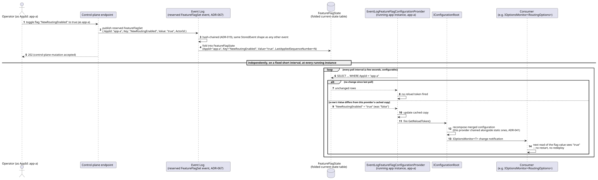
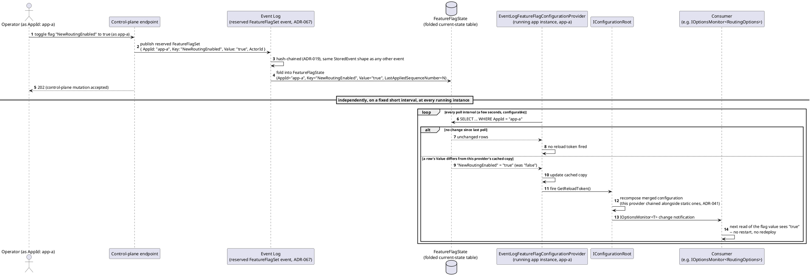
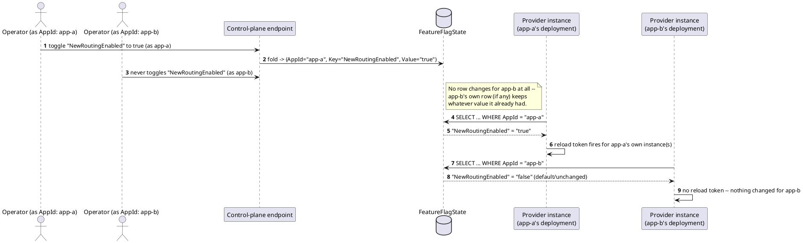
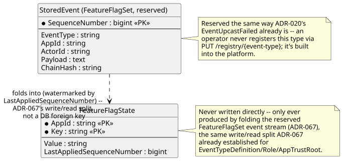
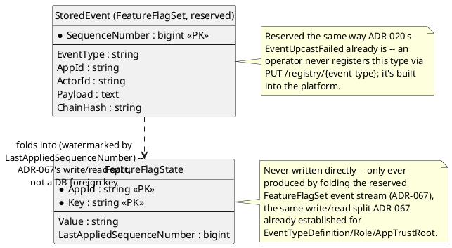

# Feature: Instant feature-flag toggles via a dynamic `IConfigurationProvider`

Context: `ADR-077`
(`../adrs/adr-077-dynamic-feature-flag-configuration-provider.md`)
resolves what looked like an internal contradiction between three
already-Accepted ADRs — `ADR-038`'s promise that a bad rollout "can be
disabled instantly," `ADR-041`'s "configuration stays
`Microsoft.Extensions.Configuration`," and `ADR-058`'s own
config-source question left open. The premise was wrong, not the ADRs:
`IConfiguration`'s provider model already supports live, no-restart
change propagation via `GetReloadToken()` — the same mechanism the file
provider already uses locally for `appsettings.json`
(`reloadOnChange: true`), and the same one `ADR-041`'s secrets addendum
already chains live, network-backed providers (Key Vault, Vault)
alongside static ones for. This doc covers the flag-specific
application of that existing pattern: a small
`EventLogFeatureFlagConfigurationProvider` that polls a folded
`FeatureFlagState` table (`../data/schema-registry.md`, defined
alongside this ADR) every few seconds and fires a reload token when a
flag's value changes.

Flag state is a **reserved Event Log event**, not a bespoke admin
table — a `FeatureFlagSet` event (`ActorId`, `AppId`, flag key, value)
follows `ADR-067`'s control-plane-actions-as-reserved-events pattern
exactly (`../adrs/adr-067-control-plane-actions-as-reserved-events.md`)
— the same reserved-event, folded-current-state-table shape `ADR-067`
already established for `SchemaRegistered` and `RoleGranted`/
`RoleRevoked`, applied here to flags instead. That gives flag changes
`ADR-019`'s hash chain and `ActorId`/audit trail for free, with no new
tamper-evidence or storage mechanism. Flags are `AppId`-scoped per
`ADR-075`'s silo model — one tenant's flag state, its folding event
stream, and its `FeatureFlagState` rows all live inside that tenant's
own deployment; two `AppId`s can hold independently different values
for a flag of the identical name with zero interaction.

**Out of scope, deliberately**: this doc does not re-derive `ADR-041`'s
general configuration-provider-chaining story (secrets, connection
strings, deployment topology) — those stay on `ADR-041`'s static
providers, entirely unaffected by this mechanism; nor does it claim
sub-second propagation — `ADR-077` is explicit that "instantly" means
"no redeploy-rollback cycle," not real-time push, so a poll interval of
a few seconds (configurable) is the actual latency bound, not a Postgres
`LISTEN`/`NOTIFY`-style push (rejected as provider-specific, breaking
`ADR-004`'s portability). Nor does this doc re-derive `ADR-058`'s rate
limits themselves — `ADR-077` only notes that mechanism is *available*
as one possible config source for them, without forcing it; see
[`rate-limiting.md`](rate-limiting.md) for that feature's own concern.

## Sequence diagram — toggling a flag propagates within the poll interval, no restart





The gap between step 1 (the toggle accepted) and the loop noticing it is
this feature's entire latency bound — bounded by the poll interval, not
by a deploy/rollback cycle, which is the specific promise `ADR-038`
makes and this mechanism satisfies.

## Sequence diagram — two `AppId`s hold independent state for the same flag key




Per `ADR-075`'s silo model, `app-a` and `app-b` are separate deployments
with separate databases in a real deployment — this diagram draws both
polls against one shared `state` participant only to make the row-level
isolation visible side by side; it is not claiming a shared database
between tenants.

## Data model (ER diagram)





Full entity shape is in
[`../data/schema-registry.md`](../data/schema-registry.md)'s
"Feature flag state (`ADR-077`)" section — this diagram shows only the
write/read relationship this doc's scenarios exercise.

## Salt (UI mockup)

Not applicable — `ADR-077` decides the propagation *mechanism* (a
reserved event, a folded table, a polling configuration provider); it
does not decide or require an operator-facing flag-management UI, and
none is invented here. Toggling a flag in every scenario below is a
control-plane endpoint call, the same machine-facing shape
[`multi-tenancy.md`](multi-tenancy.md) and
[`rate-limiting.md`](rate-limiting.md) already use for their own
registry/config-level mutations. If an operator console for flags is
ever built, it would be a Gateway operations surface — not specified by
`ADR-077` and not designed here.

## Gherkin

```gherkin
Feature: Instant feature-flag toggles via a dynamic IConfigurationProvider
  As an operator
  I want to toggle a feature flag's value without a restart or redeploy
  So that a bad rollout can be disabled quickly, scoped to one tenant at a time

  # Every control-plane request in this file carries sufficient scope
  # (see auth.md) unless a scenario says otherwise; only the flag
  # propagation mechanism itself is under test here.

  Background:
    Given AppId "app-a" has flag "NewRoutingEnabled" currently set to "false"
    And AppId "app-b" has flag "NewRoutingEnabled" currently set to "false"
    And the configured poll interval is 5 seconds

  Scenario: Toggling a flag takes effect within the poll interval, with no restart
    When AppId "app-a" toggles flag "NewRoutingEnabled" to "true"
    Then a reserved FeatureFlagSet event should be published for AppId "app-a"
    And FeatureFlagState for (AppId "app-a", "NewRoutingEnabled") should read "true"
    And within one poll interval, AppId "app-a"'s running instance(s) should observe "NewRoutingEnabled" as "true"
    And no process restart or redeployment should have occurred

  Scenario: Two AppIds hold independently different values for the same flag key
    When AppId "app-a" toggles flag "NewRoutingEnabled" to "true"
    Then AppId "app-a"'s FeatureFlagState for "NewRoutingEnabled" should read "true"
    And AppId "app-b"'s FeatureFlagState for "NewRoutingEnabled" should remain "false"
    # AppId scoping (ADR-075's silo model) means toggling one tenant's flag
    # never touches another tenant's row, stream, or running instance.

  Scenario: A flag toggle is captured as an ordinary, hash-chained reserved event
    When AppId "app-a" toggles flag "NewRoutingEnabled" to "true"
    Then the resulting FeatureFlagSet event should be hash-chained (ADR-019) into the same Event Log as any business event
    And the event should carry the ActorId of the operator who made the change
    # Same audit trail ADR-067 already gives SchemaRegistered/RoleGranted --
    # no separate, unaudited flag-admin table.

  Scenario: A provider that observes no change fires no reload token
    Given no flag for AppId "app-a" has changed since the last poll
    When the EventLogFeatureFlagConfigurationProvider polls FeatureFlagState
    Then no configuration reload token should fire
    And no consumer should observe a change notification

  Scenario: Toggling a flag never changes which code or plugins are loaded
    Given AppId "app-a" has an IDeviceInputSource-style extensibility seam configured with a fixed set of adapters at startup (ADR-041/ADR-058's explicit-composition rule)
    When AppId "app-a" toggles flag "NewRoutingEnabled" to "true"
    Then the set of loaded adapters/plugins should remain exactly as composed at startup
    # This is the resolution of the apparent ADR-038/ADR-041/ADR-058
    # contradiction: a flag changes a VALUE at runtime, never which CODE
    # is loaded -- explicit composition is unaffected.

  Scenario: Static configuration such as connection strings is unaffected by this mechanism
    Given AppId "app-a"'s connection string is configured via a static provider (ADR-041)
    When AppId "app-a" toggles flag "NewRoutingEnabled" to "true"
    Then the connection string value should remain sourced from its static provider, unchanged
    # The flag/static-config boundary: only values ADR-038 already calls
    # a feature flag flow through this dynamic provider at all.

  Scenario: Reverting a flag to its previous value propagates the same way as any other toggle
    Given AppId "app-a" has flag "NewRoutingEnabled" set to "true"
    When AppId "app-a" toggles flag "NewRoutingEnabled" back to "false"
    Then a new reserved FeatureFlagSet event should be published
    And within one poll interval, AppId "app-a"'s running instance(s) should observe "NewRoutingEnabled" as "false"
```
