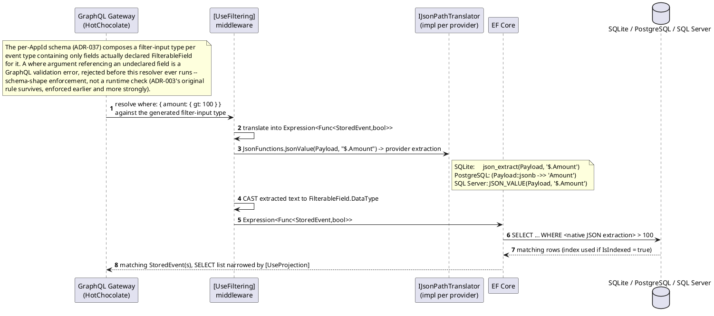
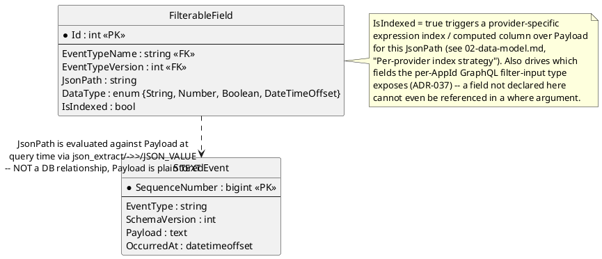

# Feature: GraphQL filter pushdown to the database

Context: full design in `../04-odata-filter-pushdown.md` (retitled
"GraphQL Filter Pushdown Design" this session, per `ADR-037`); this is
the query-translation mechanics underlying
[`follow-subscribe.md`](follow-subscribe.md) — that doc covers the
GraphQL Subscription/SSE connection lifecycle, this one covers what
happens inside a single query once a GraphQL `where` argument has been
resolved. The `where` argument itself travels inside a GraphQL query/
subscription document, carried in the `QUERY` request body (`ADR-012`),
never a URL query string and never OData's `$filter` syntax (`ADR-037`)
— the translation into native SQL JSON extraction described below is
otherwise unaffected by either transport detail.

## Sequence diagram



## Data model (ER diagram)



Full entity set is in `../02-data-model.md`. The relationship here is
deliberately drawn as logical-only: `Payload` has no native JSON column type
(`ADR-004`), so there is nothing for a real foreign key to point at — the
`JsonPath` string is only meaningful once handed to the provider's
extraction function at query time.

## Salt (UI mockup)

Not applicable — filter pushdown is an internal query-translation concern
with no UI surface.

## Gherkin

```gherkin
Feature: GraphQL filter pushdown to the database
  As a GraphQL resolver (Follow, Lineage, or registry listing)
  I want where-argument filter expressions translated into native SQL JSON extraction
  So that filtering is executed by the database, not in application memory

  # Runs under the same events:follow-scoped requests as follow-subscribe.md;
  # see auth.md for authentication/authorization behavior itself. The
  # examples below use a bounded (non-streaming) query against the same
  # underlying IQueryable<StoredEvent> resolver Follow's Subscription
  # field also filters -- the live-tail/replay streaming behavior itself
  # is covered in follow-subscribe.md, not repeated here.
  #
  # "orderPlacedEvents" below is an illustrative bounded resolver name for
  # exercising the pushdown mechanism directly and is not itself a real,
  # separately-contracted field -- 03-api-contracts.md's actual read
  # surfaces are Follow's onOrderPlaced Subscription, the Lineage query
  # fields, and registry listing (04-*.md, "Explicitly out of scope").
  # This doc stays scoped to pushdown mechanics, agnostic to which real
  # surface drives it.

  Scenario Outline: Filter predicate is pushed down identically on every provider
    Given the active database provider is "<provider>"
    And the event type "OrderPlaced" is registered with filterable field "$.Amount" of type "Number", indexed
    And 3 "OrderPlaced" events exist with Amount values 50, 100, 150
    When I run a bounded GraphQL query with document:
      """
      query { orderPlacedEvents(where: { amount: { gt: 100 } }) { orderId amount } }
      """
    Then I should receive only the event with Amount 150
    And the generated SQL should contain a native JSON extraction function for "<provider>"

    Examples:
      | provider   |
      | Sqlite     |
      | Postgres   |
      | SqlServer  |

  Scenario: A where argument referencing an undeclared field cannot be constructed
    Given the event type "OrderPlaced" is registered with filterable field "$.Amount" of type "Number", indexed
    When I run a GraphQL query with document:
      """
      query { orderPlacedEvents(where: { secretField: { eq: "x" } }) { orderId } }
      """
    Then the query should be rejected as a GraphQL validation error, before any resolver runs
    And no SQL query should be executed
    # secretField was never declared FilterableField, so it does not exist on the
    # generated filter-input type at all -- this is a schema-shape guarantee
    # (ADR-037), not the pre-ADR-037 parse-then-400 runtime check.

  Scenario: Numeric comparison casts extracted text correctly
    Given the event type "OrderPlaced" is registered with filterable field "$.Amount" of type "Number", indexed
    And an "OrderPlaced" event exists with Amount 99.5
    When I run a bounded GraphQL query with document:
      """
      query { orderPlacedEvents(where: { amount: { gt: 99 } }) { orderId amount } }
      """
    Then the event with Amount 99.5 should be included in the results

  Scenario: String comparison does not require casting
    Given the event type "OrderPlaced" is registered with filterable field "$.Status" of type "String", not indexed
    And an "OrderPlaced" event exists with Status "Paid"
    When I run a bounded GraphQL query with document:
      """
      query { orderPlacedEvents(where: { status: { eq: "Paid" } }) { orderId status } }
      """
    Then the event with Status "Paid" should be included in the results

  Scenario: Combining conditions translates to a combined SQL predicate
    Given the event type "OrderPlaced" is registered with filterable field "$.Amount" of type "Number", indexed
    And the event type "OrderPlaced" is registered with filterable field "$.Status" of type "String", not indexed
    And an "OrderPlaced" event exists with Amount 150 and Status "Pending"
    And an "OrderPlaced" event exists with Amount 150 and Status "Paid"
    When I run a bounded GraphQL query with document:
      """
      query { orderPlacedEvents(where: { and: [{ amount: { gt: 100 } }, { status: { eq: "Paid" } }] }) { orderId } }
      """
    Then I should receive only the second event
    # HotChocolate's `and` combinator on the filter-input type -- see
    # 04-odata-filter-pushdown.md's operator -> SQL mapping table.

  Scenario: Indexed field query uses the expression index / computed column
    Given the event type "OrderPlaced" is registered with filterable field "$.Amount" of type "Number", indexed
    When I run a bounded GraphQL query with document:
      """
      query { orderPlacedEvents(where: { amount: { gt: 100 } }) { orderId } }
      """
    Then the query execution plan should reference the index created for "$.Amount"
```
