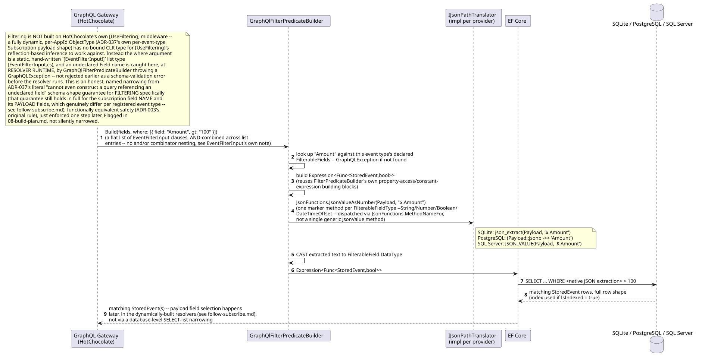
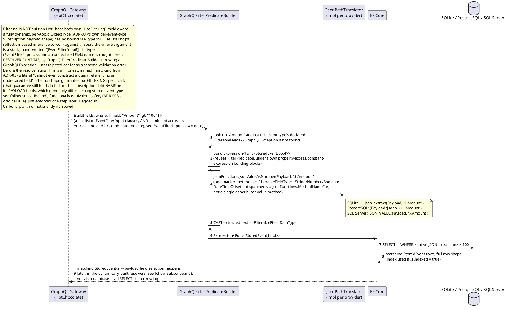
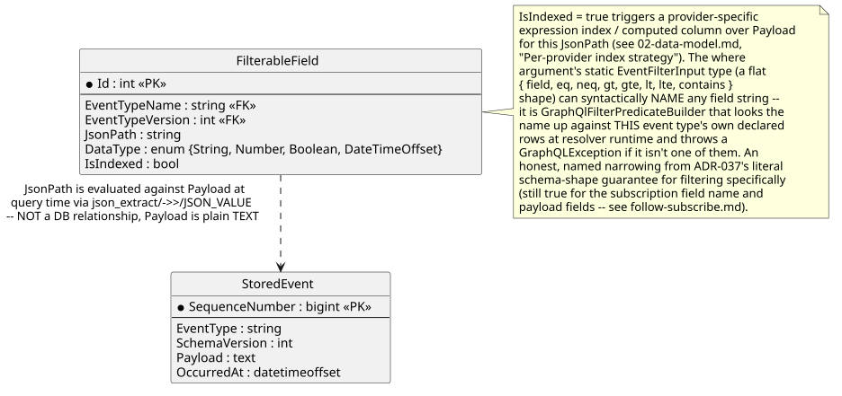
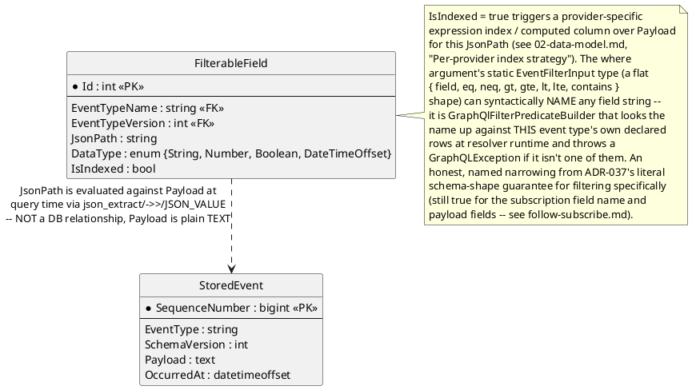

# Feature: GraphQL filter pushdown to the database

Context: full design in `../04-odata-filter-pushdown.md` (retitled
"GraphQL Filter Pushdown Design" this session, per `ADR-037`); this is
the query-translation mechanics underlying
[`follow-subscribe.md`](follow-subscribe.md) — that doc covers the
GraphQL Subscription/SSE connection lifecycle, this one covers what
happens inside a single query once a GraphQL `where` argument has been
resolved. The `where` argument itself travels inside a GraphQL query/
subscription document, carried in the `QUERY` request body (`ADR-012`),
never a URL query string and never OData's `$filter` syntax (`ADR-037`)
— the translation into native SQL JSON extraction described below is
otherwise unaffected by either transport detail.

## Sequence diagram





## Data model (ER diagram)





Full entity set is in `../02-data-model.md`. The relationship here is
deliberately drawn as logical-only: `Payload` has no native JSON column type
(`ADR-004`), so there is nothing for a real foreign key to point at — the
`JsonPath` string is only meaningful once handed to the provider's
extraction function at query time.

## Salt (UI mockup)

Not applicable — filter pushdown is an internal query-translation concern
with no UI surface.

## Gherkin

```gherkin
Feature: GraphQL filter pushdown to the database
  As a GraphQL resolver (Follow, Lineage, or registry listing)
  I want where-argument filter expressions translated into native SQL JSON extraction
  So that filtering is executed by the database, not in application memory

  # Runs under the same events:follow-scoped requests as follow-subscribe.md;
  # see auth.md for authentication/authorization behavior itself. The
  # examples below exercise the real subscription field
  # on_demo_OrderPlaced (ADR-037's per-AppId, per-event-type field naming,
  # FollowSubscriptionTypeModule) with its real `where: [EventFilterInput!]`
  # argument shape -- a flat list of { field, eq, neq, gt, gte, lt, lte,
  # contains } clauses, AND-combined across list entries, values passed as
  # strings and cast server-side to the field's own declared
  # FilterableFieldType (EventFilterInput.cs, GraphQlFilterPredicateBuilder).
  # There is no and/or combinator and no nested per-field object shape.

  Scenario Outline: Filter predicate is pushed down identically on every provider
    Given the active database provider is "<provider>"
    And the event type "OrderPlaced" is registered with filterable field "$.Amount" of type "Number", indexed
    And 3 "OrderPlaced" events exist with Amount values 50, 100, 150
    When I open a GraphQL Subscription connection with document:
      """
      subscription { on_demo_OrderPlaced(where: [{ field: "Amount", gt: "100" }]) { orderId amount } }
      """
    Then I should receive only the event with Amount 150
    And the generated SQL should contain a native JSON extraction function for "<provider>"

    Examples:
      | provider   |
      | Sqlite     |
      | Postgres   |
      | SqlServer  |

  Scenario: A where argument naming an undeclared field is rejected at resolver runtime
    Given the event type "OrderPlaced" is registered with filterable field "$.Amount" of type "Number", indexed
    When I open a GraphQL Subscription connection with document:
      """
      subscription { on_demo_OrderPlaced(where: [{ field: "secretField", eq: "x" }]) { orderId } }
      """
    Then the subscription should be rejected with a GraphQLException
    And no SQL query should be executed
    # "secretField" was never declared FilterableField for this event type.
    # EventFilterInput's own Field is a plain string on a static,
    # hand-written input type -- it CAN be spelled here syntactically -- so
    # GraphQlFilterPredicateBuilder.Build is what looks the name up against
    # this event type's declared FilterableFields and throws at resolver
    # runtime, not a schema-composition-time validation error. An honest,
    # narrower guarantee than ADR-037's literal "cannot even be
    # constructed" for FILTERING specifically (still literally true for
    # the subscription field NAME and its payload fields -- see
    # follow-subscribe.md).

  Scenario: Numeric comparison casts extracted text correctly
    Given the event type "OrderPlaced" is registered with filterable field "$.Amount" of type "Number", indexed
    And an "OrderPlaced" event exists with Amount 99.5
    When I open a GraphQL Subscription connection with document:
      """
      subscription { on_demo_OrderPlaced(where: [{ field: "Amount", gt: "99" }]) { orderId amount } }
      """
    Then the event with Amount 99.5 should be included in the results

  Scenario: String comparison does not require casting
    Given the event type "OrderPlaced" is registered with filterable field "$.Status" of type "String", not indexed
    And an "OrderPlaced" event exists with Status "Paid"
    When I open a GraphQL Subscription connection with document:
      """
      subscription { on_demo_OrderPlaced(where: [{ field: "Status", eq: "Paid" }]) { orderId status } }
      """
    Then the event with Status "Paid" should be included in the results

  Scenario: Combining conditions translates to a combined SQL predicate
    Given the event type "OrderPlaced" is registered with filterable field "$.Amount" of type "Number", indexed
    And the event type "OrderPlaced" is registered with filterable field "$.Status" of type "String", not indexed
    And an "OrderPlaced" event exists with Amount 150 and Status "Pending"
    And an "OrderPlaced" event exists with Amount 150 and Status "Paid"
    When I open a GraphQL Subscription connection with document:
      """
      subscription { on_demo_OrderPlaced(where: [{ field: "Amount", gt: "100" }, { field: "Status", eq: "Paid" }]) { orderId } }
      """
    Then I should receive only the second event
    # Two entries in the SAME where list, AND-combined by
    # GraphQlFilterPredicateBuilder.Build's own foreach loop -- there is no
    # and/or combinator keyword to write (see EventFilterInput.cs's own
    # note on why: a hand-written static input type, not a dynamically
    # composed one).

  Scenario: Indexed field query uses the expression index / computed column
    Given the event type "OrderPlaced" is registered with filterable field "$.Amount" of type "Number", indexed
    When I open a GraphQL Subscription connection with document:
      """
      subscription { on_demo_OrderPlaced(where: [{ field: "Amount", gt: "100" }]) { orderId } }
      """
    Then the query execution plan should reference the index created for "$.Amount"

  # ADR-096/ADR-097 -- a classified field's Payload value is ciphertext, so
  # an encrypted-kind FilterableField skips json_extract/->>/JSON_VALUE
  # entirely and compares against EncryptedFieldIndexEntry.Token instead.
  # See docs/comparisons/searchable-encryption-for-crypto-shredded-fields.md
  # for the full mechanism and its accepted leakage trade-offs -- not yet
  # built (08-build-plan.md's matching item is Not started).

  Scenario: Equality query against a blind-indexed encrypted field never extracts Payload as plaintext
    Given the event type "CustomerRegistered" is registered with filterable field "$.Email" of type "String", indexed, EncryptedBlindIndex
    And a "CustomerRegistered" event exists with Email "alice@example.com", encrypted at rest under the entity's own crypto-shredding key
    When I open a GraphQL Subscription connection with document:
      """
      subscription { on_demo_CustomerRegistered(where: [{ field: "Email", eq: "alice@example.com" }]) { customerId } }
      """
    Then I should receive the matching event
    And the generated SQL should compare against EncryptedFieldIndexEntry.Token, never json_extract/->>/JSON_VALUE against Payload

  Scenario: Entity erasure removes that entity's own Shared-scope index tokens without touching the hash chain
    Given the event type "CustomerRegistered" is registered with filterable field "$.Email" of type "String", indexed, EncryptedBlindIndex, Shared key scope
    And a "CustomerRegistered" event exists with Email "alice@example.com" for entity "demo:Customer:alice"
    When entity "demo:Customer:alice" is erased
    Then the EncryptedFieldIndexEntry rows for entity "demo:Customer:alice" should no longer exist
    And a subsequent equality query for Email "alice@example.com" should not match that entity
    And the event's ChainHash and every ChainHash after it should be unchanged
```
