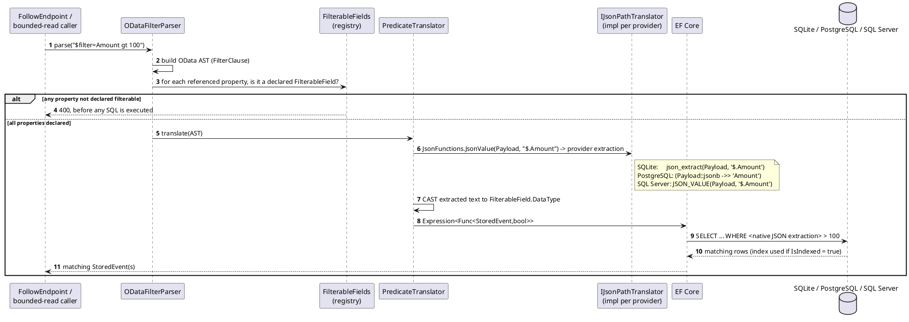
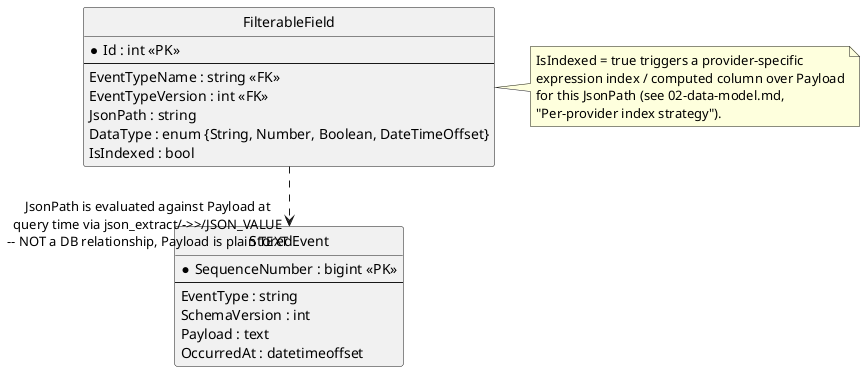

# Feature: OData filter pushdown to the database

> **Surface superseded, per `ADR-037`.** `$filter` (OData syntax) is gone
> — GraphQL query/subscription arguments are the only filtering surface
> now. **The pushdown mechanism this doc actually tests survives
> unchanged**: `IJsonPathTranslator`'s per-provider native SQL JSON
> generation still runs, now driven by GraphQL resolver arguments instead
> of an OData AST. See `../04-odata-filter-pushdown.md`'s banner for the
> same distinction. Scenario rewriting for the GraphQL surface is tracked
> as outstanding propagation work (`CLAUDE.md`), not done in this pass.

Context: full design in `../04-odata-filter-pushdown.md`; this is the query-
translation mechanics underlying [`follow-subscribe.md`](follow-subscribe.md)
— that doc covers the SSE connection lifecycle, this one covers what happens
inside a single poll/query once a `$filter` has been accepted. `$filter`
itself travels in the `QUERY` request body per `ADR-012`, not a URL query
string, but the string content and its translation into SQL — this
doc's actual subject — are unaffected by that transport change.

## Sequence diagram



## Data model (ER diagram)



Full entity set is in `../02-data-model.md`. The relationship here is
deliberately drawn as logical-only: `Payload` has no native JSON column type
(`ADR-004`), so there is nothing for a real foreign key to point at — the
`JsonPath` string is only meaningful once handed to the provider's
extraction function at query time.

## Salt (UI mockup)

Not applicable — filter pushdown is an internal query-translation concern
with no UI surface.

## Gherkin

```gherkin
Feature: OData filter pushdown to the database
  As the follow API
  I want $filter expressions translated into native SQL JSON extraction
  So that filtering is executed by the database, not in application memory

  # Runs under the same events:follow-scoped requests as follow-subscribe.md;
  # see auth.md for authentication/authorization behavior itself.

  Scenario Outline: Filter predicate is pushed down identically on every provider
    Given the active database provider is "<provider>"
    And the event type "OrderPlaced" is registered with filterable field "$.Amount" of type "Number", indexed
    And 3 "OrderPlaced" events exist with Amount values 50, 100, 150
    When I query "/follow/OrderPlaced?$filter=Amount gt 100" with a bounded read (not a live stream)
    Then I should receive only the event with Amount 150
    And the generated SQL should contain a native JSON extraction function for "<provider>"

    Examples:
      | provider   |
      | Sqlite     |
      | Postgres   |
      | SqlServer  |

  Scenario: Unsupported field reference is rejected before query execution
    Given the event type "OrderPlaced" is registered with filterable field "$.Amount" of type "Number", indexed
    When I query "/follow/OrderPlaced?$filter=SecretField eq 'x'"
    Then no SQL query should be executed
    And the response status should be 400

  Scenario: Numeric comparison casts extracted text correctly
    Given the event type "OrderPlaced" is registered with filterable field "$.Amount" of type "Number", indexed
    And an "OrderPlaced" event exists with Amount 99.5
    When I query "/follow/OrderPlaced?$filter=Amount gt 99"
    Then the event with Amount 99.5 should be included in the results

  Scenario: String comparison does not require casting
    Given the event type "OrderPlaced" is registered with filterable field "$.Status" of type "String", not indexed
    And an "OrderPlaced" event exists with Status "Paid"
    When I query "/follow/OrderPlaced?$filter=Status eq 'Paid'"
    Then the event with Status "Paid" should be included in the results

  Scenario: Indexed field query uses the expression index / computed column
    Given the event type "OrderPlaced" is registered with filterable field "$.Amount" of type "Number", indexed
    When I query "/follow/OrderPlaced?$filter=Amount gt 100"
    Then the query execution plan should reference the index created for "$.Amount"
```
