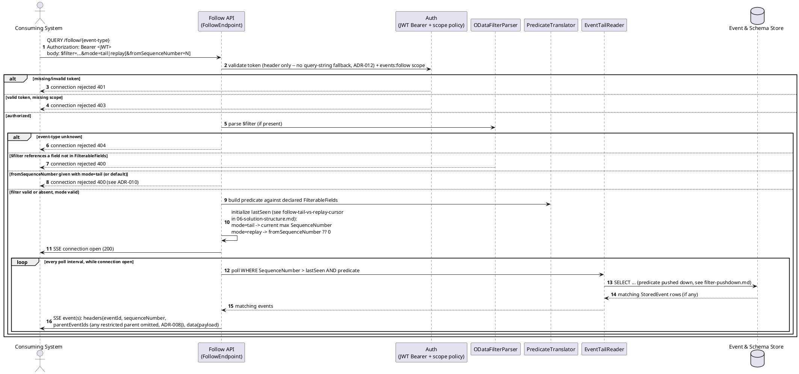
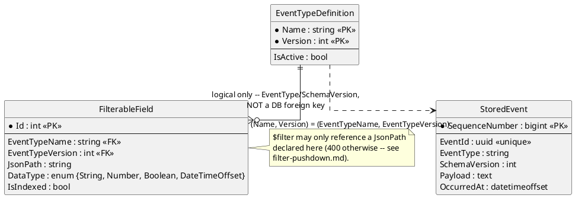

# Feature: Follow an event type via SSE

> **Surface superseded, per `ADR-037`.** `QUERY /follow/{event-type}`
> (bare SSE) is replaced by a GraphQL Subscription served through the
> GraphQL Gateway — same `mode`/`fromSequenceNumber` tail-vs-replay
> semantics (`ADR-010`), same HTTP `QUERY` method for the same PII-in-URL
> reason, just a GraphQL subscription document instead of a bare `$filter`
> string, and a GraphQL-transport response instead of a standalone SSE
> stream. Scenario rewriting is tracked as outstanding propagation work
> (`CLAUDE.md`), not done in this pass.

Context: full contract in `../03-api-contracts.md`; the `$filter` pushdown
mechanics (per-provider SQL translation) are covered in depth in
[`filter-pushdown.md`](filter-pushdown.md), not repeated here; auth
requirements, including the browser `fetch()`-based SSE story, in
[`auth.md`](auth.md); the `mode`/`fromSequenceNumber` tail-vs-replay design
in `ADR-010` (`../07-adrs.md`) and `../06-solution-structure.md`.

**Note on notation**: per `ADR-012`, Follow is `QUERY /follow/{event-type}`,
not `GET` — `$filter`, `mode`, and `fromSequenceNumber` travel in the
`QUERY` request body (`application/x-www-form-urlencoded`), not a literal
URL query string. This doc (and the other feature docs referencing Follow)
still write them as `?$filter=...&mode=...` throughout, purely as
shorthand for "these parameter values" — read every such string as body
content, not a URL.

## Sequence diagram



`mode=replay` and `mode=tail` (the default) share this exact loop; only
`lastSeen`'s initial value differs — see `ADR-010` and
`06-solution-structure.md`, "Follow: tail vs replay cursor".

## Data model (ER diagram)



Full entity set is in `../02-data-model.md` — this diagram shows only what
the follow/tail path reads.

## Salt (UI mockup)

Not applicable — following is a machine-to-machine (or browser-`fetch()`,
per `ADR-012`) API with no UI surface in scope.

## Gherkin

```gherkin
Feature: Follow an event type via SSE
  As a consuming system
  I want to subscribe to a stream of events of a given type
  So that I receive matching events as they are published

  # Every connection in this file carries a Bearer token with the
  # events:follow scope unless a scenario says otherwise. See auth.md for
  # authentication/authorization behavior itself.

  Background:
    Given the event type "OrderPlaced" version 1 is registered with schema:
      """
      { "type": "object", "properties": { "Amount": { "type": "number" }, "Status": { "type": "string" } }, "required": ["Amount", "Status"] }
      """
    And "OrderPlaced" has filterable fields:
      | jsonPath   | dataType | isIndexed |
      | $.Amount   | Number   | true      |
      | $.Status   | String   | false     |

  Scenario: Connecting without a filter streams all events of the type
    Given I open an SSE connection to "/follow/OrderPlaced"
    When an "OrderPlaced" event with body {"Amount": 50, "Status": "Paid"} is published
    Then I should receive that event on the SSE stream

  Scenario: Connecting with a filter only streams matching events
    Given I open an SSE connection to "/follow/OrderPlaced?$filter=Amount gt 100"
    When an "OrderPlaced" event with body {"Amount": 50, "Status": "Paid"} is published
    And an "OrderPlaced" event with body {"Amount": 150, "Status": "Paid"} is published
    Then I should receive only the event with Amount 150 on the SSE stream

  Scenario: Filtering on a field not marked filterable is rejected at connection time
    When I open an SSE connection to "/follow/OrderPlaced?$filter=InternalNotes eq 'x'"
    Then the connection should be rejected with 400
    And the response should state "InternalNotes" is not a filterable field

  Scenario: Filtering combines multiple conditions
    Given I open an SSE connection to "/follow/OrderPlaced?$filter=Amount gt 100 and Status eq 'Paid'"
    When an "OrderPlaced" event with body {"Amount": 150, "Status": "Pending"} is published
    And an "OrderPlaced" event with body {"Amount": 150, "Status": "Paid"} is published
    Then I should receive only the second event on the SSE stream

  Scenario: Connecting to an unknown event type is rejected
    When I open an SSE connection to "/follow/NonExistentType"
    Then the connection should be rejected with 404

  Scenario: A restricted parent's ID is omitted from the envelope, not exposed unresolved
    Given the event type "PatientAdmitted" is registered with read claim "clearance:phi"
    And a "PatientAdmitted" event "admit-1" was published with body {"PatientId": "abc-123"}
    And I open an SSE connection to "/follow/OrderPlaced" with no additional claims
    When an "OrderPlaced" event with body {"Amount": 50, "Status": "Paid"} parented off "admit-1" is published
    Then I should receive that event on the SSE stream
    And its parentEventIds should not include "admit-1"
    # order-1 itself streams normally -- lacking access to its parent's type
    # never blocks the event whose type you can see (ADR-008).

  Scenario: Connecting with mode=replay streams matching history, then tails new events with no gap
    Given an "OrderPlaced" event with body {"Amount": 50, "Status": "Paid"} was published
    And an "OrderPlaced" event with body {"Amount": 150, "Status": "Paid"} was published
    When I open an SSE connection to "/follow/OrderPlaced?mode=replay"
    Then I should receive both existing events on the SSE stream
    When an "OrderPlaced" event with body {"Amount": 75, "Status": "Paid"} is published
    Then I should receive that new event too, without a gap or a duplicate

  Scenario: Connecting with mode=replay and fromSequenceNumber only replays events after that point
    Given an "OrderPlaced" event "order-1" with body {"Amount": 50, "Status": "Paid"} was published
    And an "OrderPlaced" event "order-2" with body {"Amount": 150, "Status": "Paid"} was published
    When I open an SSE connection to "/follow/OrderPlaced?mode=replay&fromSequenceNumber={order-1's SequenceNumber}"
    Then I should receive "order-2" on the SSE stream
    And I should not receive "order-1" on the SSE stream

  Scenario: mode=replay combines with $filter, replaying only matching history
    Given an "OrderPlaced" event with body {"Amount": 50, "Status": "Paid"} was published
    And an "OrderPlaced" event with body {"Amount": 150, "Status": "Paid"} was published
    When I open an SSE connection to "/follow/OrderPlaced?mode=replay&$filter=Amount gt 100"
    Then I should receive only the event with Amount 150 from the replay

  Scenario: Connecting without mode defaults to tail-only, unchanged from before ADR-010
    Given an "OrderPlaced" event with body {"Amount": 50, "Status": "Paid"} was published
    When I open an SSE connection to "/follow/OrderPlaced"
    Then I should not receive that pre-existing event on the SSE stream

  Scenario: Supplying fromSequenceNumber without mode=replay is rejected
    When I open an SSE connection to "/follow/OrderPlaced?fromSequenceNumber=0"
    Then the connection should be rejected with 400
```
