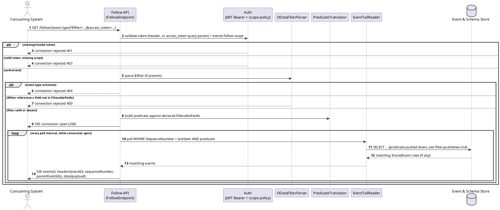
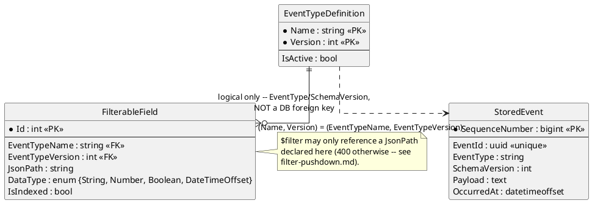

# Feature: Follow an event type via SSE

Context: full contract in `../03-api-contracts.md`; the `$filter` pushdown
mechanics (per-provider SQL translation) are covered in depth in
[`filter-pushdown.md`](filter-pushdown.md), not repeated here; auth
requirements, including the browser `EventSource` `access_token`
query-string caveat, in [`auth.md`](auth.md).

## Sequence diagram



## Data model (ER diagram)



Full entity set is in `../02-data-model.md` — this diagram shows only what
the follow/tail path reads.

## Salt (UI mockup)

Not applicable — following is a machine-to-machine (or browser-`EventSource`)
API with no UI surface in scope.

## Gherkin

```gherkin
Feature: Follow an event type via SSE
  As a consuming system
  I want to subscribe to a stream of events of a given type
  So that I receive matching events as they are published

  # Every connection in this file carries a Bearer token with the
  # events:follow scope unless a scenario says otherwise. See auth.md for
  # authentication/authorization behavior itself.

  Background:
    Given the event type "OrderPlaced" version 1 is registered with schema:
      """
      { "type": "object", "properties": { "Amount": { "type": "number" }, "Status": { "type": "string" } }, "required": ["Amount", "Status"] }
      """
    And "OrderPlaced" has filterable fields:
      | jsonPath   | dataType | isIndexed |
      | $.Amount   | Number   | true      |
      | $.Status   | String   | false     |

  Scenario: Connecting without a filter streams all events of the type
    Given I open an SSE connection to "/follow/OrderPlaced"
    When an "OrderPlaced" event with body {"Amount": 50, "Status": "Paid"} is published
    Then I should receive that event on the SSE stream

  Scenario: Connecting with a filter only streams matching events
    Given I open an SSE connection to "/follow/OrderPlaced?$filter=Amount gt 100"
    When an "OrderPlaced" event with body {"Amount": 50, "Status": "Paid"} is published
    And an "OrderPlaced" event with body {"Amount": 150, "Status": "Paid"} is published
    Then I should receive only the event with Amount 150 on the SSE stream

  Scenario: Filtering on a field not marked filterable is rejected at connection time
    When I open an SSE connection to "/follow/OrderPlaced?$filter=InternalNotes eq 'x'"
    Then the connection should be rejected with 400
    And the response should state "InternalNotes" is not a filterable field

  Scenario: Filtering combines multiple conditions
    Given I open an SSE connection to "/follow/OrderPlaced?$filter=Amount gt 100 and Status eq 'Paid'"
    When an "OrderPlaced" event with body {"Amount": 150, "Status": "Pending"} is published
    And an "OrderPlaced" event with body {"Amount": 150, "Status": "Paid"} is published
    Then I should receive only the second event on the SSE stream

  Scenario: Connecting to an unknown event type is rejected
    When I open an SSE connection to "/follow/NonExistentType"
    Then the connection should be rejected with 404
```
