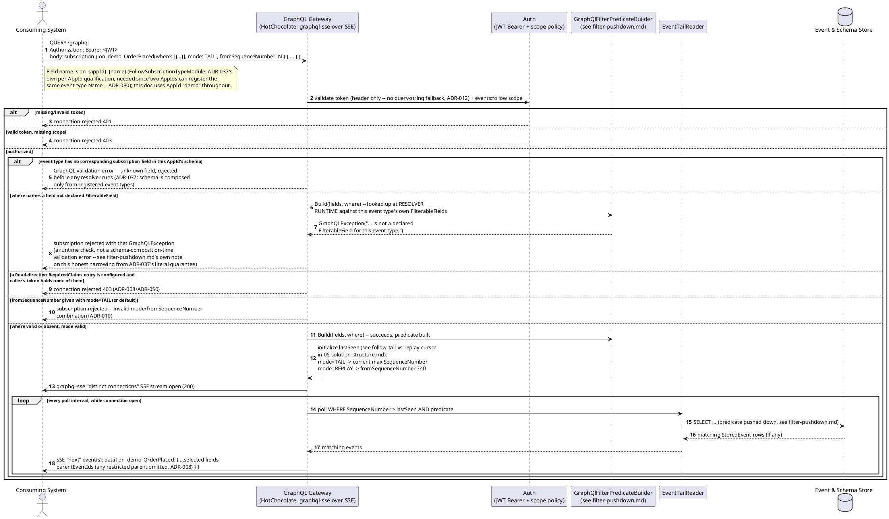
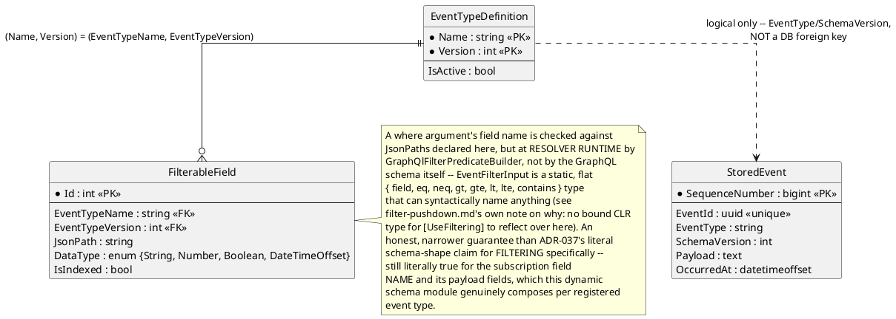

# Feature: Follow an event type via a GraphQL Subscription over SSE

Context: full contract in `../03-api-contracts.md`, "Follow — GraphQL
Subscription over SSE" (`ADR-037`); the `where`-argument pushdown
mechanics (per-provider SQL translation) are covered in depth in
[`filter-pushdown.md`](filter-pushdown.md), not repeated here; auth
requirements, including the browser `fetch()`-based SSE story, in
[`auth.md`](auth.md); the `mode`/`fromSequenceNumber` tail-vs-replay design
in `ADR-010` (`../07-adrs.md`) and `../06-solution-structure.md`.

**Transport, post-`ADR-037`**: for an externally-facing caller, Follow is
a GraphQL **Subscription**, served through the GraphQL Gateway over the
[GraphQL over Server-Sent Events Protocol](https://github.com/enisdenjo/graphql-sse/blob/master/PROTOCOL.md)
("distinct connections mode" — one SSE connection per subscription
operation), which HotChocolate implements natively. The connection is
opened with `QUERY /graphql` (`ADR-012`), carrying the subscription
document as the request body — never `GET`, since a `where` argument can
carry PII/PHI. `mode`/`fromSequenceNumber` (`ADR-010`) are ordinary
subscription-field arguments now, not URL-shaped query-string
parameters. This doc writes every request as a literal GraphQL document
rather than the pre-`ADR-037` `?$filter=...&mode=...` shorthand.

**Correction, found against the live code**: the bare `QUERY
/follow/{event-type}` REST+SSE endpoint (`EventStore.Follow.Api`,
`FollowEndpoints.cs`) is **not** retired — it's still mapped in every Host
`Program.cs` that calls `.MapFollowEndpoints()` and is exactly what
`ProjectionHost`'s own `FollowClient`
(`src/EventStore.Projections.Host/FollowClient.cs`) uses to tail/replay,
with no GraphQL document anywhere in that path (see
[`cqrs-projections.md`](cqrs-projections.md)'s own corrected banner).
`ADR-037` added the GraphQL Subscription surface this doc otherwise
describes for ad hoc/external consumers; it did not delete the older
endpoint that at least one real, first-party internal consumer still
depends on. Both surfaces share the same underlying `EventTailReader`
poll loop and `IJsonPathTranslator`/`FilterableField` pushdown mechanics
([`filter-pushdown.md`](filter-pushdown.md)) — this doc's scenarios below
still exercise the GraphQL Subscription surface specifically, since that
is the one `ADR-037` actually adds and the one meant for a caller other
than `ProjectionHost`.

## Sequence diagram



`mode: REPLAY` and `mode: TAIL` (the default) share this exact loop; only
`lastSeen`'s initial value differs — see `ADR-010` and
`06-solution-structure.md`, "Follow: tail vs replay cursor".

## Data model (ER diagram)



Full entity set is in `../02-data-model.md` — this diagram shows only what
the follow/tail path reads.

## Salt (UI mockup)

Not applicable — following (a GraphQL Subscription, `ADR-037`) is a
machine-to-machine (or browser-`fetch()`, per `ADR-012`) API with no UI
surface in scope.

## Gherkin

```gherkin
Feature: Follow an event type via a GraphQL Subscription over SSE
  As a consuming system
  I want to subscribe to a stream of events of a given type
  So that I receive matching events as they are published

  # Every connection in this file carries a Bearer token with the
  # events:follow scope unless a scenario says otherwise. See auth.md for
  # authentication/authorization behavior itself. Every registration below
  # is under AppId "demo", so the real subscription field name is
  # on_demo_OrderPlaced (FollowSubscriptionTypeModule's on_{appId}_{name}
  # convention, ADR-037/ADR-030) -- not the bare onOrderPlaced a single-
  # tenant reading might expect.

  Background:
    Given the event type "OrderPlaced" version 1 is registered with schema:
      """
      { "type": "object", "properties": { "Amount": { "type": "number" }, "Status": { "type": "string" } }, "required": ["Amount", "Status"] }
      """
    And "OrderPlaced" has filterable fields:
      | jsonPath   | dataType | isIndexed |
      | $.Amount   | Number   | true      |
      | $.Status   | String   | false     |

  Scenario: Connecting without a where argument streams all events of the type
    Given I open a GraphQL Subscription connection with document:
      """
      subscription { on_demo_OrderPlaced { amount status } }
      """
    When an "OrderPlaced" event with body {"Amount": 50, "Status": "Paid"} is published
    Then I should receive that event on the SSE stream

  Scenario: Connecting with a where argument only streams matching events
    Given I open a GraphQL Subscription connection with document:
      """
      subscription { on_demo_OrderPlaced(where: [{ field: "Amount", gt: "100" }]) { amount status } }
      """
    When an "OrderPlaced" event with body {"Amount": 50, "Status": "Paid"} is published
    And an "OrderPlaced" event with body {"Amount": 150, "Status": "Paid"} is published
    Then I should receive only the event with Amount 150 on the SSE stream

  Scenario: Filtering on a field not marked filterable is rejected at resolver runtime
    When I open a GraphQL Subscription connection with document:
      """
      subscription { on_demo_OrderPlaced(where: [{ field: "internalNotes", eq: "x" }]) { amount } }
      """
    Then the subscription should be rejected with a GraphQLException
    And the error should state "internalNotes" is not a declared FilterableField for this event type
    # Unlike a schema-composition-time rejection, "internalNotes" is
    # syntactically valid on EventFilterInput's own static, flat shape --
    # GraphQlFilterPredicateBuilder.Build looks it up against this event
    # type's declared FilterableFields and throws at resolver runtime, not
    # before. See filter-pushdown.md's own note on this honest narrowing
    # from ADR-037's literal guarantee, for FILTERING specifically.

  Scenario: Filtering combines multiple conditions
    Given I open a GraphQL Subscription connection with document:
      """
      subscription { on_demo_OrderPlaced(where: [{ field: "Amount", gt: "100" }, { field: "Status", eq: "Paid" }]) { amount status } }
      """
    When an "OrderPlaced" event with body {"Amount": 150, "Status": "Pending"} is published
    And an "OrderPlaced" event with body {"Amount": 150, "Status": "Paid"} is published
    Then I should receive only the second event on the SSE stream
    # Two entries in the same where LIST, AND-combined -- there is no
    # and/or combinator keyword (EventFilterInput.cs's own note on why: a
    # static, hand-written input type, not a dynamically composed one).

  Scenario: Connecting to an unknown event type cannot even be constructed
    When I open a GraphQL Subscription connection with document:
      """
      subscription { onNonExistentType { eventId } }
      """
    Then the subscription should be rejected as a GraphQL validation error
    And the error should state no field "onNonExistentType" exists on the Subscription type
    # The per-AppId schema (ADR-037) only ever composes a subscription field
    # (on_{appId}_{name}) for a type actually registered, active, under
    # that AppId -- there is no separate 404 branch to reach. Unlike the
    # where-argument field-name check above, THIS guarantee genuinely is
    # schema-shape, enforced by FollowSubscriptionTypeModule's dynamic
    # CreateTypesAsync, not a resolver-runtime check.

  Scenario: A restricted parent's ID is omitted from the envelope, not exposed unresolved
    Given the event type "PatientAdmitted" is registered with read claim "clearance:phi"
    And a "PatientAdmitted" event "admit-1" was published with body {"PatientId": "abc-123"}
    And I open a GraphQL Subscription connection with document:
      """
      subscription { on_demo_OrderPlaced { amount status parentEventIds } }
      """
      with no additional claims
    When an "OrderPlaced" event with body {"Amount": 50, "Status": "Paid"} parented off "admit-1" is published
    Then I should receive that event on the SSE stream
    And its parentEventIds should not include "admit-1"
    # the OrderPlaced event itself streams normally -- lacking access to its
    # parent's type never blocks the event whose type you can see (ADR-008).

  Scenario: Connecting with mode: REPLAY streams matching history, then tails new events with no gap
    Given an "OrderPlaced" event with body {"Amount": 50, "Status": "Paid"} was published
    And an "OrderPlaced" event with body {"Amount": 150, "Status": "Paid"} was published
    When I open a GraphQL Subscription connection with document:
      """
      subscription { on_demo_OrderPlaced(mode: REPLAY) { amount status } }
      """
    Then I should receive both existing events on the SSE stream
    When an "OrderPlaced" event with body {"Amount": 75, "Status": "Paid"} is published
    Then I should receive that new event too, without a gap or a duplicate

  Scenario: Connecting with mode: REPLAY and fromSequenceNumber only replays events after that point
    Given an "OrderPlaced" event "order-1" with body {"Amount": 50, "Status": "Paid"} was published
    And an "OrderPlaced" event "order-2" with body {"Amount": 150, "Status": "Paid"} was published
    When I open a GraphQL Subscription connection with document:
      """
      subscription { on_demo_OrderPlaced(mode: REPLAY, fromSequenceNumber: {order-1's SequenceNumber}) { amount status } }
      """
    Then I should receive "order-2" on the SSE stream
    And I should not receive "order-1" on the SSE stream

  Scenario: mode: REPLAY combines with a where argument, replaying only matching history
    Given an "OrderPlaced" event with body {"Amount": 50, "Status": "Paid"} was published
    And an "OrderPlaced" event with body {"Amount": 150, "Status": "Paid"} was published
    When I open a GraphQL Subscription connection with document:
      """
      subscription { on_demo_OrderPlaced(mode: REPLAY, where: [{ field: "Amount", gt: "100" }]) { amount status } }
      """
    Then I should receive only the event with Amount 150 from the replay

  Scenario: Connecting without mode defaults to tail-only, unchanged from before ADR-010
    Given an "OrderPlaced" event with body {"Amount": 50, "Status": "Paid"} was published
    When I open a GraphQL Subscription connection with document:
      """
      subscription { on_demo_OrderPlaced { amount status } }
      """
    Then I should not receive that pre-existing event on the SSE stream

  Scenario: Supplying fromSequenceNumber without mode: REPLAY is rejected
    When I open a GraphQL Subscription connection with document:
      """
      subscription { on_demo_OrderPlaced(fromSequenceNumber: 0) { amount } }
      """
    Then the subscription should be rejected with a GraphQL error stating
      fromSequenceNumber is only valid alongside mode: REPLAY
```
