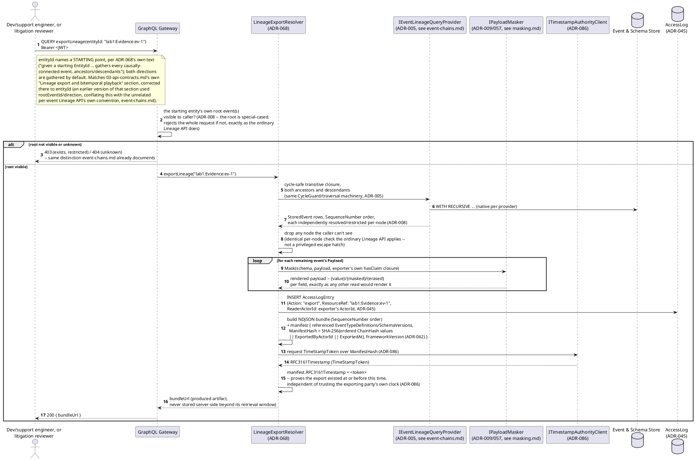
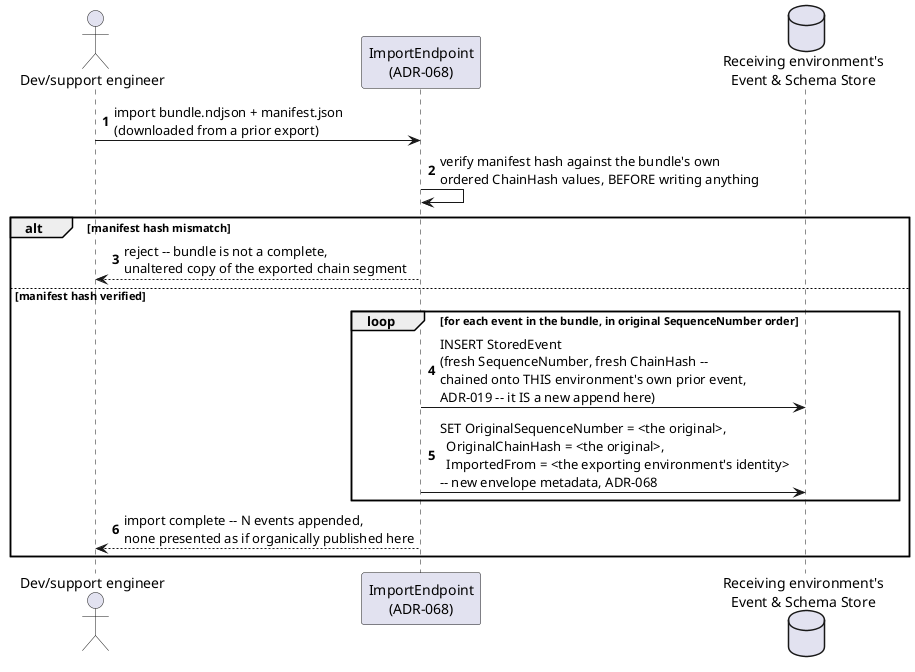
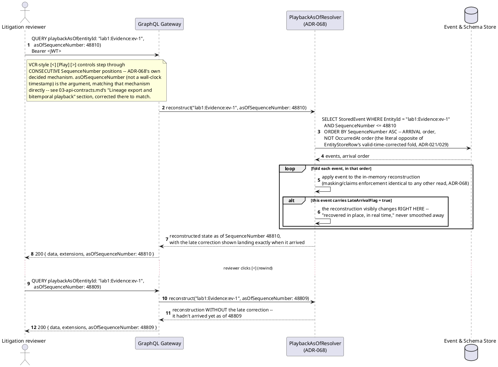
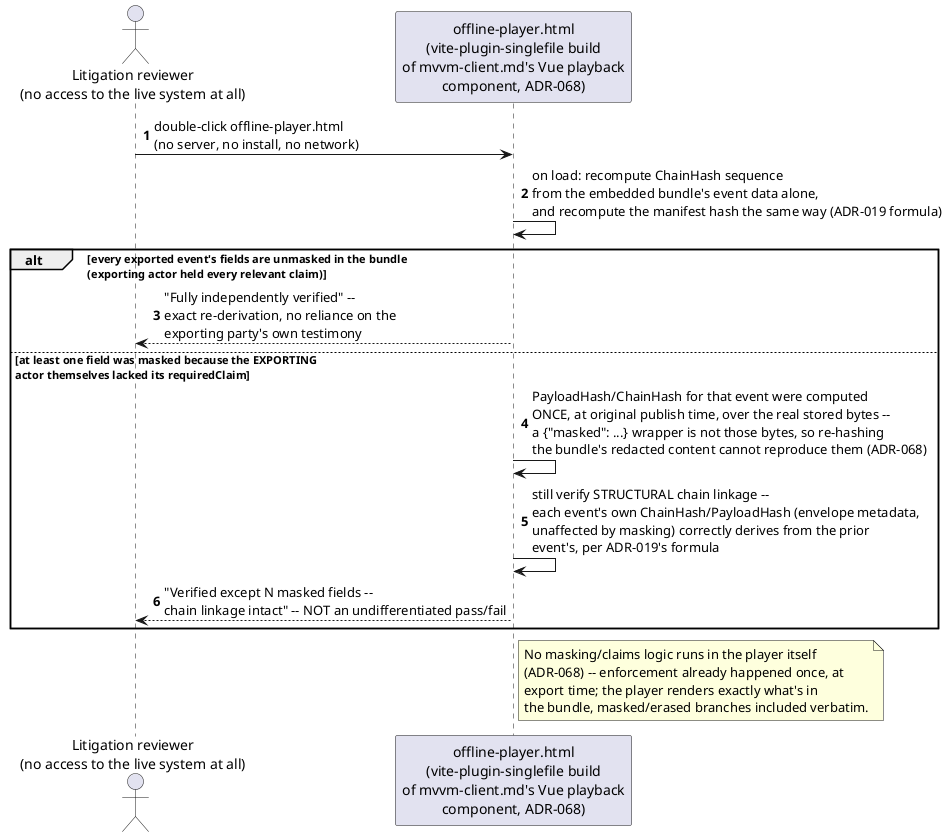
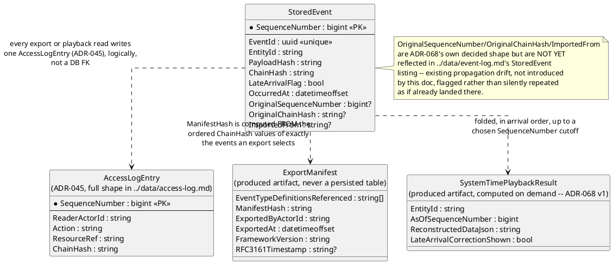
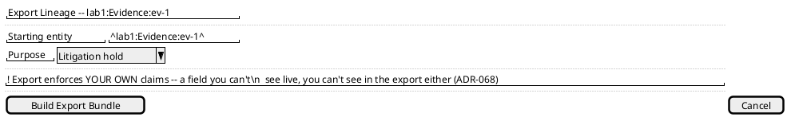
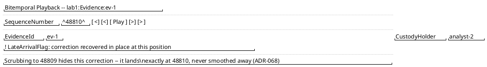
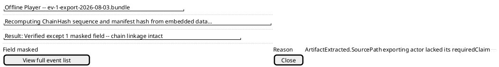

# Feature: Lineage-scoped event export, bitemporal system-time playback, and the self-contained offline player

Context: decision record `ADR-068` in
[`../adrs/adr-068-lineage-export-and-bitemporal-playback.md`](../adrs/adr-068-lineage-export-and-bitemporal-playback.md);
contract in `../03-api-contracts.md` ("Lineage export and bitemporal
playback"); library usage in
[`../libraries/web/vite-plugin-singlefile.md`](../libraries/web/vite-plugin-singlefile.md).
Three related capabilities, all new *read* shapes over history this
design didn't build until `ADR-068` — none of them a new authorization
primitive:

1. **Lineage-scoped event export**, for dev/support replay and
   litigation/regulatory chain-of-custody handoff. Walks the existing
   Lineage DAG (`ADR-005`) — the same `IEventLineageQueryProvider`/
   `CycleGuard` traversal machinery [`event-chains.md`](event-chains.md)
   already documents — into a portable NDJSON-plus-manifest bundle.
   Goes through the *exact same* read-path enforcement as any other
   query: `ADR-008`'s `RequiredClaims`, `ADR-009`'s masking (including
   `ADR-057`'s `erased` branch), and `ADR-045`'s read-access audit
   logging all apply unchanged. An export is a read, never a bypass.
2. **Bitemporal system-time playback**, for litigation/regulatory
   review of "what did the system actually show, in what order" —
   folding only events with `SequenceNumber <= T`, in **arrival**
   order, with no logical-time correction: the literal opposite of the
   authoritative Entity Store's valid-time-corrected fold (`ADR-021`/
   `ADR-029`). A `LateArrivalFlag`'d event's correction visibly lands
   in place, in real time, during playback, rather than being smoothed
   into the record the way `EntityStoreRow` already does.
3. **A self-contained offline player** — a single static HTML file
   (data and playback UI both embedded, zero external requests, opens
   by double-click) built via
   [`vite-plugin-singlefile`](../libraries/web/vite-plugin-singlefile.md)
   as an alternate build target of the *same* Vue playback component
   [`mvvm-client.md`](mvvm-client.md) already needs (`ADR-039`), not a
   second technology stack. Self-verifying on load, with one honest,
   explicitly-surfaced limitation: exact for every event unmasked in
   the bundle, but **not** exact for a field the *exporting actor
   themselves* lacked the claim for — the player distinguishes "fully
   independently verified" from "verified except N masked fields,
   chain linkage intact," never one undifferentiated pass/fail.

This doc deliberately does **not** re-derive:
- **The Lineage DAG traversal mechanics themselves** — direct-join
  parents/children, cycle-safe recursive-CTE ancestors/descendants,
  per-node `resolved`/`restricted` visibility. See
  [`event-chains.md`](event-chains.md); this doc only shows the export
  resolver *consuming* that same traversal to build an export set, not
  the traversal's own SQL/pagination mechanics.
- **`RequiredClaims`/masking-wrapper mechanics in general** (`ADR-008`/
  `ADR-009`/`ADR-057`) — see [`event-security.md`](event-security.md)
  and [`masking.md`](masking.md). This doc only shows *that* the same
  `{value}`/`{masked}`/`{erased}` wrapper applies unchanged to an
  exported/played-back field, never re-deriving the wrapper itself.
- **`ChainHash`/`PayloadHash` derivation** (`ADR-019`) — see
  [`../data/event-log.md`](../data/event-log.md)'s "Tamper evidence"
  section. This doc only shows the manifest hash's *inputs* (the
  ordered `ChainHash` values) and the offline player's
  *re-derivation* of the same formula, not how `ChainHash` is computed
  at original publish time.
- **`ADR-045`'s read-access audit log mechanics in general** — see
  `docs/data/access-log.md`. This doc only notes that an export or
  playback query writes an ordinary `AccessLogEntry`, not the hash
  chain or retention posture of `AccessLog` itself.
- **The Vue/MVVM client architecture and its command-dispatch/outbox
  mechanics** (`ADR-039`) — see [`mvvm-client.md`](mvvm-client.md).
  This doc only shows the playback component's *alternate build
  target*, never re-deriving MVVM, ViewModel binding, or the client
  outbox (playback is a pure read; there is nothing to dispatch or
  queue).
- **Package/SemVer versioning of the framework itself** (`ADR-062`) —
  this doc only shows the manifest's `FrameworkVersion` field and the
  "matched version reads its own bundles" consequence `ADR-068 §4`
  states; it doesn't re-derive `ADR-062`'s package-distribution model.

Every event type below is registered under `AppId` `"lab1"`
(`ADR-030`); `EntityId` format is `{appId}:{entityType}:{uniqueId}`
(`ADR-021`).

## Sequence diagram — lineage-scoped export, with the no-bypass masking rule



Dropping a restricted node here is the *same* per-node visibility rule
`event-chains.md`'s own Lineage API query already applies — this
diagram adds nothing new to that check, only a new consumer of it.

## Sequence diagram — import at a receiving environment, preserving provenance



`OriginalSequenceNumber`/`OriginalChainHash`/`ImportedFrom` are
envelope metadata, not `Payload` content — the same convention
`parentEventIds`/`TelemetryPointer`/`erasureScope` already establish
for a repeated-relationship-shaped field that answers its own distinct
question (here: "where did this event actually originate," never
conflated with this environment's own, freshly-computed
`SequenceNumber`/`ChainHash`).

## Sequence diagram — bitemporal system-time playback, VCR-style stepping



`v1 computes this on demand, not via a new persisted store` (`ADR-068`'s
own stated scope) — every position in the diagram above is a fresh
fold, not a cached snapshot; a named, not-yet-built future optimization
is periodic system-time snapshots, the same shape `ADR-016`'s
`ProjectionSnapshot`/`ADR-027`'s materialized upcasts already use
elsewhere.

## Sequence diagram — self-contained offline player, load and self-verification



**Implementation note (added once built, 2026-08-11):** "recompute
ChainHash sequence" above is realized as a manifest-hash recomputation
(exact, over the bundle's own ordered `ChainHash` values) plus a masked/
erased-field count, not a per-event `PayloadHash`-from-`Payload` re-hash
-- `ExportedEventLine` carries no `ParentEventIds`, so that recomputation
isn't safely buildable without risking a false "tampered" result for any
event with real causal parents. See `ADR-068`'s own "Corrected, 2026-08-11"
Consequences note and `client-web/src/playback/verifyBundle.ts`.

## Data model (ER diagram)



Full `StoredEvent`/`AccessLogEntry` column lists are in
[`../data/event-log.md`](../data/event-log.md) and
[`../data/access-log.md`](../data/access-log.md) — this diagram shows
only what export, import, and playback actually touch.

## Salt (UI mockup) — export configuration, VCR-style playback control, offline player verdict

### Screen 1: Export configuration screen



**Build Export Bundle** dispatches the `exportLineage` query from the
first sequence diagram above; the resulting `bundleUrl` downloads the
NDJSON bundle and manifest directly from this same screen (a produced
artifact, never a second page). A masked or erased field the exporting
user themselves can't see renders exactly as it always would, inside
the bundle, per the no-bypass rule this doc's Context paragraph states.

### Screen 2: VCR-style bitemporal playback control



`[<]`/`[>]` step to the immediately adjacent `SequenceNumber` position
(rewind/advance one arrival at a time); `[Play]` advances automatically
at a configurable pace; `[|<]`/`[>|]` jump to the first/last known
position. Every position shown is a fresh `playbackAsOf` reconstruction
from the third sequence diagram above, never a cached snapshot in v1.

### Screen 3: Offline player's verification-result screen



Opened by double-clicking the `.html` file itself — no server, no
install, no network round trip to Screen 1 or 2. This is the fourth
sequence diagram's honest partial-verification branch, shown as this
doc's own required distinction: a plain, undifferentiated pass/fail
would misrepresent the one masked field as either "fully trustworthy"
or "the whole export is untrustworthy," neither of which is true.

## Gherkin

```gherkin
Feature: Lineage-scoped event export, bitemporal system-time playback, and the self-contained offline player
  As a dev/support engineer
  I want to export a causally-connected set of events for replay in another environment
  As a litigation or regulatory reviewer
  I want to scrub through an entity's history exactly as the system actually saw it, corrections included
  And to independently re-verify an exported bundle's integrity with no live access to the source system
  So that history can leave this system, or be replayed out of arrival order, without ever bypassing the
  same claims/masking/audit discipline every other read already follows

  # AppId "lab1" throughout (ADR-030). EntityId format
  # {appId}:{entityType}:{uniqueId} (ADR-021). Every request carries an
  # ordinary Bearer token unless a scenario says otherwise -- see auth.md.

  Background:
    Given the event type "EvidenceAcquired" version 1 is registered with EntityIdField "$.EvidenceId"
    And the event type "ArtifactExtracted" version 1 is registered with EntityIdField "$.ArtifactId", ParentValidationMode "Strict", and a maskable field "SourcePath" requiring claim "forensics:sourcepath"
    And "engineer-1" holds no additional claims
    And "auditor-3" holds claim "export:lineage"
    And "attorney-1" holds claim "export:lineage" but NOT "forensics:sourcepath"

  Scenario: A caller lacking visibility on the export's own root is rejected outright
    Given "lab1:Evidence:ev-1"'s root event has a Read-direction RequiredClaims entry the caller does not hold
    When "engineer-1" queries "exportLineage(entityId: \"lab1:Evidence:ev-1\")"
    Then the response should be 403
    And no bundle should be produced
    # The root is special-cased, exactly as the ordinary Lineage API
    # already treats it (ADR-008, see event-chains.md) -- not a new rule.

  Scenario: An export bundle's manifest hash is a verifiable function of the exported chain segment
    Given "lab1:Evidence:ev-1" and its 4 descendant events are visible to "auditor-3"
    When "auditor-3" queries "exportLineage(entityId: \"lab1:Evidence:ev-1\")"
    Then the response status should be 200 with a bundleUrl
    And the manifest's ManifestHash should equal SHA-256 over the ordered ChainHash values of all 5 exported events plus ExportedByActorId "auditor-3" and ExportedAt
    And an AccessLogEntry should be written with Action "export" and ReaderActorId "auditor-3"

  Scenario: An export bundle's manifest carries an RFC 3161 trusted timestamp over its own manifest hash
    Given "lab1:Evidence:ev-1" and its 4 descendant events are visible to "auditor-3"
    And the configured TSA (ITimestampAuthorityClient, ADR-086) is reachable
    When "auditor-3" queries "exportLineage(entityId: \"lab1:Evidence:ev-1\")"
    Then the response status should be 200 with a bundleUrl
    And the manifest's RFC3161Timestamp should be a TimeStampToken obtained over the manifest's own ManifestHash
    And the timestamp should prove the export existed at or before a specific time, independent of the exporting party's own system clock
    # ADR-086 -- strengthens ADR-068's own stated goal ("independent of
    # trusting the exporting party") the same way it strengthens ADR-066's
    # Signature.SignedAt with an independently-verifiable timestamp.

  Scenario: Importing an exported bundle preserves provenance rather than presenting it as organic
    Given a valid bundle exported from environment "prod-east" is available
    When "engineer-1" imports that bundle into a fresh environment
    Then each imported event should receive a freshly-assigned SequenceNumber and ChainHash in the new environment
    And each imported event should carry OriginalSequenceNumber, OriginalChainHash, and ImportedFrom "prod-east"
    And none of the imported events should be indistinguishable from an organically published one

  Scenario: Importing a bundle whose manifest hash doesn't match its contents is rejected before any write
    Given a bundle whose manifest's ManifestHash does not match a recomputation over its own event data
    When "engineer-1" attempts to import that bundle
    Then the import should be rejected
    And no event from that bundle should be appended to the receiving environment's store

  Scenario: Bitemporal playback shows a late-arriving correction landing exactly where it arrived, not smoothed away
    Given evidence "lab1:Evidence:ev-1" has an event carrying LateArrivalFlag true at SequenceNumber 48810
    When "attorney-1" queries "playbackAsOf(entityId: \"lab1:Evidence:ev-1\", asOfSequenceNumber: 48810)"
    Then the reconstruction should show the correction already applied
    When "attorney-1" queries "playbackAsOf(entityId: \"lab1:Evidence:ev-1\", asOfSequenceNumber: 48809)"
    Then the reconstruction should NOT show that correction
    # The literal opposite of EntityStoreRow's valid-time-corrected fold
    # (ADR-021/029) -- arrival order, no logical-time correction (ADR-068).

  Scenario: VCR-style rewind steps to the immediately preceding SequenceNumber position
    Given the reviewer is currently viewing "lab1:Evidence:ev-1" at SequenceNumber 48810
    When the reviewer clicks rewind
    Then the view should advance to SequenceNumber 48809
    And no SequenceNumber should be skipped between consecutive rewind/advance steps

  Scenario: The offline player fully verifies a bundle containing no masked fields
    Given every field in "lab1:Evidence:ev-1"'s exported bundle was visible to the exporting actor
    When the offline player loads the bundle and recomputes its chain
    Then it should report "Fully independently verified"

  Scenario: The offline player reports partial verification, distinct from a plain pass/fail, when the exporting actor itself lacked a field's claim
    Given "attorney-1" exported "lab1:Evidence:ev-1"'s lineage, and "attorney-1" lacks claim "forensics:sourcepath"
    And the exported "ArtifactExtracted" event's "SourcePath" field is therefore rendered as {"masked": "***"} in the bundle
    When the offline player loads that bundle and recomputes its chain
    Then it should report "Verified except 1 masked field -- chain linkage intact"
    And it should NOT report an undifferentiated "verified" or "failed" result
    And it should still confirm structural chain linkage between every event, including the one with the masked field
    # This is the honest, unavoidable limit ADR-068 states explicitly:
    # PayloadHash/ChainHash for that one event were computed once, over the
    # real stored bytes, at original publish time -- a masked wrapper is not
    # those bytes, so re-hashing the redacted bundle content can't reproduce
    # them. Envelope-level chain linkage (unaffected by masking) is still
    # fully re-derived and checked.

  Scenario: The offline player performs no masking/claims enforcement of its own
    Given a bundle containing both unmasked and masked fields, exactly as exported
    When the offline player renders the bundle's events
    Then every field should render exactly as it appears in the bundle, masked/erased branches included verbatim
    And the player should not apply any additional claim check before rendering
    # Enforcement already happened once, at export time (ADR-068) -- a
    # second enforcement point in the player would be redundant at best.

  Scenario: A bundle produced by a newer major framework version is not guaranteed playable by an older player
    Given a bundle's manifest records FrameworkVersion "3.0.0"
    And the offline player being used was built against framework version "2.4.0"
    Then the player is not guaranteed to correctly read that bundle
    # ADR-068 §4's narrowed guarantee: "same version reads its own
    # bundles," not "any future version reads any past bundle" -- the
    # matching player travels with the export, archived together, rather
    # than a future player being engineered to read an arbitrarily old
    # format.
```
