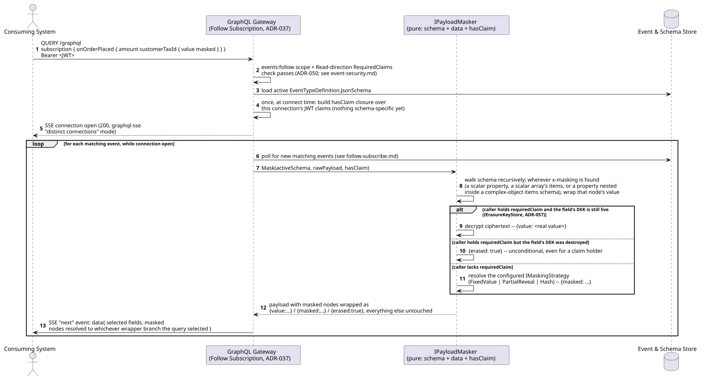
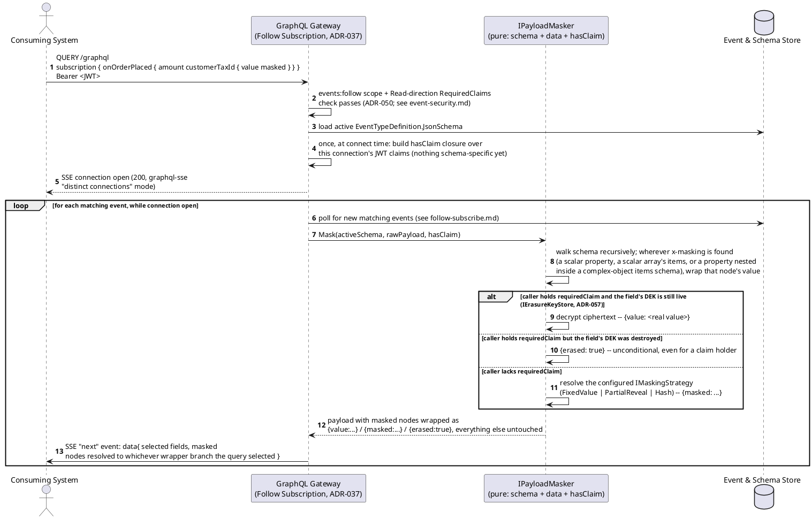
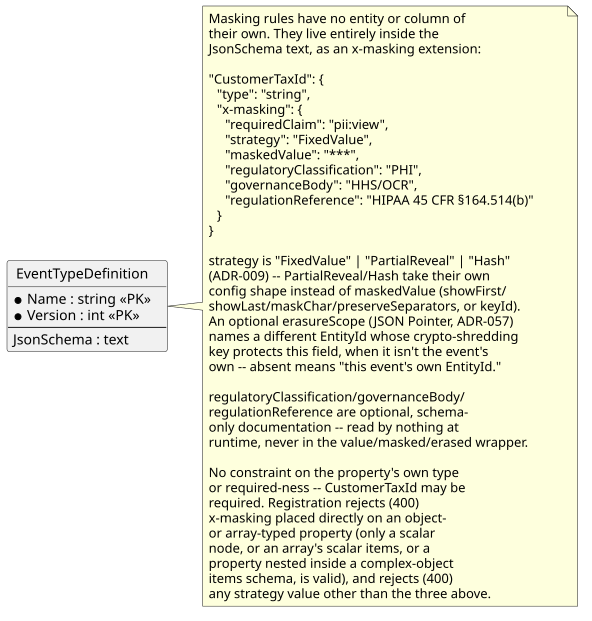
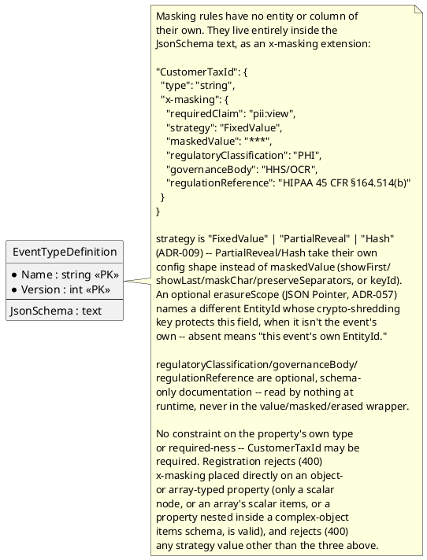

# Feature: Property-level masking (value/masked/erased wrapper)

> **Fully corrected this pass.** Registration-rejection scenarios were
> never actually stale (`ADR-013`'s Problem Details table strikes through
> only the *publish*-time `400` rows; registration-time rejection for a
> malformed `x-masking` placement or a genuinely unsupported strategy is
> unaffected by `ADR-023`) — a prior version of this banner claimed
> otherwise and was corrected. The one publish scenario asserting `201`
> now asserts `202` (`ADR-023`); every `RequiredReadClaim` reference is
> now `RequiredClaims` (`ADR-050`); Follow is shown as a GraphQL
> Subscription over SSE (`ADR-037`). **The real gap, found and fixed this
> pass**: this doc described v1 as `FixedValue`-only with a `{value}`/
> `{masked}` two-branch wrapper — both wrong, not because of a design
> change nobody documented, but because `ADR-009` was already amended (in
> an earlier session pass) to promote `PartialReveal` and `Hash` into the
> real decision, and `ADR-057` already added the wrapper's third `erased`
> branch — neither ever made it into this doc. `06-solution-structure.md`'s
> three registered `IMaskingStrategy` implementations were correct all
> along; this doc was the one that hadn't caught up. No new ADR needed —
> resolved by reading `ADR-009`'s own current text, not by deciding
> anything new.

Context: data model note in `../02-data-model.md` ("Event-type security",
masking paragraph); contract in `../03-api-contracts.md` ("Masking" note
under "AsyncAPI (follow side)"); registration validation in
`../05-schema-registry-and-spec-generation.md`; implementation shape in
`../06-solution-structure.md` ("Masking — a pure, schema-plus-data
transform"); decision record `ADR-009` in `../07-adrs.md`, including its
"Future: declined masking strategies" section (tokenization,
generalization/bucketing, format-preserving encryption, whole-object/
array masking — explicitly declined, not just unbuilt; `FixedValue`/
`PartialReveal`/`Hash` below are all decided and in scope). Depends on
[`event-security.md`](event-security.md) — masking only
ever applies to callers who already cleared a `Read`-direction entry in
`RequiredClaims` (`ADR-050`) for the event type (or the type has none).
Design is complete; per `08-build-plan.md`'s "Property-Level Masking"
item, building it is a lower priority than everything else, not blocked
on anything technical. Follow is a GraphQL Subscription over SSE
(`ADR-037`; see `../03-api-contracts.md`'s "Follow — GraphQL Subscription
over SSE") — the sequence diagram below shows the real
`subscription { ... }` document, not `GET`/OData shorthand.

A maskable property's effective wire type becomes a three-way `oneOf`
wrapper: `{"value": <real value>}` for a caller holding its
`requiredClaim`, `{"masked": <masked content>}` for one who doesn't, or
`{"erased": true}` for a field whose crypto-shredding key has been
destroyed (`ADR-057`) — permanent and unconditional, shown even to a
caller who holds the claim, since `erased` means "gone," not "you lack
permission." This applies for **every** scalar-typed field, including
required, non-nullable ones — the wrapper is what "works on all fields":
it doesn't reuse the field's own type slot (which is what forced an
earlier, since-replaced `null`-out design to require nullability), it
introduces a new type at that position.

**v1 supports three masking strategies** (`FixedValue`/`PartialReveal`/
`Hash`; a fourth, format-preserving encryption, plus tokenization,
generalization/bucketing, and whole-object/array masking, are explicitly
declined for now — `ADR-009`'s "Future: declined masking strategies"):
- **`FixedValue`**: `masked` is a configured literal string
  (`maskedValue`, default `"***"`).
- **`PartialReveal`**: `masked` is `{ showFirst, showLast, maskChar,
  preserveSeparators }` applied to the real value — named,
  human-readable fields (not a symbolic mask-template string), modeled on
  PCI-DSS Requirement 3.3's own plain-language card-PAN masking ("only
  the first six and last four digits displayed"). Format-preserving,
  meaningful only for an originally-string property.
- **`Hash`**: `masked` carries a *keyed* HMAC of the real value (`{
  keyId }`), reusing `ADR-050`'s already-adopted `Microsoft.Extensions.
  Compliance.Redaction`'s `HmacRedactor` — not a bare unsalted hash, so a
  caller lacking the claim can tell two masked events share the same
  underlying value (correlation) without ever learning the value itself
  or being able to brute-force a small value space.

All three strategies are an explicit Strategy-pattern seam
(`IMaskingStrategy`, one class + one keyed-DI registration line per
strategy, `06-solution-structure.md`) — `IPayloadMasker` never branches on
the strategy name itself. Registering any other `strategy` value is
rejected `400` at registration (see Gherkin below) — including a
plausible-sounding but still-declined one like `"Tokenization"` or
`"Bucketing"`, not just an obviously-invalid string.

`x-masking` also carries three optional, schema-only documentation
fields — `regulatoryClassification`/`governanceBody`/`regulationReference`
— that carry no runtime behavior at all and never appear on the wire (see
the ER diagram note below, and `ADR-009`). A field may also declare
`erasureScope` (a JSON Pointer to another property naming the `EntityId`
whose crypto-shredding key actually protects it, when that differs from
the event's own `EntityId` — `ADR-057`; defaults to the event's own
`EntityId` when absent) — out of scope for this doc's own scenarios,
which don't exercise the cross-entity case, but relevant to how `erased`
gets triggered.

## Sequence diagram — connect-time setup and per-event masking





`IPayloadMasker` needs only the schema and the data — see
`06-solution-structure.md` for why that matters (it's a reusable pipeline
step, not logic embedded in the Follow Subscription resolver, `ADR-037`
having retired the old `FollowEndpoint` name).

## Data model (ER diagram)





No new table, no new column on `EventTypeDefinition` — see
`../02-data-model.md`. This is the same reasoning `filter-pushdown.md` uses
for why `FilterableField.JsonPath -> Payload` is drawn as logical-only: the
relationship is real, but there's nothing for a database relationship to
point at. The registered schema itself (what `SchemaValidationService`
validates publish payloads against) is never wrapped — only the generated
Follow-side/AsyncAPI view and the actual SSE wire format are.

## Consumer guidance: skip masked/absent fields when overlaying onto existing state

Not enforced by the store — it has no visibility into a downstream
consumer's own state — but load-bearing for anyone building a
read-model/projection from the Follow stream (`ADR-009`'s consequences):
if a field arrives as `{"masked": "***"}` or is absent from the payload,
treat that as **no information provided for this field in this event**,
not as "set it to `***`" or "clear it." Only overlay a field from
`{"value": ...}` (or a non-maskable field's plain value). A consumer that
naively overlays whatever it receives will clobber a previously-known good
value with a placeholder the moment it (or a replay) sees the same field
masked — exactly the corruption masking exists to prevent, one layer
further downstream than the store can reach.

## Salt (UI mockup)

Not applicable — masking is a read-time serialization transform with no UI
surface.

## Gherkin

```gherkin
Feature: Property-level masking (value/masked/erased wrapper)
  As the event store
  I want individual fields within an event wrapped as {value:...}, {masked:...},
  or {erased:true} depending on whether the caller holds a field-specific claim
  and whether the field's crypto-shredding key still exists
  So that sensitive fields can be hidden -- on any scalar type, including
  required ones -- without withholding the whole event, and permanently
  destroyed on request without corrupting the append-only log

  Background:
    Given client "follower-client" has scope "events:follow"
    And the event type "OrderPlaced" version 1 is registered with schema:
      """
      {
        "type": "object",
        "properties": {
          "Amount": { "type": "number" },
          "CustomerTaxId": {
            "type": "string",
            "x-masking": { "requiredClaim": "pii:view", "strategy": "FixedValue", "maskedValue": "***" }
          },
          "Ssn": {
            "type": "string",
            "x-masking": { "requiredClaim": "pii:view", "strategy": "PartialReveal", "showFirst": 0, "showLast": 4, "maskChar": "X", "preserveSeparators": true }
          },
          "CustomerEmail": {
            "type": "string",
            "x-masking": { "requiredClaim": "pii:view", "strategy": "Hash", "keyId": "email-hmac-2026" }
          },
          "Notes": {
            "type": "array",
            "items": {
              "type": "string",
              "x-masking": { "requiredClaim": "pii:view", "strategy": "FixedValue", "maskedValue": "***" }
            }
          },
          "LineItems": {
            "type": "array",
            "items": {
              "type": "object",
              "properties": {
                "Sku": { "type": "string" },
                "Ssn": {
                  "type": "string",
                  "x-masking": { "requiredClaim": "pii:view", "strategy": "FixedValue", "maskedValue": "***" }
                }
              },
              "required": ["Sku", "Ssn"]
            }
          }
        },
        "required": ["Amount", "CustomerTaxId"]
      }
      """

  Scenario: Registering x-masking directly on an object-typed property is rejected
    When I PUT "/registry/PatientAdmitted" with body:
      """
      {
        "jsonSchema": {
          "type": "object",
          "properties": {
            "Contact": {
              "type": "object",
              "properties": { "Phone": { "type": "string" } },
              "x-masking": { "requiredClaim": "pii:view", "strategy": "FixedValue" }
            }
          },
          "required": []
        },
        "filterableFields": []
      }
      """
    Then the response status should be 400
    And the response should state "Contact" cannot be masked directly (only a scalar node, or array items, may carry x-masking)

  Scenario: Registering a genuinely unsupported masking strategy is rejected
    When I PUT "/registry/PatientAdmitted" with body:
      """
      {
        "jsonSchema": {
          "type": "object",
          "properties": {
            "Ssn": { "type": "string", "x-masking": { "requiredClaim": "pii:view", "strategy": "Bucketing" } }
          },
          "required": []
        },
        "filterableFields": []
      }
      """
    Then the response status should be 400
    And the response should state "Bucketing" is not a supported masking strategy
    # Bucketing/generalization is a real, named, explicitly declined proposal
    # (ADR-009's "Future: declined masking strategies") -- unlike
    # FixedValue/PartialReveal/Hash, it was never promoted into the decision.

  Scenario: Registering PartialReveal and Hash strategies succeeds -- both are decided, not proposed
    When I PUT "/registry/PatientAdmitted" with body:
      """
      {
        "jsonSchema": {
          "type": "object",
          "properties": {
            "Ssn": { "type": "string", "x-masking": { "requiredClaim": "pii:view", "strategy": "PartialReveal", "showFirst": 0, "showLast": 4 } },
            "Email": { "type": "string", "x-masking": { "requiredClaim": "pii:view", "strategy": "Hash", "keyId": "email-hmac-2026" } }
          },
          "required": []
        },
        "filterableFields": []
      }
      """
    Then the response status should be 201

  Scenario: A follower without the field claim receives the masked wrapper
    Given I have a Bearer token for client "follower-client" with no additional claims
    And I open an SSE connection to "/follow/OrderPlaced"
    When an "OrderPlaced" event with body {"Amount": 150.00, "CustomerTaxId": "123-45-6789"} is published
    Then I should receive that event on the SSE stream with CustomerTaxId equal to {"masked": "***"}
    And Amount should still equal 150.00 unwrapped

  Scenario: A follower with the field claim receives the value wrapper
    Given I have a Bearer token for client "follower-client" with claim "pii" value "view"
    And I open an SSE connection to "/follow/OrderPlaced"
    When an "OrderPlaced" event with body {"Amount": 150.00, "CustomerTaxId": "123-45-6789"} is published
    Then I should receive that event on the SSE stream with CustomerTaxId equal to {"value": "123-45-6789"}

  Scenario: PartialReveal shows only the configured first/last characters, masking the rest
    Given I have a Bearer token for client "follower-client" with no additional claims
    And I open an SSE connection to "/follow/OrderPlaced"
    When an "OrderPlaced" event with body {"Amount": 150.00, "CustomerTaxId": "123-45-6789", "Ssn": "123-45-6789"} is published
    Then I should receive that event on the SSE stream with Ssn equal to {"masked": "XXX-XX-6789"}
    # showFirst: 0, showLast: 4, preserveSeparators: true (Background) -- the
    # separators show through untouched; only the digit positions are masked.

  Scenario: Hash masking is correlatable across events without revealing the value
    Given I have a Bearer token for client "follower-client" with no additional claims
    And I open an SSE connection to "/follow/OrderPlaced"
    When an "OrderPlaced" event with body {"Amount": 150.00, "CustomerTaxId": "123-45-6789", "CustomerEmail": "same@example.com"} is published
    And a second "OrderPlaced" event with body {"Amount": 75.00, "CustomerTaxId": "123-45-6789", "CustomerEmail": "same@example.com"} is published
    Then both events' CustomerEmail masked HMAC values should be identical
    And neither should reveal "same@example.com" or let it be recovered
    # Keyed HMAC (ADR-050's HmacRedactor), not a bare hash -- correlatable,
    # not brute-forceable the way an unsalted hash of a small value space is.

  Scenario: A field whose crypto-shredding key has been destroyed renders erased, even for a claim holder
    Given I have a Bearer token for client "follower-client" with claim "pii" value "view"
    And an "OrderPlaced" event "order-1" with body {"Amount": 150.00, "CustomerTaxId": "123-45-6789"} was published
    And entity "demo:Order:order-1" has since been erased (ADR-057 -- its DEK destroyed)
    When I open an SSE connection to "/follow/OrderPlaced"
    And "order-1" is redelivered (e.g. a mode: REPLAY connection)
    Then I should receive that event on the SSE stream with CustomerTaxId equal to {"erased": true}
    # erased is unconditional -- holding the claim no longer matters once the
    # key is gone. Distinct from {"masked": ...}, which still means "someone
    # with the right claim can see this."

  Scenario: A required maskable field is masked without any nullability workaround
    Given I have a Bearer token for client "follower-client" with no additional claims
    And I open an SSE connection to "/follow/OrderPlaced"
    When an "OrderPlaced" event with body {"Amount": 150.00, "CustomerTaxId": "123-45-6789"} is published
    Then the response status should be 202
    # Publish is always 202 + SchemaStatus now (ADR-023) -- masking is a
    # read-time transform, wholly unrelated to which status code the
    # publish itself got back.
    And I should receive that event on the SSE stream with CustomerTaxId equal to {"masked": "***"}

  Scenario: A property without x-masking is never wrapped
    Given I have a Bearer token for client "follower-client" with no additional claims
    And I open an SSE connection to "/follow/OrderPlaced"
    When an "OrderPlaced" event with body {"Amount": 150.00, "CustomerTaxId": "123-45-6789"} is published
    Then Amount should equal 150.00 unwrapped, regardless of claims held

  Scenario: An array of scalar values is masked element by element
    Given I have a Bearer token for client "follower-client" with no additional claims
    And I open an SSE connection to "/follow/OrderPlaced"
    When an "OrderPlaced" event with body {"Amount": 150.00, "CustomerTaxId": "123-45-6789", "Notes": ["call before delivery", "leave at door"]} is published
    Then I should receive that event on the SSE stream with Notes equal to [{"masked": "***"}, {"masked": "***"}]

  Scenario: An array of complex objects only wraps the masked properties within each element
    Given I have a Bearer token for client "follower-client" with no additional claims
    And I open an SSE connection to "/follow/OrderPlaced"
    When an "OrderPlaced" event with body {"Amount": 150.00, "CustomerTaxId": "123-45-6789", "LineItems": [{"Sku": "ABC", "Ssn": "111-22-3333"}]} is published
    Then I should receive that event on the SSE stream with LineItems equal to [{"Sku": "ABC", "Ssn": {"masked": "***"}}]

  Scenario: A masked event whose field is legitimately absent stays absent, not wrapped
    Given I have a Bearer token for client "follower-client" with no additional claims
    And I open an SSE connection to "/follow/OrderPlaced"
    When an "OrderPlaced" event with body {"Amount": 150.00, "CustomerTaxId": "123-45-6789"} is published
    Then I should receive that event on the SSE stream without a Notes property present

  Scenario: Masking applies even when the event type has no RequiredClaims entry at all
    Given "OrderPlaced" has no Read-direction entry in RequiredClaims
    And I have a Bearer token for client "follower-client" with no additional claims
    When I open an SSE connection to "/follow/OrderPlaced"
    Then the connection should be accepted
    When an "OrderPlaced" event with body {"Amount": 150.00, "CustomerTaxId": "123-45-6789"} is published
    Then I should receive that event on the SSE stream with CustomerTaxId equal to {"masked": "***"}

  Scenario: Regulatory metadata is retrievable from the registry but never appears on the wire
    When I GET "/registry/OrderPlaced"
    Then the response status should be 200
    And the response body's CustomerTaxId.x-masking should include regulatoryClassification "PHI", governanceBody "HHS/OCR", and regulationReference "HIPAA 45 CFR §164.514(b)"
    Given I have a Bearer token for client "follower-client" with claim "pii" value "view"
    And I open an SSE connection to "/follow/OrderPlaced"
    When an "OrderPlaced" event with body {"Amount": 150.00, "CustomerTaxId": "123-45-6789"} is published
    Then I should receive that event on the SSE stream with CustomerTaxId equal to {"value": "123-45-6789"}
    And the streamed event should not contain regulatoryClassification, governanceBody, or regulationReference anywhere

  Scenario: Regulatory metadata fields are optional
    When I PUT "/registry/PatientAdmitted" with body:
      """
      {
        "jsonSchema": {
          "type": "object",
          "properties": {
            "Ssn": { "type": "string", "x-masking": { "requiredClaim": "pii:view", "strategy": "FixedValue" } }
          },
          "required": []
        },
        "filterableFields": []
      }
      """
    Then the response status should be 201
```
