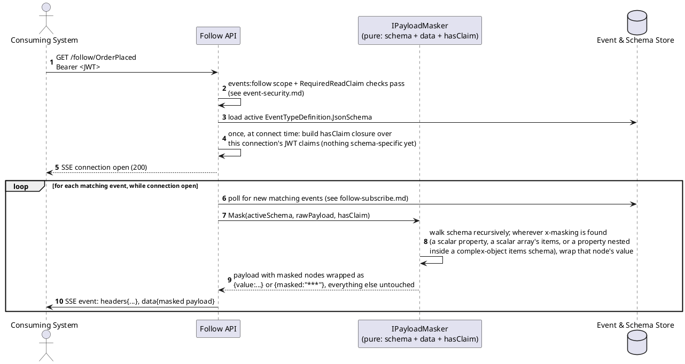
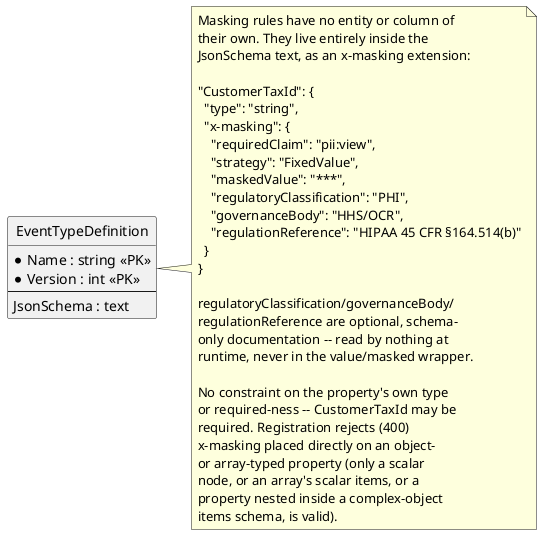

# Feature: Property-level masking (value/masked wrapper)

Context: data model note in `../02-data-model.md` ("Event-type security",
masking paragraph); contract in `../03-api-contracts.md` ("Masking" note
under "AsyncAPI (follow side)"); registration validation in
`../05-schema-registry-and-spec-generation.md`; implementation shape in
`../06-solution-structure.md` ("Masking — a pure, schema-plus-data
transform"); decision record `ADR-009` in `../07-adrs.md` (including the
"Future: definable masking strategies" proposal — not built, sketched
only). Depends on [`event-security.md`](event-security.md) — masking only
ever applies to callers who already cleared `RequiredReadClaim` for the
event type (or the type has none). Design is complete; per `08-build-plan.md`
Phase 8, building it is a lower priority than everything else, not blocked
on anything technical. Follow is shown below as `GET` for readability —
per `ADR-012` it's actually `QUERY`, unrelated to anything masking-specific.

v1 supports exactly one masking strategy, `"FixedValue"`: a maskable
property's value is wrapped as `{"value": <real value>}` for a caller
holding its `requiredClaim`, or `{"masked": "<maskedValue>"}` (default
`"***"`) for one who doesn't — for **every** scalar-typed field, including
required, non-nullable ones. This wrapper shape is what "works on all
fields": it doesn't reuse the field's own type slot (which is what forced
an earlier, since-replaced `null`-out design to require nullability), it
introduces a new type at that position. `x-masking` also carries three
optional, schema-only documentation fields —
`regulatoryClassification`/`governanceBody`/`regulationReference` — that
carry no runtime behavior at all and never appear on the wire (see the ER
diagram note below, and `ADR-009`).

## Sequence diagram — connect-time setup and per-event masking



`IPayloadMasker` needs only the schema and the data — see
`06-solution-structure.md` for why that matters (it's a reusable pipeline
step, not logic embedded in `FollowEndpoint`).

## Data model (ER diagram)



No new table, no new column on `EventTypeDefinition` — see
`../02-data-model.md`. This is the same reasoning `filter-pushdown.md` uses
for why `FilterableField.JsonPath -> Payload` is drawn as logical-only: the
relationship is real, but there's nothing for a database relationship to
point at. The registered schema itself (what `SchemaValidationService`
validates publish payloads against) is never wrapped — only the generated
Follow-side/AsyncAPI view and the actual SSE wire format are.

## Consumer guidance: skip masked/absent fields when overlaying onto existing state

Not enforced by the store — it has no visibility into a downstream
consumer's own state — but load-bearing for anyone building a
read-model/projection from the Follow stream (`ADR-009`'s consequences):
if a field arrives as `{"masked": "***"}` or is absent from the payload,
treat that as **no information provided for this field in this event**,
not as "set it to `***`" or "clear it." Only overlay a field from
`{"value": ...}` (or a non-maskable field's plain value). A consumer that
naively overlays whatever it receives will clobber a previously-known good
value with a placeholder the moment it (or a replay) sees the same field
masked — exactly the corruption masking exists to prevent, one layer
further downstream than the store can reach.

## Salt (UI mockup)

Not applicable — masking is a read-time serialization transform with no UI
surface.

## Gherkin

```gherkin
Feature: Property-level masking (value/masked wrapper)
  As the event store
  I want individual fields within an event wrapped as {value:...} or
  {masked:"***"} depending on whether the caller holds a field-specific claim
  So that sensitive fields can be hidden -- on any scalar type, including
  required ones -- without withholding the whole event

  Background:
    Given client "follower-client" has scope "events:follow"
    And the event type "OrderPlaced" version 1 is registered with schema:
      """
      {
        "type": "object",
        "properties": {
          "Amount": { "type": "number" },
          "CustomerTaxId": {
            "type": "string",
            "x-masking": { "requiredClaim": "pii:view", "strategy": "FixedValue", "maskedValue": "***" }
          },
          "Notes": {
            "type": "array",
            "items": {
              "type": "string",
              "x-masking": { "requiredClaim": "pii:view", "strategy": "FixedValue", "maskedValue": "***" }
            }
          },
          "LineItems": {
            "type": "array",
            "items": {
              "type": "object",
              "properties": {
                "Sku": { "type": "string" },
                "Ssn": {
                  "type": "string",
                  "x-masking": { "requiredClaim": "pii:view", "strategy": "FixedValue", "maskedValue": "***" }
                }
              },
              "required": ["Sku", "Ssn"]
            }
          }
        },
        "required": ["Amount", "CustomerTaxId"]
      }
      """

  Scenario: Registering x-masking directly on an object-typed property is rejected
    When I PUT "/registry/PatientAdmitted" with body:
      """
      {
        "jsonSchema": {
          "type": "object",
          "properties": {
            "Contact": {
              "type": "object",
              "properties": { "Phone": { "type": "string" } },
              "x-masking": { "requiredClaim": "pii:view", "strategy": "FixedValue" }
            }
          },
          "required": []
        },
        "filterableFields": []
      }
      """
    Then the response status should be 400
    And the response should state "Contact" cannot be masked directly (only a scalar node, or array items, may carry x-masking)

  Scenario: Registering a masking strategy other than FixedValue is rejected
    When I PUT "/registry/PatientAdmitted" with body:
      """
      {
        "jsonSchema": {
          "type": "object",
          "properties": {
            "Ssn": { "type": "string", "x-masking": { "requiredClaim": "pii:view", "strategy": "PartialReveal" } }
          },
          "required": []
        },
        "filterableFields": []
      }
      """
    Then the response status should be 400
    And the response should state "PartialReveal" is not a supported masking strategy

  Scenario: A follower without the field claim receives the masked wrapper
    Given I have a Bearer token for client "follower-client" with no additional claims
    And I open an SSE connection to "/follow/OrderPlaced"
    When an "OrderPlaced" event with body {"Amount": 150.00, "CustomerTaxId": "123-45-6789"} is published
    Then I should receive that event on the SSE stream with CustomerTaxId equal to {"masked": "***"}
    And Amount should still equal 150.00 unwrapped

  Scenario: A follower with the field claim receives the value wrapper
    Given I have a Bearer token for client "follower-client" with claim "pii" value "view"
    And I open an SSE connection to "/follow/OrderPlaced"
    When an "OrderPlaced" event with body {"Amount": 150.00, "CustomerTaxId": "123-45-6789"} is published
    Then I should receive that event on the SSE stream with CustomerTaxId equal to {"value": "123-45-6789"}

  Scenario: A required maskable field is masked without any nullability workaround
    Given I have a Bearer token for client "follower-client" with no additional claims
    And I open an SSE connection to "/follow/OrderPlaced"
    When an "OrderPlaced" event with body {"Amount": 150.00, "CustomerTaxId": "123-45-6789"} is published
    Then the response status should be 201
    And I should receive that event on the SSE stream with CustomerTaxId equal to {"masked": "***"}

  Scenario: A property without x-masking is never wrapped
    Given I have a Bearer token for client "follower-client" with no additional claims
    And I open an SSE connection to "/follow/OrderPlaced"
    When an "OrderPlaced" event with body {"Amount": 150.00, "CustomerTaxId": "123-45-6789"} is published
    Then Amount should equal 150.00 unwrapped, regardless of claims held

  Scenario: An array of scalar values is masked element by element
    Given I have a Bearer token for client "follower-client" with no additional claims
    And I open an SSE connection to "/follow/OrderPlaced"
    When an "OrderPlaced" event with body {"Amount": 150.00, "CustomerTaxId": "123-45-6789", "Notes": ["call before delivery", "leave at door"]} is published
    Then I should receive that event on the SSE stream with Notes equal to [{"masked": "***"}, {"masked": "***"}]

  Scenario: An array of complex objects only wraps the masked properties within each element
    Given I have a Bearer token for client "follower-client" with no additional claims
    And I open an SSE connection to "/follow/OrderPlaced"
    When an "OrderPlaced" event with body {"Amount": 150.00, "CustomerTaxId": "123-45-6789", "LineItems": [{"Sku": "ABC", "Ssn": "111-22-3333"}]} is published
    Then I should receive that event on the SSE stream with LineItems equal to [{"Sku": "ABC", "Ssn": {"masked": "***"}}]

  Scenario: A masked event whose field is legitimately absent stays absent, not wrapped
    Given I have a Bearer token for client "follower-client" with no additional claims
    And I open an SSE connection to "/follow/OrderPlaced"
    When an "OrderPlaced" event with body {"Amount": 150.00, "CustomerTaxId": "123-45-6789"} is published
    Then I should receive that event on the SSE stream without a Notes property present

  Scenario: Masking applies even when the event type has no RequiredReadClaim at all
    Given "OrderPlaced" has no RequiredReadClaim set
    And I have a Bearer token for client "follower-client" with no additional claims
    When I open an SSE connection to "/follow/OrderPlaced"
    Then the connection should be accepted
    When an "OrderPlaced" event with body {"Amount": 150.00, "CustomerTaxId": "123-45-6789"} is published
    Then I should receive that event on the SSE stream with CustomerTaxId equal to {"masked": "***"}

  Scenario: Regulatory metadata is retrievable from the registry but never appears on the wire
    When I GET "/registry/OrderPlaced"
    Then the response status should be 200
    And the response body's CustomerTaxId.x-masking should include regulatoryClassification "PHI", governanceBody "HHS/OCR", and regulationReference "HIPAA 45 CFR §164.514(b)"
    Given I have a Bearer token for client "follower-client" with claim "pii" value "view"
    And I open an SSE connection to "/follow/OrderPlaced"
    When an "OrderPlaced" event with body {"Amount": 150.00, "CustomerTaxId": "123-45-6789"} is published
    Then I should receive that event on the SSE stream with CustomerTaxId equal to {"value": "123-45-6789"}
    And the streamed event should not contain regulatoryClassification, governanceBody, or regulationReference anywhere

  Scenario: Regulatory metadata fields are optional
    When I PUT "/registry/PatientAdmitted" with body:
      """
      {
        "jsonSchema": {
          "type": "object",
          "properties": {
            "Ssn": { "type": "string", "x-masking": { "requiredClaim": "pii:view", "strategy": "FixedValue" } }
          },
          "required": []
        },
        "filterableFields": []
      }
      """
    Then the response status should be 201
```
