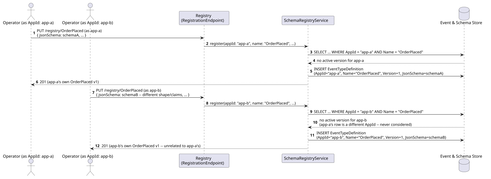
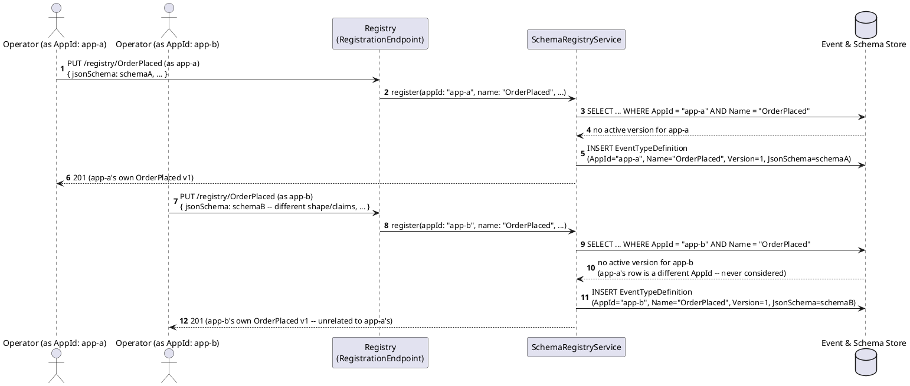
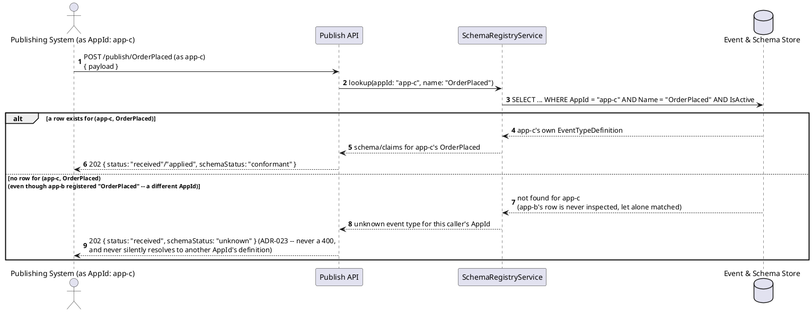
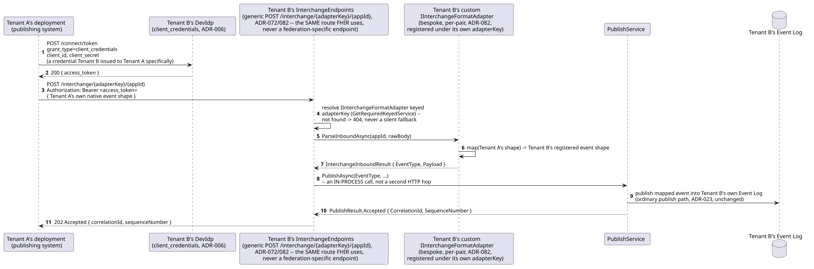
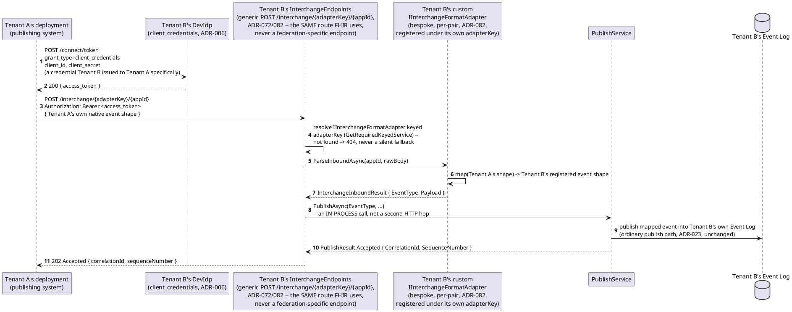
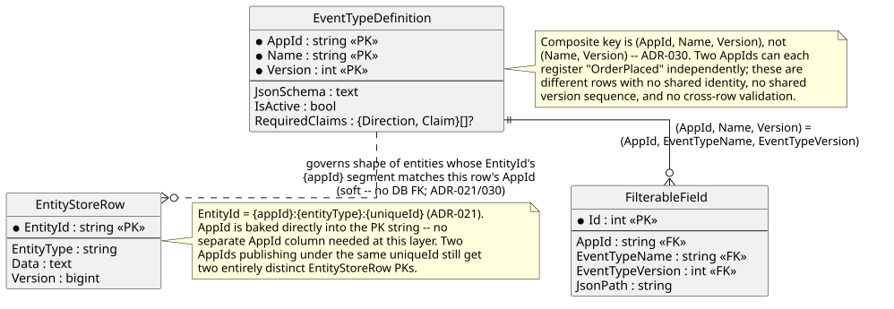
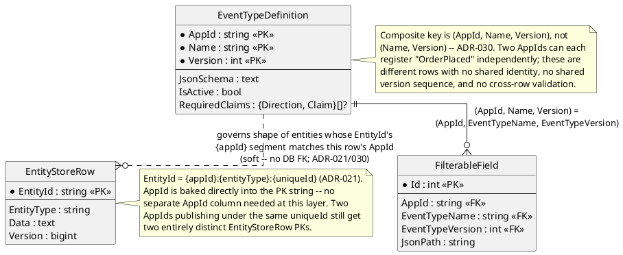

# Feature: Multi-tenancy (`AppId`-scoped schemas and entities)

Context: `ADR-030` (`../adrs/adr-030-multi-tenant-framework.md`) makes
`appId` a real, first-class scoping key rather than a prefix convention
buried inside `EntityId` (`ADR-021`): `EventTypeDefinition`'s key becomes
`(AppId, Name, Version)`, not just `(Name, Version)`, so two independent
applications can register a type with the identical name, shape, claims,
and `ChangeKind`, with zero collision — they are different rows entirely.
The registry-layer shape (`AppId` as part of the composite key) lives in
[`../data/schema-registry.md`](../data/schema-registry.md); the
entity-layer scoping was already free once `ADR-021` landed, because
`EntityId` (`{appId}:{entityType}:{uniqueId}`) bakes `AppId` directly into
the row's primary key — see
[`../data/entity-store.md`](../data/entity-store.md). Builds on
[`schema-registry.md`](schema-registry.md) and
[`publish-event.md`](publish-event.md) for the endpoints this doc scopes;
this doc covers only the parts specific to `AppId` isolation itself, the
same "covers only the parts specific to X" split
[`event-chains.md`](event-chains.md) uses for `parentEventIds`.

The core-engine-has-zero-domain-knowledge rule this ADR states as a hard
rule (not just "the `Orders` walkthrough is a sample app") is the whole
point of this doc: nothing below is specific to `Orders`, or to any other
domain — every scenario works identically for any two arbitrarily-named
applications, which is exactly what the last Gherkin scenario checks for
directly.

**Two things this doc deliberately does not resolve, flagged rather than
silently assumed:**
- *How `AppId` is actually carried on the wire* (a JWT claim, a path
  segment, a header) is not fixed by `ADR-030` itself. The scenarios below
  use "as AppId `X`" as a caller-scoping shorthand — the same kind of
  abstraction [`auth.md`](auth.md) uses for the exact Bearer-token wire
  format — rather than inventing a transport mechanism no ADR has decided.
- *Whether operation-level scopes* (`registry:admin`, `events:publish`,
  `ADR-006`) *should themselves become `AppId`-scoped* (e.g.
  `registry:admin:app1`, so App A's operator can't touch App B's schemas)
  is a real, separate, explicitly still-open question — see
  [`../10-open-questions.md`](../10-open-questions.md). Every scenario
  below assumes a caller whose scope is already sufficient for the
  operation attempted (today, that scope is global across every `AppId`);
  none of them exercise that open question one way or the other.

## Sequence diagram — independent registration, no collision





## Sequence diagram — publish resolution never crosses an `AppId` boundary




Both diagrams are deliberately drawn at the registry-lookup level, not the
storage level — multi-tenancy at the event-log/entity-store level was
already free once `EntityId` existed (`ADR-030`'s own Consequences say so
explicitly); the registry lookup above is the one place this ADR actually
adds new behavior.

## Tenant-to-tenant federation mapping (ADR-082)

Every scenario above covers one tenant's own siloed deployment
(`ADR-075`). `ADR-082` addresses a different case: two *separate*
tenants, each with their own independently-versioned deployment and
schema registry, federating data between them. This needs no new
mechanism on either axis this doc or `auth.md` already covers — it's
**transport**: tenant A's deployment authenticates to tenant B's
deployment using the exact same `client_credentials` flow
([`auth.md`](auth.md), `ADR-006`) any other service-to-service caller
already uses, scoped and revocable the same way. There is no new
credential type, and no shared cross-tenant identity mechanism.

**Shape mapping stays accepted as bespoke, per-tenant-pair integration
code** — since neither tenant's native schema is anchored to an
externally standardized format the way `ADR-072`'s built-in interchange
adapters are, there's no shared spec to map to automatically. That
bespoke mapping doesn't need a new interface, though: it can be written
as an ordinary custom `IInterchangeFormatAdapter` implementation,
registered per tenant pair in that tenant's own composition root — see
`docs/features/bulk-ingestion-and-interchange-adapters.md` for that
seam's general shape; this doc only covers the transport half.





No new component appears in this diagram beyond a per-pair adapter
implementation and a `client_credentials` client — both are reuses of
existing framework surface, exactly as `ADR-082` states. **Corrected
here**: an earlier draft of this diagram routed the mapped publish
through tenant B's ordinary `POST /publish/{event-type}` Publish API,
with the adapter mapping shown as an inline step inside that same call.
The real, tested flow (`tests/EventStore.IntegrationTests/
TenantFederationHttpSqliteTests.cs`) instead POSTs to the same generic
`/interchange/{adapterKey}/{appId}` endpoint "Bulk Ingestion & External
Interchange-Format Adapters" already built for FHIR — a dedicated route
from the ordinary Publish API, not a variant of it — which itself
resolves the keyed adapter and calls `PublishService.PublishAsync(...)`
in-process; see
[`bulk-ingestion-and-interchange-adapters.md`](bulk-ingestion-and-interchange-adapters.md)
for that endpoint's own general shape.

## Data model (ER diagram)





The asymmetry worth noticing: `AppId` had to be *added* to
`EventTypeDefinition`'s key (a real, mechanical propagation cost — `ADR-030`
Consequences), but it was already present, for free, everywhere `EntityId`
already flowed. This ADR's actual cost is entirely in the registry and
generation layers, not the write/entity path.

## Salt (UI mockup)

Not applicable — `AppId` scoping is a data-model and registry-lookup
concern with no UI surface of its own; see
[`schema-registry.md`](schema-registry.md)'s own "Not applicable" for the
same reasoning about the registry generally.

## Gherkin

```gherkin
Feature: Multi-tenancy (AppId-scoped schemas and entities)
  As the framework
  I want every registered event type and every entity scoped by AppId
  So that any number of independent applications can share one deployment
    with zero collision and zero cross-application visibility

  # Every request in this file carries a Bearer token with sufficient scope
  # (registry:admin for registration, events:publish for publishing) unless
  # a scenario says otherwise -- see auth.md for authentication/authorization
  # itself. Today that scope is global across every AppId (ADR-030 leaves
  # this open, see 10-open-questions.md); no scenario below depends on that
  # changing. "as AppId X" is a caller-scoping shorthand for however AppId
  # is actually carried on the wire -- a detail ADR-030 does not fix.

  Background:
    Given AppId "app-a" has registered the event type "OrderPlaced" version 1 with schema:
      """
      { "type": "object", "properties": { "Amount": { "type": "number" } }, "required": ["Amount"] }
      """

  Scenario: Two AppIds register an event type with the same name independently, with no collision
    When AppId "app-b" registers the event type "OrderPlaced" version 1 with a completely different schema:
      """
      { "type": "object", "properties": { "CustomerRef": { "type": "string" } }, "required": ["CustomerRef"] }
      """
    Then the response status should be 201
    And AppId "app-b"'s "OrderPlaced" version 1 should be its own row, independent of AppId "app-a"'s
    And AppId "app-a"'s "OrderPlaced" version 1 schema should remain exactly as registered in the Background

  Scenario: Registering a new version for one AppId does not affect another AppId's version numbering
    Given AppId "app-b" has registered "OrderPlaced" version 1
    When AppId "app-a" registers an updated schema for "OrderPlaced", creating version 2
    Then AppId "app-a"'s "OrderPlaced" active version should be 2
    And AppId "app-b"'s "OrderPlaced" active version should remain 1

  Scenario: Listing registered event types only returns the caller's own AppId
    Given AppId "app-a" has also registered "OrderCancelled" version 1
    And AppId "app-b" has registered "OrderPlaced" version 1 and "InvoiceIssued" version 1
    When AppId "app-a" lists its own registered event types
    Then the response should include "OrderPlaced" and "OrderCancelled"
    And the response should not include "InvoiceIssued"

  Scenario: Publishing under an AppId that never registered a type never resolves against another AppId's registration
    Given AppId "app-b" has registered the event type "OrderPlaced" version 1 with schema:
      """
      { "type": "object", "properties": { "CustomerRef": { "type": "string" } }, "required": ["CustomerRef"] }
      """
    And AppId "app-c" has never registered "OrderPlaced"
    When AppId "app-c" publishes to "OrderPlaced" with body:
      """
      { "payload": { "CustomerRef": "cust-1" } }
      """
    Then the response status should be 202
    And the response schemaStatus should be "unknown"
    And the payload should not have been validated against AppId "app-b"'s schema for "OrderPlaced"

  Scenario: Entity Store rows are scoped per AppId even when the same uniqueId is reused
    Given AppId "app-a" published an "OrderPlaced" event for uniqueId "order-1" with body { "Amount": 150.00 }
    And AppId "app-b" published its own "OrderPlaced" event for uniqueId "order-1" with body { "CustomerRef": "cust-1" }
    Then the Entity Store should contain a row for EntityId "app-a:Order:order-1"
    And the Entity Store should contain a separate row for EntityId "app-b:Order:order-1"
    And folding AppId "app-a"'s event should never change AppId "app-b"'s row, even though the uniqueId is identical

  Scenario: Two unrelated sample applications coexist side by side with no baked-in domain knowledge in the core engine
    Given AppId "orders-sample" has registered "OrderPlaced" version 1 requiring an "Amount" field
    And AppId "inventory-sample" has registered a wholly unrelated event type "StockAdjusted" version 1 requiring "Sku" and "Delta" fields
    When AppId "orders-sample" publishes to "OrderPlaced" with body:
      """
      { "payload": { "Amount": 99.00 } }
      """
    And AppId "inventory-sample" publishes to "StockAdjusted" with body:
      """
      { "payload": { "Sku": "WIDGET-1", "Delta": -3 } }
      """
    Then both responses should be 202 with schemaStatus "conformant"
    And neither AppId's registry entry, schema, or Entity Store rows should reference the other AppId's event type name at all
    And nothing in the core engine's own request-handling code should reference "OrderPlaced", "StockAdjusted", "Amount", "Sku", or any other domain-specific name -- both are ordinary registered data, not special cases

  Scenario: A federating tenant authenticates via client_credentials and publishes a mapped event into another tenant's Event Log (ADR-082)
    Given Tenant "tenant-b" has issued a client_credentials credential to Tenant "tenant-a" specifically
    And Tenant "tenant-b" has registered a custom IInterchangeFormatAdapter mapping Tenant "tenant-a"'s native "ShipmentDispatched" shape to its own "OrderShipped" event type
    When Tenant "tenant-a" requests a token from Tenant "tenant-b"'s deployment using that credential
    And Tenant "tenant-a" POSTs its native "ShipmentDispatched" shape to Tenant "tenant-b"'s "/interchange/{adapterKey}/{appId}" endpoint using that token (the same generic route "Bulk Ingestion & External Interchange-Format Adapters" already built for FHIR, not tenant B's ordinary Publish API)
    Then the response status should be 202
    And Tenant "tenant-b"'s Event Log should contain a mapped "OrderShipped" event, not a raw "ShipmentDispatched" one
    And no new authentication mechanism beyond ordinary client_credentials was involved

  Scenario: Generated API documentation is scoped per AppId, never leaking another AppId's types
    Given AppId "app-a" has registered "OrderPlaced" version 1
    And AppId "app-b" has registered "InvoiceIssued" version 1
    When AppId "app-a" requests its own GraphQL SDL
    Then the SDL should define a type for "OrderPlaced"
    And the SDL should not define a type for "InvoiceIssued"
```
