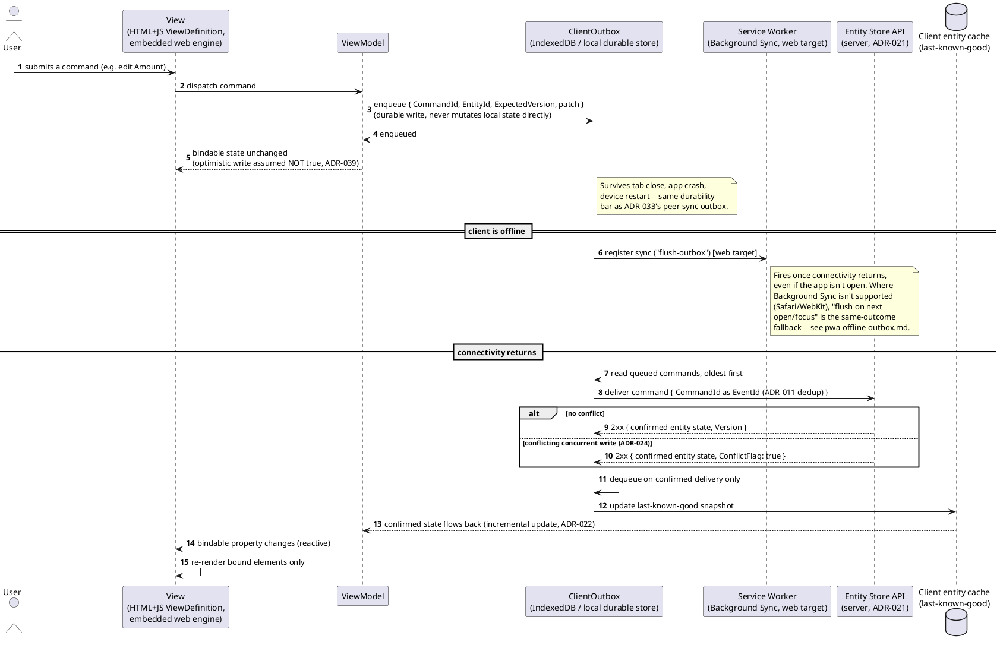
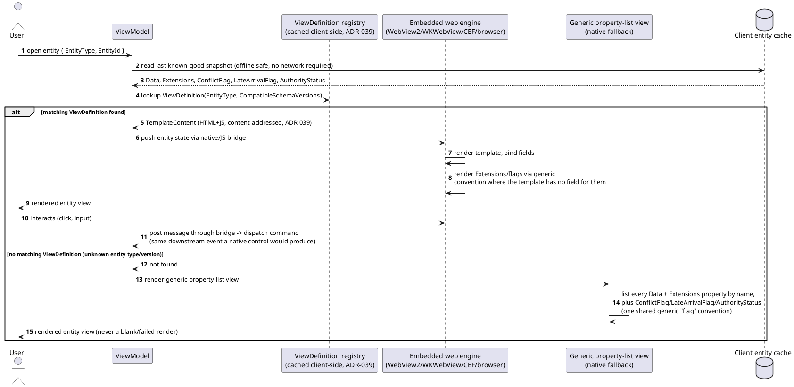
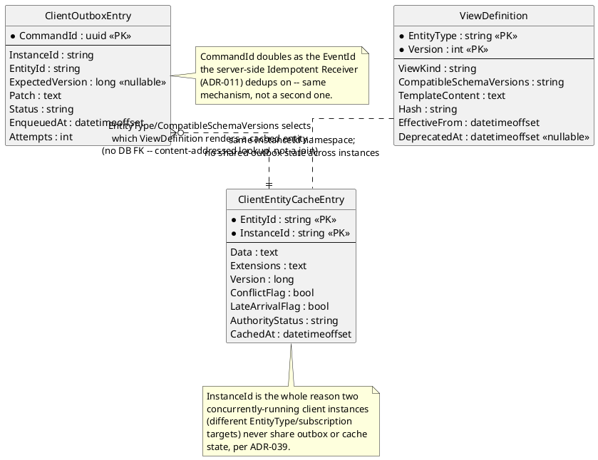
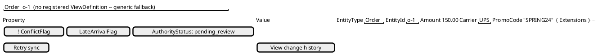

# Feature: MVVM client (entity views, client-local outbox, native/JS bridge)

Context: decision record `ADR-039` in [`../adrs/adr-039-mvvm-client.md`](../adrs/adr-039-mvvm-client.md);
concrete Vue 3 implementation mapping in
[`../patterns/mvvm-client-architecture.md`](../patterns/mvvm-client-architecture.md);
installable/offline PWA mechanics (Service Worker, Web App Manifest,
Background Sync, multi-instance outbox namespacing) in
[`../patterns/pwa-offline-outbox.md`](../patterns/pwa-offline-outbox.md); the
MVVM→MVP→MVC→code-behind fallback order in
[`../comparisons/ui-architecture-patterns.md`](../comparisons/ui-architecture-patterns.md);
Vue-vs-Blazor framework reasoning in
[`../comparisons/ui-framework.md`](../comparisons/ui-framework.md). Build-plan
exit criteria in `../08-build-plan.md`, Phase 20. Data shapes referenced below
(`Optional<T>` patches, `Extensions`, `ConflictFlag`/`LateArrivalFlag`,
`AuthorityStatus`) come from `ADR-022`/`ADR-024`/`ADR-029`/`ADR-035` and
`../data/entity-store.md`; the content-addressed/versioned `ViewDefinition`
shape mirrors `../data/schema-registry.md`'s existing schema-registry entries,
per `ADR-039` itself. This is the one ADR in the design-docs integration's
outstanding-propagation list with a genuine UI surface — the mockup below is
a real one, not a placeholder.

This doc covers only the client-specific mechanics `ADR-039` adds: the
command-dispatch-through-outbox round trip, `ViewDefinition` rendering and its
generic fallback, and PWA installability/offline behavior. It does not
re-derive MVVM itself (see the pattern doc) or the outbox's durability
mechanism (see the PWA pattern doc and `ADR-033`).

## Sequence diagram — command dispatched while offline, delivered on reconnect



The ViewModel's own write is never treated as truth between the first and
second halves of this diagram — the round trip through the Entity Store is
what makes it real, exactly as `ADR-039` states. `CommandId` doubling as the
`EventId` the server's Idempotent Receiver (`ADR-011`) already dedups on is
why redelivering the same queued command after reconnect never applies
twice — no second dedup mechanism was introduced for the client.

## Sequence diagram — rendering a `ViewDefinition`, with generic fallback



## Data model (ER diagram)



`InstanceId` is the asymmetry worth noticing here, the same way `event-
chains.md`'s ER diagram calls out `ParentEventId`'s missing FK: it's not a
server-side concept at all — it exists purely so two windows of the same
installed app, each configured to a different `EntityType`/subscription
target, can share one Service Worker/cache origin (`pwa-offline-outbox.md`)
while keeping their queued commands and cached snapshots from ever
colliding.

## Salt (UI mockup) — `EntityView` (generic fallback)

Where a registered `ViewDefinition` renders in the embedded web engine, the
rendered shape is exactly the `OrderTable`-style mockup already shown in
[`mvvm-client-architecture.md`](../patterns/mvvm-client-architecture.md)'s
own Salt block — bound data, bound commands, structure-as-config, unchanged
whether a browser or a native WebView2/WKWebView/CEF host renders it. The mockup below
is the other half `ADR-039` requires: the **native, non-web** generic
property-list fallback, for an entity type/version with no matching
`ViewDefinition` at all.



Every row comes from the same `Data`/`Extensions` bag a registered
`ViewDefinition` would also receive via the native/JS bridge — the fallback
simply lists properties by name instead of binding them into a
template-defined layout. `PromoCode` renders here because it landed in
`Extensions` (`ADR-022`) rather than a typed slot; a template-backed view
with no field for it would do the same (render it generically, or omit it)
rather than fail to render. The flag row is one shared convention for all
three concerns `ADR-024`/`ADR-029`/`ADR-035` raise (`ConflictFlag` shown
filled/exclaimed here only because it's `true` in this example,
`LateArrivalFlag` shown unset, `AuthorityStatus` shown with its current
value) — not three bespoke indicators.

## Gherkin

```gherkin
Feature: MVVM client (entity views, client-local outbox, native/JS bridge)
  As a user of the MVVM client (native shell or installed web app)
  I want commands to survive being offline and entities to always render
  So that connectivity gaps and unrecognized shapes never lose data or fail the UI

  Background:
    Given the entity type "Order" has a registered ViewDefinition
      | EntityType | Version | ViewKind |
      | Order      | 1       | detail   |
    And the entity type "Shipment" has no registered ViewDefinition
    And client instance "A" is launched configured to follow EntityType "Order"
    And client instance "B" is launched configured to follow EntityType "Shipment"

  Scenario: A command dispatched while offline queues durably and is never lost
    Given client instance "A" is offline
    When I dispatch a command to set Order "o-1"'s Amount to 175.00
    Then the command should be enqueued in client instance "A"'s local outbox
    And the command should still be present in the outbox after the client process restarts

  Scenario: A queued command applies once connectivity resumes, with no duplicate application
    Given a command to set Order "o-1"'s Amount to 175.00 is queued in client instance "A"'s outbox
    When connectivity returns
    Then the outbox should deliver the queued command to the Entity Store
    And Order "o-1"'s confirmed Amount should flow back to the ViewModel as 175.00
    And redelivering the same CommandId should not apply the change a second time

  Scenario: An entity with no registered ViewDefinition still renders via the generic fallback
    When client instance "B" opens Shipment "s-1"
    Then the client should render the generic property-list fallback view
    And the render should not fail

  Scenario: An unaccounted-for property lands in Extensions and never fails the render
    Given Order "o-1"'s ViewDefinition template only has fields for Amount and Carrier
    And Order "o-1"'s entity data carries an additional property "PromoCode"
    When client instance "A" renders Order "o-1"
    Then "PromoCode" should be present in Order "o-1"'s Extensions
    And the rendered view should show it generically or omit it, without a rendering failure

  Scenario: ConflictFlag, LateArrivalFlag, and AuthorityStatus all render via one shared flag convention
    Given Order "o-1" has ConflictFlag true, LateArrivalFlag false, and AuthorityStatus "pending_review"
    When client instance "A" renders Order "o-1"
    Then all three should be shown using the same generic flag-rendering convention
    And no one of the three should use a bespoke indicator of its own

  Scenario: Two client instances scoped to different entity types run concurrently without sharing outbox state
    Given client instance "A" is offline with a queued command for Order "o-1"
    When client instance "B" enqueues a command for Shipment "s-1" while online
    Then client instance "B"'s command should deliver independently of client instance "A"'s connectivity state
    And client instance "A"'s queued command should remain in its own outbox, unaffected by instance "B"

  Scenario: The web client is installable
    When the web client is opened in a browser that supports installation
    Then a Web App Manifest should be served
    And the browser should offer to install the client to the device's home screen/app list

  Scenario: The app shell and cached ViewDefinitions render with no network present at all
    Given the web client has been opened at least once while online
    And Order "o-1"'s ViewDefinition and entity data were cached during that session
    When the device has no network connectivity at all
    And the installed client is opened again
    Then the Service Worker should serve the cached app shell
    And Order "o-1" should render from cached data with no network round trip

  Scenario: Background Sync unavailability falls back to flush-on-focus, never dropping the command
    Given the browser engine does not support the Background Sync API
    And a command for Order "o-1" is queued in the outbox while offline
    When connectivity returns while the app is not open
    Then the queued command should remain in the outbox until the app is next opened or focused
    And the command should flush at that point rather than being lost
```
