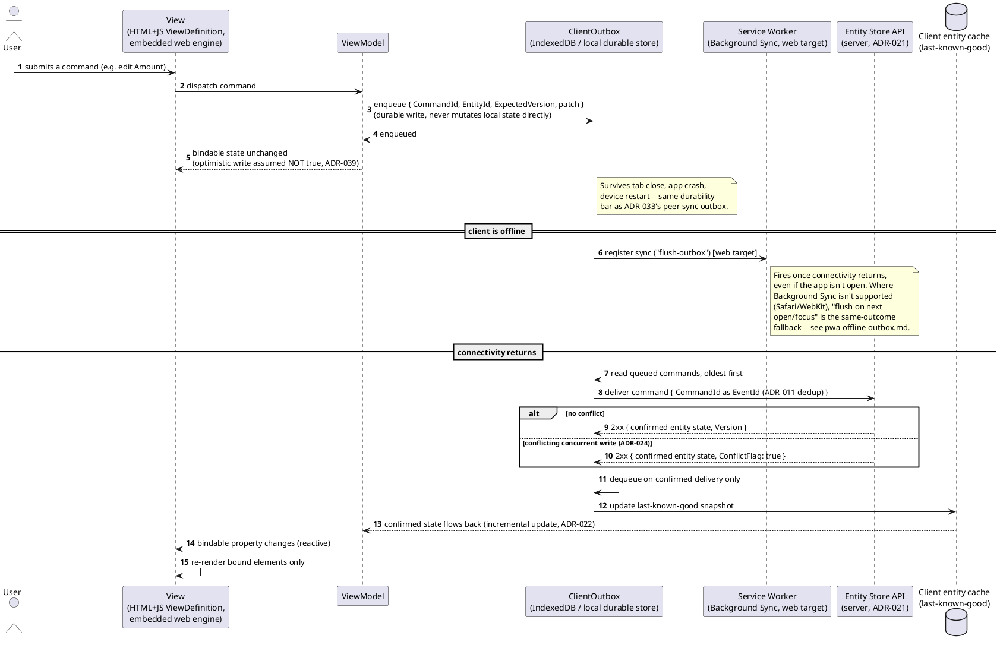
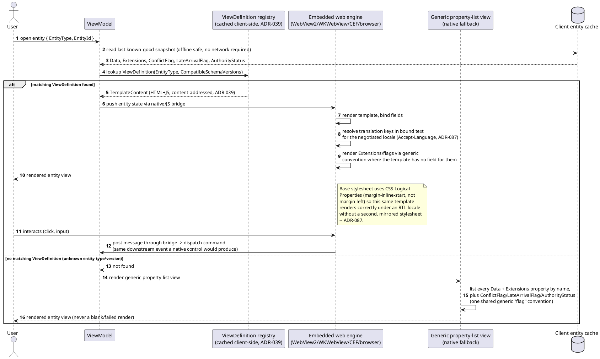
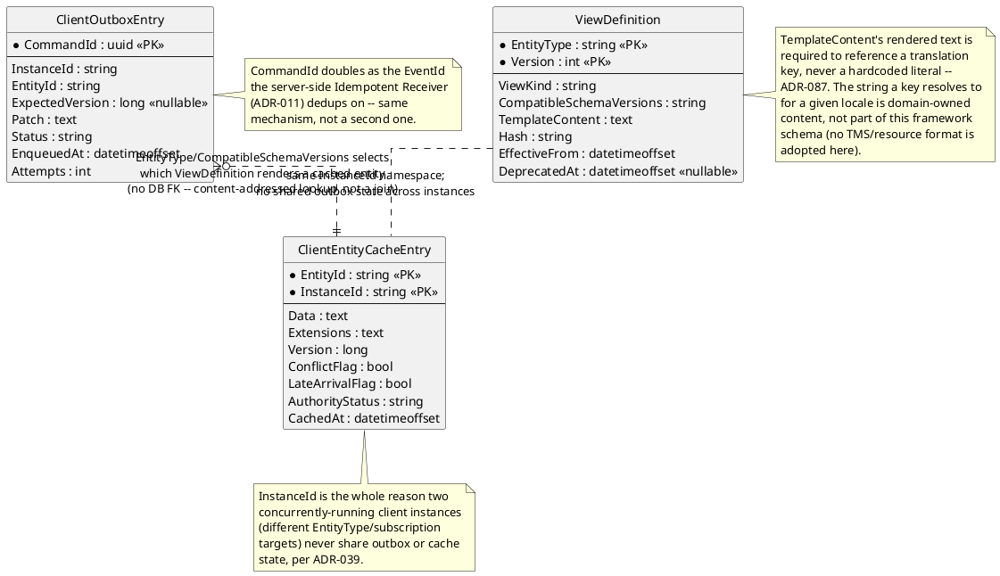
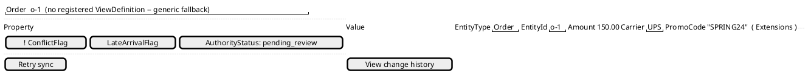

# Feature: MVVM client (entity views, client-local outbox, native/JS bridge)

Context: decision record `ADR-039` in [`../adrs/adr-039-mvvm-client.md`](../adrs/adr-039-mvvm-client.md);
concrete Vue 3 implementation mapping in
[`../patterns/mvvm-client-architecture.md`](../patterns/mvvm-client-architecture.md);
installable/offline PWA mechanics (Service Worker, Web App Manifest,
Background Sync, multi-instance outbox namespacing) in
[`../patterns/pwa-offline-outbox.md`](../patterns/pwa-offline-outbox.md); the
MVVM→MVP→MVC→code-behind fallback order in
[`../comparisons/ui-architecture-patterns.md`](../comparisons/ui-architecture-patterns.md);
Vue-vs-Blazor framework reasoning in
[`../comparisons/ui-framework.md`](../comparisons/ui-framework.md). Build-plan
exit criteria in `../08-build-plan.md`, "MVVM Client". Data shapes referenced below
(`Optional<T>` patches, `Extensions`, `ConflictFlag`/`LateArrivalFlag`,
`AuthorityStatus`) come from `ADR-022`/`ADR-024`/`ADR-029`/`ADR-035` and
`../data/entity-store.md`; the content-addressed/versioned `ViewDefinition`
shape mirrors `../data/schema-registry.md`'s existing schema-registry entries,
per `ADR-039` itself. This is the one ADR in the design-docs integration's
outstanding-propagation list with a genuine UI surface — the mockup below is
a real one, not a placeholder.

This doc covers only the client-specific mechanics `ADR-039` adds: the
command-dispatch-through-outbox round trip, `ViewDefinition` rendering and its
generic fallback, and PWA installability/offline behavior. It does not
re-derive MVVM itself (see the pattern doc) or the outbox's durability
mechanism (see the PWA pattern doc and `ADR-033`).

## Sequence diagram — command dispatched while offline, delivered on reconnect



The ViewModel's own write is never treated as truth between the first and
second halves of this diagram — the round trip through the Entity Store is
what makes it real, exactly as `ADR-039` states. `CommandId` doubling as the
`EventId` the server's Idempotent Receiver (`ADR-011`) already dedups on is
why redelivering the same queued command after reconnect never applies
twice — no second dedup mechanism was introduced for the client.

## Pluggable outbox flush triggers (ADR-069)

The offline-command diagram above shows exactly one trigger for
`ClientOutbox`'s flush: Background Sync firing on reconnect (with the
open/focus fallback `pwa-offline-outbox.md` already documents). `ADR-069`
generalizes this: the durable outbox exposes one idempotent `Flush`
operation, and **any** trigger may invoke it, any number of times, safely
— `ADR-011`'s publish idempotency (the same `CommandId`-as-`EventId`
dedup this doc's diagram already relies on) is what makes a redundant
`Flush` always safe, so the client never needs to reason about *which*
trigger fired, only that `Flush` ran. Three trigger categories exist, not
just the opportunistic one diagrammed above:

1. **Opportunistic** (already diagrammed above, unchanged) — Background
   Sync / open-focus fallback.
2. **Scheduled ("phone home")** — the [Web Periodic Background Sync
   API](https://developer.mozilla.org/en-US/docs/Web/API/Web_Periodic_Background_Synchronization_API)
   where available (checked, not assumed: Chromium-only, experimental,
   unsupported in Firefox/Safari as of this writing — the same kind of
   honest caveat `ADR-039`'s own Background Sync note already states);
   otherwise an OS/device-level scheduled task calling `Flush` on a timer
   for a non-browser/native device client. This framework doesn't build
   a scheduler — it only needs `Flush` to be safely callable by one.
3. **Explicit/manual** — a user/operator-initiated "sync now" action, or,
   for a genuinely air-gapped device with no network path at all, ever,
   exporting the outbox's queued commands to a portable bundle for
   physical transport and later import at a connected system — **reusing
   `ADR-068`'s portable bundle format directly** (NDJSON + manifest +
   chain-of-custody hash) rather than inventing a second shape; see
   `docs/features/lineage-export-and-playback.md` for that bundle format
   itself, not re-derived here. The receiving system verifies the
   transferred bundle is complete and unaltered before importing it, the
   same story as any other use of that format.

No change to `ClientOutboxEntry`'s shape (below) or to the diagram
above's durability guarantee — this is purely additive: two more ways to
invoke the same `Flush` operation, none of which the client needs to
distinguish once invoked.

## Local/edge active-scope caching and erasure invalidation (ADR-065)

`ClientEntityCacheEntry` (below) already holds decrypted, reviewable
plaintext, not ciphertext — a deliberate, accepted trade-off: genuine
offline review requires locally-usable data with no network present.
`ADR-065` states the two rules that bound that trade-off:

- **Scope is explicit, not "everything this client has ever seen."** A
  local/edge client subscribes with an explicit scope filter — the same
  `FilterableFields`-backed argument shape any GraphQL Subscription
  already supports (`ADR-037`), e.g. "entities assigned to this site/
  device AND still open." **Built as a server-side subscription filter,
  not a client-side eviction signal** — the filter bounds what the client
  ever receives (and therefore ever caches) going forward, which is the
  entire retention policy this ADR names; it is not a push-based "this
  entity just fell out of scope, delete it now" notification, since
  nothing in the underlying GraphQL Subscription mechanism sends one.
  Honest, named limitation: an already-cached entity whose later update
  stops matching the filter (closed, completed, reassigned) simply stops
  receiving further updates through that connection — it goes stale
  rather than being proactively purged the instant that happens.
- **Receiving an `EntityErasureRequested` event for a subscribed entity
  is a mandatory, immediate local purge**, not deferred to the next
  scope-eviction cycle. `ADR-057`'s erasure event reaches a subscribed
  local client through the exact same subscription channel as any other
  update; the client treats it as an instruction to delete its own local
  cached copy right away. This is the piece that reaches what server-side
  crypto-shredding alone can't: destroying the server-side DEK makes
  every *ciphertext* copy unreadable everywhere at once, but a device
  that already decrypted and cached plaintext holds a copy independent
  of that key — the erasure event's delivery, not the key destruction, is
  what reaches it.

**Honest, named limitation**: a device offline at the moment erasure
fires won't purge until it reconnects and receives the event — nothing in
this design can reach a device that never reconnects; that's an
operational disposal concern (wipe the device), not a gap this ADR's own
mechanism silently introduces.

## Sequence diagram — rendering a `ViewDefinition`, with generic fallback



## Data model (ER diagram)



`InstanceId` is the asymmetry worth noticing here, the same way `event-
chains.md`'s ER diagram calls out `ParentEventId`'s missing FK: it's not a
server-side concept at all — it exists purely so two windows of the same
installed app, each configured to a different `EntityType`/subscription
target, can share one Service Worker/cache origin (`pwa-offline-outbox.md`)
while keeping their queued commands and cached snapshots from ever
colliding.

## Salt (UI mockup) — `EntityView` (generic fallback)

Where a registered `ViewDefinition` renders in the embedded web engine, the
rendered shape is exactly the `OrderTable`-style mockup already shown in
[`mvvm-client-architecture.md`](../patterns/mvvm-client-architecture.md)'s
own Salt block — bound data, bound commands, structure-as-config, unchanged
whether a browser or a native WebView2/WKWebView/CEF host renders it. The mockup below
is the other half `ADR-039` requires: the **native, non-web** generic
property-list fallback, for an entity type/version with no matching
`ViewDefinition` at all.



Every row comes from the same `Data`/`Extensions` bag a registered
`ViewDefinition` would also receive via the native/JS bridge — the fallback
simply lists properties by name instead of binding them into a
template-defined layout. `PromoCode` renders here because it landed in
`Extensions` (`ADR-022`) rather than a typed slot; a template-backed view
with no field for it would do the same (render it generically, or omit it)
rather than fail to render. The flag row is one shared convention for all
three concerns `ADR-024`/`ADR-029`/`ADR-035` raise (`ConflictFlag` shown
filled/exclaimed here only because it's `true` in this example,
`LateArrivalFlag` shown unset, `AuthorityStatus` shown with its current
value) — not three bespoke indicators.

## Accessibility standard (ADR-073)

Both the `ViewDefinition`-rendered template above and the generic
property-list fallback mockup are screens this framework's client
renders, and `ADR-073` sets **WCAG 2.1 AA as the baseline accessibility
standard for every one of them** (WCAG 2.2 AA where practical), regardless
of which UI pattern implements a given screen — MVVM (this doc's own
subject) or a named fallback (`docs/comparisons/ui-architecture-
patterns.md`'s MVP/MVC/code-behind chain). `ADR-073` states the
requirement; this doc's own mechanism (the native/JS bridge, the
`ViewDefinition` template model, the generic fallback) governs how a
given screen actually satisfies it — a deliberate separation, not a
redundant one. Nothing about the generic fallback's flag-rendering
convention (`ConflictFlag`/`LateArrivalFlag`/`AuthorityStatus`, shown in
the mockup above) or a template-backed `ViewDefinition`'s own markup is
exempt merely for being a fallback or being content-addressed — both are
screens a real user reads.

## Internationalization & localization (ADR-087)

`ADR-087` draws the same separation for i18n/l10n that `ADR-073` already
draws for accessibility, immediately above: this framework states an
architectural *requirement/shape*; the actual translated strings are
domain-owned content the framework never ships itself, the same way a
domain's own `docs/domains/{domain}/README.md#glossary` is
domain-specific terminology this framework never tries to own. Three
requirements apply to every `ViewDefinition` this doc's rendering
sequence diagram (above) shows, and to the client generally:

- **Translation-key discipline in `TemplateContent`.** A `ViewDefinition`'s
  rendered text must reference a translation key, never a hardcoded
  literal — the ER diagram's `viewdef` entity and its attached note
  above mark exactly this. `ADR-087` states the requirement; the concrete
  resource-key convention itself belongs in `ADR-039`'s view-definition
  format, which `ADR-087`'s own Consequences section flags as not yet
  written there — this doc treats the requirement as already governing
  `ViewDefinition` rendering today regardless, the same way the
  Accessibility section above treats WCAG 2.1 AA as already governing
  every screen before every implementation detail is filled in.

  **Implementation note (added once built, 2026-08-11):** the previously-
  open resource-key convention is now `{{ t:key }}` — reusing this same
  format's existing `{{ field }}` interpolation shape rather than
  inventing a second templating syntax, disambiguated by the literal `t:`
  marker. `{{ field:date }}`/`{{ field:number }}` apply `Intl.
  DateTimeFormat`/`Intl.NumberFormat` to a bound field for the resolved
  locale (the "Locale-aware formatting" bullet below, made concrete).
  Enforced server-side at registration time by
  `EventStore.ViewRegistry/TranslationKeyValidator.cs` (strips every
  `{{ }}` interpolation and HTML tag/comment via regex, matching this
  format's own "small injected binding runtime" style rather than adding
  an HTML-parser dependency; any non-whitespace text left over is a
  hardcoded literal and rejected), and resolved client-side by
  `client-web/src/components/entity/TemplateRenderer.vue` against
  `client-web/src/i18n/translations.ts`'s resource map for the locale
  `client-web/src/api/localeClient.ts` negotiated. An unresolved key
  renders visibly as `[key]` rather than silently blanking, matching this
  doc's own "never a blank/failed render" framing for the generic
  fallback.
- **Locale-aware formatting via built-in culture APIs.** Any date/number/
  currency value a `ViewDefinition` template binds renders through the
  `Intl` API (`Intl.DateTimeFormat`, `Intl.NumberFormat`) in the embedded
  web engine — never hand-rolled formatting logic — per `ADR-087`.
- **RTL layout via CSS Logical Properties**, so the same `TemplateContent`
  renders correctly under a right-to-left locale without a second,
  mirrored stylesheet — the note attached to `webengine` in the rendering
  sequence diagram above marks where this applies (`margin-inline-start`,
  not `margin-left`).

Locale itself is negotiated via the standard `Accept-Language` header
(RFC 9110 §12), not a bespoke query parameter — the same negotiated
value this doc's rendering sequence diagram uses to resolve a template's
translation keys. `ADR-087` names the GraphQL Gateway (`ADR-037`) and
every `EventStore.Host.<Provider>` as the components reading that header
for locale-sensitive server content; this doc does not re-derive that
server-side selection, only the client-side consequence of it (which
locale a rendered `ViewDefinition` resolves its keys against).

**Honest, named gap**: `ADR-087`'s translation-key requirement is stated
specifically for `ADR-039`'s view-definition format. The native generic
fallback mockup above (`## Salt (UI mockup)`) labels its rows with raw,
untranslated property names (`EntityType`, `Amount`, `Carrier`, ...) —
schema field names surfaced generically, not `ViewDefinition` template
content — and `ADR-087`'s text does not say whether that fallback's own
labels are in scope. This doc does not extend the translation-key
requirement to the fallback on its own authority; flagged here as a real
open point rather than silently assumed either way.

## Gherkin

```gherkin
Feature: MVVM client (entity views, client-local outbox, native/JS bridge)
  As a user of the MVVM client (native shell or installed web app)
  I want commands to survive being offline and entities to always render
  So that connectivity gaps and unrecognized shapes never lose data or fail the UI

  Background:
    Given the entity type "Order" has a registered ViewDefinition
      | EntityType | Version | ViewKind |
      | Order      | 1       | detail   |
    And the entity type "Shipment" has no registered ViewDefinition
    And client instance "A" is launched configured to follow EntityType "Order"
    And client instance "B" is launched configured to follow EntityType "Shipment"

  Scenario: A command dispatched while offline queues durably and is never lost
    Given client instance "A" is offline
    When I dispatch a command to set Order "o-1"'s Amount to 175.00
    Then the command should be enqueued in client instance "A"'s local outbox
    And the command should still be present in the outbox after the client process restarts

  Scenario: A queued command applies once connectivity resumes, with no duplicate application
    Given a command to set Order "o-1"'s Amount to 175.00 is queued in client instance "A"'s outbox
    When connectivity returns
    Then the outbox should deliver the queued command to the Entity Store
    And Order "o-1"'s confirmed Amount should flow back to the ViewModel as 175.00
    And redelivering the same CommandId should not apply the change a second time

  Scenario: An entity with no registered ViewDefinition still renders via the generic fallback
    When client instance "B" opens Shipment "s-1"
    Then the client should render the generic property-list fallback view
    And the render should not fail

  Scenario: An unaccounted-for property lands in Extensions and never fails the render
    Given Order "o-1"'s ViewDefinition template only has fields for Amount and Carrier
    And Order "o-1"'s entity data carries an additional property "PromoCode"
    When client instance "A" renders Order "o-1"
    Then "PromoCode" should be present in Order "o-1"'s Extensions
    And the rendered view should show it generically or omit it, without a rendering failure

  Scenario: ConflictFlag, LateArrivalFlag, and AuthorityStatus all render via one shared flag convention
    Given Order "o-1" has ConflictFlag true, LateArrivalFlag false, and AuthorityStatus "pending_review"
    When client instance "A" renders Order "o-1"
    Then all three should be shown using the same generic flag-rendering convention
    And no one of the three should use a bespoke indicator of its own

  Scenario: Two client instances scoped to different entity types run concurrently without sharing outbox state
    Given client instance "A" is offline with a queued command for Order "o-1"
    When client instance "B" enqueues a command for Shipment "s-1" while online
    Then client instance "B"'s command should deliver independently of client instance "A"'s connectivity state
    And client instance "A"'s queued command should remain in its own outbox, unaffected by instance "B"

  Scenario: A scheduled phone-home trigger flushes the outbox with no user present (ADR-069)
    Given a command for Order "o-1" is queued in client instance "A"'s outbox
    And client instance "A" is running on a device using an OS-level scheduled task to call Flush periodically
    When that scheduled task invokes Flush while connectivity is available
    Then the queued command should be delivered to the Entity Store
    And no user interaction should have been required to trigger the flush

  Scenario: An air-gapped device exports queued outbox commands to a portable bundle for physical transport (ADR-069)
    Given client instance "A" is running on a device with no network path at all, ever
    And a command for Order "o-1" is queued in client instance "A"'s outbox
    When an operator explicitly exports the outbox to a portable bundle
    Then the exported bundle should use the same NDJSON + manifest + chain-of-custody hash format ADR-068 defines for history export
    When that bundle is later imported at a connected system
    Then the receiving system should verify the bundle is complete and unaltered before importing it
    And the queued command should then be delivered to the Entity Store from the connected system

  Scenario: An explicit scope filter bounds what the local cache ever receives, not a client-side post-filter (ADR-065)
    Given client instance "A" subscribes with a scope filter for "entities assigned to this site AND still open"
    Then the filter travels as the Subscription's own "where" argument (the same [EventFilterInput!] shape ADR-037 already exposes)
    And only events matching that filter are ever delivered to, or cached by, client instance "A"
    # Honest, named limitation (ADR-065), decided rather than silently
    # narrowed: the filter is enforced server-side, per event -- once a
    # cached entity's own later update stops matching it (closed, completed,
    # reassigned), the server simply stops delivering further updates for it
    # through this connection. There is no push-based "you fell out of
    # scope, evict now" signal, so an already-cached copy goes stale rather
    # than being proactively purged the moment that happens; it is not
    # actively wrong (no further writes reach it), and a fresh reconnect
    # with the same filter never re-delivers it. This is the accepted
    # trade-off of reusing ADR-037's existing filter mechanism verbatim,
    # rather than building a new removal-notification protocol this ADR's
    # own Consequences explicitly rule out ("no new sync protocol, no new
    # replication tier").

  Scenario: Receiving an erasure event for a subscribed entity triggers an immediate, mandatory local purge (ADR-065)
    Given client instance "A" is subscribed to and has a locally cached, decrypted copy of Order "o-1"
    When client instance "A" receives an "EntityErasureRequested" event for Order "o-1" through its existing subscription
    Then client instance "A" should immediately delete its own local cached copy of Order "o-1"
    And this purge should not wait for the next scope-eviction cycle
    # Honest limitation (ADR-065): a device offline at the moment erasure
    # fires won't purge until it reconnects and receives the event.

  Scenario: Every screen the client renders meets the WCAG 2.1 AA baseline, in either template-backed or fallback form (ADR-073)
    Given Order "o-1" has a registered ViewDefinition and Shipment "s-1" has none
    When client instance "A" renders Order "o-1" via its ViewDefinition template
    And client instance "B" renders Shipment "s-1" via the generic property-list fallback
    Then both rendered screens should conform to WCAG 2.1 AA
    # ADR-073 governs the requirement; this doc's own rendering mechanism
    # (native/JS bridge, ViewDefinition template, generic fallback) governs
    # how each screen satisfies it -- neither screen is exempt for being a
    # fallback or being content-addressed.

  Scenario: A ViewDefinition's translation keys resolve for the client's negotiated locale (ADR-087)
    Given Order "o-1"'s ViewDefinition TemplateContent references translation key "order.field.amount" for its Amount label, not a hardcoded literal
    And client instance "A" negotiated locale "fr-FR" via the Accept-Language header
    When client instance "A" renders Order "o-1"
    Then "order.field.amount" should resolve to its "fr-FR" translated string
    And no hardcoded English literal should render in its place
    # ADR-087 states the translation-key requirement; the resolved
    # string itself is domain-owned content this framework never ships.

  Scenario: A ViewDefinition's CSS logical-property layout renders correctly under an RTL locale (ADR-087)
    Given Order "o-1"'s ViewDefinition template's base stylesheet uses CSS logical properties (e.g. margin-inline-start) rather than physical properties (e.g. margin-left)
    And client instance "A" negotiated locale "ar-SA", a right-to-left locale
    When client instance "A" renders Order "o-1"
    Then the rendered layout should mirror correctly for the right-to-left reading direction
    And no second, RTL-specific mirrored stylesheet should be required to achieve it

  Scenario: The web client is installable
    When the web client is opened in a browser that supports installation
    Then a Web App Manifest should be served
    And the browser should offer to install the client to the device's home screen/app list

  Scenario: The app shell and cached ViewDefinitions render with no network present at all
    Given the web client has been opened at least once while online
    And Order "o-1"'s ViewDefinition and entity data were cached during that session
    When the device has no network connectivity at all
    And the installed client is opened again
    Then the Service Worker should serve the cached app shell
    And Order "o-1" should render from cached data with no network round trip

  Scenario: Background Sync unavailability falls back to flush-on-focus, never dropping the command
    Given the browser engine does not support the Background Sync API
    And a command for Order "o-1" is queued in the outbox while offline
    When connectivity returns while the app is not open
    Then the queued command should remain in the outbox until the app is next opened or focused
    And the command should flush at that point rather than being lost
```
