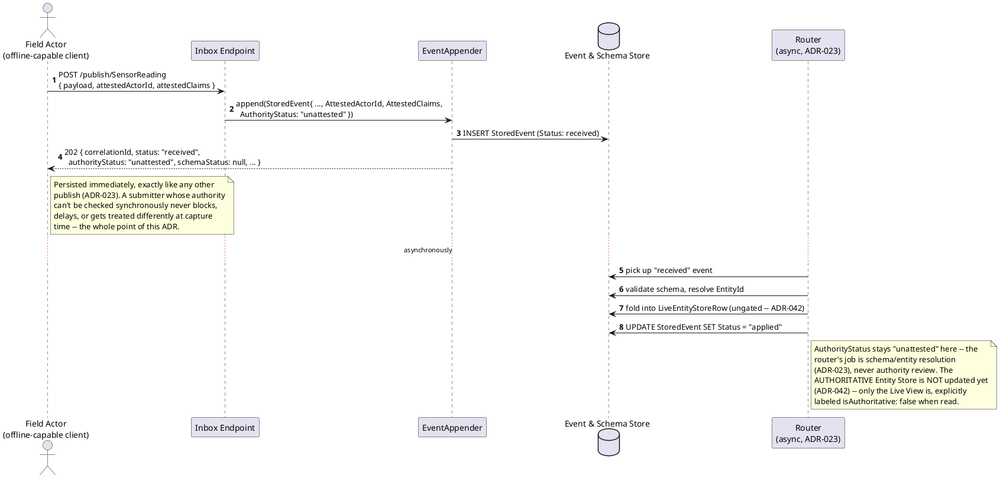
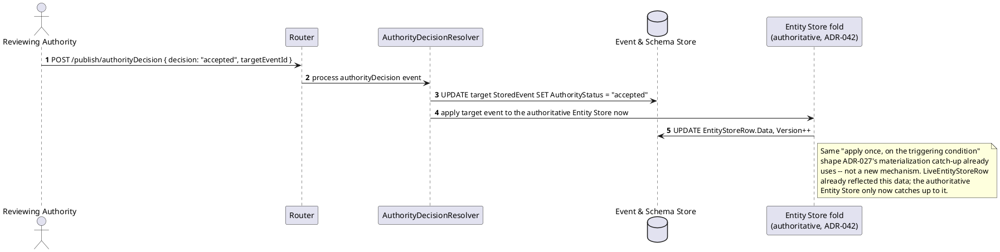
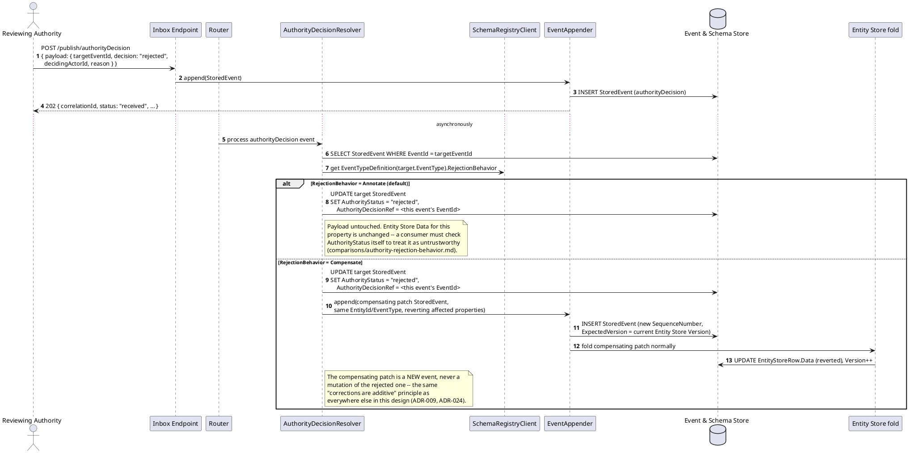
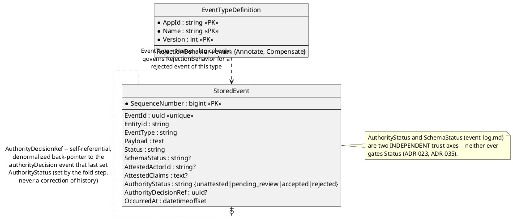

# Feature: Non-authoritative capture (`AuthorityStatus` as a trust axis)

> **Partially superseded, per `ADR-042`.** An `unattested`/
> `pending_review` event no longer folds into the authoritative Entity
> Store identically to an `accepted` one — it only folds once
> `AuthorityStatus` reaches `accepted`. A separate `LiveEntityStoreRow`
> (`../data/entity-store.md`) reflects it immediately instead, explicitly
> labeled `isAuthoritative: false`. The scenarios below are updated to
> reflect this; the `authorityDecision`/`RejectionBehavior` mechanics
> themselves are unchanged.

Context: decision record `ADR-035` in `../07-adrs.md`, revised by
`ADR-042` for the gated-fold/Live-View split; the annotate-only vs.
compensating-patch fork is worked out in full in
[`../comparisons/authority-rejection-behavior.md`](../comparisons/authority-rejection-behavior.md)
(narrower in scope post-`ADR-042` — see that doc's own note);
the new `StoredEvent` fields (`AttestedActorId`, `AttestedClaims`,
`AuthorityStatus`, `AuthorityDecisionRef`) are documented in
[`../data/event-log.md`](../data/event-log.md); `RejectionBehavior` on
`EventTypeDefinition` is documented in
[`../data/schema-registry.md`](../data/schema-registry.md). Builds on
[`publish-event.md`](publish-event.md) and its persist-everything response
envelope (`ADR-023`) — this doc covers only the parts specific to
`AuthorityStatus` and `authorityDecision` events. `AuthorityStatus` is what
`ADR-036` (DID/UCAN self-attestation) populates with real credential claims;
this doc stays credential-agnostic and only exercises the trust-axis
mechanics themselves. The MVVM client's rendering of `unattested`/
`pending_review` data (reusing `ADR-024`'s `ConflictFlag` visual-flag
convention, per `ADR-039`) is out of scope here.

An `authorityDecision` event is registered like any other event type —
`EntityIdField: "$.targetEventId"` gives each decision its own
`{appId}:authorityDecision:{targetEventId}` entity identity, purely for
query convenience. Annotating the *target* event's `AuthorityStatus`/
`AuthorityDecisionRef`, and — for `Compensate`-type targets — emitting a
compensating patch, are side effects performed by a dedicated
`AuthorityDecisionResolver` step reacting to that one event type, the same
"special-purpose reactor" shape `ADR-020`'s `EventUpcastFailed` handling and
`ADR-027`'s materialization already use, not a new generic fold mechanism.

The GraphQL query shapes referenced below are illustrative only —
`03-api-contracts.md`'s GraphQL contract rewrite for entity/history queries
is still outstanding propagation work (`CLAUDE.md`); this doc doesn't
presume a settled SDL.

## Sequence diagram — capturing an event with unattested authority



## Sequence diagram — authoritative catch-up once accepted



## Sequence diagram — an `authorityDecision:rejected` event and its effect



## Data model (ER diagram)



`AuthorityDecisionRef` is deliberately not a DB foreign key any more than
`EventParents.ParentEventId` is (`event-chains.md`) — it's set by the fold
step after the fact, on an event that already exists, never at insert time.
Full entity set is in `../02-data-model.md`; this diagram shows only what
authority review actually reads/writes.

## Salt (UI mockup)

Not applicable — authority review here is a machine-to-machine decision
workflow: an `authorityDecision` event published like any other event, with
no UI surface of its own in scope. Rendering `unattested`/`pending_review`
data with a visual indicator in the MVVM client's entity views is `ADR-039`'s
concern, not this doc's.

## Gherkin

```gherkin
Feature: Non-authoritative capture (AuthorityStatus as a trust axis)
  As a system capturing data from actors whose authority can't be verified synchronously
  I want submissions to persist immediately with an advisory AuthorityStatus
  And later accept/reject review decisions recorded as new events, never mutations
  So that offline or otherwise unverifiable actors are never blocked, delayed,
  or treated specially at capture time

  # Every request in this file carries a Bearer token with the events:publish
  # scope unless a scenario says otherwise -- authority review is a trust
  # question about the SUBMITTER'S CLAIMED IDENTITY, a different, independent
  # concern from the caller's own OAuth scope, which is still enforced
  # normally (ADR-023's closing note). See auth.md for that check itself.
  # Publish responses use the 202 envelope from ADR-023/publish-event.md:
  # { correlationId, status, entityId, schemaStatus, authorityStatus, reason, timestamp }.

  Background:
    Given the event type "SensorReading" version 1 is registered with schema:
      """
      {
        "type": "object",
        "properties": { "SensorId": { "type": "string" }, "Reading": { "type": "number" } },
        "required": ["SensorId", "Reading"]
      }
      """
      with EntityIdField "$.SensorId" and RejectionBehavior "Annotate"
    And the event type "ClaimSubmission" version 1 is registered with schema:
      """
      {
        "type": "object",
        "properties": { "ClaimId": { "type": "string" }, "Amount": { "type": "number" } },
        "required": ["ClaimId", "Amount"]
      }
      """
      with EntityIdField "$.ClaimId" and RejectionBehavior "Compensate"
    And the event type "authorityDecision" version 1 is registered with schema:
      """
      {
        "type": "object",
        "properties": {
          "targetEventId": { "type": "string" },
          "decision": { "type": "string" },
          "decidingActorId": { "type": "string" },
          "reason": { "type": "string" }
        },
        "required": ["targetEventId", "decision", "decidingActorId"]
      }
      """
      with EntityIdField "$.targetEventId"

  Scenario: Publishing an event with attested claims persists as unattested, never blocking ingestion
    When I POST to "/publish/SensorReading" with body:
      """
      {
        "payload": { "SensorId": "sensor-42", "Reading": 21.5 },
        "attestedActorId": "field-agent-7",
        "attestedClaims": { "type": "ucan-invocation", "capability": "sensor:report" }
      }
      """
    Then the response status should be 202
    And the response body should include "authorityStatus": "unattested"
    And the stored event's AttestedActorId should be "field-agent-7"

  Scenario: An unattested event reaches the Live View immediately but not the authoritative Entity Store
    When a "SensorReading" event is published for "sensor-42" with body { "SensorId": "sensor-42", "Reading": 21.5 } and AttestedClaims present
    Then querying the Live View for "sensor-42" should return Reading 21.5, wrapped with "isAuthoritative": false
    And querying the authoritative Entity Store for "sensor-42" should NOT yet reflect Reading 21.5

  Scenario: Once accepted, the authoritative Entity Store catches up to what the Live View already showed
    Given a "SensorReading" event "reading-5" was published for "sensor-42" with body { "SensorId": "sensor-42", "Reading": 45.0 } and AttestedClaims present
    And the Live View for "sensor-42" already shows Reading 45.0
    When I POST to "/publish/authorityDecision" with body:
      """
      { "payload": { "targetEventId": "reading-5", "decision": "accepted", "decidingActorId": "reviewer-1" } }
      """
    Then eventually the authoritative Entity Store for "sensor-42" should show Reading 45.0

  Scenario: AuthorityStatus is independent of SchemaStatus
    When I POST to "/publish/SensorReading" with body:
      """
      { "payload": { "SensorId": "sensor-42" }, "attestedActorId": "field-agent-7" }
      """
    Then the response status should be 202
    And the response body should include "schemaStatus": "invalid"
    And the response body should include "authorityStatus": "unattested"
    And neither flag should have prevented the event from being persisted

  Scenario: An authorityDecision:accepted event moves the target's AuthorityStatus to accepted
    Given a "SensorReading" event "reading-1" was published with body { "SensorId": "sensor-42", "Reading": 21.5 }
    When I POST to "/publish/authorityDecision" with body:
      """
      { "payload": { "targetEventId": "reading-1", "decision": "accepted", "decidingActorId": "reviewer-1" } }
      """
    Then the response status should be 202
    And the stored event "reading-1" should have AuthorityStatus "accepted"
    And the stored event "reading-1"'s AuthorityDecisionRef should equal the authorityDecision event's EventId

  Scenario: An authorityDecision:rejected event on an Annotate-type event flags the event without touching its Payload
    Given a "SensorReading" event "reading-2" was published with body { "SensorId": "sensor-42", "Reading": 99.9 }
    When I POST to "/publish/authorityDecision" with body:
      """
      { "payload": { "targetEventId": "reading-2", "decision": "rejected", "decidingActorId": "reviewer-1", "reason": "sensor miscalibrated" } }
      """
    Then the response status should be 202
    And the stored event "reading-2" should have AuthorityStatus "rejected"
    And the stored event "reading-2"'s Payload should be unchanged
    And the Entity Store row for "sensor-42" should still show Reading 99.9
    And no compensating patch event should be appended

  Scenario: An authorityDecision:rejected event on a Compensate-type event triggers a compensating patch (reversal after prior acceptance)
    Given a "ClaimSubmission" event "claim-1" was published with body { "ClaimId": "claim-9", "Amount": 5000 } and AttestedClaims present
    And an "authorityDecision" event previously accepted "claim-1", so the Entity Store row for "claim-9" shows Amount 5000
    When I POST to "/publish/authorityDecision" with body:
      """
      { "payload": { "targetEventId": "claim-1", "decision": "rejected", "decidingActorId": "reviewer-1", "reason": "unverifiable claimant" } }
      """
    Then the response status should be 202
    And the stored event "claim-1" should have AuthorityStatus "rejected"
    And the stored event "claim-1"'s Payload should be unchanged
    And a new compensating patch event should be appended for "ClaimSubmission", targeting the same EntityId
    And the Entity Store row for "claim-9" should no longer show Amount 5000

  Scenario: AuthorityDecisionRef denormalizes back to the deciding authorityDecision event
    Given a "SensorReading" event "reading-3" was published with body { "SensorId": "sensor-42", "Reading": 12.0 }
    And an "authorityDecision" event "decision-1" was published rejecting "reading-3"
    When I fetch the stored event "reading-3"
    Then its AuthorityDecisionRef should equal "decision-1"'s EventId
    And querying entity history for "sensor-42" via GraphQL should list both "reading-3" and "decision-1"

  Scenario: Two servers independently disagreeing about review status resolves via ConflictFlag, like any other divergence
    Given a "SensorReading" event "reading-4" was published with body { "SensorId": "sensor-42", "Reading": 30.0 }
    And Server A published an "authorityDecision" event "decision-a" accepting "reading-4"
    And Server B, unaware of "decision-a", independently published an "authorityDecision" event "decision-b" rejecting "reading-4"
    When peer sync delivers "decision-b" to Server A
    Then the fold step should apply "decision-b" without blocking or rejecting it
    And the later-applied decision event should have ConflictFlag set to true
    And "reading-4"'s AuthorityDecisionRef should reflect whichever decision was applied last, not a merged or auto-resolved verdict
```
