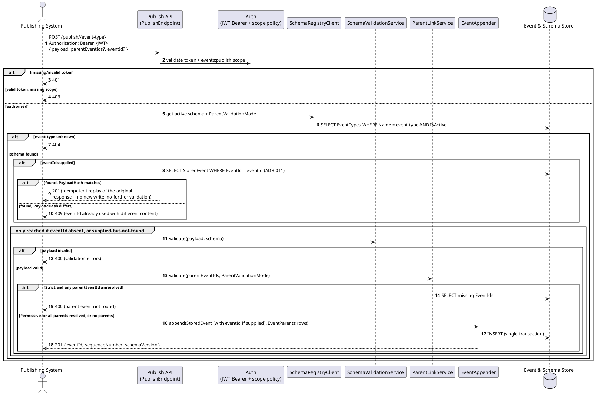
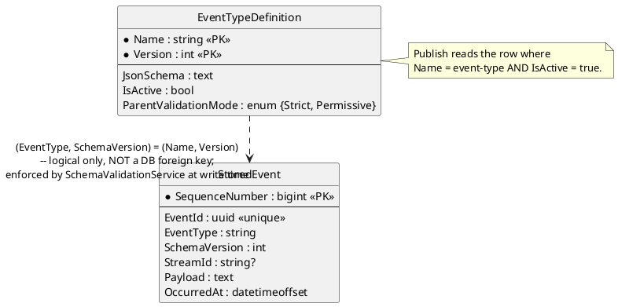

# Feature: Publish events against a registered schema

Context: full contract in `../03-api-contracts.md`; schema/registration
lifecycle in `../05-schema-registry-and-spec-generation.md`; the
`parentEventIds` envelope field is covered in depth in
[`event-chains.md`](event-chains.md); auth requirements in
[`auth.md`](auth.md).

## Sequence diagram



## Data model (ER diagram)



Full entity set (all fields, all relationships) is in `../02-data-model.md`
— this diagram shows only what publish actually reads/writes.

## Salt (UI mockup)

Not applicable — publish is a machine-to-machine API with no UI surface in
scope.

## Gherkin

```gherkin
Feature: Publish events against a registered schema
  As a publishing system
  I want events validated against a named, registered JSON Schema
  So that only well-formed events enter the store

  # Every request in this file carries a Bearer token with the events:publish
  # scope unless a scenario says otherwise. See auth.md for authentication/
  # authorization behavior itself.
  # The request body is an envelope: {"payload": {...}, "parentEventIds": [...]}.
  # See event-chains.md for parentEventIds behavior.

  Background:
    Given the event type "OrderPlaced" version 1 is registered with schema:
      """
      {
        "type": "object",
        "properties": {
          "Amount": { "type": "number" },
          "Status": { "type": "string" }
        },
        "required": ["Amount", "Status"]
      }
      """

  Scenario: Publishing a valid event succeeds
    When I POST to "/publish/OrderPlaced" with body:
      """
      { "payload": { "Amount": 150.00, "Status": "Paid" } }
      """
    Then the response status should be 201
    And the stored event should have SchemaVersion 1
    And the stored event's SequenceNumber should be assigned

  Scenario: Publishing an event missing a required field is rejected
    When I POST to "/publish/OrderPlaced" with body:
      """
      { "payload": { "Amount": 150.00 } }
      """
    Then the response status should be 400
    And the response should list "Status" as a missing required property
    And no event should be appended to the store

  Scenario: Publishing an event of the wrong type is rejected
    When I POST to "/publish/OrderPlaced" with body:
      """
      { "payload": { "Amount": "not-a-number", "Status": "Paid" } }
      """
    Then the response status should be 400
    And no event should be appended to the store

  Scenario: Publishing against an unknown event type is rejected
    When I POST to "/publish/NonExistentType" with body:
      """
      { "payload": { "foo": "bar" } }
      """
    Then the response status should be 404

  Scenario: Publishing after a schema version upgrade validates against the active version
    Given the event type "OrderPlaced" version 2 is registered with schema:
      """
      {
        "type": "object",
        "properties": {
          "Amount": { "type": "number" },
          "Status": { "type": "string" },
          "Currency": { "type": "string", "default": "USD" }
        },
        "required": ["Amount", "Status"]
      }
      """
    When I POST to "/publish/OrderPlaced" with body:
      """
      { "payload": { "Amount": 150.00, "Status": "Paid" } }
      """
    Then the response status should be 201
    And the stored event should have SchemaVersion 2

  Scenario: Retrying a publish with the same eventId and identical content replays the original response, with no new write
    Given I POST to "/publish/OrderPlaced" with body:
      """
      { "payload": { "Amount": 150.00, "Status": "Paid" }, "eventId": "3fa85f64-5717-4562-b3fc-2c963f66afa6" }
      """
    And the response status should be 201
    When I POST the exact same request again
    Then the response status should be 201
    And the response body should be identical to the first response
    And no second event should be appended to the store

  Scenario: Retrying with the same eventId but different content is a conflict
    Given I POST to "/publish/OrderPlaced" with body:
      """
      { "payload": { "Amount": 150.00, "Status": "Paid" }, "eventId": "3fa85f64-5717-4562-b3fc-2c963f66afa6" }
      """
    And the response status should be 201
    When I POST to "/publish/OrderPlaced" with body:
      """
      { "payload": { "Amount": 999.00, "Status": "Paid" }, "eventId": "3fa85f64-5717-4562-b3fc-2c963f66afa6" }
      """
    Then the response status should be 409
    And no second event should be appended to the store

  Scenario: Publishing without eventId behaves exactly as before ADR-011
    When I POST to "/publish/OrderPlaced" with body:
      """
      { "payload": { "Amount": 150.00, "Status": "Paid" } }
      """
    Then the response status should be 201
    And the stored event's EventId should be freshly generated, not derivable from the request
```
