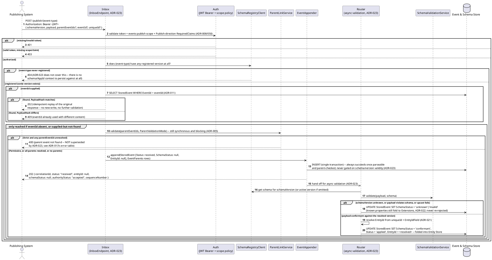
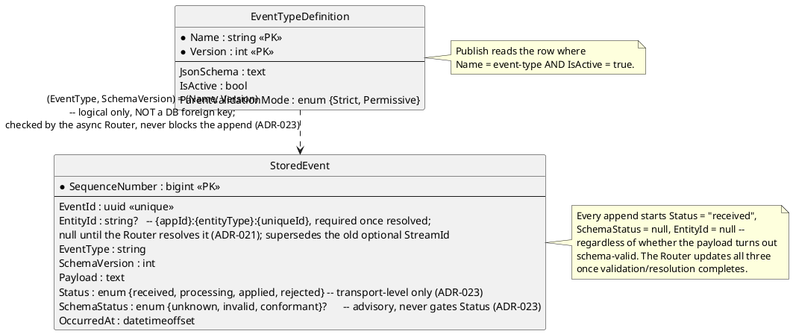

# Feature: Publish events against a registered schema

Context: full contract in `../03-api-contracts.md`; schema/registration
lifecycle in `../05-schema-registry-and-spec-generation.md`; the
`parentEventIds` envelope field is covered in depth in
[`event-chains.md`](event-chains.md); auth requirements in
[`auth.md`](auth.md). Per `ADR-023`'s persist-everything posture, a
schema-invalid payload, an unknown `schemaVersion`, or a failed upcast no
longer produce `400` — they persist with `202 Accepted` and an advisory
`SchemaStatus` (`unknown`/`invalid`/`conformant`) instead. Two rejections
survive as genuine, blocking errors, verified against `docs/adrs/adr-013-
problem-details.md`'s error table (only its `validation-failed` and
`unknown-schema-version` rows are struck through as superseded — every
other row, including these two, is unaffected by `ADR-023`): an entirely
unregistered event type (`404` — there is no schema/`AppId` context to
even persist against) and a Strict-mode publish naming a parent event
that doesn't resolve (`400` — `ADR-005`, covered in depth in
[`event-chains.md`](event-chains.md), not re-derived here). `PublishEndpoint`
itself splits into a synchronous `InboxEndpoint` (auth, idempotency, the
two blocking checks above, then an unconditional append) and a background
`Router` that owns schema/entity/upcast validation asynchronously
(`ADR-023`) — out of scope here: the Router's own queuing/retry
mechanics, covered by `ADR-023` itself, not re-derived in this doc.

## Sequence diagram



## Data model (ER diagram)



Full entity set (all fields, all relationships) is in `../02-data-model.md`
and `../data/event-log.md` — this diagram shows only what publish
actually reads/writes.

## Salt (UI mockup)

Not applicable — publish is a machine-to-machine API with no UI surface in
scope.

## Gherkin

```gherkin
Feature: Publish events against a registered schema
  As a publishing system
  I want events validated against a named, registered JSON Schema
  So that only well-formed events enter the store, and malformed ones are
  never lost -- only flagged (ADR-023)

  # Every request in this file carries a Bearer token with the events:publish
  # scope unless a scenario says otherwise. See auth.md for authentication/
  # authorization behavior itself.
  # The request body is an envelope: {"payload": {...}, "parentEventIds": [...]}.
  # See event-chains.md for parentEventIds behavior, including why a
  # Strict-mode unresolved parent is still a real 400 (unaffected by ADR-023).

  Background:
    Given the event type "OrderPlaced" version 1 is registered with schema:
      """
      {
        "type": "object",
        "properties": {
          "Amount": { "type": "number" },
          "Status": { "type": "string" }
        },
        "required": ["Amount", "Status"]
      }
      """

  Scenario: Publishing a valid event succeeds
    When I POST to "/publish/OrderPlaced" with body:
      """
      { "payload": { "Amount": 150.00, "Status": "Paid" } }
      """
    Then the response status should be 202
    And the stored event should have SchemaVersion 1
    And the stored event should eventually have SchemaStatus "conformant"
    And the stored event's SequenceNumber should be assigned

  Scenario: Publishing an event missing a required field is persisted with SchemaStatus invalid, not rejected
    # ADR-023 -- superseded the pre-existing 400 here (docs/adrs/adr-013-problem-details.md's
    # struck-through "validation-failed" row): nothing about payload shape blocks persistence.
    When I POST to "/publish/OrderPlaced" with body:
      """
      { "payload": { "Amount": 150.00 } }
      """
    Then the response status should be 202
    And the stored event should eventually have SchemaStatus "invalid"
    And the event should be appended to the store, not discarded

  Scenario: Publishing an event with a wrong-shaped field is persisted with SchemaStatus invalid, not rejected
    When I POST to "/publish/OrderPlaced" with body:
      """
      { "payload": { "Amount": "not-a-number", "Status": "Paid" } }
      """
    Then the response status should be 202
    And the stored event should eventually have SchemaStatus "invalid"
    And the event should be appended to the store, not discarded

  Scenario: Publishing against an entirely unregistered event type is still rejected
    # NOT covered by ADR-023 -- there is no schema/AppId context to persist
    # against at all, unlike an unknown schemaVersion for a type that does exist.
    When I POST to "/publish/NonExistentType" with body:
      """
      { "payload": { "foo": "bar" } }
      """
    Then the response status should be 404

  Scenario: Publishing after a schema version upgrade validates against the active version
    Given the event type "OrderPlaced" version 2 is registered with schema:
      """
      {
        "type": "object",
        "properties": {
          "Amount": { "type": "number" },
          "Status": { "type": "string" },
          "Currency": { "type": "string", "default": "USD" }
        },
        "required": ["Amount", "Status"]
      }
      """
    When I POST to "/publish/OrderPlaced" with body:
      """
      { "payload": { "Amount": 150.00, "Status": "Paid" } }
      """
    Then the response status should be 202
    And the stored event should have SchemaVersion 2
    And the stored event should eventually have SchemaStatus "conformant"

  Scenario: Retrying a publish with the same eventId and identical content replays the original response, with no new write
    Given I POST to "/publish/OrderPlaced" with body:
      """
      { "payload": { "Amount": 150.00, "Status": "Paid" }, "eventId": "3fa85f64-5717-4562-b3fc-2c963f66afa6" }
      """
    And the response status should be 202
    When I POST the exact same request again
    Then the response status should be 202
    And the response body should be identical to the first response
    And no second event should be appended to the store

  Scenario: Retrying with the same eventId but different content is a conflict
    Given I POST to "/publish/OrderPlaced" with body:
      """
      { "payload": { "Amount": 150.00, "Status": "Paid" }, "eventId": "3fa85f64-5717-4562-b3fc-2c963f66afa6" }
      """
    And the response status should be 202
    When I POST to "/publish/OrderPlaced" with body:
      """
      { "payload": { "Amount": 999.00, "Status": "Paid" }, "eventId": "3fa85f64-5717-4562-b3fc-2c963f66afa6" }
      """
    Then the response status should be 409
    And no second event should be appended to the store

  Scenario: Publishing without eventId behaves exactly as before ADR-011
    When I POST to "/publish/OrderPlaced" with body:
      """
      { "payload": { "Amount": 150.00, "Status": "Paid" } }
      """
    Then the response status should be 202
    And the stored event's EventId should be freshly generated, not derivable from the request
```
