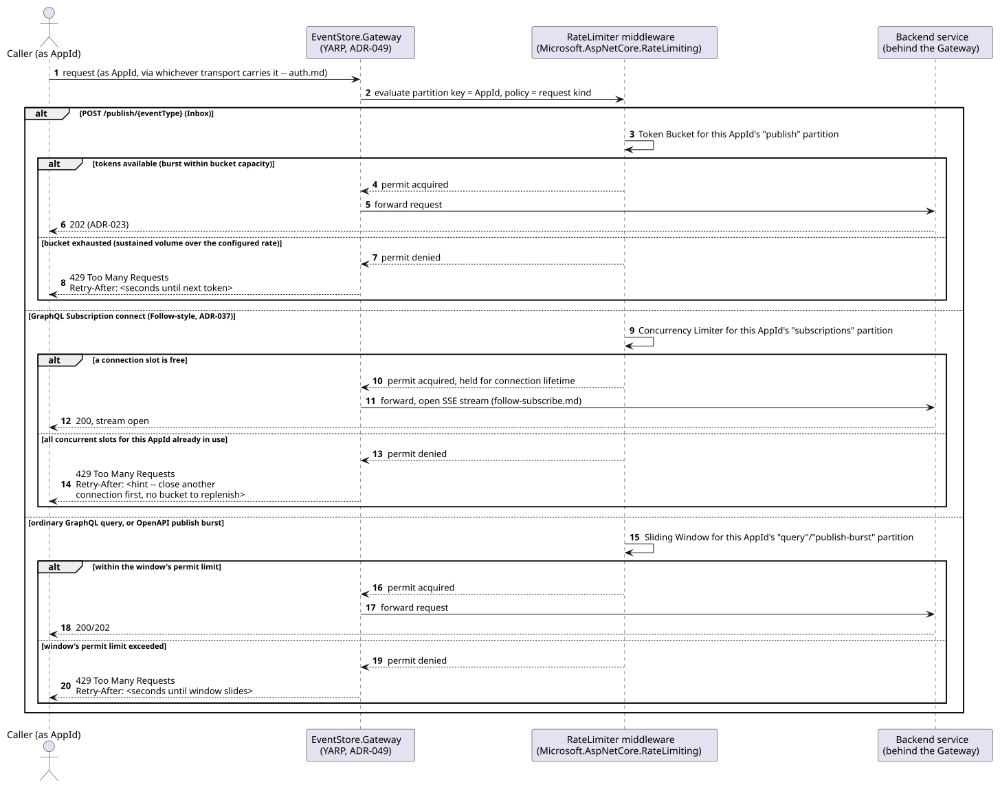
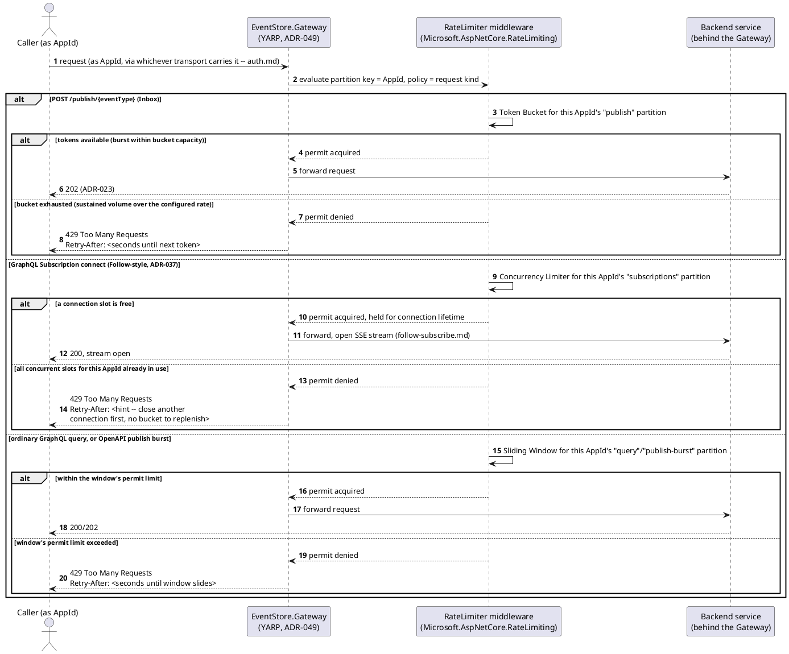
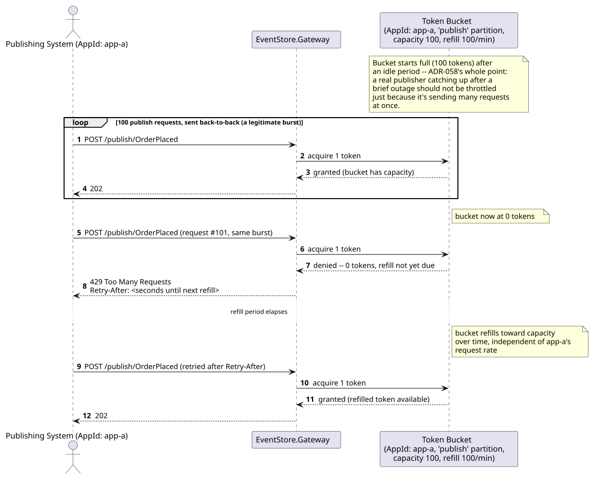
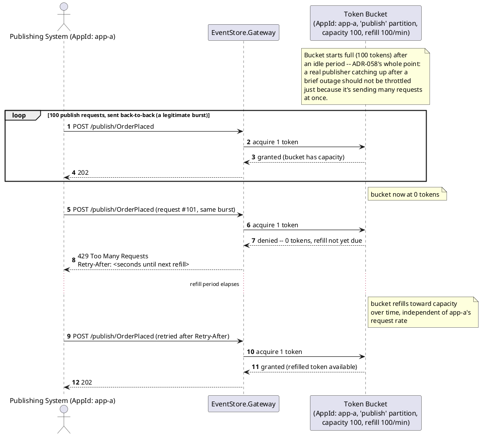
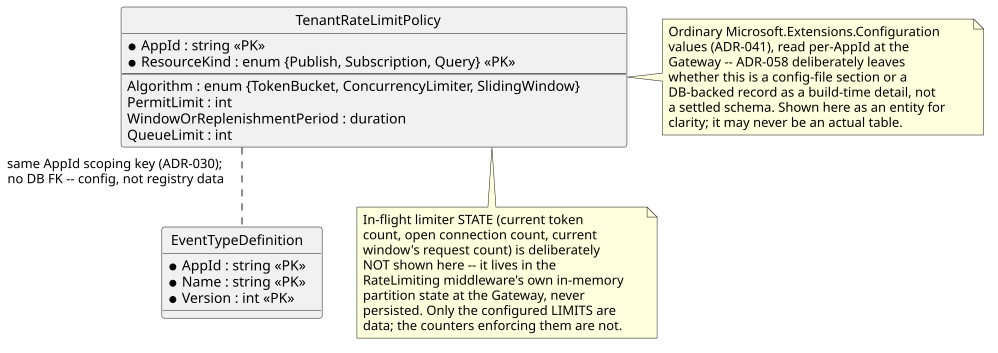
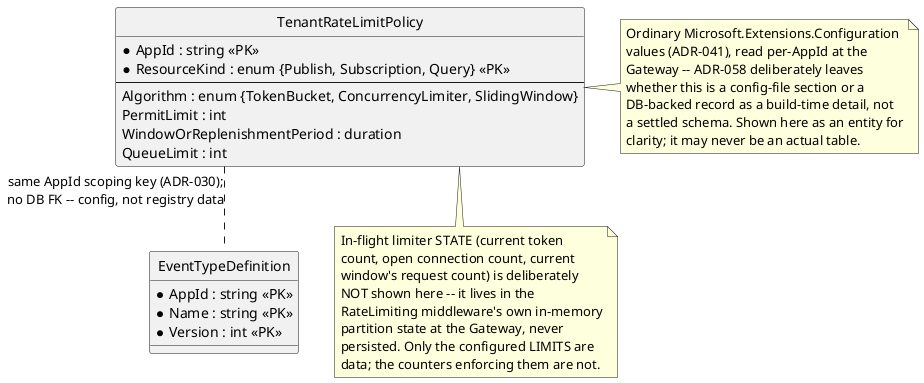

# Feature: Per-`AppId` rate limiting at the API Gateway

Context: `ADR-058` (`../adrs/adr-058-rate-limiting-quota.md`) decides
per-`AppId`-partitioned rate limiting via ASP.NET Core's first-party
`Microsoft.AspNetCore.RateLimiting` middleware (.NET 7+,
[`../libraries/dotnet/aspnetcore-ratelimiting.md`](../libraries/dotnet/aspnetcore-ratelimiting.md)),
enforced at `EventStore.Gateway` (`ADR-049`, YARP — see
`../06-solution-structure.md`), YARP itself being an ordinary ASP.NET
Core app the same middleware attaches to. Three algorithms map to three
distinct resources, not three redundant limits on the same thing:
**Token Bucket** for publish (`Inbox`) traffic — absorbs a legitimate
burst while still bounding sustained volume, the right fit for
`ADR-023`'s always-`202` ingestion, where the real danger is sustained
volume, not one spike; **Concurrency Limiter** for GraphQL Subscriptions
and Follow-style long-lived connections — bounds open connection slots,
a different resource than request rate; **Sliding Window** for ordinary
GraphQL queries and OpenAPI publish bursts — the standard general-
purpose choice absent a more specific reason to reach for the other two.
Every limiter is partitioned by `AppId` (`ADR-030`), so one tenant's
volume can never exhaust another tenant's share of a shared deployment's
capacity. Limits (`PermitLimit`/`Window`/`QueueLimit` per algorithm) are
ordinary `Microsoft.Extensions.Configuration` values (`ADR-041`), read
per-`AppId` from a tenant-limits configuration section — `ADR-058`
deliberately leaves the exact source (a config section vs. a Schema
Registry-adjacent record) as a build-time detail, not a design decision
this doc re-opens; where `AppId`-scoping configuration already lives at
the registry layer is shown in
[`../data/schema-registry.md`](../data/schema-registry.md)'s
`EventTypeDefinition`/`AppTrustRoot`/`AppDataResidencyPolicy` rows, which
this feature's own tenant-limits config sits alongside logically, not as
a new composite-key entity of its own.

**Out of scope, deliberately**: this doc does **not** re-derive
`ADR-037`'s GraphQL query-depth/complexity-cost limiter
(`../03-api-contracts.md`, `../adrs/adr-037-graphql-only-query-layer.md`)
— that mechanism bounds one query's *shape* (how deep/expensive a single
request is), enforced inside the GraphQL Gateway itself; this doc's
limiters bound *sustained volume* across many requests, enforced one hop
earlier at `EventStore.Gateway`. The two are complementary and both
apply to the same GraphQL query, in sequence, not overlapping or
replacing one another. A service behind the Gateway (e.g. the Streaming
Channel Service bounding ingest throughput independently of request
count) may layer its own additional, resource-specific limiter per
`ADR-058` — not shown here, since that is a per-service opt-in, not part
of this shared Gateway mechanism.

## Sequence diagram — the Gateway selects a limiter by request kind





`ADR-037`'s own depth/cost limiter, if the request is a GraphQL
operation, still runs inside the GraphQL Gateway after this point —
passing the Sliding Window check above only means the *request* was
allowed through; an individual query can still be rejected on shape a
step later, unaffected by anything in this diagram.

## Sequence diagram — Token Bucket absorbs a burst, then rejects sustained excess





## Data model (ER diagram)





Full `AppId`-scoping context (`EventTypeDefinition`,
`AppTrustRoot`, `AppDataResidencyPolicy`) is in
[`../data/schema-registry.md`](../data/schema-registry.md) — this
diagram shows only the configuration shape this feature adds
alongside it.

## Salt (UI mockup)

Not applicable — rate limiting is a Gateway-layer, machine-to-machine
enforcement concern (a `429`/`Retry-After` response to a publishing
system or GraphQL client) with no UI surface of its own, the same
"not applicable" reasoning
[`multi-tenancy.md`](multi-tenancy.md) and
[`follow-subscribe.md`](follow-subscribe.md) give for their own
Gateway/registry-level mechanisms. A deployment operator's view of a
tenant's configured limits, if one is ever built, would be a Gateway
operations/admin surface — not specified by `ADR-058` and not invented
here.

## Gherkin

```gherkin
Feature: Per-AppId rate limiting at the API Gateway
  As the framework
  I want every tenant's request volume bounded independently at the Gateway
  So that one tenant can never starve another tenant's share of a shared
    deployment's capacity

  # Every request in this file is authenticated (auth.md) as the named
  # AppId; only the rate-limiting behavior itself is under test here.

  Background:
    Given AppId "app-a" has a Token Bucket publish policy with capacity 100 and refill 100 per minute
    And AppId "app-a" has a Concurrency Limiter subscription policy with limit 5
    And AppId "app-a" has a Sliding Window query policy with limit 50 per minute
    And AppId "app-b" has its own independent policies, identical in shape but tracked separately

  Scenario: A legitimate publish burst within bucket capacity is accepted
    When AppId "app-a" sends 100 publish requests back-to-back
    Then all 100 requests should receive 202

  Scenario: Sustained publish volume beyond the bucket's capacity is rejected with Retry-After
    Given AppId "app-a" has just sent 100 publish requests, exhausting its bucket
    When AppId "app-a" sends one more publish request before any refill occurs
    Then the response status should be 429
    And the response should include a Retry-After header

  Scenario: One AppId's exhausted bucket never affects another AppId's publish requests
    Given AppId "app-a" has exhausted its publish bucket
    When AppId "app-b" sends a publish request
    Then AppId "b"'s response status should be 202
    # Partitioning by AppId (ADR-030) is the entire point -- app-a's noise
    # never touches app-b's own bucket.

  Scenario: Opening more concurrent subscriptions than the concurrency limit is rejected
    Given AppId "app-a" already has 5 open GraphQL Subscription connections
    When AppId "app-a" attempts to open a 6th subscription connection
    Then the response status should be 429
    And the response should include a Retry-After header
    And the 5 already-open connections should remain open, unaffected

    # Closing one existing connection frees a slot for a new one
    When AppId "app-a" closes one of its 5 open subscription connections
    And AppId "app-a" attempts to open a new subscription connection
    Then the response status should be 200 and the stream should open

  Scenario: Ordinary GraphQL queries beyond the sliding window limit are rejected
    Given AppId "app-a" has already sent 50 ordinary GraphQL queries within the current window
    When AppId "app-a" sends one more ordinary GraphQL query
    Then the response status should be 429
    And the response should include a Retry-After header

  Scenario: A rejected request never reaches the backend service at all
    Given AppId "app-a" has exhausted its publish bucket
    When AppId "app-a" sends one more publish request
    Then the request should be rejected at EventStore.Gateway
    And no downstream backend service should have received the request

  Scenario: Passing the Gateway's rate limiter does not exempt a GraphQL query from ADR-037's depth/cost limiter
    Given AppId "app-a" is well within its Sliding Window query limit
    When AppId "app-a" sends a single GraphQL query whose nesting depth exceeds the configured maximum
    Then the Gateway's rate limiter should permit the request
    And the GraphQL Gateway should still reject the query for exceeding depth/cost limits
    # The two mechanisms are complementary (sustained volume vs. one
    # query's shape) -- passing one is not passing both.

  Scenario: A deployment can configure a higher limit for one AppId without a code change
    Given AppId "app-a"'s publish Token Bucket capacity is reconfigured to 500
    When AppId "app-a" sends 500 publish requests back-to-back
    Then all 500 requests should receive 202
    # Limits are Microsoft.Extensions.Configuration values (ADR-041), not
    # hardcoded -- raising a tenant's limit is a configuration change.
```
