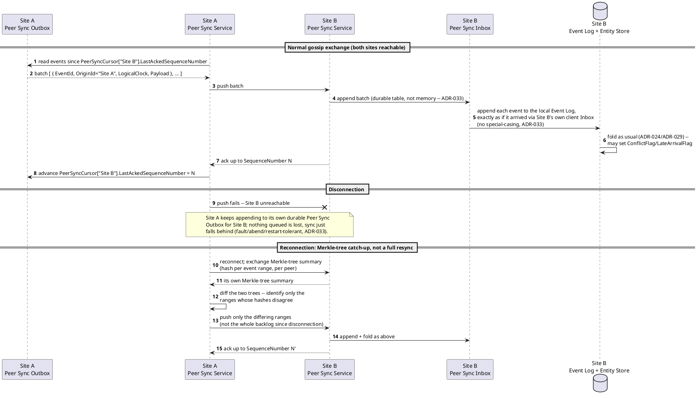
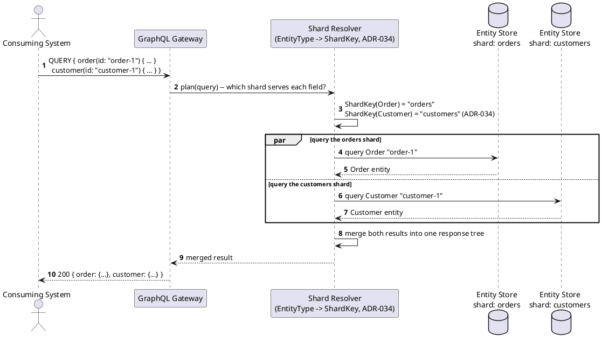
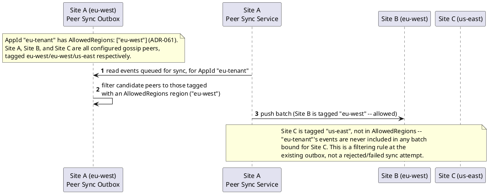
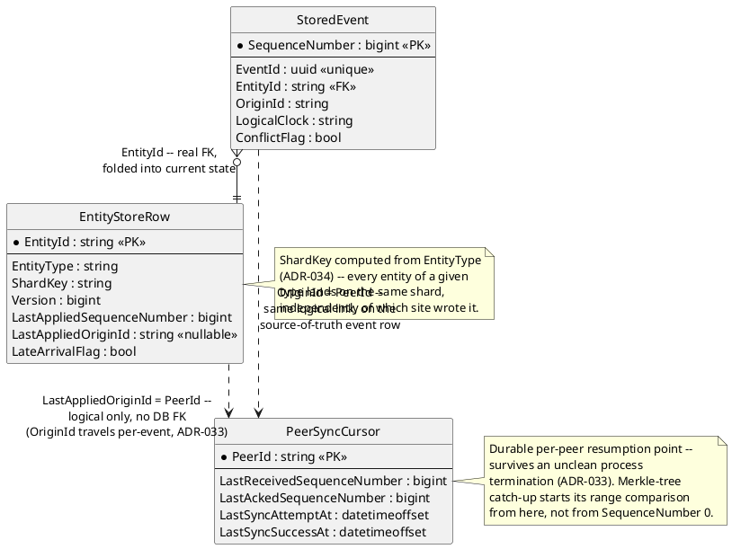

# Feature: Multi-origin replication and application-level sharding

Context: this doc deliberately covers two ADRs together, not one —
[`docs/comparisons/README.md`](../comparisons/README.md) already groups
their two decision comparisons side by side as "distribution" concerns,
and neither has any feature doc yet. `ADR-033`
(`../adrs/adr-033-multi-origin-replication.md`) decides the gossip/full-mesh
peer-sync topology, the minimum 2-replica regional-fault-tolerance
requirement, `OriginId`/`LogicalClock` (HLC) ordering, the fault/abend/
restart-tolerant Peer Sync Outbox/Inbox, and Merkle-tree catch-up after a
disconnection — see
[`docs/comparisons/peer-sync-topology.md`](../comparisons/peer-sync-topology.md)
for why gossip won over hub-and-spoke and leaderless pull. `ADR-034`
(`../adrs/adr-034-application-level-sharding.md`) decides `ShardKey =
EntityType` for the Entity Store and requires a fan-out/merge coordinator
for any query spanning shards — see
[`docs/comparisons/sharding-strategy.md`](../comparisons/sharding-strategy.md)
for why entity-type-based won over hash-based consistent hashing. Both
ADRs' fields — `ShardKey`, `LastAppliedOriginId` — live on
`EntityStoreRow` in [`../data/entity-store.md`](../data/entity-store.md).
Cross-shard fan-out is a GraphQL Gateway concern (`ADR-037`), not a new
query surface. Cross-server conflict resolution reuses `ADR-024`'s
`ConflictFlag` outright — no second mechanism (`ADR-033`'s consequences).
See `patterns/README.md`'s "Sharding," "Multi-origin replication +
anti-entropy/gossip," and "Merkle tree catch-up" rows for the general
patterns this doc applies concretely.

## Sequence diagram — peer-sync gossip exchange, then Merkle-tree catch-up after a disconnection



`ADR-033` is explicit that sync performs no routing, schema validation, or
projection of its own — a synced event lands in the receiving site's event
log exactly as if it arrived from its own client Inbox, and that site's own
local router/projector handles it with whatever schema/registry knowledge
it currently has. The Merkle-tree exchange is standard Dynamo/Cassandra-
style anti-entropy — a different application of the hashing discipline
`ADR-019`'s `ChainHash` already established (ranges of the log for catch-up
efficiency here, not tamper evidence there).

## Sequence diagram — a query spanning entity types on different shards



This is `ADR-034`'s stated consequence made concrete: a GraphQL resolver
spanning entity types that live on different shards issues one query per
shard and merges results, rather than assuming a single-shard query plan
always suffices. A single-shard query (both requested entities on the same
`ShardKey`) skips the `par` branch entirely — one call, no merge step.

## Data residency — region pinning (ADR-061)

`ADR-061` layers one filtering rule onto the peer-sync outbox the first
sequence diagram above already shows, rather than adding a new mechanism.
Every configured peer gains a `Region` tag (e.g. `"eu-west"`, `"us-
east"`), and a new per-`AppId` `AllowedRegions` list (`docs/data/schema-
registry.md`) constrains which regions that `AppId`'s events may
replicate to. Enforcement happens at the outbox, not at fold/query time:
when an event belonging to a region-constrained `AppId` is queued for
outbound gossip sync, the outbox filters candidate destination peers down
to only those tagged with one of the `AppId`'s `AllowedRegions` — a
disallowed-region peer simply never receives that event in a sync batch.
`ADR-034`'s `ShardKey = EntityType` is completely unchanged by this;
region constrains *where a shard's replicas may live*, not a new
sharding dimension layered onto the key itself.



This is a **named, honest tension with `ADR-033`'s minimum-replication-
factor-of-2 requirement**, not silently resolved: a tenant restricted to
a single region satisfies both requirements only if that region has ≥2
live sites tagged with it. Where it doesn't, residency wins — it's a
regulatory hard constraint, fault tolerance is a design preference — and
the deployment is responsible for ensuring ≥2 sites exist in any region a
tenant restricts to, or knowingly accepting single-site risk.

## Data model (ER diagram)



There is deliberately no `Peer`/`Site` table with a hard foreign key from
`EntityStoreRow.LastAppliedOriginId` or `StoredEvent.OriginId` — both are
logical-only links to whichever peer identifier a `PeerSyncCursor` row
uses, the same "logical only, not a DB FK" discipline `follow-
subscribe.md`'s ER diagram already uses for `EventTypeDefinition ..>
StoredEvent`. `ShardKey` and `LastAppliedOriginId` are the two fields
`ADR-034`/`ADR-033` respectively add to `EntityStoreRow`
(`../data/entity-store.md`); `OriginId`/`LogicalClock`/`ConflictFlag` are
carried on `StoredEvent` (`../data/event-log.md`) — `ConflictFlag` is
`ADR-024`'s pre-existing field, reused here for cross-origin conflicts,
not a new one.

## Salt (UI mockup)

Not applicable — replication and sharding are server-to-server and
resolver-internal mechanisms with no UI surface in scope.

## Gherkin

```gherkin
Feature: Multi-origin replication and application-level sharding
  As an operator running this event store across more than one site
  I want events to replicate between sites and entities to shard predictably by type
  So that any single site can go dark without losing data or availability,
     and a query spanning entity types still returns one merged result

  # Every site in this file authenticates its peer-sync traffic the same way
  # any other server-to-server caller does; see auth.md. This doc only
  # covers replication/sharding mechanics, not that authentication itself.

  Background:
    Given the event type "OrderPlaced" version 1 is registered with schema:
      """
      { "type": "object", "properties": { "OrderId": { "type": "string" }, "Amount": { "type": "number" } }, "required": ["OrderId", "Amount"] }
      """
    And the event type "CustomerRegistered" version 1 is registered with schema:
      """
      { "type": "object", "properties": { "CustomerId": { "type": "string" }, "Name": { "type": "string" } }, "required": ["CustomerId", "Name"] }
      """
    And entity type "Order" is shard-mapped to ShardKey "orders" (ADR-034)
    And entity type "Customer" is shard-mapped to ShardKey "customers" (ADR-034)
    And "Site A" and "Site B" are configured as gossip peers, each replicating every shard (ADR-033)
    And the "orders" shard's minimum replication factor of 2 is satisfied by "Site A" and "Site B"

  Scenario: An event published at one site eventually replicates to its peer
    When an "OrderPlaced" event for "order-1" is published at "Site A"
    Then eventually "Site A"'s Entity Store should show an "Order" entity "order-1"
    And eventually "Site B"'s Entity Store should also show that same "Order" entity "order-1"
    And "Site B"'s copy should have LastAppliedOriginId "Site A"

  Scenario: Two sites disconnect, write independently, and reconnect via Merkle-tree diff rather than a full resync
    Given "Site A" and "Site B" are fully in sync
    When connectivity between "Site A" and "Site B" is lost
    And an "OrderPlaced" event for "order-2" is published at "Site A" while disconnected
    And an "OrderPlaced" event for "order-3" is published at "Site B" while disconnected
    And connectivity between "Site A" and "Site B" is restored
    Then the two sites should exchange Merkle-tree summaries of their event ranges before transferring anything
    And only the event ranges that actually differ should be transferred, not the full event log
    And eventually both "Site A" and "Site B" should show both "order-2" and "order-3"

  Scenario: A conflicting concurrent write from two origins is flagged, reusing ConflictFlag rather than a new mechanism
    Given an "Order" entity "order-1" exists at Version 5, already synced to both "Site A" and "Site B"
    When "Site A" publishes a patch to "order-1" with ExpectedVersion 5
    And "Site B" independently publishes a conflicting patch to "order-1" with ExpectedVersion 5, before the sites next sync
    And "Site A" and "Site B" then sync with each other
    Then the patch that loses the fold-time conflict check should have ConflictFlag set to true
    And no origin-specific or second conflict-resolution mechanism should be involved -- it is the exact same ConflictFlag ADR-024 defines for a same-server concurrent write

  Scenario: An entity of a given EntityType always resolves to the same shard
    When "Order" entities "order-10" and "order-11" are both created
    Then both should resolve to ShardKey "orders"
    When a "Customer" entity "customer-1" is created
    Then it should resolve to ShardKey "customers", a different shard than either Order

  Scenario: A query spanning entity types on different shards fans out and merges results
    Given an "Order" entity "order-1" exists on the "orders" shard
    And a "Customer" entity "customer-1" exists on the "customers" shard
    When a single GraphQL query requests both "order-1" and "customer-1" in one request
    Then the GraphQL Gateway should issue one query against the "orders" shard and one against the "customers" shard
    And the response should merge both results into a single response tree, indistinguishable from a single-shard query

  Scenario: Losing one entire site still leaves the system serving reads and writes from the surviving site
    Given the "orders" shard is replicated across "Site A" and "Site B" (minimum factor of 2, ADR-033)
    When "Site A" goes dark entirely (a full regional outage)
    Then "Site B" should continue to accept new "OrderPlaced" publishes
    And "Site B" should continue to serve reads against its own Entity Store
    And no event or entity already synced to "Site B" before the outage should be lost

  Scenario: An AppId with a restricted AllowedRegions list never replicates to a peer tagged with a different region (ADR-061)
    Given "Site A" and "Site B" are both tagged Region "eu-west"
    And "Site C" is tagged Region "us-east" and is also a configured gossip peer of "Site A"
    And AppId "eu-tenant" is configured with AllowedRegions ["eu-west"]
    When an "OrderPlaced" event for "order-9" is published at "Site A" under AppId "eu-tenant"
    Then eventually "Site B"'s Entity Store should show that "Order" entity "order-9"
    And "Site C" should never receive that event in any peer-sync batch
    # Enforced by a filtering rule at Site A's own Peer Sync Outbox (ADR-061),
    # not a rejected sync attempt or a fold/query-time check.

  Scenario: The Peer Sync Outbox survives an unclean process restart
    Given "Site A" has events queued in its Peer Sync Outbox for "Site B" that have not yet been acknowledged
    When "Site A"'s process terminates uncleanly and is restarted
    Then those queued events should still be present in "Site A"'s Peer Sync Outbox after restart
    And sync to "Site B" should resume from the durable PeerSyncCursor, re-sending only the unacknowledged events

  Scenario: A synced event is folded by the receiving site's own local router, not pre-processed by the sending site
    Given "Site B"'s local schema registry replica is lagging behind "Site A"'s for event type "OrderPlaced" version 2
    When an "OrderPlaced" version 2 event is published at "Site A" and syncs to "Site B"
    Then "Site B" should append it to its own event log exactly as if it had arrived through its own client Inbox
    And "Site B"'s own local fold and schema handling should apply to it, not any pre-processing performed at "Site A"
```
