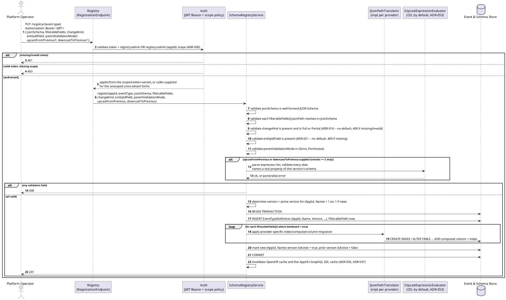
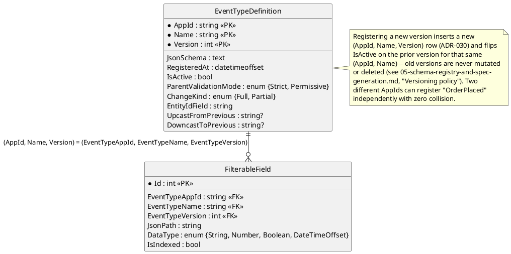

# Feature: Schema registry

Context: full lifecycle in `../05-schema-registry-and-spec-generation.md`
(that doc's own banner notes it's still written in terms of the pre-
`ADR-037` OData listing surface and the pre-`ADR-050` singular claim
fields — this feature doc follows the current mechanism instead, per
`docs/data/schema-registry.md`); entities in `../02-data-model.md` and `../data/schema-registry.md`
(ground truth for this doc's field shapes); per-field indexing in
`../04-odata-filter-pushdown.md`; auth requirements in
[`auth.md`](auth.md). Registration (`PUT /registry/{event-type}`,
`GET /registry/{event-type}`, `GET /registry/{event-type}/{version}`) is
still plain OpenAPI/REST, unaffected by `ADR-037` — only the *listing*
endpoint moved to GraphQL: `eventTypes(first: Int, after: String)` and
`eventType(name: ..., version: ...)`, cursor-paginated fields on the same
Gateway every other query goes through (`ADR-037`, `03-api-contracts.md`
"Registry listing — GraphQL query field"), replacing the old `QUERY
/registry` with OData `$top`/`$skip` (`ADR-012`). `EventTypeDefinition`'s
key is `(AppId, Name, Version)`, not just `(Name, Version)` (`ADR-030`) —
two independent applications can register a type named `OrderPlaced`
with completely different shapes/claims/`ChangeKind` and never collide,
because they're different rows entirely; `AppId` is resolved from the
caller's `registry:admin:{appId}` scope (or the unscoped, cross-tenant
`registry:admin`), never a body field. `ChangeKind` (`ADR-016`) and
`EntityIdField` (`ADR-021`) are both required registration fields with no
default — `UpcastFromPrevious`/`DowncastToPrevious` (`ADR-018`/`ADR-028`)
are optional, meaningful only for version `>= 2`, and evaluated via a
pluggable `IUpcastExpressionEvaluator` (CEL by default, `ADR-053`) since
`ADR-037` removed OData `compute()` expressions from this design
entirely. Out of scope: the merge semantics `ChangeKind` actually drives
at fold time (`ADR-016`, `docs/features/cqrs-projections.md`), and
`RequiredClaims` registration/enforcement — a separate field on the same
entity, covered by [`auth.md`](auth.md) and
[`event-security.md`](event-security.md), not re-derived here.

## Sequence diagram



## Data model (ER diagram)



This is the one relationship in the whole data model that's a real,
DB-enforced foreign key end to end — both sides are hand-authored at
registration time, unlike `StoredEvent`'s soft references to this table
(see [`publish-event.md`](publish-event.md),
[`follow-subscribe.md`](follow-subscribe.md)). Full column list (`RejectionBehavior`,
`RequiredSignature`, `DeprecatedAt`, and the rest) is in
`../data/schema-registry.md` — this diagram shows only what registration's
own scenarios below actually touch.

## Salt (UI mockup)

Not applicable — no admin UI is in scope for v1; the registry is an API only
(see `../README.md`, "What this system deliberately is not").

## Gherkin

```gherkin
Feature: Schema registry
  As a platform operator
  I want to register event types with their JSON Schema and filterable fields
  So that publishers and followers have a single, versioned source of truth

  # Every request in this file carries a Bearer token scoped to
  # registry:admin:demo (AppId "demo") unless a scenario says otherwise.
  # See auth.md for authentication/authorization behavior itself, and
  # ADR-030 for the AppId-scoped vs. unscoped registry:admin distinction.

  Scenario: Registering a new event type creates version 1
    When I PUT "/registry/OrderPlaced" with body:
      """
      {
        "jsonSchema": { "type": "object", "properties": { "Amount": { "type": "number" } }, "required": ["Amount"] },
        "filterableFields": [ { "jsonPath": "$.Amount", "dataType": "Number", "isIndexed": true } ],
        "changeKind": "Full",
        "entityIdField": "$.OrderId"
      }
      """
    Then the response status should be 201
    And "demo:OrderPlaced" version 1 should be the active version
    And a database index should exist for "demo:OrderPlaced" field "$.Amount"

  Scenario: Registering the same type name under a different AppId creates an independent version 1
    # ADR-030 -- (AppId, Name, Version) is the real key; two applications
    # never collide even with an identical type name and different shapes.
    Given AppId "demo" has "OrderPlaced" version 1 registered with schema:
      """
      { "type": "object", "properties": { "Amount": { "type": "number" } }, "required": ["Amount"] }
      """
    When I PUT "/registry/OrderPlaced" with body, authenticated as AppId "acme":
      """
      {
        "jsonSchema": { "type": "object", "properties": { "TotalCents": { "type": "integer" } }, "required": ["TotalCents"] },
        "filterableFields": [],
        "changeKind": "Partial",
        "entityIdField": "$.OrderRef"
      }
      """
    Then the response status should be 201
    And "acme:OrderPlaced" version 1 should be the active version, independent of "demo:OrderPlaced"

  Scenario: Registering an updated schema creates a new version and deactivates the previous one
    Given "demo:OrderPlaced" version 1 is registered with schema:
      """
      { "type": "object", "properties": { "Amount": { "type": "number" } }, "required": ["Amount"] }
      """
    When I PUT "/registry/OrderPlaced" with body:
      """
      {
        "jsonSchema": { "type": "object", "properties": { "Amount": { "type": "number" }, "Status": { "type": "string" } }, "required": ["Amount"] },
        "filterableFields": [ { "jsonPath": "$.Amount", "dataType": "Number", "isIndexed": true } ],
        "changeKind": "Full",
        "entityIdField": "$.OrderId",
        "upcastFromPrevious": "Amount, 'Unknown' as Status",
        "downcastToPrevious": "Amount"
      }
      """
    Then the response status should be 201
    And "demo:OrderPlaced" version 2 should be the active version
    And "demo:OrderPlaced" version 1 should remain readable but inactive

  Scenario: Registering without a required changeKind or entityIdField is rejected
    # ADR-016/ADR-021 -- unlike parentValidationMode, neither has a safe default.
    When I PUT "/registry/OrderPlaced" with body:
      """
      {
        "jsonSchema": { "type": "object", "properties": { "Amount": { "type": "number" } }, "required": ["Amount"] },
        "filterableFields": []
      }
      """
    Then the response status should be 400

  Scenario: Registering a filterable field whose path does not exist in the schema is rejected
    When I PUT "/registry/OrderPlaced" with body:
      """
      {
        "jsonSchema": { "type": "object", "properties": { "Amount": { "type": "number" } }, "required": ["Amount"] },
        "filterableFields": [ { "jsonPath": "$.DoesNotExist", "dataType": "String", "isIndexed": false } ],
        "changeKind": "Full",
        "entityIdField": "$.OrderId"
      }
      """
    Then the response status should be 400

  Scenario: Fetching the currently active schema for an event type
    Given "demo:OrderPlaced" version 1 is registered with schema:
      """
      { "type": "object", "properties": { "Amount": { "type": "number" } }, "required": ["Amount"] }
      """
    When I GET "/registry/OrderPlaced"
    Then the response status should be 200
    And the response body should equal the registered schema for version 1

  Scenario: Registering a schema regenerates the OpenAPI document and this AppId's GraphQL schema
    When I PUT "/registry/OrderPlaced" with body:
      """
      {
        "jsonSchema": { "type": "object", "properties": { "Amount": { "type": "number" } }, "required": ["Amount"] },
        "filterableFields": [],
        "changeKind": "Full",
        "entityIdField": "$.OrderId"
      }
      """
    Then "/openapi.json" should include a path "/publish/OrderPlaced"
    And AppId "demo"'s GraphQL schema should include a Subscription field "onOrderPlaced"

  Scenario: Listing registered event types via the GraphQL registry-listing query (ADR-037)
    Given AppId "demo" has "OrderPlaced", "OrderCancelled", "PaymentReceived" each registered with a minimal schema
    When I QUERY "/graphql" with document:
      """
      query { eventTypes(first: 2) { name version isActive } }
      """
    Then the response should include exactly 2 event types
    When I QUERY "/graphql" with document:
      """
      query { eventTypes(first: 50) { name version isActive } }
      """
    Then the response should include all 3 event types
```
