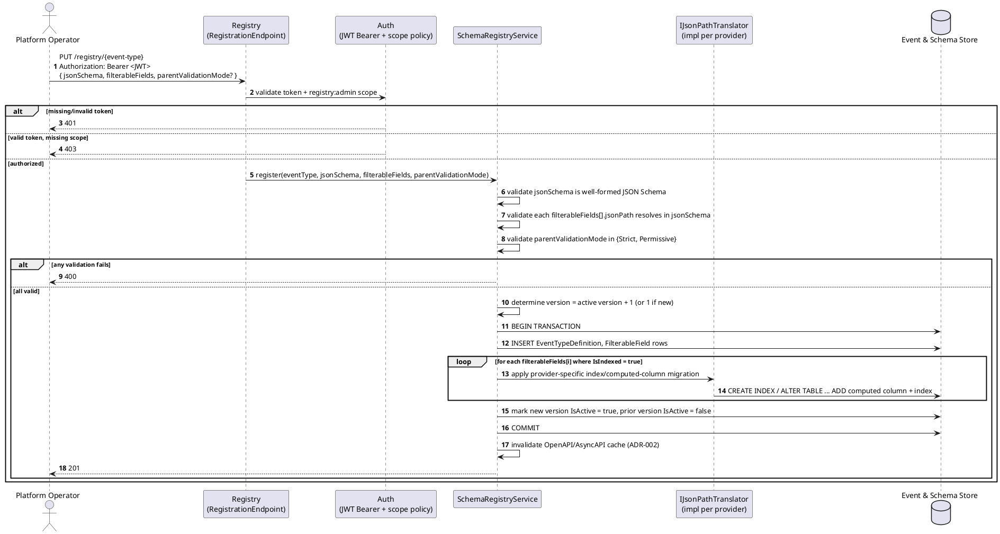

# Feature: Schema registry

Context: full lifecycle in `../05-schema-registry-and-spec-generation.md`;
entities in `../02-data-model.md`; per-field indexing in
`../04-odata-filter-pushdown.md`; auth requirements in
[`auth.md`](auth.md).

## Sequence diagram



## Salt (UI mockup)

Not applicable — no admin UI is in scope for v1; the registry is an API only
(see `../README.md`, "What this system deliberately is not").

## Gherkin

```gherkin
Feature: Schema registry
  As a platform operator
  I want to register event types with their JSON Schema and filterable fields
  So that publishers and followers have a single, versioned source of truth

  # Every request in this file carries a Bearer token with the registry:admin
  # scope unless a scenario says otherwise. See auth.md for authentication/
  # authorization behavior itself.

  Scenario: Registering a new event type creates version 1
    When I PUT "/registry/OrderPlaced" with body:
      """
      {
        "jsonSchema": { "type": "object", "properties": { "Amount": { "type": "number" } }, "required": ["Amount"] },
        "filterableFields": [ { "jsonPath": "$.Amount", "dataType": "Number", "isIndexed": true } ]
      }
      """
    Then the response status should be 201
    And "OrderPlaced" version 1 should be the active version
    And a database index should exist for "OrderPlaced" field "$.Amount"

  Scenario: Registering an updated schema creates a new version and deactivates the previous one
    Given the event type "OrderPlaced" version 1 is registered with schema:
      """
      { "type": "object", "properties": { "Amount": { "type": "number" } }, "required": ["Amount"] }
      """
    When I PUT "/registry/OrderPlaced" with body:
      """
      {
        "jsonSchema": { "type": "object", "properties": { "Amount": { "type": "number" }, "Status": { "type": "string" } }, "required": ["Amount"] },
        "filterableFields": [ { "jsonPath": "$.Amount", "dataType": "Number", "isIndexed": true } ]
      }
      """
    Then the response status should be 201
    And "OrderPlaced" version 2 should be the active version
    And "OrderPlaced" version 1 should remain readable but inactive

  Scenario: Registering a filterable field whose path does not exist in the schema is rejected
    When I PUT "/registry/OrderPlaced" with body:
      """
      {
        "jsonSchema": { "type": "object", "properties": { "Amount": { "type": "number" } }, "required": ["Amount"] },
        "filterableFields": [ { "jsonPath": "$.DoesNotExist", "dataType": "String", "isIndexed": false } ]
      }
      """
    Then the response status should be 400

  Scenario: Fetching the currently active schema for an event type
    Given the event type "OrderPlaced" version 1 is registered with schema:
      """
      { "type": "object", "properties": { "Amount": { "type": "number" } }, "required": ["Amount"] }
      """
    When I GET "/registry/OrderPlaced"
    Then the response status should be 200
    And the response body should equal the registered schema for version 1

  Scenario: Registering a schema regenerates the OpenAPI and AsyncAPI documents
    When I PUT "/registry/OrderPlaced" with body:
      """
      {
        "jsonSchema": { "type": "object", "properties": { "Amount": { "type": "number" } }, "required": ["Amount"] },
        "filterableFields": []
      }
      """
    Then "/openapi.json" should include a path "/publish/OrderPlaced"
    And "/asyncapi.json" should include a channel "/follow/OrderPlaced"
```
