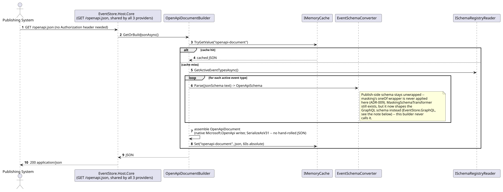
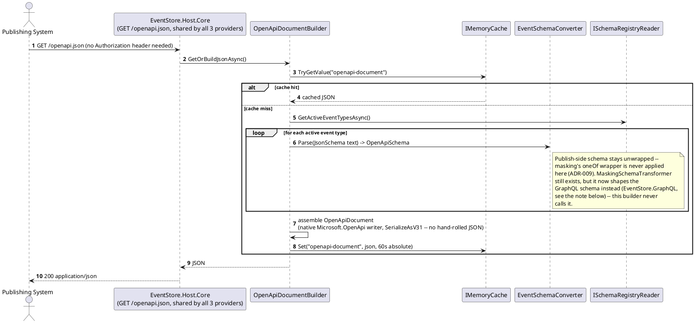
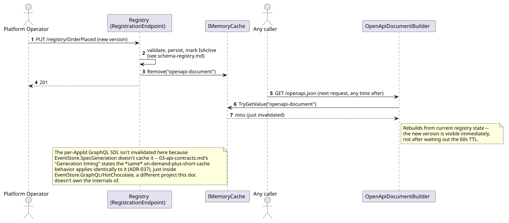
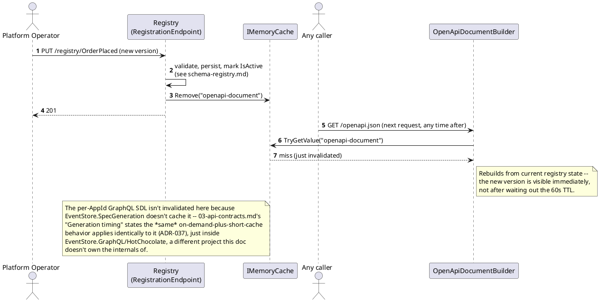
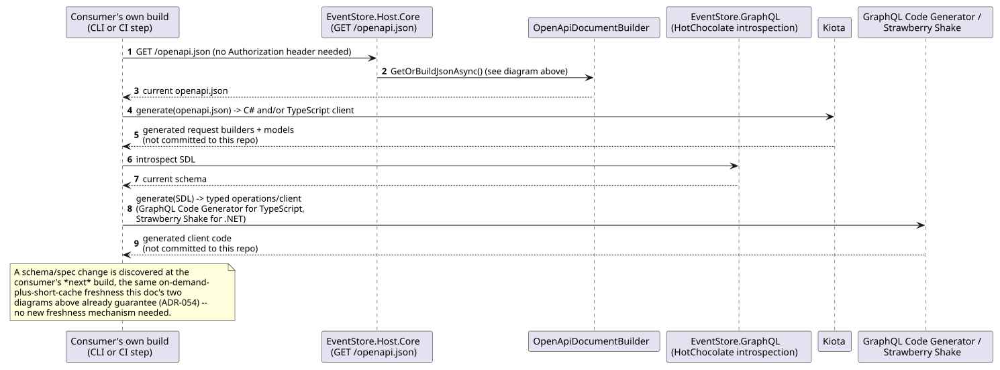
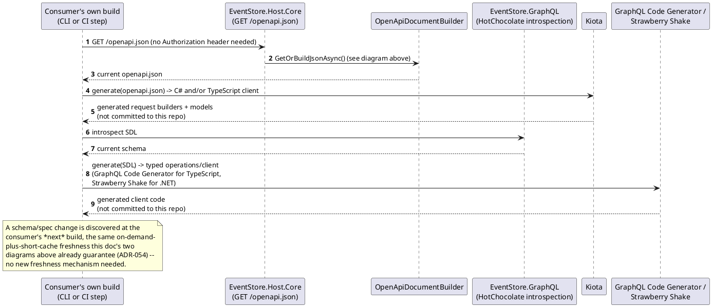

# Feature: Dynamic OpenAPI generation, and the GraphQL SDL HotChocolate serves alongside it

Context: decision and full build mechanism in `ADR-002` (`../07-adrs.md`)
— now covers the **OpenAPI half only**; `ADR-037` superseded the AsyncAPI
half entirely, moving Follow's spec to a GraphQL Subscription whose SDL
HotChocolate serves itself via its own built-in schema-introspection
endpoint, not a second document this project hand-builds. Contract-level
description in `../03-api-contracts.md` ("Generation timing", "OpenAPI
(publish side) — unchanged by `ADR-037`", and "GraphQL schema shape
(masking)" under "Follow — GraphQL Subscription over SSE"); DI wiring and
code sketches (preserved pre-`ADR-037`, for reference only) in
`../06-solution-structure.md` ("Spec generation — one shared schema model,
two document builders" — that section carries its own banner marking the
`AsyncApiDocumentBuilder` half superseded); cache invalidation step in
`../05-schema-registry-and-spec-generation.md`. Depends on
[`schema-registry.md`](schema-registry.md) (there's nothing to generate
from an empty registry). **Not** dependent on `masking.md`'s `x-masking`
extension the way this doc previously was: that wrapper is still real
(`MaskingSchemaTransformer`, `ADR-057`), but now it shapes the **GraphQL**
schema (`EventStore.GraphQL`, per `03-api-contracts.md`'s "GraphQL schema
shape (masking)") rather than a second document `EventStore.SpecGeneration`
itself builds — OpenAPI's publish-side schema stays unwrapped either way
(`ADR-009`). `EventStore.SpecGeneration` keeps only `OpenApiDocumentBuilder`
now.

## Sequence diagram — building and caching the OpenAPI document





**The GraphQL SDL is not diagrammed here as a second document build** —
`EventStore.SpecGeneration` doesn't own it. HotChocolate composes
`EventStore.GraphQL`'s per-`AppId` schema (`ADR-030`/`ADR-037`) directly
from `ISchemaRegistryReader.GetActiveEventTypesAsync()` and serves it via
its own built-in introspection endpoint — the same registry-reading
dependency as the diagram above, but no `EventStore.SpecGeneration`
class in the sequence, and no second hand-built envelope to maintain.

## Sequence diagram — registration invalidates the OpenAPI cache (and the GraphQL schema is independently always current)





## Client SDK generation (ADR-054)

`ADR-054` adds no new server-side surface at all — it names a **consumer-
side** tooling story on top of the two contracts this doc already
diagrams above: **Kiota** generates the OpenAPI-side (publish) client, for
both C# and TypeScript, from one `openapi.json`; **GraphQL Code
Generator** (TypeScript) and **Strawberry Shake** (.NET, the same
ChilliCream vendor as the server's own `HotChocolate`) generate the
GraphQL-side (query/subscribe) client from the SDL HotChocolate's
introspection endpoint serves. All three run as part of a *consuming*
application's own build — never committed generated code in this
repository. The framework's only job, already fully covered by the two
sequence diagrams above, is keeping `/openapi.json` and the GraphQL SDL
anonymously fetchable and always current; generation itself happens
entirely outside this system's process boundary.





No new Gherkin scenario is added for this section: every behavior `ADR-
054` depends on (anonymous, always-current `/openapi.json` and GraphQL
SDL) is already covered by this file's existing scenarios above — the
generation step itself runs inside a *consumer's* build, not this
framework's own testable surface, so there is no new behavior of this
framework's own to assert here.

## Data model (ER diagram)

Not applicable as a new diagram — this feature reads `EventTypeDefinition`
exactly as already drawn in [`schema-registry.md`](schema-registry.md) and
adds no entity, column, or relationship of its own. `IMemoryCache` entries
are process memory, not persisted data. Unaffected by `ADR-037` — the
AsyncAPI-to-GraphQL move changed which document gets built, not what's
read to build either one.

## Salt (UI mockup)

Not applicable — `/openapi.json` returns JSON to a caller (which may well
be a UI like Swagger UI or Scalar rendering the document elsewhere, but
that rendering is outside this system's scope). The GraphQL SDL is the
same story one level removed: it's introspectable JSON/SDL text that a
GraphQL IDE (Banana Cake Pop, GraphiQL) can render, but building that IDE
is HotChocolate's concern, not this project's.

## Gherkin

```gherkin
Feature: Dynamic OpenAPI generation, and the GraphQL SDL HotChocolate serves alongside it
  As a publishing or consuming system
  I want /openapi.json and the GraphQL schema to always reflect current registry state
  So that I never integrate against a stale or hand-authored contract

  Background:
    Given the event type "OrderPlaced" version 1 is registered with schema:
      """
      {
        "type": "object",
        "properties": {
          "Amount": { "type": "number" },
          "CustomerTaxId": {
            "type": "string",
            "x-masking": { "requiredClaim": "pii:view", "strategy": "FixedValue", "maskedValue": "***" }
          }
        },
        "required": ["Amount", "CustomerTaxId"]
      }
      """

  Scenario: The OpenAPI document and the GraphQL schema are both readable without a Bearer token
    When I GET "/openapi.json" without an Authorization header
    Then the response status should be 200
    When I send a GraphQL introspection query without an Authorization header
    Then the response status should be 200
    # There is no /asyncapi.json anymore (ADR-037) -- Follow's spec is the
    # GraphQL schema itself, served by HotChocolate's own built-in
    # introspection endpoint, not a second hand-built document.

  Scenario: A maskable property is documented unwrapped on the publish side
    When I GET "/openapi.json"
    Then the schema for "OrderPlaced" should declare "CustomerTaxId" as a plain string, not a wrapper

  Scenario: The same maskable property is documented wrapped in the GraphQL schema
    When I introspect the GraphQL schema
    Then the type for "OrderPlaced.customerTaxId" should be a three-way wrapper { value: String, masked: String, erased: Boolean }
    # MaskingSchemaTransformer still produces this wrapper -- it now shapes
    # the GraphQL schema (EventStore.GraphQL) instead of a hand-built
    # asyncapi.json envelope (ADR-037; see 03-api-contracts.md's "GraphQL
    # schema shape (masking)").

  Scenario: The wrapper appears in the GraphQL schema even before masking's data enforcement is built
    Given IPayloadMasker (Phase 8) has not been implemented yet
    When I introspect the GraphQL schema
    Then "OrderPlaced.customerTaxId" should still resolve to the three-way wrapper type
    # The schema half (MaskingSchemaTransformer) is independent of the data
    # half (IPayloadMasker) -- see ADR-002 and ADR-009. Still true after
    # ADR-037, just expressed as a GraphQL type instead of an AsyncAPI oneOf.

  Scenario: Registering a new version is reflected immediately in the OpenAPI document, not after the cache TTL
    Given I have already requested "/openapi.json" once (populating the cache)
    When the event type "OrderPlaced" version 2 is registered adding property "Currency"
    And I immediately GET "/openapi.json" again
    Then the schema for "OrderPlaced" should include "Currency"

  Scenario: The GraphQL schema is likewise never stale, on the same on-demand-plus-short-cache terms
    Given I have already introspected the GraphQL schema once
    When the event type "OrderPlaced" version 2 is registered adding property "Currency"
    And I immediately introspect the GraphQL schema again
    Then the type for "OrderPlaced" should include a "currency" field
    # 03-api-contracts.md's "Generation timing" states this applies
    # identically to the OpenAPI document and the per-AppId GraphQL SDL
    # (ADR-037) -- EventStore.GraphQL/HotChocolate's own mechanism, not
    # EventStore.SpecGeneration's, but the same freshness guarantee.

  Scenario: An unusual JSON Schema keyword survives the round trip through the shared schema model
    Given the event type "Special" is registered with a schema using "$comment" and a custom "x-example-only" extension
    When I GET "/openapi.json"
    Then the generated schema for "Special" should still contain "$comment" and "x-example-only"
    # Guards against ADR-002's noted fidelity risk: OpenApiSchema.Extensions
    # must carry unrecognized keywords through, not silently drop them.
    # Retargeted from the now-superseded /asyncapi.json -- the underlying
    # claim (OpenApiSchema.Extensions fidelity) is exactly the same one,
    # and OpenAPI is the document that still actually uses this model.
```
