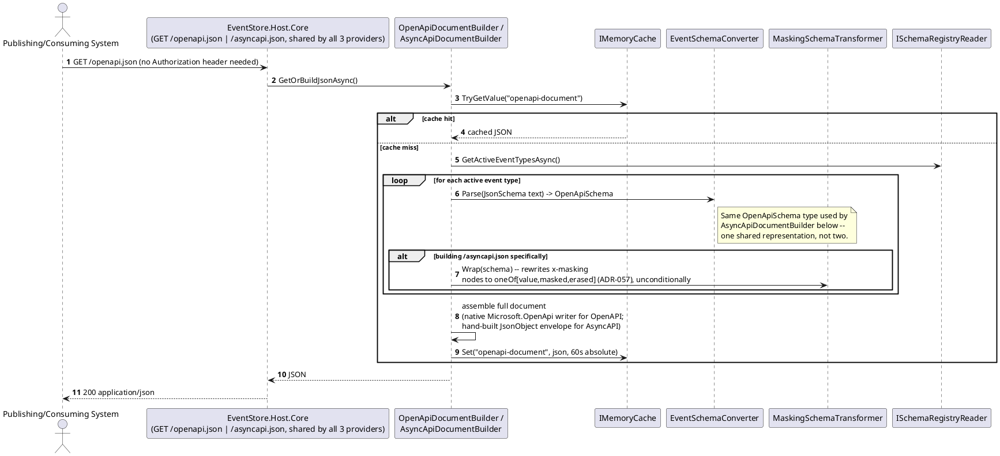
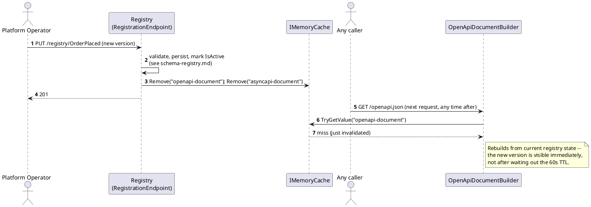

# Feature: Dynamic OpenAPI/AsyncAPI generation

Context: decision and full build mechanism in `ADR-002` (`../07-adrs.md`);
contract-level description in `../03-api-contracts.md` ("Generation
timing", "How each document is actually built", and the "Masking" note
under "AsyncAPI (follow side)"); DI wiring and code sketches in
`../06-solution-structure.md` ("Spec generation — one shared schema model,
two document builders"); cache invalidation step in
`../05-schema-registry-and-spec-generation.md`. Depends on
[`schema-registry.md`](schema-registry.md) (there's nothing to generate
from an empty registry) and, for the masking-wrapper behavior specifically,
on the `x-masking` extension from [`masking.md`](masking.md) — but not on
that feature's runtime enforcement, which is a separate, later phase.

## Sequence diagram — building and caching both documents



## Sequence diagram — registration invalidates both caches



## Data model (ER diagram)

Not applicable as a new diagram — this feature reads `EventTypeDefinition`
exactly as already drawn in [`schema-registry.md`](schema-registry.md) and
adds no entity, column, or relationship of its own. `IMemoryCache` entries
are process memory, not persisted data.

## Salt (UI mockup)

Not applicable — both endpoints return JSON to a caller (which may well be
a UI like Swagger UI or an AsyncAPI Studio rendering the document
elsewhere, but that rendering is outside this system's scope).

## Gherkin

```gherkin
Feature: Dynamic OpenAPI/AsyncAPI generation
  As a publishing or consuming system
  I want /openapi.json and /asyncapi.json to always reflect current registry state
  So that I never integrate against a stale or hand-authored contract

  Background:
    Given the event type "OrderPlaced" version 1 is registered with schema:
      """
      {
        "type": "object",
        "properties": {
          "Amount": { "type": "number" },
          "CustomerTaxId": {
            "type": "string",
            "x-masking": { "requiredClaim": "pii:view", "strategy": "FixedValue", "maskedValue": "***" }
          }
        },
        "required": ["Amount", "CustomerTaxId"]
      }
      """

  Scenario: Both spec documents are readable without a Bearer token
    When I GET "/openapi.json" without an Authorization header
    Then the response status should be 200
    When I GET "/asyncapi.json" without an Authorization header
    Then the response status should be 200

  Scenario: A maskable property is documented unwrapped on the publish side
    When I GET "/openapi.json"
    Then the schema for "OrderPlaced" should declare "CustomerTaxId" as a plain string, not a wrapper

  Scenario: The same maskable property is documented wrapped on the follow side
    When I GET "/asyncapi.json"
    Then the schema for "OrderPlaced" should declare "CustomerTaxId" as oneOf [ { value: string }, { masked: string }, { erased: boolean } ]

  Scenario: The wrapper appears in AsyncAPI even before masking's data enforcement is built
    Given IPayloadMasker (Phase 8) has not been implemented yet
    When I GET "/asyncapi.json"
    Then "CustomerTaxId" should still be documented as oneOf [ { value: string }, { masked: string }, { erased: boolean } ]
    # The schema half (MaskingSchemaTransformer) is independent of the data
    # half (IPayloadMasker) -- see ADR-002 and ADR-009.

  Scenario: Registering a new version is reflected immediately, not after the cache TTL
    Given I have already requested "/openapi.json" once (populating the cache)
    When the event type "OrderPlaced" version 2 is registered adding property "Currency"
    And I immediately GET "/openapi.json" again
    Then the schema for "OrderPlaced" should include "Currency"

  Scenario: An unusual JSON Schema keyword survives the round trip through the shared schema model
    Given the event type "Special" is registered with a schema using "$comment" and a custom "x-example-only" extension
    When I GET "/asyncapi.json"
    Then the generated schema for "Special" should still contain "$comment" and "x-example-only"
    # Guards against ADR-002's noted fidelity risk: OpenApiSchema.Extensions
    # must carry unrecognized keywords through, not silently drop them.
```
