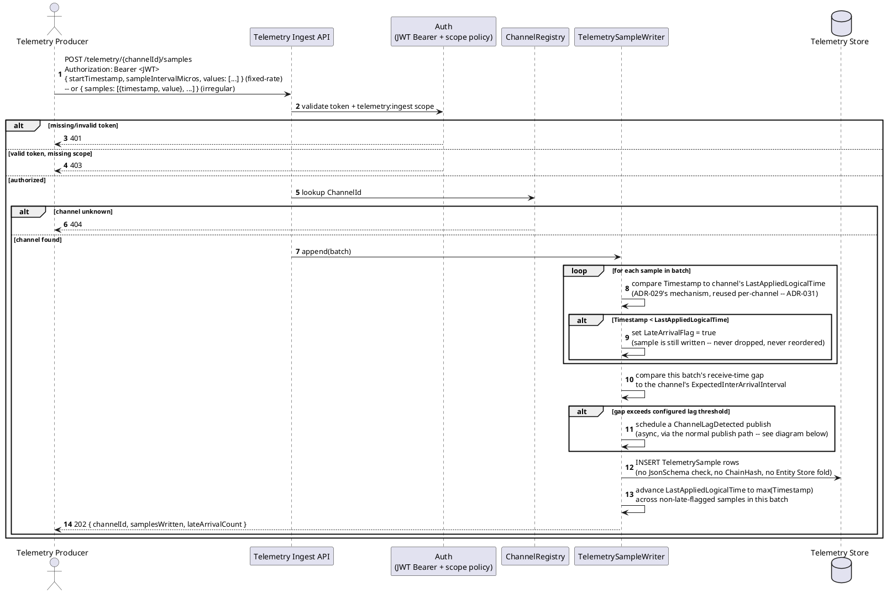
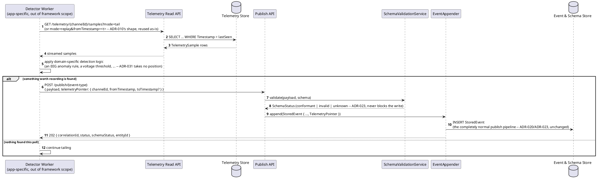
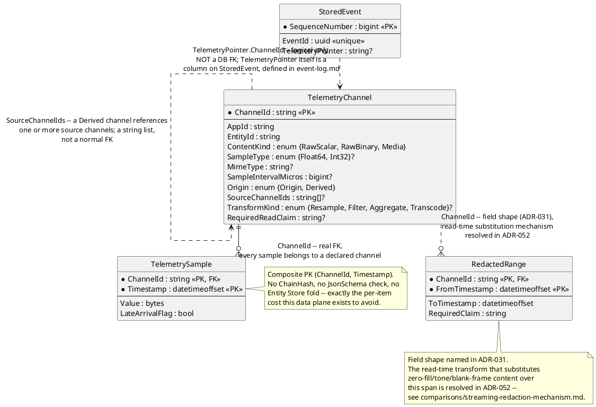

# Feature: Streaming channels (telemetry, audio/video ingestion)

Context: decision record `ADR-031` in `../07-adrs.md`; entities in
`../data/streaming-and-attachments.md`; the `TelemetryPointer` envelope
field on `StoredEvent` is defined in `../data/event-log.md` and takes its
place alongside `parentEventIds` (`ADR-005`, [`event-chains.md`](event-chains.md))
and `MaterializationOfEventId` (`ADR-027`) as a distinct envelope-metadata
relationship — this doc covers only the parts specific to streaming
channels. A detector's published event goes through the completely normal
publish path once it decides to record something — see
[`publish-event.md`](publish-event.md) for that pipeline itself (schema
validation, `ADR-023`'s persist-everything `202`+`SchemaStatus` posture);
this doc only adds the `telemetryPointer` envelope field on top of it.
Auth requirements (new `telemetry:ingest`/`telemetry:read` scopes,
`ADR-006`'s pattern) are in [`auth.md`](auth.md). Pattern write-ups for
the mechanisms this feature reuses rather than invents — streaming
ingestion as a separate fast path, deep-linking via temporal fragment
URIs, seekable playback via byte-range requests — are catalogued in
`../patterns/README.md`'s "Decided, not yet written up as standalone
docs" table. `RedactedRange`'s read-time redaction transform, originally
left unspecified beyond its field shape, is now resolved in `ADR-052`
(read-time, zero-fill/tone/blank-frame default per `ContentKind`, a
configurable `Strategy`) — see `../comparisons/streaming-redaction-mechanism.md`
for the full prior-art search and reasoning.

The `Streaming Channel Service` container appears in
`../01-c4-architecture.md` (its component diagram is flagged there as
still outstanding — the container itself, and everything this doc
describes, is real); build sequencing is Phase 14 in `../08-build-plan.md`.
This is the first feature doc for `ADR-031` — there is no prior version to
supersede, so unlike several other `features/*.md` files this one carries
no stale-scenario banner.

## Sequence diagram — ingesting a batch of samples



## Sequence diagram — a detector publishing a linked event



`TelemetryPointer` is envelope metadata, never `Payload` — the same reasoning
`ADR-005` already established for `parentEventIds`, so it can never collide
with `additionalProperties`/JSON Schema validation.

## Data model (ER diagram)



Full entity set is in `../data/streaming-and-attachments.md`; this diagram
shows only what ingestion, detection, and the redaction shape actually
touch. `Attachment`/`AttachmentRef` (`ADR-032`) are a related but distinct
data plane — discrete binary objects, not a sequenced stream — and are out
of scope for this doc.

## Salt (UI mockup)

Not applicable — this is a data-ingestion/API feature (telemetry ingest,
tail/replay, playback, detector publish) with no UI surface in scope.

## Gherkin

```gherkin
Feature: Streaming channels (telemetry, audio/video ingestion)
  As a telemetry producer, a detector worker, or a playback client
  I want raw signal/media samples ingested and read back on a fast path
  kept separate from the event log
  So that high-frequency signal data never pays for schema validation,
  hash-chaining, or an Entity Store fold it doesn't need -- and a detector
  can still bridge back to an ordinary, fully-validated domain event when
  something in the stream is actually worth recording

  # Every request in this file carries a Bearer token with sufficient scope
  # (telemetry:ingest for ingestion, telemetry:read for tail/replay/playback,
  # events:publish for a detector's published event) unless a scenario says
  # otherwise. See auth.md for authentication/authorization behavior itself.

  Background:
    Given the entity "patient:123" exists (ADR-021)
    And the event type "DizzinessReported" version 1 is registered with schema:
      """
      { "type": "object", "properties": { "Note": { "type": "string" } }, "required": ["Note"] }
      """
    And a "RawScalar" TelemetryChannel "eeg-ch1" is registered for entity "patient:123"
      with SampleType "Float64", SampleIntervalMicros 4000, Origin "Origin"

  Scenario: Registering a new origin channel
    When I PUT "/telemetry/channels/eeg-ch2" with body:
      """
      { "appId": "clinical-app", "entityId": "patient:123", "contentKind": "RawScalar",
        "sampleType": "Float64", "sampleIntervalMicros": 4000, "origin": "Origin" }
      """
    Then the response status should be 201
    And channel "eeg-ch2" should immediately accept ingestion and tail/replay requests

  Scenario: Ingesting a fixed-rate batch omits per-sample timestamps
    When I POST to "/telemetry/eeg-ch1/samples" with body:
      """
      { "startTimestamp": "2026-07-29T10:00:00Z", "sampleIntervalMicros": 4000,
        "values": [0.12, 0.15, 0.11, 0.20] }
      """
    Then the response status should be 202
    And 4 TelemetrySample rows should be written to channel "eeg-ch1"
    And none of those samples should have been JSON-Schema validated, hash-chained, or folded into the Entity Store

  Scenario: A detector publishes an ordinary event carrying a TelemetryPointer
    Given channel "eeg-ch1" has samples spanning "2026-07-29T10:00:00Z" to "2026-07-29T10:00:10Z"
    And a detector tailing channel "eeg-ch1" (mode=tail) notices an anomaly at "2026-07-29T10:00:04Z"
    When the detector POSTs to "/publish/DizzinessReported" with body:
      """
      { "payload": { "Note": "patient reported dizziness" },
        "telemetryPointer": { "channelId": "eeg-ch1", "fromTimestamp": "2026-07-29T10:00:04Z" } }
      """
    Then the response status should be 202
    And the stored event's TelemetryPointer should reference channel "eeg-ch1" at "2026-07-29T10:00:04Z"
    And the stored event should have gone through the normal publish pipeline unchanged, including SchemaStatus

  Scenario: Retrieving a byte range from a Media channel for seekable playback
    Given a "Media" TelemetryChannel "cam-ch1" with MimeType "video/h264" has 30 seconds of ingested chunks
    When I GET "/telemetry/cam-ch1/samples" with header "Range: bytes=1000-1999"
    Then the response status should be 206
    And the response should include a "Content-Range" header
    And the response body should contain exactly the requested byte range

  Scenario: A deep-link temporal fragment resolves to the same window as a TelemetryPointer
    Given a "Media" TelemetryChannel "cam-ch1" has ingested chunks spanning at least 20 seconds
    When I resolve the deep link "/telemetry/cam-ch1#t=10,20"
    Then the resolved window should be equivalent to a TelemetryPointer of
      { "channelId": "cam-ch1", "fromTimestamp": "<start+10s>", "toTimestamp": "<start+20s>" }

  Scenario: A late-arriving sample is flagged, not silently reordered or dropped
    Given channel "eeg-ch1"'s high-water mark (LastAppliedLogicalTime) is "2026-07-29T10:00:10Z"
    When I POST to "/telemetry/eeg-ch1/samples" with a sample timestamped "2026-07-29T10:00:05Z"
    Then the response status should be 202
    And that sample should still be written to channel "eeg-ch1"
    And that sample's LateArrivalFlag should be true
    And channel "eeg-ch1"'s high-water mark should remain "2026-07-29T10:00:10Z"

  Scenario: A slow-uploading producer triggers a ChannelLagDetected event
    Given channel "eeg-ch1" has an ExpectedInterArrivalInterval matching its SampleIntervalMicros
    And the gap since channel "eeg-ch1"'s last received batch already exceeds the configured lag threshold
    When the next batch for channel "eeg-ch1" is finally received
    Then a system-owned "ChannelLagDetected" event should be published
    And that event's TelemetryPointer should reference the last sample actually received before the gap
    And that event's payload should carry the expected vs. actual inter-arrival gap

  Scenario: A derived channel is resampled from its source channel
    Given a "Derived" TelemetryChannel "eeg-ch1-1hz" declares SourceChannelIds ["eeg-ch1"] and TransformKind "Resample"
    And channel "eeg-ch1" has 250 samples at a 4000-microsecond interval spanning 1 second
    When the ChannelDerivationWorker tails channel "eeg-ch1" and applies the "Resample" transform
    Then channel "eeg-ch1-1hz" should contain the resampled output for that 1-second span
    And if channel "eeg-ch1-1hz" were lost or corrupted, it should be fully recoverable by re-deriving from "eeg-ch1"
```
