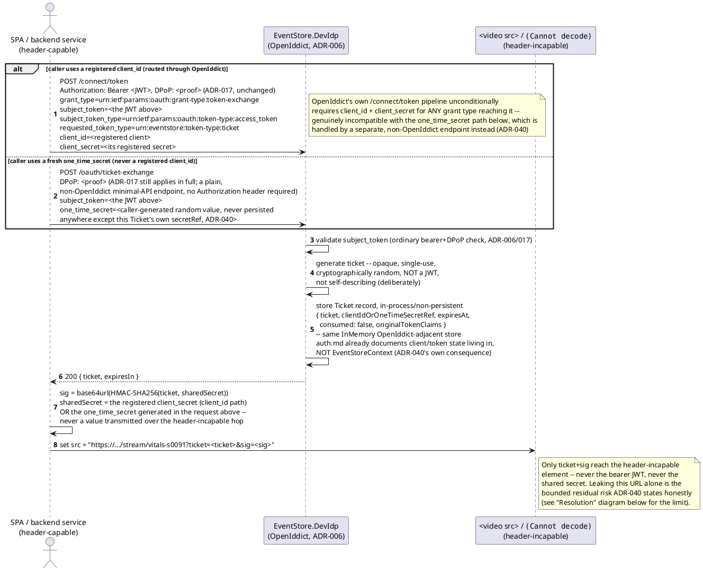
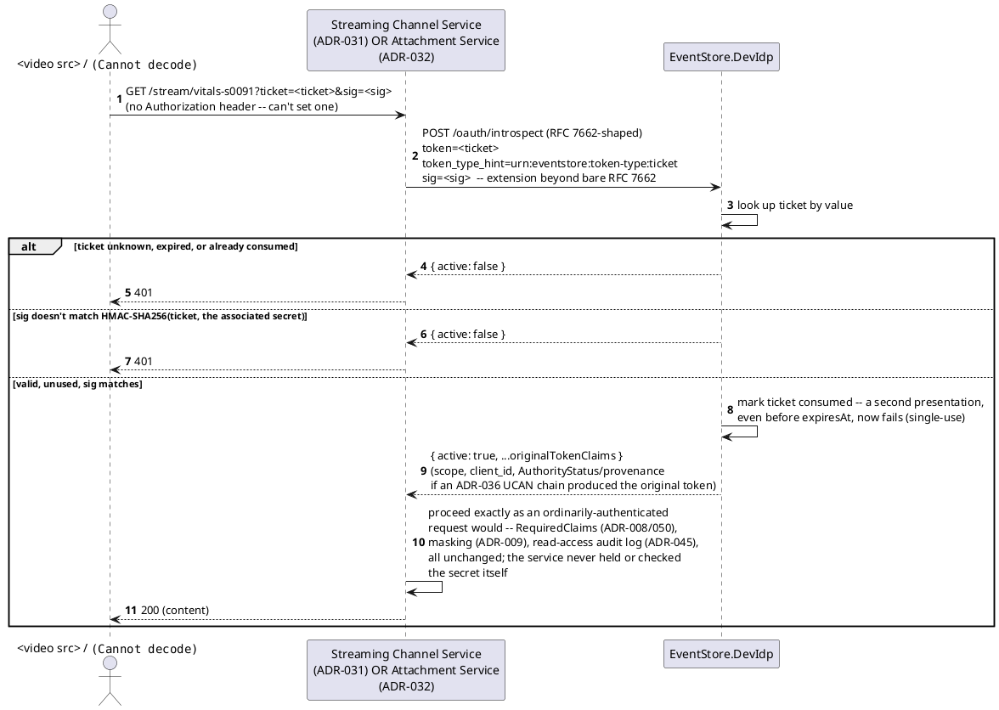
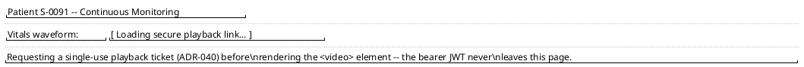
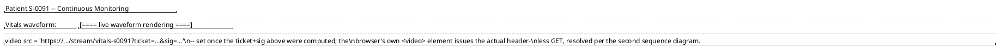

# Feature: Ticket exchange for header-incapable clients

Context: decision record `ADR-040` in
[`../adrs/adr-040-ticket-exchange-headerless-clients.md`](../adrs/adr-040-ticket-exchange-headerless-clients.md);
the general pattern write-up in
[`../patterns/ticket-exchange-headerless-clients.md`](../patterns/ticket-exchange-headerless-clients.md)
(read that first for the CAS/signed-URL/reference-token prior-art
framing — not re-derived here); rotation of the shared secret used for
signing in [`../adrs/adr-093-signing-secret-rotation-dual-signature.md`](../adrs/adr-093-signing-secret-rotation-dual-signature.md);
applied specifically to Streaming Channel playback
([`streaming-channels.md`](streaming-channels.md), `ADR-031`) and
Attachment retrieval ([`binary-attachments.md`](binary-attachments.md),
`ADR-032`) — the two places a URL, not a request this application
controls, is genuinely the only transport. Depends on
[`auth.md`](auth.md) — ticket issuance (step 1 below) is an ordinary,
header-based, DPoP-proved request, authenticated exactly as any other
call; this doc covers only what's specific to the three-hop ticket
mechanism itself.

**This doc deliberately does not re-derive**: DPoP proof validation
(`auth.md`, `ADR-017`) — step 1 is bound by it like any other request;
RFC 8693 Token Exchange's general request/response shape (`ADR-036`,
[`did-ucan-attestation.md`](did-ucan-attestation.md) — step 1 reuses the
identical grant type, only `requested_token_type` differs); how Streaming
Channel playback or Attachment retrieval themselves work once a caller is
authenticated (`streaming-channels.md`/`binary-attachments.md` own that);
`ADR-060`'s webhook-signing HMAC convention (a different direction —
this signs a URL a client presents, `ADR-060` signs a payload this
framework sends — same primitive, opposite direction, not the same
code path).

**Not a general Bearer/DPoP replacement** — every other endpoint keeps
authenticating exactly as `ADR-006`/`ADR-017` already specify. This
mechanism exists only for the two named header-incapable surfaces above.

## Sequence diagram — issue, sign, and hand off to a header-incapable element



## Sequence diagram — resolution at the receiving service



**The receiving service never holds a shared secret and never verifies a
signature itself** — it only ever forwards `ticket`+`sig` to the IdP,
exactly as `ADR-040`'s own consequence states. Once introspection returns
`active: true`, everything downstream (claims checks, masking, audit
logging) runs through the identical pipeline an ordinary Bearer-token
request already goes through — a resolved ticket is not a privileged
bypass of any of it.

## Data model

**No new entity in `EventStoreContext`.** The `Ticket` record (`{ ticket,
clientIdOrOneTimeSecretRef, expiresAt, consumed, originalTokenClaims }`)
lives entirely inside `EventStore.DevIdp`'s own in-process, non-persistent
OpenIddict-adjacent store — the same place `auth.md`'s Data model section
already documents client/token state living, never the event store's own
database. This is a deliberate, stated consequence of `ADR-040`, not an
oversight: a ticket's whole point is being short-lived and single-use, so
there's nothing here that needs the durability guarantees
`EventStoreContext` exists to provide.

**The shared secret used for HMAC signing is likewise not a new entity**
— it's either the caller's already-registered OAuth2 `client_secret`
(`ADR-006`, DevIdp-side state) or a caller-generated `one_time_secret`
that's used for exactly one ticket and never persisted at all.

**Corrected, 2026-08-11**: the paragraph above previously claimed
`ADR-093`'s current+previous rotation support extends to this
`client_secret` path too, "as an instance of ordinary OAuth2 client-
credential rotation (OpenIddict already supports a client holding more
than one valid credential)." That claim was never actually verified
before being written down, and turned out to be false — checked against
OpenIddict's own docs/source/issue tracker while building `ADR-093`:
`OpenIddictApplicationDescriptor.ClientSecret` is a single string per
application, with no built-in multi-secret mechanism. `ADR-093` itself
now says so explicitly (struck through, with the real finding). Zero-
downtime rotation for THIS path's own `client_secret` needed one of: (a)
a custom OpenIddict event handler accepting a locally-stored previous
secret alongside the current one, or (b) registering a second client
application as a temporary stopgap during rotation.

**Built, later pass**: option (a) — `EventStore.DevIdp`'s
`ClientSecretRotationStore` plus a `ValidateTokenRequestContext` pipeline
handler that transparently rewrites a presented previous secret to the
current one before OpenIddict's own built-in check runs, and a matching
dual-secret check in `/oauth/introspect`'s own HMAC verification. See
`ADR-093`'s own Consequences for the concrete mechanism and
`TicketExchangeSecretRotationHttpSqliteTests.cs` for the proof.

## Salt (UI mockup) — the SPA's own flow constructing a header-incapable URL

### Screen 1: Clinician's dashboard, before the video element loads



The SPA (the header-capable caller) makes the token-exchange request from
the first sequence diagram in the background, using the clinician's own
already-established session — nothing here is visible to the clinician
beyond a brief loading state.

### Screen 2: Playback begins, using the signed ticket URL



Clicking away and back (or a page refresh) triggers a fresh
token-exchange request for a new ticket — the consumed one from Screen 1
cannot be reused, by design.

## Gherkin

```gherkin
Feature: Ticket exchange for header-incapable clients
  As a header-capable caller (an SPA or backend service)
  I want to exchange my bearer token for a short-lived, single-use, signed ticket
  So that a header-incapable element (<video src>, ) can authenticate
  without ever carrying my real credential in a URL

  Background:
    Given client "clinician-spa" has scope "telemetry:read" and a registered client_secret
    And "clinician-spa" holds a valid Bearer token with claim "telemetry:read:vitals"

  Scenario: Exchanging a bearer token for a ticket, signing it, and resolving it succeeds
    When "clinician-spa" exchanges its bearer token for a ticket via RFC 8693 Token Exchange
    Then the response should be 200 with a ticket and an expiresIn value
    When "clinician-spa" computes sig = HMAC-SHA256(ticket, its own client_secret)
    And a header-incapable request is made to "/stream/vitals-s0091?ticket=<ticket>&sig=<sig>"
    Then the request should succeed and stream the content
    # The receiving service never saw the client_secret or the original
    # Bearer token -- only ticket+sig, resolved via introspection.

  Scenario: A ticket is single-use -- a second presentation fails even before expiry
    Given "clinician-spa" has already successfully used a ticket once
    When the same ticket+sig is presented again, before expiresIn has elapsed
    Then the request should be rejected with 401
    # Single-use consumption, not the signature, is what bounds a leaked
    # complete URL's replay window (ADR-040's stated residual risk).

  Scenario: A ticket presented with a signature computed from the wrong secret is rejected
    Given "clinician-spa" has a valid, unused ticket
    When the ticket is presented with a signature computed from a different client's secret
    Then the request should be rejected with 401
    # The signature is what stops a forged completion if only the ticket
    # (not the signature) leaked or was guessed -- a different threat than
    # the one single-use consumption bounds; neither property substitutes
    # for the other (ADR-040).

  Scenario: An expired ticket is rejected even if never used
    Given "clinician-spa" has a ticket whose expiresIn has elapsed
    When that ticket+a correctly-computed sig is presented
    Then the request should be rejected with 401

  Scenario: A one-time-secret ticket never requires a registered client_id
    Given "clinician-spa" generates a fresh one_time_secret and exchanges its bearer token for a ticket using that secret instead of a client_id
    When it signs the ticket with that same one_time_secret and presents it
    Then the request should succeed
    # The one_time_secret path exists for a caller that doesn't want to
    # embed a long-lived registered client_secret at all -- generated
    # per-exchange, never persisted, never reused across tickets.

  Scenario: A resolved ticket goes through the same claims/masking/audit pipeline as any other read
    Given "clinician-spa"'s original Bearer token's claims do not include "clearance:phi"
    And the streamed vitals payload has a field masked behind "clearance:phi"
    When a ticket derived from that Bearer token resolves successfully
    Then the streamed content should show that field masked, not the real value
    And an AccessLogEntry should be written for the read (ADR-045)
    # A resolved ticket is not a privileged bypass -- it carries the
    # original token's claims through unchanged, including their limits.
```
