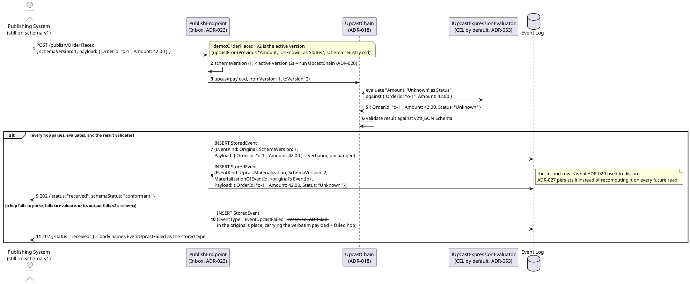
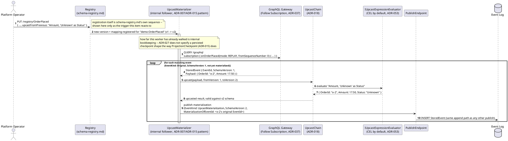
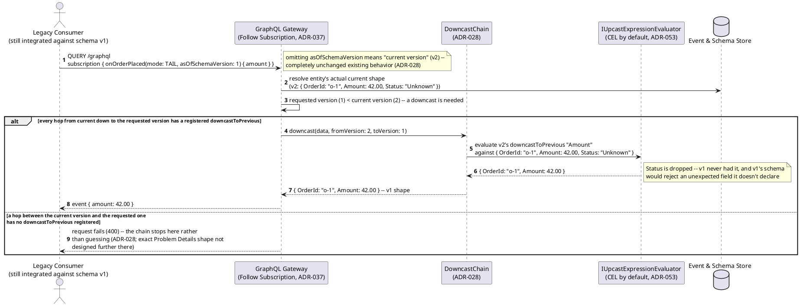
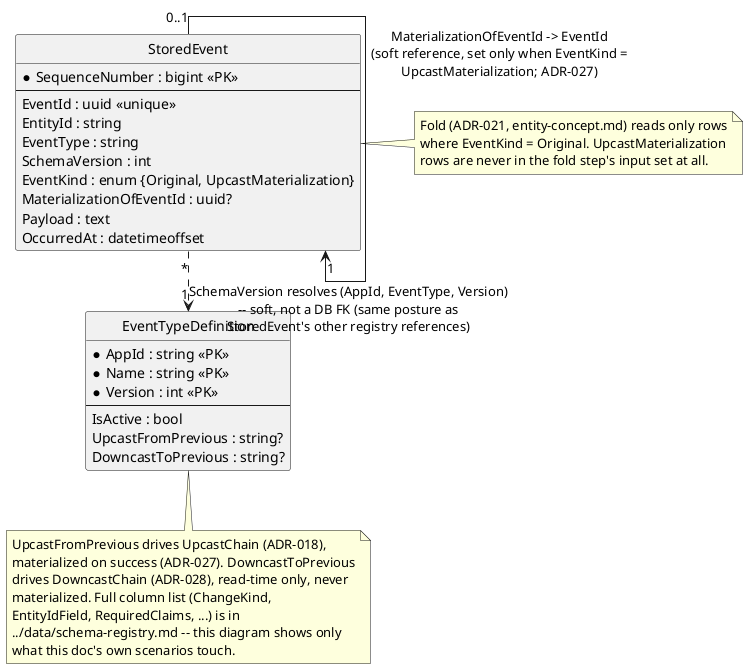

# Feature: Upcast materialization and downcast on retrieval

Context: decision records `ADR-027` (persist a successful lagging-publish
upcast as a new `UpcastMaterialization` event, at publish time or via a
background reconciliation pass over the existing backlog; the Entity
Store fold skips materializations entirely), `ADR-028` (`downcastToPrevious`
— the reverse, current→old direction, read-time only, never persisted,
walked backward hop by hop for an explicitly requested older version),
and `ADR-053` (`IUpcastExpressionEvaluator` is the pluggable seam both
`UpcastChain` and `DowncastChain` evaluate expressions through, CEL the
registered default) in `../07-adrs.md`. `StoredEvent.EventKind`/
`MaterializationOfEventId` and `EventTypeDefinition.UpcastFromPrevious`/
`DowncastToPrevious` are grounded against
[`../data/event-log.md`](../data/event-log.md) and
[`../data/schema-registry.md`](../data/schema-registry.md) respectively —
both already carry these fields; this doc introduces no new persisted
shape of its own (see "Data model" below for why there is deliberately no
separate `UpcastMaterialization` table).

This doc covers only what happens **after** a version + mapping is
already registered — the materialization background job and the
read-time downcast walk. It deliberately does **not** re-derive:
- Registration itself (`PUT /registry/{event-type}` accepting
  `upcastFromPrevious`/`downcastToPrevious`, the registration-time
  parse/alias validation, the `IUpcastExpressionEvaluator` seam being
  resolved via the composition root) — that's
  [`schema-registry.md`](schema-registry.md) in full; this doc starts
  from "a version + mapping is already registered" as a given.
- `UpcastChain`'s live, read-time execution against an `Original` event
  whose `SchemaVersion` is behind the active version — that's `ADR-018`,
  unchanged by this doc, and is what both triggers below invoke rather
  than re-implement.
- Publish-time upcast *validation* and the `EventUpcastFailed` reserved
  dead-letter type on a hop that fails — that's `ADR-020`; the diagram
  below shows only the success path through the same mechanism, since
  materialization only ever happens *after* that validation succeeds.
- `ChangeKind`/`Optional<T>` fold merge semantics, or the Entity Store
  fold step in general — that's [`entity-concept.md`](entity-concept.md);
  this doc only adds the one invariant `ADR-027` layers on top of that
  existing fold (never consume an `UpcastMaterialization` row).
- Follow/GraphQL Subscription transport mechanics (`mode`, `where`
  pushdown, SSE framing) — that's [`follow-subscribe.md`](follow-subscribe.md);
  both the materializer and the downcast example below reuse that
  transport exactly as documented there, not a bespoke path.

## Sequence diagram — publish-time materialization (Trigger 1, `ADR-027`)

A lagging publish (`schemaVersion` behind the active version) already runs
through `UpcastChain` for `ADR-020`'s live compatibility check. `ADR-027`'s
first trigger changes only what happens **on success**: the upcasted
result that `ADR-020` used to discard is now persisted as its own
`UpcastMaterialization` event, immediately, in the same request.



## Sequence diagram — background `UpcastMaterializer` reconciling the existing backlog (Trigger 2, `ADR-027`)

Publish-time materialization alone only covers *future* lagging publishes.
`UpcastMaterializer` is `ADR-027`'s second trigger: it activates whenever a
new schema version + mapping is registered, and catches up every event
already sitting in the log at the now-superseded version. Architecturally
it is "an internal follower," the same pattern `ADR-007`'s derivation
workers and `ADR-015`'s `ProjectionHost` already establish — it tails via
the public Follow API and republishes through the ordinary publish path,
never a private write path of its own.



## The fold-skip invariant (`ADR-027`)

Neither trigger above changes how the Entity Store fold (`ADR-021`,
[`entity-concept.md`](entity-concept.md)) behaves: the fold step continues
to `SELECT`/consume only rows where `EventKind = Original`, running
`UpcastChain` live on them exactly as `ADR-018` already specifies.
`EventKind = UpcastMaterialization` rows are never handed to the fold step
at all — not filtered out by a special case inside the fold, simply never
in its input set to begin with. This is why a materialization can exist
without ever double-applying the same logical change: if it *were* folded,
it would re-apply the original's values — reshaped, but reflecting
whatever the entity looked like at the *original's* fold time — on top of
whatever newer events have since changed those same properties, silently
reverting them.

## Sequence diagram — read-time `downcastToPrevious` walk for an explicitly requested older version (`ADR-028`)

The reverse direction is never materialized — computed fresh, read-time,
every time a consumer explicitly asks for an older shape. `ADR-028` names
`asOfSchemaVersion` on a Follow connection as one concrete carrier for
that explicit request; this diagram reuses
[`follow-subscribe.md`](follow-subscribe.md)'s exact subscription
transport with that one added argument, rather than inventing a new
query surface.



## Data model (ER diagram)

There is deliberately **no separate `UpcastMaterialization` entity or
table.** `ADR-027` adds two fields directly to the existing `StoredEvent`
row (already landed in
[`../data/event-log.md`](../data/event-log.md)): `EventKind` (`Original` |
`UpcastMaterialization`) and `MaterializationOfEventId` (set only on a
materialization row, a soft — not DB-enforced — reference back to the
original's own `EventId`). A materialization is an ordinary row in the
same `StoredEvent` table, published through the same append path as any
other event, not a parallel mechanism. `downcastToPrevious` (`ADR-028`)
never persists anything at all — it has no row of its own to show here.



## Salt (UI mockup)

Not applicable. Trigger 1 is an in-request side effect of an existing
publish call; Trigger 2 is a background worker with no interactive
surface of its own; the downcast walk is a query-time content-negotiation
mechanism aimed at machine consumers pinned to an older schema (`ADR-028`'s
own framing: "a legacy integration... a slow-moving client"), not an
end-user screen. [`mvvm-client.md`](mvvm-client.md)'s client always reads
the current-shape entity through the Gateway's Entity Resolver and never
requests an older `asOfSchemaVersion` — if a future UI ever needed to,
that client doc, not this one, would own the resulting screen.

## Gherkin

```gherkin
Feature: Upcast materialization and downcast on retrieval
  As a consumer of an event type whose schema has evolved
  I want an old-version event upcast once and reused (not recomputed forever)
  And a legacy consumer to be able to ask for current data in an old shape it still understands
  So that replay stays cheap and no consumer is ever forced to upgrade before it's ready

  # Every request carries a Bearer token scoped appropriately for AppId "demo"
  # (events:publish / events:follow) unless a scenario says otherwise -- see
  # auth.md. EntityId format is {appId}:{entityType}:{uniqueId} (ADR-021).

  Background:
    Given "demo:OrderPlaced" version 1 is registered with ChangeKind "Full", EntityIdField "$.OrderId", and schema:
      """
      { "type": "object", "properties": { "OrderId": { "type": "string" }, "Amount": { "type": "number" } }, "required": ["OrderId", "Amount"] }
      """
    And "demo:OrderPlaced" version 2 is registered with schema:
      """
      {
        "type": "object",
        "properties": { "OrderId": { "type": "string" }, "Amount": { "type": "number" }, "Status": { "type": "string" } },
        "required": ["OrderId", "Amount"],
        "upcastFromPrevious": "Amount, 'Unknown' as Status",
        "downcastToPrevious": "Amount"
      }
      """
    # Same registered mapping already exercised in schema-registry.md's own
    # Gherkin -- reused here rather than inventing a second example schema.

  Scenario: A lagging publish that upcasts successfully is materialized immediately (Trigger 1, ADR-027)
    When I POST to "/publish/OrderPlaced" with body:
      """
      { "schemaVersion": 1, "payload": { "OrderId": "o-1", "Amount": 42.00 } }
      """
    Then the response status should be 202
    And the original event should be stored unchanged with EventKind "Original", SchemaVersion 1, and Payload { "OrderId": "o-1", "Amount": 42.00 }
    And a second event should be stored with EventKind "UpcastMaterialization", SchemaVersion 2, MaterializationOfEventId equal to the original event's EventId, and Payload { "OrderId": "o-1", "Amount": 42.00, "Status": "Unknown" }

  Scenario: Registering a new version + mapping materializes the existing backlog (Trigger 2, ADR-027)
    Given an "OrderPlaced" event "e-2" was published for "o-2" with schemaVersion 1 and payload { "OrderId": "o-2", "Amount": 17.50 }, before version 2 existed
    # At publish time there was no v2/mapping yet, so Trigger 1 did not fire for e-2 --
    # this is exactly the backlog UpcastMaterializer exists to catch up.
    When "demo:OrderPlaced" version 2 is registered with upcastFromPrevious "Amount, 'Unknown' as Status"
    Then eventually a materialization event should exist with MaterializationOfEventId "e-2", EventKind "UpcastMaterialization", SchemaVersion 2, and Payload { "OrderId": "o-2", "Amount": 17.50, "Status": "Unknown" }

  Scenario: Fold never consumes a materialization event, so the Entity Store is never double-applied
    Given an "OrderPlaced" event "e-1" was published for "o-1" with schemaVersion 1 and payload { "OrderId": "o-1", "Amount": 42.00 }
    And "e-1" was materialized into an "UpcastMaterialization" event "m-1" at SchemaVersion 2
    When both "e-1" and "m-1" have reached the Entity Store fold step
    Then the EntityStoreRow for "demo:Order:o-1" should be at Version 1, folded from "e-1" alone
    And "m-1" should never have advanced EntityStoreRow's Version a second time
    # If m-1 were folded too, it would re-apply e-1's values on top of whatever
    # later events changed since -- ADR-027's fold-skip invariant is what
    # prevents that, not a coincidence of this scenario's ordering.

  Scenario: An explicitly requested older version returns data downcast to that shape (ADR-028)
    Given an "OrderPlaced" event was published for "o-1" with schemaVersion 1 and payload { "OrderId": "o-1", "Amount": 42.00 }
    And "demo:OrderPlaced" version 2 is the active version
    When a consumer subscribes with document:
      """
      subscription { onOrderPlaced(mode: TAIL, asOfSchemaVersion: 1) { amount } }
      """
    Then the delivered event should have shape { "amount": 42.00 } only
    And it should never include a "status" field, even though v2's current shape has one
    # asOfSchemaVersion omitted would have returned the current (v2) shape
    # unchanged -- downcasting only ever happens on an explicit request.

  Scenario: A downcast hop with no registered downcastToPrevious fails rather than guessing (ADR-028)
    Given "demo:OrderPlaced" version 3 is registered, adding a "Carrier" field, with no downcastToPrevious clause
    And "demo:OrderPlaced" version 3 is now the active version
    When a consumer subscribes with document:
      """
      subscription { onOrderPlaced(mode: TAIL, asOfSchemaVersion: 1) { amount } }
      """
    Then the request should fail with a 400
    # The v3 -> v2 hop has no downcastToPrevious registered, so the chain stops
    # there -- unlike upcasting's "no upcaster -- pass through unchanged"
    # fallback, downcast has no safe pass-through (ADR-028's consequences).
```
