# Feature: Outbound Webhooks

Context: decision record `ADR-060` in `../07-adrs.md` (`WebhookSubscription`,
the durable `WebhookOutbox`/`WebhookDeliveryCursor` primitive, Standard
Webhooks-shaped signing) — see [the Standard Webhooks
specification](https://github.com/standard-webhooks/standard-webhooks/blob/main/spec/standard-webhooks.md)
itself for the header/signing convention this ADR adopts rather than
reinvents; folded in below as its own section, `ADR-093` (the
current+previous signing-secret pair and dual-signature emission during a
rotation window). Data model in
[`../data/schema-registry.md`](../data/schema-registry.md) — `WebhookSubscription`
("Webhook subscriptions" section) and `WebhookOutbox`/`WebhookDeliveryCursor`
("Webhook outbox and delivery cursor" section) — this doc shows only the
columns its own scenarios touch; full column lists live there.
`WebhookOutboxPump` is the leader-elected background worker role named in
`../data/schema-registry.md`'s `LeaderLease` (`ADR-078`) that drains the
outbox; election mechanics themselves are `ADR-078`'s concern, not
re-derived here.

This doc deliberately does **not** re-derive:
- **The `{value}`/`{masked}`/`{erased}` masking wrapper mechanics and
  `IPayloadMasker` itself** (`ADR-009`, `ADR-057`) — see
  [`masking.md`](masking.md). This doc only shows *when* a webhook payload
  is masked (at outbox-enqueue time, against the subscription's own frozen
  claim snapshot) and states the one honest limitation that follows,
  never the transform's own recursion/strategy mechanics.
- **`RequiredClaims`, event-type security, and ordinary Bearer-token
  auth/scopes** (`ADR-006`, `ADR-008`/`ADR-050`) — see
  [`event-security.md`](event-security.md) and [`auth.md`](auth.md).
  Registering/rotating a subscription is shown gated behind an
  illustrative `webhooks:admin` scope, following this design's existing
  scope-naming convention (`registry:admin`, `events:publish`) — `03-api-
  contracts.md` doesn't yet enumerate a webhook-management endpoint at
  all (a propagation gap, not exercised further here), so the exact
  scope name is this doc's own reasonable extrapolation, not a cited
  ADR fact.
- **The general durable outbox/inbox primitive's fault/abend/restart-
  tolerance argument itself** (`ADR-023`'s Inbox, `ADR-033`'s peer-sync
  outbox, `ADR-039`'s client outbox) — no core-engine feature doc owns a
  dedicated write-up of that shared primitive yet, so this doc cites
  `ADR-060`'s own "confirms this really does inherit the primitive"
  reasoning inline rather than inventing a summary of it.
- **The publish/ingestion pipeline and `SchemaStatus`/`AuthorityStatus`
  advisory flags** (`ADR-023`, `ADR-035`) — see
  [`publish-event.md`](publish-event.md) and
  [`non-authoritative-capture.md`](non-authoritative-capture.md). This
  doc picks up *after* an event is already durably stored and folded;
  it doesn't re-show how it got there.
- **`ADR-057`'s crypto-shredding erasure mechanism itself** — see
  `../data/event-log.md` and `event-security.md`'s masking section. This
  doc only shows the *consequence* for an already-enqueued or already-
  delivered webhook payload, per `ADR-060`'s own stated honest
  limitation, never how erasure itself is triggered.

## Sequence diagram — subscription registration (fixed claim snapshot)

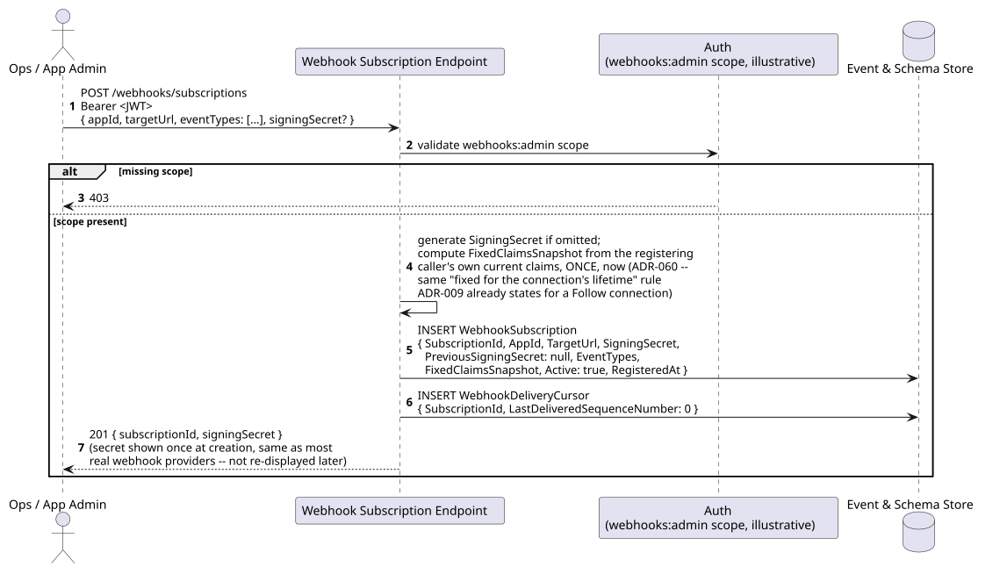

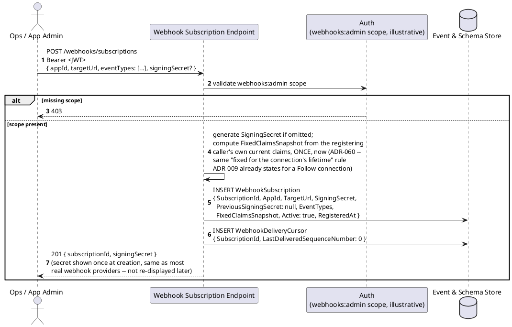

`FixedClaimsSnapshot` is never re-evaluated after this point — if the
registering caller's own claims later change (a role revoked, a new one
granted), this subscription keeps masking against the snapshot taken here,
exactly as `ADR-009` already requires for a live Follow connection.

## Sequence diagram — event delivery, durable outbox, retry/backoff, dead-letter

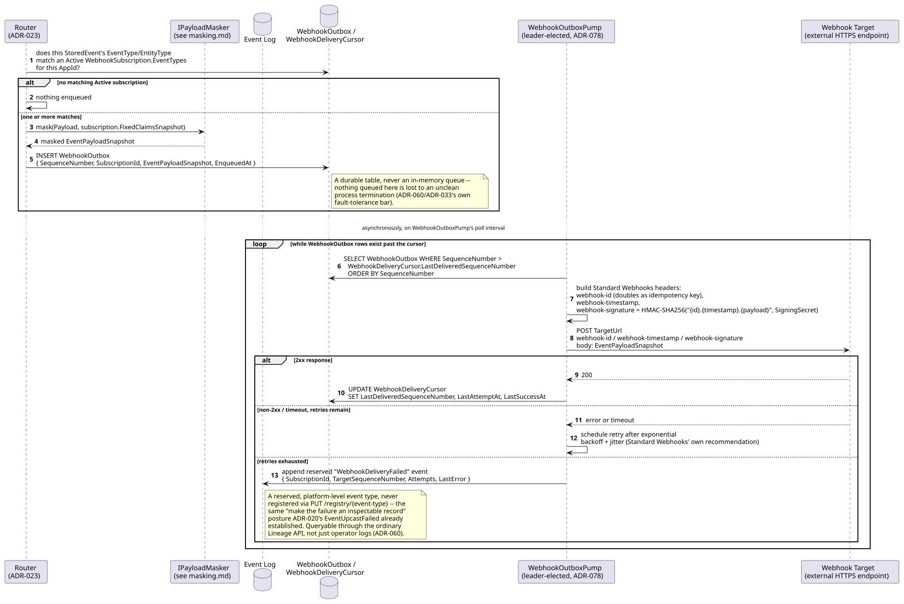

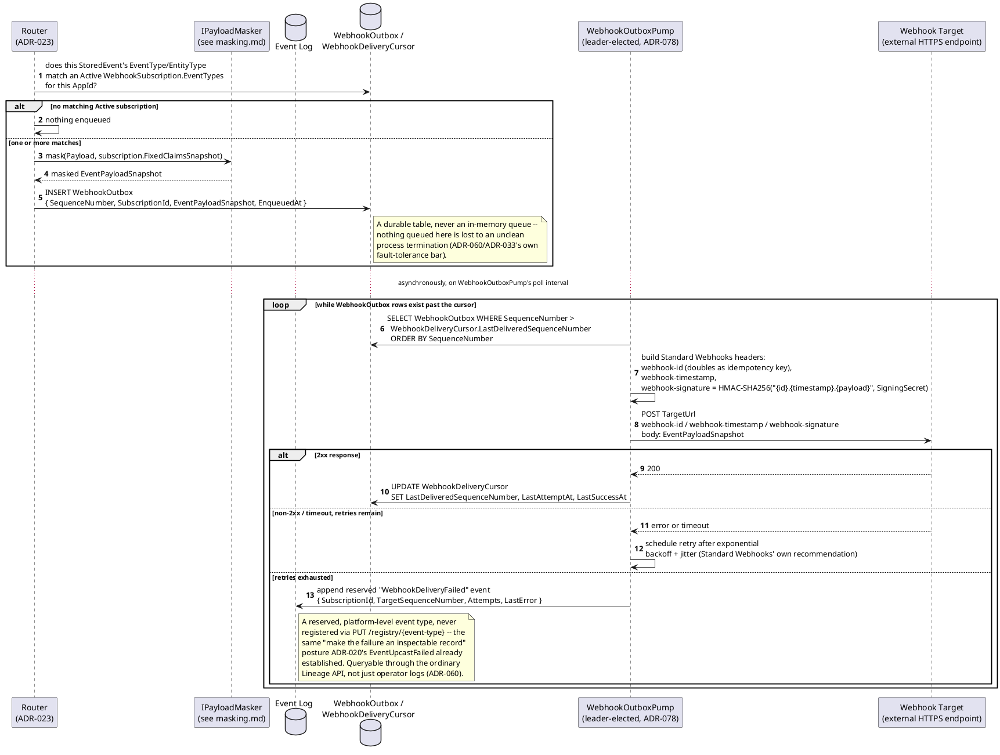

**Honest limitation, stated per `ADR-060`'s own Consequences**: once a
payload has actually left `pump` for `target` with a `2xx` response, this
framework has no further control over that copy. If `ADR-057`'s
crypto-shredding later destroys the key protecting a field that payload
carried, the already-delivered copy is not retroactively reachable. A
*retried* delivery attempted after that erasure — still within this same
retry loop, before the cursor advances past it — correctly re-masks
through `IPayloadMasker` against the now-erased key and carries
`{"erased": true}` for that field; only copies already successfully sent
before the erasure are the real exposure.

## Sequence diagram — signing-secret rotation with dual-signature emission (`ADR-093`)


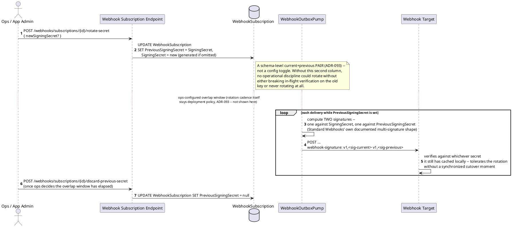

No new signing mechanism is invented for rotation — `ADR-093` uses exactly
the multiple-simultaneous-secret shape the Standard Webhooks spec already
supports, which `ADR-060` had already adopted more fully than it originally
exercised.

## Data model (ER diagram)

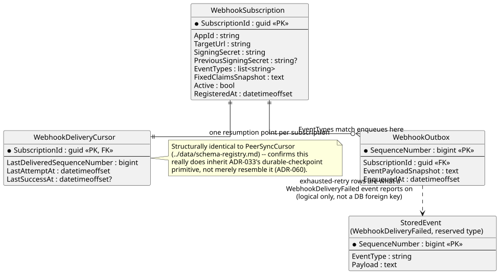

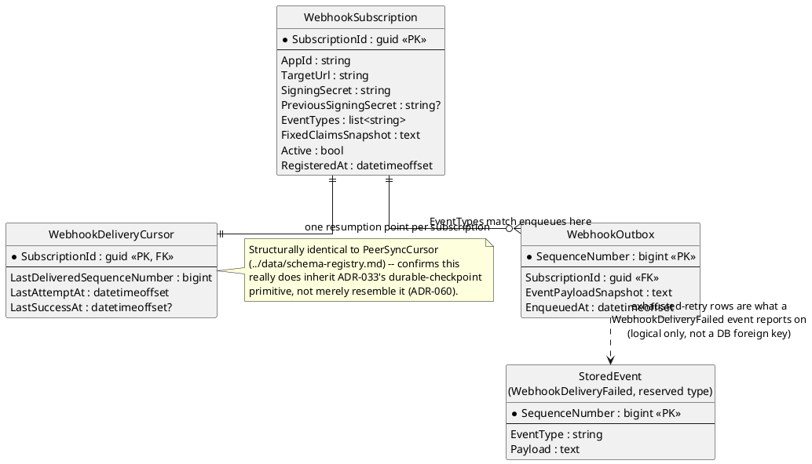

Full column lists are in `../data/schema-registry.md` — this diagram shows
only what registration, delivery, and dead-lettering actually read/write.

## Salt (UI mockup) — registering, monitoring, and inspecting a failed delivery

### Screen 1: Register a webhook subscription

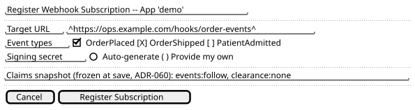

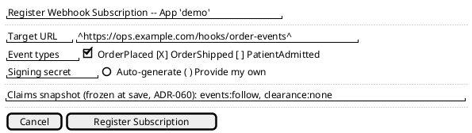

### Screen 2: Subscriptions dashboard

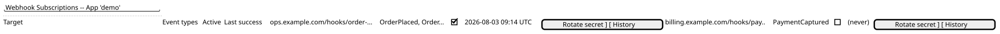

```plantuml
@startsalt
{
  { "Webhook Subscriptions -- App 'demo'" }
  ..
  | Target                          | Event types           | Active | Last success        | .        |
  | ops.example.com/hooks/order-... | OrderPlaced, Order...  | [X]    | 2026-08-03 09:14 UTC | [ Rotate secret ] [ History ] |
  | billing.example.com/hooks/pay.. | PaymentCaptured        | [ ]    | (never)              | [ Rotate secret ] [ History ] |
}
@endsalt
```

Clicking **Rotate secret** dispatches `ADR-093`'s rotation flow (Screen 1's
sequence diagram above, "signing-secret rotation" diagram); clicking
**History** opens Screen 3 for that subscription.

### Screen 3: Delivery history, including a dead-lettered event

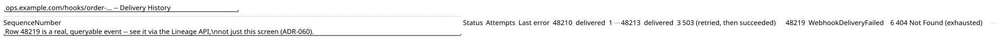

```plantuml
@startsalt
{
  { "ops.example.com/hooks/order-... -- Delivery History" }
  ..
  | SequenceNumber | Status         | Attempts | Last error                  |
  | 48210          | delivered      | 1        | --                          |
  | 48213          | delivered      | 3        | 503 (retried, then succeeded) |
  | 48219          | WebhookDeliveryFailed | 6 | 404 Not Found (exhausted) |
  ..
  "Row 48219 is a real, queryable event -- see it via the Lineage API,\nnot just this screen (ADR-060)."
}
@endsalt
```

## Gherkin

```gherkin
Feature: Outbound Webhooks
  As a hosting team
  I want to register a webhook subscription and have matching events delivered reliably
  So that a consumer doesn't need to hold an open Follow connection to be notified

  # Every admin request below carries a Bearer token with the webhooks:admin
  # scope (illustrative, see this doc's Context) unless a scenario says
  # otherwise. Delivery itself is a background process, not gated by a
  # caller's own token at all.

  Background:
    Given app "demo" has registered event type "OrderPlaced" version 1
    And app "demo" has registered event type "OrderShipped" version 1

  Scenario: Registering a subscription freezes its claim snapshot once, at registration time
    Given the registering caller currently holds claim "clearance" value "none"
    When I POST to "/webhooks/subscriptions" with body:
      """
      { "appId": "demo", "targetUrl": "https://ops.example.com/hooks/order-events", "eventTypes": ["OrderPlaced"] }
      """
    Then the response status should be 201
    And the created subscription's FixedClaimsSnapshot should record claim "clearance" value "none"
    When the registering caller is later granted claim "clearance" value "phi"
    Then the subscription's FixedClaimsSnapshot should still record only "clearance: none"
    # Never re-evaluated after registration -- the same rule ADR-009
    # already applies to a live Follow connection's claims (ADR-060).

  Scenario: A matching event is masked and enqueued into the durable outbox, not an in-memory queue
    Given a subscription targets event type "OrderPlaced" with FixedClaimsSnapshot holding no "clearance" claim
    And "OrderPlaced" has a "CustomerTaxId" property masked behind requiredClaim "clearance:pii"
    When an "OrderPlaced" event is published with body { "Amount": 150.00, "CustomerTaxId": "123-45-6789" }
    Then a WebhookOutbox row should be enqueued for that subscription
    And its EventPayloadSnapshot should carry "CustomerTaxId" as {"masked": "***"}, not the real value
    # Masked at enqueue time, against the FROZEN snapshot -- never a live
    # re-check against the subscriber's current claims (masking.md).

  Scenario: A non-matching event type is never enqueued for that subscription
    Given a subscription targets only event type "OrderPlaced"
    When an "OrderShipped" event is published
    Then no WebhookOutbox row should be enqueued for that subscription

  Scenario: Delivery signs the payload using the Standard Webhooks header shape
    Given a WebhookOutbox row is pending delivery for a subscription with SigningSecret "whsec_test"
    When WebhookOutboxPump attempts delivery
    Then the outbound request should carry headers "webhook-id", "webhook-timestamp", and "webhook-signature"
    And "webhook-signature" should equal the HMAC-SHA256 of "{webhook-id}.{webhook-timestamp}.{payload}" keyed by "whsec_test"

  Scenario: A failed delivery retries with exponential backoff before exhausting
    Given a WebhookOutbox row is pending delivery
    When the target responds 503 on the first two attempts and 200 on the third
    Then the delivery should eventually be recorded as successful
    And each retry should be spaced further apart than the last (backoff + jitter)
    And WebhookDeliveryCursor.LastSuccessAt should be updated only after the successful third attempt

  Scenario: Exhausted retries dead-letter as a queryable WebhookDeliveryFailed event, not a silent failure
    Given a WebhookOutbox row is pending delivery to a target that always responds 404
    When WebhookOutboxPump exhausts its configured retry attempts
    Then a "WebhookDeliveryFailed" event should be appended to app "demo"'s own Event Log
    And that event should be queryable through the ordinary Lineage API
    # Same "make the failure an inspectable record" posture as
    # EventUpcastFailed (ADR-020) -- never just an operator log line.

  Scenario: An already-delivered payload is not retroactively reachable after a later erasure
    Given a WebhookOutbox row for entity "demo:Order:o-1" was delivered successfully before any erasure request
    When entity "demo:Order:o-1"'s "CustomerTaxId" field is later crypto-shredded (ADR-057)
    Then the copy already sent to the webhook target remains exactly as originally delivered
    # Stated as an honest limitation, not glossed over (ADR-060's own
    # Consequences) -- this framework has no further control once sent.

  Scenario: A retry attempted after erasure correctly carries {"erased": true}
    Given a WebhookOutbox row for entity "demo:Order:o-1" has NOT yet been successfully delivered
    And entity "demo:Order:o-1"'s "CustomerTaxId" field is crypto-shredded (ADR-057) before the next retry
    When WebhookOutboxPump retries delivery
    Then the payload sent on this retry should carry "CustomerTaxId" as {"erased": true}

  Scenario: Rotating a subscription's signing secret emits dual signatures during the overlap window (ADR-093)
    Given a subscription's SigningSecret is "whsec_old"
    When I POST to "/webhooks/subscriptions/{id}/rotate-secret" with a new secret "whsec_new"
    Then the subscription's SigningSecret should become "whsec_new"
    And its PreviousSigningSecret should become "whsec_old"
    When a delivery is attempted while PreviousSigningSecret is still set
    Then the "webhook-signature" header should carry two signatures, one valid against "whsec_new" and one valid against "whsec_old"

  Scenario: Discarding the previous secret ends the overlap window
    Given a subscription's PreviousSigningSecret is "whsec_old", per a prior rotation
    When I POST to "/webhooks/subscriptions/{id}/discard-previous-secret"
    Then the subscription's PreviousSigningSecret should become null
    When a delivery is attempted afterward
    Then the "webhook-signature" header should carry only one signature, valid against the current secret
    # How long the overlap window lasts before this is called is ops
    # policy, not a framework-enforced timer (ADR-093).
```
