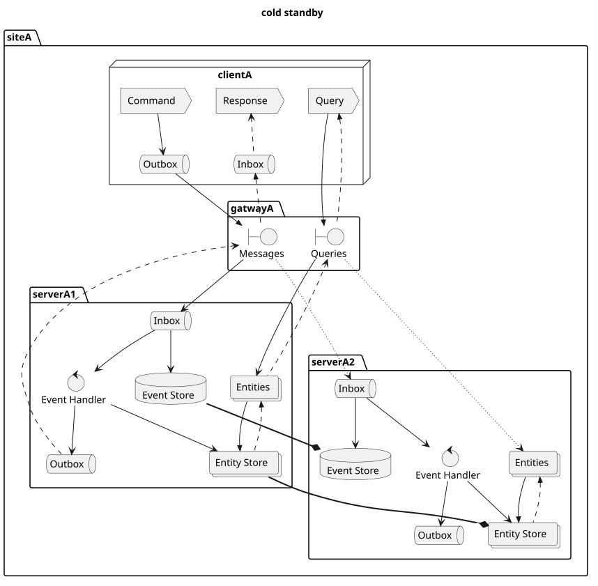
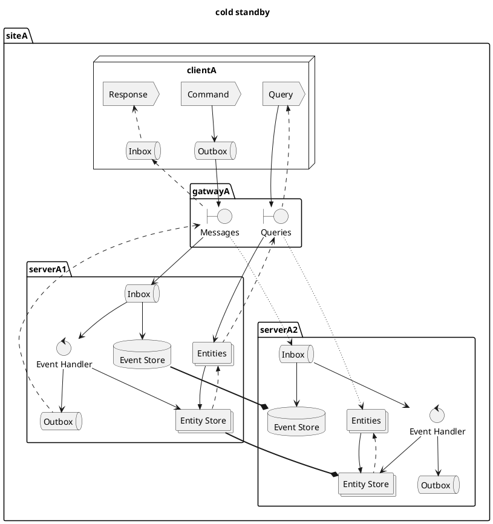

# Event Sourcing

## Overview

```plantuml
@startuml
title cold standby

package siteA {
    node clientA {
        queue inboxClientA as "Inbox"
        queue outboxClientA as "Outbox"

        action queryClientA as "Query"
        action commandClientA as "Command"
        action responseClientA as "Response"
    }
    
    package gatwayA{
        boundary messageGatewayA as "Messages"
        boundary queryGatewayA as "Queries"
    }

    package serverA1 {
        queue inboxServerA1 as "Inbox"
        queue outboxServerA1 as "Outbox"

        control handlerA1 as "Event Handler"
        collections entitiesA1 as "Entities"

        database eventStoreA1 as "Event Store"
        collections entityStoreA1 as "Entity Store"
    }    

    package serverA2 {
        queue inboxServerA2 as "Inbox"
        queue outboxServerA2 as "Outbox"

        control handlerA2 as "Event Handler"
        collections entitiesA2 as "Entities"

        database eventStoreA2 as "Event Store"
        collections entityStoreA2 as "Entity Store"
    }
}

commandClientA --> outboxClientA
responseClientA <.. inboxClientA
queryClientA -->> queryGatewayA
queryClientA <<.. queryGatewayA
outboxClientA -->> messageGatewayA
inboxClientA <<.. messageGatewayA

messageGatewayA --> inboxServerA1
messageGatewayA <.. outboxServerA1
queryGatewayA --> entitiesA1
queryGatewayA <.. entitiesA1
inboxServerA1 --> handlerA1 
inboxServerA1 --> eventStoreA1 
entitiesA1 -->> entityStoreA1
entitiesA1 <<.. entityStoreA1
handlerA1 --> outboxServerA1
handlerA1 --> entityStoreA1

messageGatewayA ~~> inboxServerA2
queryGatewayA ~~> entitiesA2
inboxServerA2 --> handlerA2 
inboxServerA2 --> eventStoreA2
entitiesA2 -->> entityStoreA2
entitiesA2 <<.. entityStoreA2
handlerA2 --> outboxServerA2
handlerA2 --> entityStoreA2

eventStoreA1 ==* eventStoreA2
entityStoreA1 ==* entityStoreA2

@enduml
```