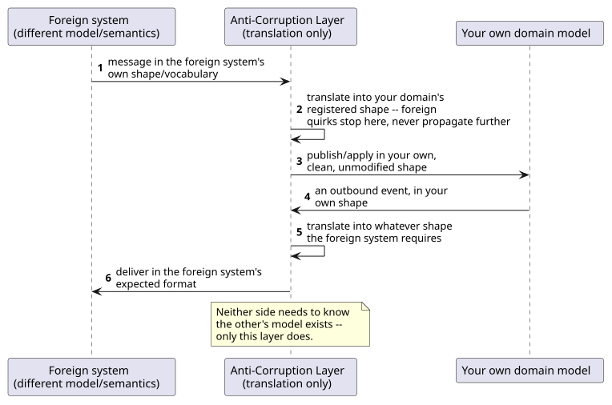
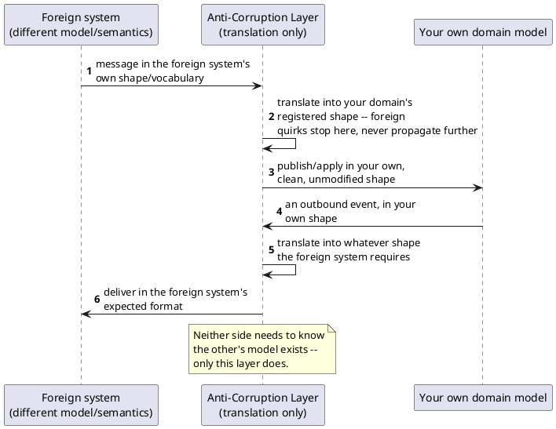

[← Pattern index](README.md)

# Anti-Corruption Layer

## The pattern

Place an isolating, translating layer between two subsystems that don't
share the same data model or semantics, so that integrating with the
foreign one never leaks its shape, quirks, or quality problems into your
own domain model. **Source:** Eric Evans —
*Domain-Driven Design: Tackling Complexity in the Heart of Software*
(Addison-Wesley, 2003), which coined the term for exactly this shape at a
bounded-context boundary; see also
[Azure Architecture Center — Anti-Corruption Layer pattern](https://learn.microsoft.com/en-us/azure/architecture/patterns/anti-corruption-layer),
which frames it concretely as "implement a façade or adapter layer
between a modern application and a legacy system" so that "dependencies
on outside subsystems don't limit an application's design."

The translation runs **both ways** where the integration is bidirectional:
inbound, a message in the foreign system's shape/vocabulary is mapped
into your own domain's model before anything downstream ever sees it;
outbound, your own model is mapped back into whatever shape the foreign
system requires. Either direction, the layer contains *all* of the
translation logic — nothing downstream (or upstream) needs to know the
other system's model exists.

## When you'd reach for it

Any integration with a system you don't control (a legacy platform, an
external regulatory/industry-standard format, a partner's own API) whose
data model, vocabulary, or transport genuinely differs from your own —
especially when adopting that foreign shape directly would force
compromises (obsolete fields, a different transport protocol, inconsistent
naming) into an otherwise cleanly-designed domain model. Not worth it when
the two systems already share close-enough semantics — forcing a
translation layer between models that already agree just adds latency and
a component to maintain for no real isolation benefit.

## Cost

Added latency on every call that crosses the boundary; a whole extra
component to build, deploy, and monitor; and translation logic that must
be actively kept in sync with **both** sides as either one evolves — a
foreign system's format change or your own domain model's evolution both
land here first. Azure's own write-up on the pattern flags the same
trade-offs: scaling the layer itself, deciding whether it needs to cover
every feature of the integration or just a subset, and (if adopted as
part of a migration) deciding whether it's a permanent fixture or
something to retire once the legacy system is gone.

## Also known as

A specific, deliberate application of the general **Adapter pattern**
(Gamma, Helm, Johnson, Vlissides, 1994) at a **bounded-context boundary**
specifically to protect a domain model's integrity — not just "make two
incompatible interfaces callable from one call site" the way a plain
Adapter is used more casually. Also implemented as a **façade** when the
foreign system's surface needs simplifying as well as translating, not
just reshaping.

## How this application uses it

`ADR-072`'s `IInterchangeFormatAdapter` extensibility seam is this
pattern, applied to real, named external interchange standards this
design's proving-ground domains actually need: `Hl7V2Adapter` and
`FhirAdapter` (inbound, hospital EMR integration for the clinical-trials
domain), `IchE2bR3Adapter` (outbound, pharmacovigilance reporting),
`Gs1EpcisAdapter` (outbound, DSCSA pharma-supply-chain trading-partner
exchange) — one keyed-DI-registered implementation per external format,
the same shape every other extensibility seam in this design already
uses (`ADR-041`/`ADR-059`), chosen per integration need, several active
simultaneously.

**Inbound**, an adapter receives a message in the external format,
translates it into this framework's own registered `JsonSchema` shape,
and publishes it through the *ordinary* publish path (`ADR-023`) —
inheriting persist-everything, non-authoritative capture (`ADR-035`, a
reasonable default for EMR-sourced data arriving through an interface
engine this framework doesn't itself operate), and every other publish-
path guarantee automatically, exactly the way this pattern is supposed to
work: nothing downstream of the adapter needs to know HL7v2 or FHIR was
ever involved. **HL7v2 specifically needed its real transport checked,
not assumed** — verified that production HL7v2 interfaces run over MLLP
(TCP), not HTTP, matching
[Google Cloud's own MLLP-to-REST adapter](https://github.com/GoogleCloudPlatform/mllp/)'s
shape rather than inventing a bespoke bridge; FHIR, being RESTful/HTTP-
native already, needs no such bridge.

**Outbound**, an adapter transforms an event already in this framework's
own shape into the external format *before* delivery — composing with
`ADR-060`'s webhook delivery (see the "Webhook delivery with HMAC
signing and retry" row in [the pattern catalog](README.md)) as an extra
transform step ahead of the HTTP `POST`, not a replacement for it.

**Distinct from [Tolerant Reader](tolerant-reader-and-schema-evolution.md),
worth disambiguating explicitly**: Tolerant Reader is about a consumer
being permissive toward *unrecognized parts of an otherwise-expected
shape* from a provider it already has an ongoing relationship with (don't
break when a field is added); Anti-Corruption Layer is about translating
*an entirely different, foreign shape* into your own model at a hard
integration boundary — the two compose (an `IInterchangeFormatAdapter`'s
translated output still lands in this framework's own Tolerant-Reader-safe
publish path), but neither is a special case of the other. This design
relies on the foreign/target format being reasonably representable as its
own JSON Schema shape — an adapter's transform logic is ordinary
application code against `IInterchangeFormatAdapter`'s interface, with no
change needed to `ADR-020`'s schema versioning or `ADR-018`'s upcast chain
for it to work.
