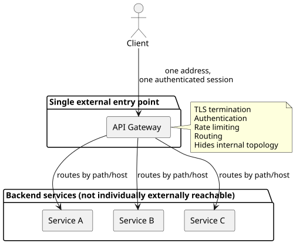
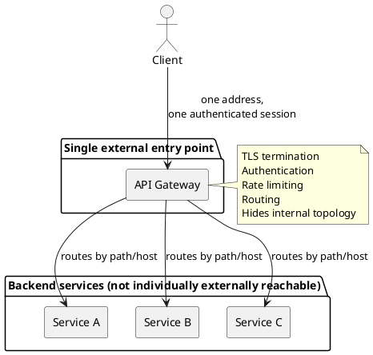

[← Pattern index](README.md)

# API Gateway

## The pattern

Put a single entry point in front of a system built from multiple
independently-addressable backend services, rather than requiring
each caller to know every service's address and talk to them
individually. A client interacts with what looks like one API and one
address; the gateway is what actually knows how many services stand
behind it, and routes each incoming request to the right one. Beyond
routing, a gateway is also the natural place to centralize concerns
that would otherwise be duplicated in every backend service:
TLS termination, authentication, rate limiting, and generally hiding
the internal topology from the outside world. A specific variant,
**Backends for Frontends (BFF)**, deploys a *separate* gateway per
client category (a distinct gateway shaped for a web client versus a
mobile client versus a third-party integrator) rather than one shared
gateway serving every caller identically — a refinement worth naming
even when a system doesn't (yet) need it.

**Source:** [Chris Richardson, microservices.io — "API Gateway / Backends for Frontends" pattern](https://microservices.io/patterns/apigateway.html), part of his broader microservices pattern catalog (also published as *Microservices Patterns*, Manning, 2018).

## Also known as

**Backends for Frontends (BFF)** is the named variant that splits one
shared gateway into several, each tailored to one client category's
own needs — a genuine refinement of this pattern, not a synonym for
it: plain API Gateway is one entry point for every client; BFF is
deliberately more than one, chosen when different client types
actually need meaningfully different response shapes or aggregation
behavior.

## When you'd reach for it

Once a system genuinely exposes more than one independently-addressable
external surface — several distinct services, or one service with
several separately-versioned/separately-authenticated endpoints — and
callers would otherwise need to know and manage all of those addresses
individually. It's also the natural place to add a cross-cutting
concern (TLS termination, a single authentication boundary, rate
limiting) once duplicating that concern into every backend service
individually starts to look wasteful or inconsistent.

## Cost

A gateway is a new moving part that has to be deployed, versioned, and
kept available in its own right — and because every external request
now passes through it, it becomes a potential single point of failure
and a potential performance bottleneck for the entire system if it
isn't itself made redundant. Centralizing authentication at the
gateway also concentrates risk: a gateway misconfiguration or
vulnerability now has blast radius across every backend service behind
it, rather than being contained to one. None of this is a reason to
avoid the pattern once the fan-out it solves is real — it's the
named, permanent operational cost of accepting it.

## How this application uses it

`ADR-049` adopts this pattern using **YARP** (Microsoft's own
reverse-proxy library) in front of every external-facing surface this
design exposes — the GraphQL Gateway (`ADR-037`), attachment retrieval
(`ADR-032`), streaming channel playback (`ADR-031`), ticket
issuance/introspection (`ADR-040`), and OAuth token endpoints
(`ADR-006`) — routed by path/host from one external address, rather
than each `EventStore.Host.<Provider>` remaining separately
addressable as it originally was. `src/EventStore.Gateway/Program.cs`
is the concrete implementation: `AddReverseProxy().LoadFromConfig(...)`
wires YARP's routing from configuration, `AppIdBufferingMiddleware`
plus `UseRateLimiter()` enforce `ADR-058`'s per-tenant rate limiting
*before* a request ever reaches YARP's own forwarding (a rejected
`429` never reaches a backend `Host` at all), and external TLS
termination plus `ADR-006`/`ADR-017`/`ADR-040` authentication happen at
this boundary — the `Authorization` header rides through unchanged to
the backend `Host`, which still performs its own JWT/DPoP validation
independently; the gateway doesn't re-implement that. The gateway
additionally authenticates itself to the backend `Host` via `ADR-048`'s
SPIFFE/SPIRE workload identity (`SpiffePeerIdentity`, the same
mechanism peer-sync already uses, reused under its own SPIFFE ID path)
rather than a second internal-identity mechanism. Explicitly **not** a
Backends-for-Frontends split — `ADR-049` states plainly that nothing in
this design yet has different client categories needing meaningfully
different response shapes, so one shared gateway is the deliberate
choice, revisited only if that changes.
