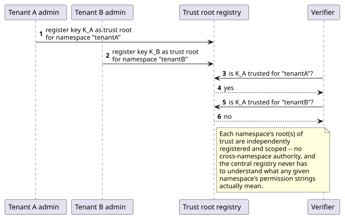
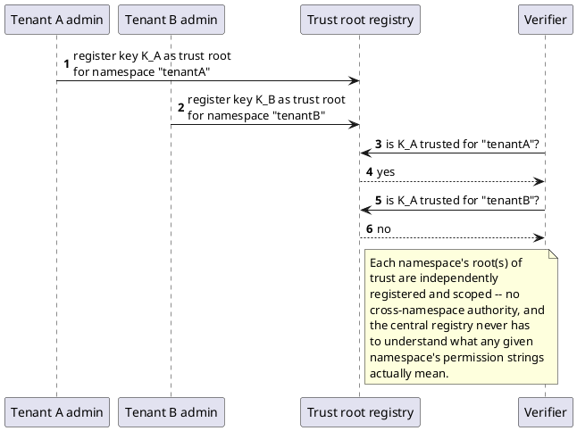

[← Pattern index](README.md)

# Application-Defined Permission Namespaces via Per-Tenant Trust Roots

## The pattern

UCAN delegation chains prove that a capability was validly narrowed
from some root — but the specification deliberately leaves one thing
unresolved, on purpose: it does not define how a verifier learns *which
key counts as the root of trust* for a given capability namespace in
the first place. The spec states this is left to "applications and
deployments to establish out-of-band." **Source:** the UCAN
specification's own scope statement
([ucan.xyz/specification](https://ucan.xyz/specification/)).

This pattern resolves that specific, spec-acknowledged gap by binding
root-of-trust registration to an existing multi-tenant namespacing key:
each tenant (or application) registers its own trusted issuer key(s)
for its own namespace, and a verifier's job becomes "does this
delegation chain verify, *and* does it root in a key registered as
trusted for *this* namespace" — never a single, global root the whole
system shares, and never something the central authority has to
pre-approve the meaning of.

## When you'd reach for it

A system already has a real, existing tenant/application boundary and
wants each tenant to be able to mint its own custom permission
vocabulary — without either (a) forcing every custom permission through
a central authority's registration process, or (b) trusting a single,
system-wide root key whose compromise would let an attacker forge
permissions for every tenant at once.

## Cost

Registering a key as a namespace's trust root is a genuinely
high-consequence action — a wrong or malicious registration hands that
key's holder the ability to mint arbitrary permissions within that
one namespace, for as long as the registration stands. The pattern
itself doesn't solve *who may register a trust root* — that's a
separate, real authorization question the pattern's adopter still has
to answer explicitly (see "How this application uses it" below for how
this project answers it), and getting it wrong doesn't fail loudly; a
bad registration just silently grants standing authority until someone
notices and removes it.

## How this application uses it

`ADR-044` adds `AppTrustRoot { AppId, IssuerDid, Description,
RegisteredAt }` (`src/EventStore.DevIdp/AppTrustRoot.cs`), reusing
`ADR-030`'s existing `AppId` scoping key as the namespace boundary —
each `AppId` may register one or more trusted issuer keys via
`TrustRootService.RegisterAsync`
(`src/EventStore.DevIdp/TrustRootService.cs`), and
`TrustRootService.IsTrustedAsync` is exactly the per-namespace check
`UcanValidator.ValidateAsync` (`src/EventStore.Ucan/UcanValidator.cs`)
calls when a presented delegation carries no proof — the issuer's own
key must be a registered `AppTrustRoot` for the target `AppId`, or
validation fails. Permission/capability strings themselves stay opaque
to the core engine, exactly like `ADR-008`'s existing
`RequiredPublishClaim`/`RequiredReadClaim` shape — the engine verifies
the chain and the registration, never what a capability string means.

The "who may register a trust root" question `ADR-044`'s own
Consequences section flagged is answered in
[`docs/comparisons/trust-root-registration-gate.md`](../comparisons/trust-root-registration-gate.md):
a new `registry:trust-admin` scope, deliberately *not* implied by the
broader `registry:admin` scope, gates registration/de-registration —
matching the same shape AWS IAM, GCP, and Azure AD all converge on for
"establish a new external trust anchor"-class actions (a narrow,
separately-named permission, not bundled into generic admin).
[Delegated, capped, time-boxed access grants](delegated-capped-time-boxed-access-grants.md)'s
own mechanism composes on top unchanged, so a central operator can
extend a capped, `AppId`-scoped slice of `registry:trust-admin` to an
application's own team rather than personally registering every
tenant's trust root by hand. Classical dual-control/Four Eyes approval
for this specific action was examined and explicitly not adopted as a
system-wide requirement — `AppTrustRoot`'s blast radius stays contained
to one `AppId`'s own namespace, unlike a PKI root CA or an AWS account's
federated-identity trust policy.
