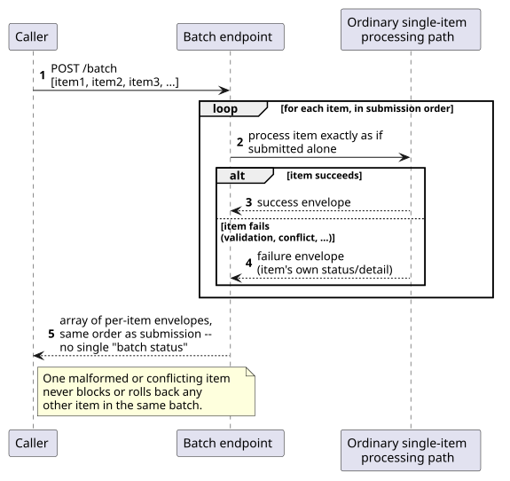
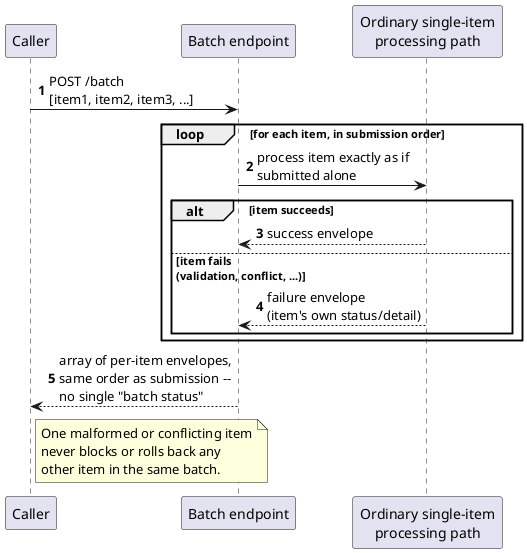

[← Pattern index](README.md)

# Bulk/Batch Operations

## The pattern

Let a caller submit many independent items in a single request instead
of one request per item, purely to cut round trips and per-request
overhead — and then process and report on every item exactly as
independently as if it had been submitted alone. A batch response is
an array of per-item outcomes in submission order, each carrying its
own success/failure status; the batch as a whole never succeeds or
fails atomically just because it arrived together. This is
deliberately *not* a transaction: two items in the same batch have no
guaranteed relationship to each other beyond having shared one HTTP
round trip, and a caller who wants an all-or-nothing guarantee across
several items needs a different, explicitly transactional mechanism —
conflating the two is the mistake this pattern's own design guidance
warns against directly.

**Source:** Google's [AIP-233 — "Batch methods: Create"](https://google.aip.dev/233)
(part of Google's API Improvement Proposals, `google.aip.dev`) is the
concrete, well-documented statement of exactly this shape: a batch
request carrying many independent item-level requests, an optional
partial-success mode, and a response reporting each item's own outcome
individually — with the guide explicitly distinguishing a "simple
passthrough" atomic case from one where "operations... manage complex
resources" and partial success is the more appropriate default.
Microsoft's own [Azure Architecture Center API design guidance](https://learn.microsoft.com/en-us/azure/architecture/best-practices/api-design)
and Google's older bulk HTTP batching convention document the same
transport-efficiency motivation independently, converging on the same
shape from different platforms.

## When you'd reach for it

Whenever callers routinely have many independent items ready to submit
at once and per-request overhead (network round trips, connection
setup, fixed per-request processing cost) is a real, measured cost —
not "might one day be a problem." It fits especially well when the
underlying single-item operation already has well-defined, idempotent,
independent semantics on its own, so wrapping many of them in one
request changes nothing about *what* happens, only *how many round
trips* it takes to make it happen.

## Cost

Because each item is independently processed and reported, a caller
must always inspect the whole per-item response array rather than
treating one HTTP status code as the answer — a batch that returns
`202` overall can still contain individually failed items, and code
that only checks the outer status will silently miss them. It also
tempts a caller (or a future maintainer) to assume the batch is a
transaction it explicitly is not; that assumption has to be corrected
by documentation and response shape, not by the transport mechanism
itself, since nothing about batching stops one item's write from
committing durably while its sibling in the same request fails.
Finally, an unbounded batch size shifts a caller's own overload
problem into one oversized request — a real batch endpoint typically
needs its own size/item-count limit, a concern a single-item endpoint
never has to think about.

## How this application uses it

`ADR-072` adds `POST /publish/batch`, accepting an NDJSON or JSON-array
body of multiple event submissions in one request. It is explicitly
**not** a new persistence model: each event inside the batch still goes
through the exact same persist-everything path every other publish
already uses (`ADR-023`) — its own `SequenceNumber`, `ChainHash`, and
`ADR-011` idempotency check — batching is purely the transport/
efficiency optimization of one HTTP round trip and one database
transaction for N inserts, not a different guarantee. The response is
an array of the same per-event status envelope `ADR-023` already
defines, one per submitted event, in submission order; a batch never
fails or succeeds as a unit, exactly this pattern's own definition.
The implementation lives in `src/EventStore.Inbox/PublishEndpoints.cs`
— the `POST /publish/batch` handler, the `BatchPublishItem` record (one
submission inside a batch request, restating `EventType` per item since
a batch has no single route to carry it), and `BuildBatchItemEnvelope`,
whose own comment states the same rule this pattern's cost section
raises explicitly: "a batch response can only ever carry ONE real HTTP
status... each item inside it carries its own."
