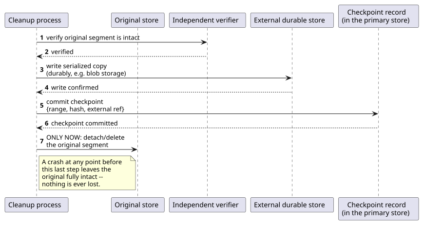
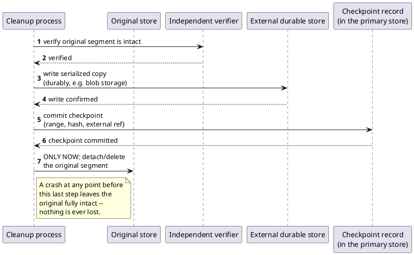

[← Pattern index](README.md)

# Checkpoint-Before-Destroy

## The pattern

Never remove the original copy of data until, in strict order: (1) its
replacement/relocation has been independently verified correct, (2) the
verified replacement has been durably written somewhere else, and (3) a
small, separately-committed pointer or checkpoint record has itself been
durably saved, recording that the externalized copy exists and where it
lives. Only after all three have landed does the original get deleted.
The ordering is the entire point: a crash or failure at any earlier step
always leaves the original copy still in place, so nothing is ever lost
— the only failure mode possible is "the cleanup didn't happen yet,"
never "the data is gone and the copy never actually landed."

**Source:** this is the same discipline behind Martin Fowler's
**Low-Water Mark** pattern in
[*Patterns of Distributed Systems*](https://martinfowler.com/articles/patterns-of-distributed-systems/low-watermark.html) —
"an index in the write-ahead log showing which portion of the log can
be discarded," used precisely so a WAL, which otherwise grows
indefinitely, can be safely truncated only once everything before that
index is known to be durably captured elsewhere (typically a snapshot).
[PostgreSQL's own WAL documentation](https://www.postgresql.org/docs/current/wal-configuration.html)
is the concrete, shipped version of the same rule: a checkpoint record
is written to the WAL, all dirty pages are flushed to disk, and only
*after* that checkpoint is durable are the WAL segments preceding it
recycled or removed. **Kafka's segment retention** is a related but
looser analogy, worth stating precisely rather than overclaiming: Kafka
discards old segments once a configured time/size threshold elapses
(and, separately, only ever compacts or deletes *closed* segments, never
the currently-active one) — a real "don't touch what's still needed"
discipline, but driven by an elapsed-retention policy rather than by an
explicit verify-then-externalize-then-checkpoint sequence the way WAL
checkpointing and this pattern are.

## When you'd reach for it

Any time "shrink or clean up the primary store" and "the data is
genuinely still safe" are two separate claims that must both be true at
once — archiving an append-only log, truncating a write-ahead log,
evicting a cache backed by a slower durable store, or migrating data to
cheaper storage. Anywhere a naive "copy then delete" implementation
could crash between the copy and the delete's own confirmation and
silently lose data, this pattern is the fix.

## Cost

Extra latency and I/O on every cleanup operation — a verify pass, a
durable external write, and a separately committed checkpoint record are
three sequential durable operations where a naive implementation would
do one. It also means cleanup is deliberately conservative: a crash
partway through leaves the original data not-yet-removed even though the
copy might already be safely externalized, so storage isn't reclaimed
as early as a riskier implementation could reclaim it. That conservatism
is the entire point, not an inefficiency to optimize away.

## How this application uses it

`ADR-089` applies this exact sequence to Event Log and `AccessLog`
archival: **verify** the segment's hash chain is intact
(`ChainVerificationService`/`AccessLogChainVerificationService`) →
**serialize** it to NDJSON (the same export format `ADR-068`'s
litigation export already uses) → **write** the blob to a registered
`IAttachmentContentStore` backend (`ADR-032`, reused with no new
interface) → **save** a `ChainCheckpoint` row
(`{SequenceNumberRangeStart, SequenceNumberRangeEnd,
ChainHashAtRangeEnd, ContentProviderKey, ContentProviderRef}`) → only
**then** detach (delete) the original rows. This is implemented
end-to-end in
[`src/EventStore.Archival/ArchivalService.cs`](../../src/EventStore.Archival/ArchivalService.cs)'s
`ArchiveEventLogSegmentAsync`/`ArchiveAccessLogSegmentAsync`, whose own
comments state the invariant directly: "so a crash at any point always
leaves the archived bytes/checkpoint durable BEFORE the only local copy
is ever removed." Ongoing verification of events appended after an
archived segment needs only the checkpoint's `ChainHashAtRangeEnd` — it
never touches archived data, so archiving has zero cost on the live
verification path — while full re-verification of an archived segment
stays possible on demand via `ReVerifyEventLogSegmentAsync`, fetching the
blob back and recomputing `ADR-019`'s chain from scratch. `ADR-056`
separately owns *when* this runs (a deployment-configured retention
policy, not yet built); `ADR-089` owns only *how*.
