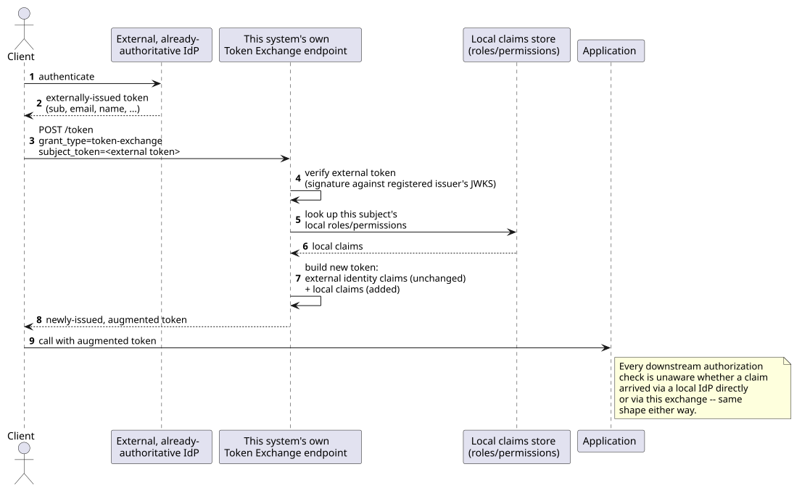
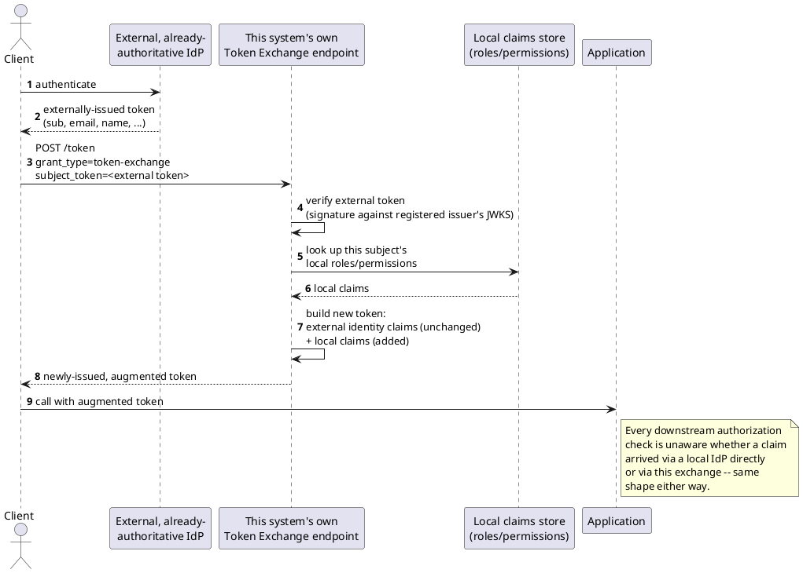

[← Pattern index](README.md)

# Claims Augmentation for Federated IdPs

## The pattern

When an external identity provider (a corporate SSO, Azure AD, Okta —
anything OIDC-compliant) is already authoritative for *who a user is*,
don't try to replace or duplicate that authority locally. Instead,
take the token it issued, verify it, and **enrich** it with claims the
external IdP has no reason to know about — an application-specific
role, a permission, a local entitlement — before the token reaches
your own authorization checks. The external IdP's own identity claims
(`sub`, `email`, `name`, ...) pass through untouched; your own claims
are added alongside them, never overwriting anything.

This is a well-established identity pattern under several names —
**claims augmentation**, **claims transformation**, **token
enrichment** — implemented concretely by Azure AD B2C custom policies,
ADFS claim rules, and Auth0 Actions/Rules, all solving the identical
shape: an externally-issued, already-trusted token gets locally-known
claims added before it reaches application logic. The standardized
wire mechanism most current implementations reach for is
**[RFC 8693, OAuth 2.0 Token Exchange](https://www.rfc-editor.org/rfc/rfc8693)**
(IETF, 2020) — a Security Token Service pattern built on OAuth 2.0
where a client presents a `subject_token` and receives back a newly
minted token, using the `urn:ietf:params:oauth:grant-type:token-
exchange` grant type. Token Exchange is a general-purpose token-
transformation primitive (it also covers impersonation and delegation
via an optional `actor_token`); claims augmentation is one common use
of it, not the only one. **Source:** RFC 8693 (OAuth 2.0 Token
Exchange).

## Also known as

**Claims transformation** and **token enrichment** are the same idea
under different vendor vocabularies (Azure AD B2C uses "claims
transformation," Auth0 uses "Actions/Rules," ADFS uses "claim rules").
All three describe the identical mechanism: enrich, never replace, an
externally-issued token's claims.

## When you'd reach for it

Any time your system needs to accept identity from an IdP it doesn't
own and has no reason to teach your application's own permission
vocabulary to — a corporate SSO federating into a SaaS product, a
multi-tenant platform where each tenant brings its own IdP, or simply
separating "who verifies identity" from "who decides what this
identity can do in *this* application" as distinct concerns owned by
different teams.

## Cost

Verifying an external token means fetching and caching that issuer's
own signing keys (JWKS) — a new external network dependency at
exchange time that didn't exist when the only IdP was your own. It
also introduces a mapping problem that's easy to get wrong: an
external `sub` claim is only guaranteed unique **within its own
issuer** (OpenID Connect Core 1.0's own scoping), never globally — a
naive `sub`-only local-identity mapping silently risks merging two
different people's permissions the moment a second external issuer is
trusted for the same application. The composite (`iss`, `sub`) pair,
not bare `sub`, is the only combination OpenID Connect's Basic Client
Implementer's Guide names as a stable identifier an RP may rely on.

## How this application uses it

`ADR-047` adopts this pattern to support an external, already-
authoritative OIDC IdP alongside `EventStore.DevIdp` (which remains
the default/fallback when no external issuer is configured for an
`AppId`). It reuses RFC 8693 Token Exchange — the same primitive
`ADR-036` (UCAN→JWT) and `ADR-040` (ticket issuance) already use, a
third use case for one already-adopted mechanism, not a new one — via
a new `TrustedFederationIssuer { AppId, Issuer, JwksUri, Description }`
registry entry naming which external issuer(s) are trusted per
application and where to fetch their signing keys. The exchange
verifies the external token against that issuer's JWKS, then looks up
the token's `sub` against this framework's own `Role`/`UserPermission`
records (`ADR-046`, see
[`role-based-access-control-flat.md`](role-based-access-control-flat.md))
and **adds** the resulting claims — the external IdP's own identity
claims are never removed or overridden, the same "additive only"
discipline `ADR-046` already applies to combining permission sources
generalized here to combining claim *sources*.

**The `sub`-collision risk above is exactly what
[`docs/comparisons/federated-identity-mapping.md`](../comparisons/federated-identity-mapping.md)
resolves**, per `ADR-047`'s own flagged open question: it mandates the
composite `(iss, sub)` as the real identity key — never bare `sub` —
realized as a `FederatedIdentityMapping { AppId, Issuer, Sub, ActorId,
CreatedAt }` record, populated via lightweight, first-seen JIT
provisioning at the token-exchange step (a repeat lookup for the same
pair reuses the previously-minted `ActorId`), stopping short of full
SCIM push-based deprovisioning since nothing has required
near-real-time reaction to an external account's termination yet.

Implementation:
[`src/EventStore.DevIdp/FederationService.cs`](../../src/EventStore.DevIdp/FederationService.cs) —
`RegisterIssuerAsync`/`FindAsync` manage `TrustedFederationIssuer`
rows, `FetchSigningKeysAsync` pulls and parses the external issuer's
JWKS, and `GetOrCreateActorIdAsync` is the JIT-provisioning step
itself: look up `(AppId, Issuer, Sub)` in `FederatedIdentityMapping`,
return the existing `ActorId` if found, otherwise mint a new
`federated:{guid}`-shaped `ActorId` and insert the mapping row before
returning it — exactly the resolved-comparison's Option B (composite
key) plus the JIT half of Option C, never the full SCIM protocol.
[`src/EventStore.DevIdp/TrustedFederationIssuer.cs`](../../src/EventStore.DevIdp/TrustedFederationIssuer.cs)
holds the registry entity itself.
