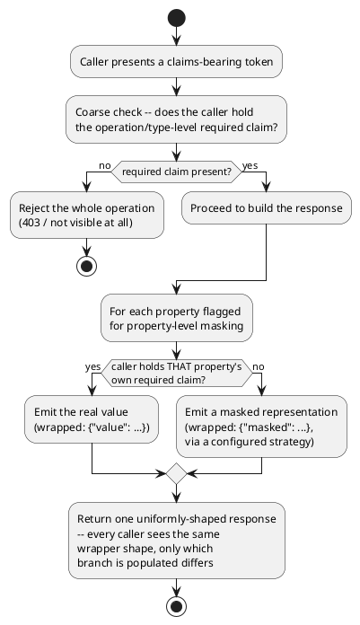

[← Pattern index](README.md)

# Claims-Based Authorization + Property-Level Masking

## The pattern

Two ideas, deliberately layered rather than merged into one check.
First, **claims-based authorization**: instead of asking "does this
user have the right role/group membership" (an identity-centric
question tied to a specific directory's own group model), ask "does
the presented token carry the specific claim this operation requires"
— an opaque `type:value` fact about the caller, checked independently
of *how* that claim came to be true. This decouples the authorization
decision from any one identity provider's own representation of
users, which is exactly the shape a claims-based token (a JWT, a SAML
assertion) already provides for free. **Source:** *A Guide to
Claims-Based Identity and Access Control* (Microsoft patterns &
practices, Dominick Baier, Vittorio Bertocci, Keith Brown, Scott
Densmore, Eugenio Pace, Matias Woloski; 1st ed. 2010, 2nd ed. 2013) —
the reference text that named and popularized this shift from
role/group membership checks to claims as the basic unit of an
authorization decision.

Second, and orthogonal to the first: **property-level (dynamic) data
masking** — redact individual *fields* within an otherwise-visible
record for a caller who lacks a finer-grained claim, rather than
gating the whole record all-or-nothing. Real, current implementations
of exactly this idea (each independently, all under this same name)
include SQL Server's own
[Dynamic Data Masking](https://learn.microsoft.com/en-us/sql/relational-databases/security/dynamic-data-masking)
feature and Oracle Data Redaction — both mask column values at query
time based on the querying identity's privileges, leaving the
underlying stored data untouched. The combination — claims decide
*whether* a caller sees a field's real value; masking decides *what*
they see instead of it when they don't — is what lets one caller
receive a full record and another receive the same record shape with
some fields obscured, from one query, with no second code path.

## When you'd reach for it

The coarse half (claims-based authorization) fits anywhere you want
authorization decoupled from a specific identity provider's group
model — any OAuth2/OIDC-fronted system, really. The finer half
(property-level masking) is worth its own mechanism specifically when
an all-or-nothing record-level check is too blunt: a record has some
fields everyone with base access should see and other fields only a
narrower set of callers should see the *real* value of (a tax ID
inside an otherwise-visible order, a patient's identifying fields
inside an otherwise-visible clinical event) — and you'd rather express
that once, declaratively, per field, than fork the whole response
shape per caller.

## Cost

Claims-based authorization pushes the real complexity onto whoever
issues tokens — the claim-checking code is trivially simple (`"does
the caller have claim X"`), but *getting the right claims onto the
token in the first place* (role expansion, delegation, federation) is
where the real design work lives, and a claims check alone says
nothing about how it got there. Property-level masking's cost is a
uniform wire-shape tax: every consumer of a maskable field, even a
fully authorized one, now codes against a wrapper
(`{"value":...}`/`{"masked":...}`) instead of a bare value — a real
integration cost paid by *every* caller in exchange for the field
working uniformly regardless of type, and for authorized/unauthorized
responses never being distinguishable by shape alone.

## How this application uses it

`ADR-008` is the claims half: `EventTypeDefinition` carries optional
`RequiredPublishClaim`/`RequiredReadClaim` fields (later generalized
to a list by `ADR-050`), each a `"type:value"` string, gating publish
and read independently per event type — deliberately two separate
knobs, since a caller may be allowed to publish an event type without
being allowed to read it back. Visibility for the Lineage API and
Follow's `parentEventIds` is enforced **per node**, not per request —
a node the caller can't see is omitted entirely from the response
without failing the rest of it, except for the Lineage API's own
named `{eventId}` root, which must be visible to the caller or the
whole request is rejected outright.

`ADR-009` is the masking half, and deliberately reuses `ADR-008`'s
exact `"type:value"` claim string at finer grain via a `x-masking`
schema vendor extension, rather than inventing a second claim format.
A maskable property's response type becomes a three-way `oneOf`
wrapper (`{"value":...}` / `{"masked":...}` / `{"erased":true}` once
`ADR-057`'s crypto-shredding added the third branch) — the same
uniform shape regardless of which branch a given caller receives.
Three masking strategies exist (`FixedValue`, `PartialReveal`,
`Hash`), each an `IMaskingStrategy` behind a Strategy-pattern seam
(see [`strategy-pattern-extensible-masking.md`](strategy-pattern-extensible-masking.md)
for that mechanism specifically) — this doc is about the two-axis
authorization *shape* those strategies plug into, not the
extensibility mechanism itself. `ADR-009`'s `revealOnDemand` is a
further, orthogonal refinement layered on top — even a fully
authorized caller gets the masked display form by default for a
`revealOnDemand` field, with the real value fetched only via an
explicit, separately-audited `revealField` action.

This complements, rather than duplicates,
[`docs/comparisons/authorization-model.md`](../comparisons/authorization-model.md)'s
own coverage: that comparison surveys candidate models (RBAC, ABAC,
ReBAC, DACL, classification-based, Hybrid) for a *further*, per-task/
per-instance access question this two-axis mechanism doesn't answer
today (`RequiredClaims` is type-wide, `x-masking` is per-field but
still schema/claim-driven, neither has an instance-scoped "this
specific task, this specific actor" concept) — this pattern doc
describes the already-built, foundational two-axis mechanism that
comparison's own options would sit on top of, not a third option
alongside them.

Implementation:
[`src/EventStore.Domain/SchemaRegistry/RequiredClaimEvaluator.cs`](../../src/EventStore.Domain/SchemaRegistry/RequiredClaimEvaluator.cs)
(`HasAny`/`HasClaim`/`HasClaimForEntity` — the shared claim-checking
primitive both `ADR-008`'s type-level gate and `ADR-009`'s per-field
`x-masking.requiredClaim` reuse directly, never a second parser) and
[`src/EventStore.Masking/PayloadMasker.cs`](../../src/EventStore.Masking/PayloadMasker.cs)
(the recursive schema-driven transform that walks a payload against
its schema's `x-masking` annotations, calling the caller-supplied
`hasClaim` delegate at each masked leaf and dispatching to the
resolved `IMaskingStrategy`).
