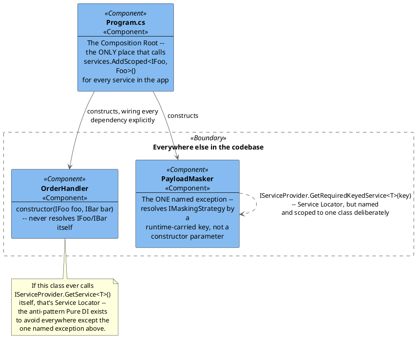

[← Pattern index](README.md)

# Composition Root & Pure DI

## The pattern

A **Composition Root** is the single, specific place near an application's
entry point where every object graph is actually wired together — every
`new` of a service with dependencies, every interface-to-implementation
binding, all visible in one place. **Source:**
[Mark Seemann — Composition Root](https://blog.ploeh.dk/2011/07/28/CompositionRoot/),
generalized further in his book *Dependency Injection Principles,
Practices, and Patterns* (with Steven van Deursen, Manning, 2019).
**Pure DI** is Seemann's own name for using a DI *container* only as a
convenience inside that one root — every registration still an explicit,
hand-written line — as opposed to letting the container's own
convention-scanning features (assembly scanning, naming-convention-based
auto-registration, attribute-driven discovery) decide what gets wired to
what.

The distinction that actually matters: a DI **container** is a library; a
Composition Root is an **architectural location** — exactly one, as close
to the application's entry point as possible, where every other part of
the codebase is composed. Everywhere else, a class only ever declares its
dependencies via constructor parameters and never reaches for the
container itself — reaching for the container from inside ordinary
application code is the **Service Locator** anti-pattern (Seemann's own
term for it), because it hides a class's real dependencies behind a
runtime lookup instead of a visible constructor signature.

## When you'd reach for it

Any application assembled from more than a handful of interchangeable
parts (interfaces with more than one real or potential implementation) —
which is most non-trivial software. The question Pure DI answers isn't
"should dependencies be injected" (nearly always yes) but "should the
*wiring itself* be discovered by convention/reflection, or written out
explicitly" — Pure DI is the answer for a codebase that values being able
to answer "where does this get registered" by reading one file, over the
reduced boilerplate a scanning convention gives at the cost of that
traceability.

## Cost

A Composition Root that lists every registration explicitly grows
linearly with the number of services in the application — more lines to
maintain than a scanning convention that infers registrations
automatically, and every new service needs an explicit line added by
hand, not picked up for free. The trade is deliberate: convention-based
auto-registration can silently register the *wrong* implementation (two
classes matching the same naming pattern) with no compiler or reviewer
ever seeing it happen; Pure DI makes every binding a visible, reviewable
line of code instead.

## Also known as

**Pure DI** is specifically Seemann's term for "use a DI container, but
configure it entirely by hand" — distinguish from **Poor Man's DI**
(no container at all, just `new`-ing everything by hand in the root,
which Pure DI generalizes beyond) and from what Seemann calls the
**Service Locator** anti-pattern (a class reaching into a container or
static registry at the point of use, rather than declaring its
dependencies in its constructor) — the specific thing a Composition Root
exists to push to the edges of an application and nowhere else.

## How this application uses it

`ADR-041` adopts this directly and by name: constructor injection
everywhere it's possible, and manual, explicit composition — every
`services.AddScoped<IFoo, Foo>()`-style line written out in each
`EventStore.Host.<Provider>`'s `Program.cs` (`06-solution-structure.md`)
— over assembly-scanning auto-registration. The container itself stays
`Microsoft.Extensions.DependencyInjection`; what's rejected is
convention-magic layered on top of it, not the container itself.

`ADR-059` **formalizes this as the answer to "how do I add an
extension"** specifically, not a new decision: a hosting team adding a
custom `IMaskingStrategy`, `IUpcastExpressionEvaluator`, or
`IErasureKeyStore` implementation writes a class and registers it in
*their own* composition root — the identical shape `ADR-041` already
established, just named explicitly as the extensibility story rather
than only inferable from the general DI stance. There is, and per
`ADR-059`, will never be, a dynamic plugin-discovery mechanism (assembly
scanning, a runtime plugin manifest, anything MEF/Eclipse-Extension-
Points-shaped) anywhere in this framework.

`ADR-062` extends the same idea one level out: once the engine is
distributed as installable NuGet/npm packages rather than forked per
deployment, **a downstream domain's own executable project *is* the
composition root** — it references exactly the `EventStore.*` packages
it needs (`EventStore.Core` plus one of `.Host.Sqlite`/`.Postgres`/
`.SqlServer`, per `ADR-001`'s still-unchanged "one provider, chosen at
build time" rule) and calls the framework's own `IServiceCollection`
extension methods from its own `Program.cs`. `ADR-059`'s registration
discipline doesn't change at all — `ADR-062` only settles *where* the
referenced code comes from (an installed package vs. a forked copy), not
how it's wired.

**The one deliberate, explicitly-named exception**: `PayloadMasker`
(`ADR-009`) resolves its matching `IMaskingStrategy` via
`IServiceProvider.GetRequiredKeyedService<IMaskingStrategy>(strategyName)`
— a genuine Service Locator call, not a constructor parameter — because
which strategy applies is a runtime fact carried in registered schema
data (the `x-masking.strategy` string), not something a compile-time
constructor parameter can express. See [Strategy Pattern (Extensible
Masking/Redaction Content)](strategy-pattern-extensible-masking.md) for
the full reasoning; this is the only place in the entire design Pure DI's
"never reach for the container from application code" rule is
knowingly, narrowly broken, and it's named as such rather than silently
contradicted.
