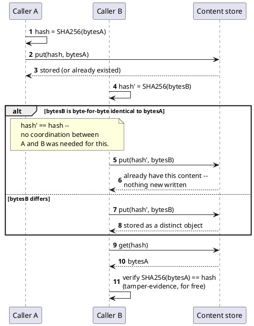

[← Pattern index](README.md)

# Content-Addressable Storage

## The pattern

Address a binary object by the hash of its own bytes, instead of by a
path, a filename, or an assigned sequential ID. The object's identity
*is* a deterministic function of its content: store `(SHA-256(bytes),
bytes)`, and any two callers who compute the hash of identical bytes
arrive at the identical key, independently, with no coordination. Three
properties fall out of this for free, not as separate features that need
building: **deduplication** (uploading the same bytes twice just resolves
to the same key — there is no "second copy" to even consider storing),
**cacheability** (a content-addressed reference never goes stale, since
the referenced content can't change without becoming a different
reference — the classic cache-invalidation problem structurally can't
occur), and **tamper-evidence** (recomputing the hash of what's actually
stored either matches the reference or it doesn't; there's no room for a
silent, undetected substitution).

**Source:** Git's own object database is the most recognizable
real-world instance of this pattern: "Git is, at its core, a
content-addressable filesystem: a key-value store where the key is a
[SHA-1] hash of the content and the value is the content itself" ([Pro
Git, "10.2 Git Internals - Git
Objects"](https://git-scm.com/book/en/v2/Git-Internals-Git-Objects)) —
the same book notes this is precisely why an unchanged file across many
commits, or two identical files anywhere in the repository, is stored
only once.

## Also known as

A **content-defined chunking** extension of the same idea applies it at
sub-file granularity: instead of hashing one whole object, a rolling hash
(a **Rabin fingerprint** — [Rabin, "Fingerprinting by Random
Polynomials," Harvard Center for Research in Computing Technology, Tech.
Report TR-15-81, 1981](https://link.springer.com/chapter/10.1007/978-1-4613-9323-8_11),
first applied to this exact problem by the [Low-Bandwidth Network File
System, Muthitacharoen/Chen/Mazières, SOSP 2001](https://blog.gopheracademy.com/advent-2018/split-data-with-cdc/))
slides over the byte stream and marks a chunk boundary wherever the
hash's low bits match a fixed pattern. Because the boundary is a function
of local content rather than a fixed byte offset, an edit shifts only the
chunks near the edit — everything before and after it re-chunks
identically — unlike naive fixed-size blocking, where a single inserted
byte shifts every following block boundary and defeats deduplication
entirely. `restic`, Borg Backup, and `casync` all converge on this same
rolling-hash-plus-per-chunk-fingerprint shape for exactly this reason.

## When you'd reach for it

Whenever the interesting property of a binary object is its *content*,
not its position — a document, an image, a build artifact, a backup
segment. Especially valuable when uploads/writes happen from multiple,
uncoordinated sources that might genuinely submit the same bytes (dedup
for free), when references to the object need to be safely cached
indefinitely, or when a later reader needs to independently verify the
object hasn't been altered since it was stored.

## Cost

Content-addressing alone only dedups a whole object against an
identical whole object — it gives no benefit for two large objects that
mostly overlap but differ somewhere, and no partial-fetch capability for
a peer that already has most of an object. Content-defined chunking
answers that, but at a real added cost: a chunk index has to be
computed, stored, and diffed, which is pure overhead for small objects
where whole-object hashing already captures all the achievable benefit —
chunking is only worth turning on above a size threshold. A
content-addressed store also has no notion of "the current version at
this path" the way a conventional file store does — a caller always
needs the actual hash to fetch anything, which pushes the burden of
tracking "what's the latest reference" up to whatever links into the
store (here, an event's own `AttachmentRef`), not the store itself.

## How this application uses it

`ADR-032` makes `Attachment` content-addressed by construction —
`ContentHash` (SHA-256 of the raw bytes, the same primitive `ADR-011`/
`ADR-019` already use elsewhere, not a new algorithm) is the durable
reference (`src/EventStore.Domain/Streaming/Attachment.cs`); uploading
identical bytes twice naturally resolves to the existing stored object,
the same idempotency-by-content-equality reasoning `ADR-011` already
applies to events. `AttachmentRef` is the envelope-metadata field linking
a `ContentHash` to an `EntityId` and/or a specific `EventId` — a fifth
member of this design's repeated-relationship-field family, distinct
from `parentEventIds`/`MaterializationOfEventId`/`TelemetryPointer`.
Storage itself is out-of-band from the event log, behind a pluggable,
keyed `IAttachmentContentStore` seam
(`src/EventStore.Abstractions/IAttachmentContentStore.cs`, implemented by
`InMemoryAttachmentContentStore` for the built-in provider and named,
documented cloud tiers for a real deployment), with `ContentProviderKey`/
`ContentProviderRef` as purely internal routing fields a background
mover uses to migrate cold attachments between storage tiers —
`ContentHash` itself stays the one stable identity a caller ever
references, regardless of which backend currently holds the bytes.

`ADR-032`'s amendment extends this to sub-file granularity via the
content-defined chunking described above: `Attachment.ChunkIndex` is an
optional list of `ChunkRef` records (`ChunkHash, Offset, Length,
ContentProviderKey, ContentProviderRef` — each independently
content-addressable and independently stored, `src/EventStore.Domain/
Streaming/Attachment.cs`), populated only above a configurable size
threshold. This gives two concrete, already-needed capabilities a real
mechanism rather than inventing a new requirement to justify one:
sub-file dedup across large attachments that share common chunks, and
genuine partial sync — `ADR-033`'s peer-sync mesh and `ADR-069`'s
offline-client reconnect scenario can diff two `ChunkIndex`es and fetch
only the chunks (by `ChunkHash`) a destination doesn't already have,
rather than re-transferring the whole object, with a natural resume
point if a transfer is interrupted mid-way.
