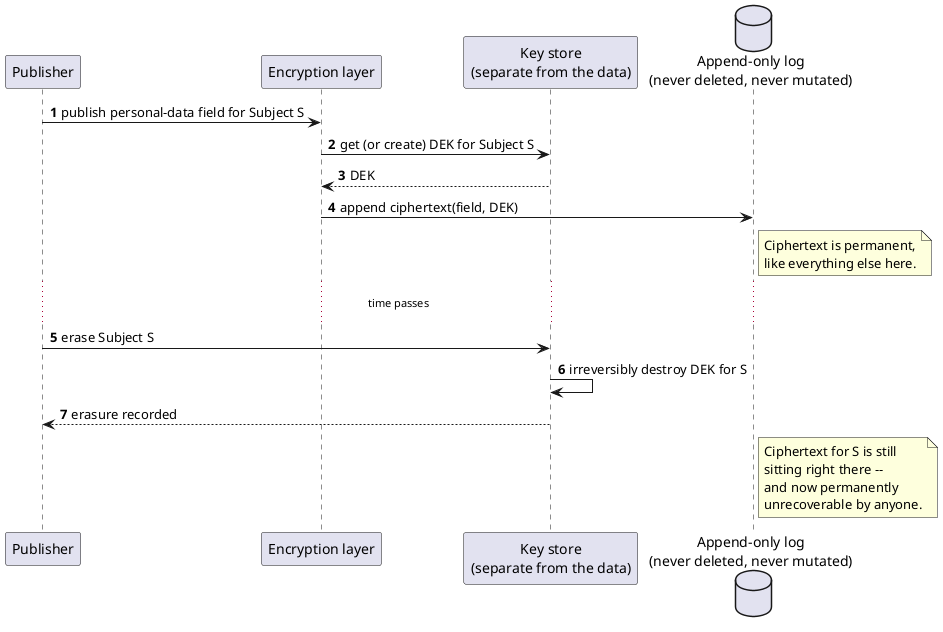

[← Pattern index](README.md)

# Crypto-Shredding (Cryptographic Erasure)

## The pattern

Encrypt a data subject's personal data with a key scoped to that
subject, and hold the key **separately** from the data it protects
(typically via [Envelope Encryption](envelope-encryption.md) — a
per-subject Data-Encryption Key wrapped by a master key held in a KMS).
"Erasing" the subject's data is then just: destroy that one key,
irreversibly. The ciphertext itself is never touched, deleted, or
rewritten — it stays exactly where it was, forever, as inert bytes that
can no longer be turned back into plaintext by anyone, including someone
who could previously read it. This is the mechanism of choice for any
system whose own architecture depends on data never being deleted or
mutated in place (an append-only log, an immutable backup, a write-once
archive) but that still needs to honor a real erasure obligation for a
specific subject.

**Source:** [Mathias Verraes — "Eventsourcing Patterns:
Crypto-Shredding"](https://verraes.net/2019/05/eventsourcing-patterns-throw-away-the-key/)
is the canonical write-up of this pattern for event-sourced systems
specifically — the pattern itself (encrypt-then-destroy-the-key as a
substitute for physical deletion) predates that piece and is standard
cryptographic practice more broadly, but Verraes' article is the specific,
widely-cited source for applying it to an append-only event log, which is
exactly this pattern's fit here.

## When you'd reach for it

Any time "the right to erasure" (or an equivalent internal retention
policy) collides with an architecture that deliberately never deletes or
mutates its own history — an event-sourced log, a hash-chained audit
trail, a write-once backup tier. Physically deleting or rewriting the
row would break the very properties (replayability, tamper-evidence,
"never lose data") the system exists to guarantee; crypto-shredding lets
both requirements hold at once by making the erasure act on the key,
not the record.

## Cost

**Regulatory, not just technical, and worth stating plainly rather than
assumed settled.** [GDPR Article 17](https://gdpr-info.eu/art-17-gdpr/)
(the right to erasure) is satisfied by cryptographic erasure according to
the European Data Protection Board (Guidelines 5/2019), the UK ICO, and
the French CNIL — but this is conditioned on strong encryption (AES-256),
genuinely irreversible key destruction, and an auditable destruction
record; it is a widely-accepted *practical* answer, not a universally
settled *legal* one — Verraes himself notes some readings hold that
encrypted personal data is still personal data under GDPR's letter.
Two Article 17(3) exemptions carve out data this mechanism should
deliberately *not* try to reach at all: **17(3)(b)** — "compliance with a
legal obligation which requires processing... or for the performance of a
task carried out in the public interest" — and **17(3)(e)** —
"establishment, exercise or defence of legal claims." A record whose
entire purpose is evidentiary (a signature, a regulatory retention
requirement) falls outside the right to erasure in the first place, so
crypto-shredding it would defeat the reason the record exists, not
satisfy a real request.

There's also a real operational cost distinct from the legal one: the
key store itself becomes as critical as the data it protects — losing
its contents *without* any erasure request having happened is
equivalent to accidentally erasing every subject at once, an inverse
risk worth weighing with the same seriousness as celebrating the erasure
capability. And it only erases what was actually encrypted under the
destroyed key — if the entity identifier itself is derived from PII
(an email address used directly as a lookup key, say), destroying the
key doesn't erase the identifier, only the payload fields that were
classified and encrypted.

## How this application uses it

`ADR-057` scopes crypto-shredding to `EntityId`, encrypting every
property already carrying `x-masking.regulatoryClassification`
(`ADR-009`) with a per-`(AppId, EntityId)` DEK via
[Envelope Encryption](envelope-encryption.md) — see that pattern's own
"How this application uses it" for the concrete `IErasureKeyStore`
backends and the shared `EnvelopeAesGcm` primitive
(`src/EventStore.Erasure/`). Requesting erasure publishes a reserved,
permanent `EntityErasureRequested` event (`src/EventStore.Erasure/
EntityErasureRequestedEventType.cs`) recording when and by whom, then
destroys that entity's DEK via the configured backend's own irreversible
key-destruction primitive — the fact that erasure happened is itself
preserved forever, consistent with this design's "never lose data"
principle; only the erased *content* is gone. The read-path wrapper
gains a third branch, `{"erased": true}`, deliberately distinct from
`{"masked": ...}` — `masked` means someone with the right claim can
still see the value; `erased` means no one ever will again, a fact the
API has to state plainly rather than reuse the softer masking signal for.

`ADR-057` categorically doesn't reach `ADR-066`'s `Signature`/`ActorId`
envelope fields — a deliberate, reasoned exemption under GDPR Art.
17(3)(b) (the retention duty 21 CFR Part 11/ICH GCP-shaped records
already carry) and 17(3)(e) (a signature's entire evidentiary purpose),
not merely a structural side effect of `ADR-057` only ever touching
`x-masking`-classified `Payload` fields and never envelope metadata.
`ADR-057`'s own compliance note is explicit that this legal grounding was
checked against GDPR specifically, and that CCPA/CPRA's own deletion-
right exemptions are a related but not independently verified-identical
structure — flagged rather than assumed to transfer directly.
