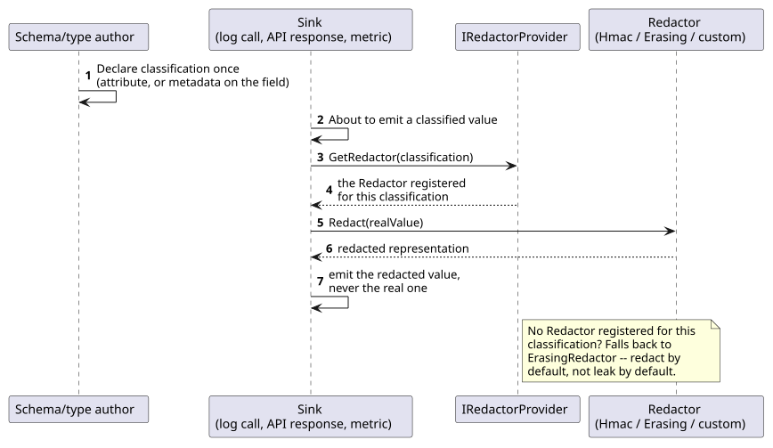
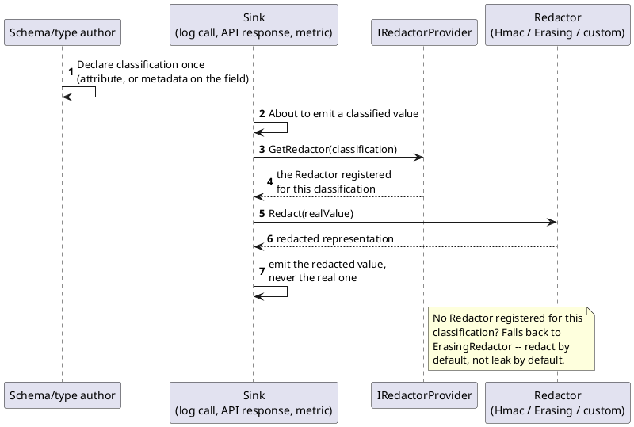

[← Pattern index](README.md)

# Data Classification + Redaction

## The pattern

Tag a piece of data with its sensitivity **once**, at the point where it's
declared — not at every place it might later be written out. Every sink
that could leak it (a log line, an API response, a metrics dimension, an
error message) then consults that one tag and applies the handling it
requires — mask it, hash it, drop it entirely — automatically, without
each call site having to remember to do the right thing on its own. The
tag and the enforcement are deliberately decoupled: a `DataClassification`
travels with the value; a `Redactor` (selected per classification, via a
provider) is what actually acts on it, at whichever sink the value happens
to reach. This turns "did every developer remember not to log the SSN"
from a discipline problem into a declared, structural one.

**Source:** [Microsoft's own .NET data redaction
documentation](https://learn.microsoft.com/en-us/dotnet/core/extensions/data-redaction)
describes exactly this mechanism generically: a `DataClassification`
taxonomy attached to a value (via an attribute on a `[LoggerMessage]`
parameter, or resolved programmatically), an `IRedactorProvider` that maps
a classification to the `Redactor` registered for it, and a documented
default — an unregistered classification falls back to the
`ErasingRedactor`, i.e. redact-by-default rather than leak-by-default.

## When you'd reach for it

Any time the same sensitivity fact ("this field is PII/PHI/PCI") needs to
be respected at more than one output surface, and you don't want to
re-implement — or worse, forget to implement — the handling rule at each
one separately. It's the right fit specifically when a sink is generic
and reusable (a structured logger, a serializer) rather than one
bespoke path where an inline check would be just as simple.

## Cost

The tag only protects a sink that actually routes through it. An ad hoc
`logger.LogInformation($"...{payload}...")` that bypasses the classified,
structured call path entirely leaks in plain text regardless of how
carefully the classification taxonomy is designed — this is a real
discipline/code-review gap the mechanism itself cannot close, not a flaw
in the pattern. It also only ever changes what a *sink* renders; it says
nothing about what's actually persisted, and it's not a substitute for a
real erasure mechanism if the requirement is "this value must become
permanently unrecoverable" rather than "this value must not appear in a
log or response" — those are different problems (see [Crypto-shredding](crypto-shredding.md)
for the former).

## How this application uses it

`ADR-050` extends `ADR-009`'s existing property-level `x-masking`
classification to drive a second sink — application logs — reusing
[`Microsoft.Extensions.Compliance.Redaction`](https://learn.microsoft.com/en-us/dotnet/core/extensions/data-redaction)
+ `Microsoft.Extensions.Telemetry`, deliberately in two different call
shapes for two different data shapes: statically-typed internal log call
sites attach a real `DataClassification`-derived attribute directly to a
`[LoggerMessage]` parameter (built as `EventStore.Masking.
ActorIdentityAttribute`, a `DataClassification` under a new
`ActorIdentityTaxonomy` — see `src/EventStore.Masking/
ActorIdentityAttribute.cs`), while dynamic, schema-driven `Payload`-derived
values (no compile-time property to attach an attribute to) resolve a
`Redactor` programmatically via `IRedactorProvider.GetRedactor(
classification)` instead. A concrete, motivated call site:
`PublishService.PublishAsync` (`src/EventStore.Inbox/PublishService.cs`)
logs which actor was rejected and why on a `Forbidden`/`StepUpRequired`
rejection via `PublishServiceLogMessages.PublishRejected`
(`src/EventStore.Inbox/PublishServiceLogMessages.cs`), whose `actorId`
parameter carries `[ActorIdentity]` — a real security diagnostic that
never actually reaches the captured log output in plain text, verified by
`StaticLogRedactionSqliteTests.
ARejectedPublishLogsWhoWasRejectedWithTheActorIdentityRedacted`.

The same ADR also guarantees this classification metadata — plus
`ADR-009`'s original `x-masking` and `ADR-050`'s own new
`RequiredClaims` — is emitted into the generated OpenAPI/AsyncAPI
documents as real Specification Extensions (`x-required-claims`,
`x-masking`), via `OpenApiDocumentBuilder`/`AsyncApiDocumentBuilder`
(`src/EventStore.SpecGeneration/`), so a reader of the generated docs can
see which claim is required and which fields are masked without needing
registry access — the "tag once, every consuming surface respects it"
idea applied to documentation generation as a third sink, not just logs
and query responses.

**Explicitly declined siblings, not gaps**: per `docs/comparisons/
masking-strategies.md`, this design deliberately ships only two masking
*content* strategies (`PartialReveal`, keyed `Hash`) and declines three
others that would otherwise seem like natural extensions of "classify
once, redact everywhere" — format-preserving encryption (would require a
first-ever key-management primitive for no stated need), generalization/
bucketing (a fourth strategy for a need nobody has stated, and one that
risks being mismarketed as a real k-anonymity guarantee this design's
per-event transform can't actually deliver), and tokenization (its
defining property — a *different* party resolving the real value
*later* through a *different* mechanism — isn't a redaction-content
tweak at all; it would need a whole new vaulted or keyed-reversal
component). None of the three are missing pieces of this pattern; they're
KISS-declined options recorded so a future reader doesn't wonder whether
they were merely overlooked.
