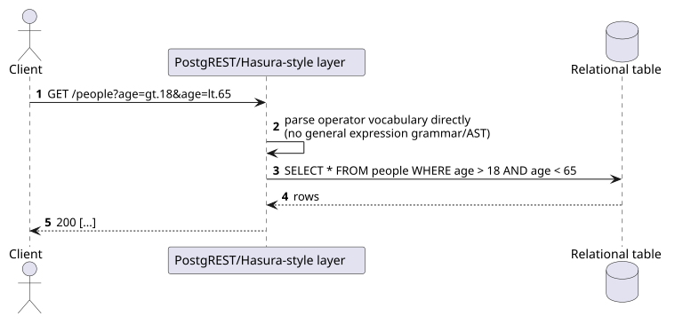
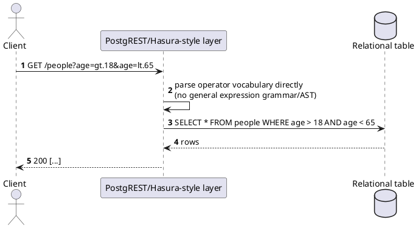

[← Pattern index](README.md)

# Declarative REST Filter Operators (PostgREST/Hasura-style)

## The pattern

Expose filtering as a small, direct vocabulary of comparison operators
applied straight to columns/fields in the URL or a query object — no
separate query language to parse, no AST: `?age=gt.18` (PostgREST) or
`where: { age: { _gt: 18 } }` (Hasura), with a fixed operator set
(`eq`/`gt`/`gte`/`lt`/`lte`/`in`/`like`/`is_null`/boolean `and`/`or`/
`not` composition). **Sources:**
[PostgREST — Tables and Views](https://docs.postgrest.org/en/stable/references/api/tables_views.html),
[Hasura — Filter Query Results](https://hasura.io/docs/2.0/queries/postgres/filters/index/).
Both project a REST (or REST-plus-GraphQL, for Hasura) surface directly
over a relational schema, generated rather than hand-written per
endpoint.

## When you'd reach for it

A thin, largely auto-generated API layer directly over a relational
schema, where the filtering need is genuinely "compare a column to a
value with a small set of operators" and a full query/expression
language would be more machinery than the problem calls for.

## Cost

Tightly coupled to a relational operator model — no native answer to
hierarchical/graph traversal of related data, and no subscription/
real-time concept in the base REST surface (Hasura's own answer to that
gap is layering GraphQL on top, not extending this filter vocabulary).

## How this application uses it

**Compared, not adopted** — and this project's own history briefly
touched a version of this option: pre-`ADR-003`, filtering here was
closer to bare, undeclared-field filtering, which `ADR-003` already
constrained (only pre-declared `FilterableField`s, rejecting unknown
fields before touching the database) specifically because an
unconstrained version of this pattern risks silent full table scans.
[The API query layer comparison](../comparisons/api-query-layer.md)
raises a telling data point against adopting a fuller version of this
pattern here: **Hasura itself layers GraphQL on top of Postgres**
precisely for the hierarchical-query-plus-subscription need this design
also has — the tool most associated with this style of filtering didn't
consider its own declarative-operator surface sufficient once real-time
and nested relations mattered.
