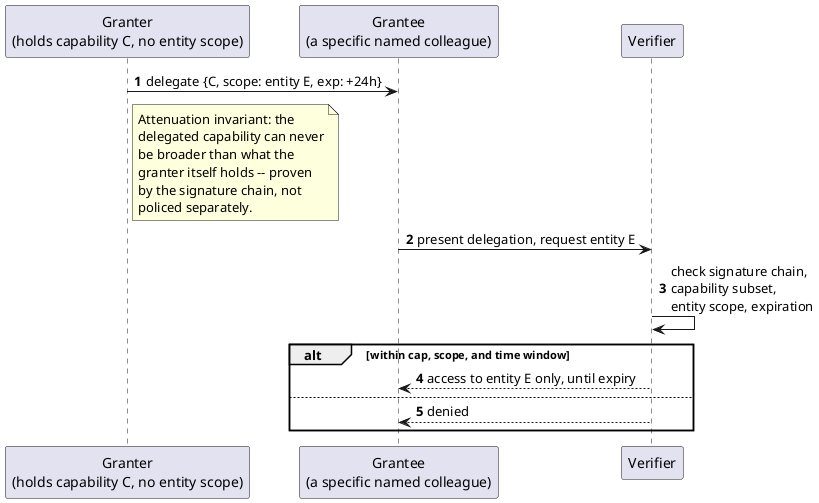

[← Pattern index](README.md)

# Delegated, Capped, Time-Boxed Access Grants ("Secondary Opinion" Access)

## The pattern

Let one authorized party unilaterally extend a slice of their own
access to a second, specific party — capped so the delegate can never
end up with more authority than the delegator held, scoped to a
specific resource rather than blanket clearance, and bounded to a fixed
window of time — without needing a central authority to mint a new
grant from scratch. The enabling mechanism is UCAN's own **attenuation**
invariant: every delegated capability chain must be an equal or
narrower subset of what the delegator holds, checked cryptographically
via the signature chain itself, not by a second, separately-trusted
authority re-verifying the cap by hand. **Source:** the UCAN
specification's delegation semantics — "every unique delegated
capability MUST have equal or narrower capabilities from their
delegator" ([ucan.xyz/specification](https://ucan.xyz/specification/));
see [Self-attested, offline-verifiable delegation
(DID/UCAN)](self-attested-did-ucan-delegation.md) for the general
delegation mechanism this pattern applies to a specific access-grant use
case.

## Also known as

This is deliberately **not** the classical **Four Eyes Principle**
(also "two-person rule," "dual control") — that pattern requires *two*
people to jointly approve *one* action before it proceeds (a bank
transaction sign-off, a production deployment); this mechanism is one
person *unilaterally delegating* access to another, with no joint
approval step at all. The two are easy to conflate because both involve
"more than one person" and "sensitive access," but they solve different
problems: Four Eyes prevents any single person from acting alone; this
pattern is specifically about one person acting alone to *extend*
access, deliberately, ahead of the need.

The closer real analogue is healthcare **break-glass access** —
temporary, audited, capped emergency access to a record — except
break-glass is normally *self-service* (the accessing clinician invokes
it for themselves, typically emergency-triggered), while this mechanism
is *peer-granted* (one specific authorized user extends access to
another specific named user, deliberately, ahead of the need, not in
response to an emergency). See [HIPAA
§164.312(a)(2)(ii)](https://hipaa.yale.edu/security/break-glass-procedure-granting-emergency-access-critical-ephi-systems)
for the regulatory shape break-glass access borrows from.

## When you'd reach for it

A holder of elevated, sensitive access needs to loop in a specific
second person — for a consult, a second opinion, a temporary handoff —
without either granting them standing access to everything the first
person can see, or routing the request through a central administrator
who has to manually provision and later remember to revoke a new grant.

## Cost

The delegated capability is only as safe as the granter's own judgment
at the moment of delegation — nothing stops an authorized-but-careless
or -malicious granter from delegating to the wrong person, since the
cap only bounds *how much* can be delegated, not *whether* delegating it
at all was a good idea. ~~In this project's own implementation, the cost
is sharper still: a grant, once issued, is valid until its own
expiration passes with **no revocation-before-expiry mechanism at
all** — a granter who changes their mind, or an operator who needs to
pull a grant early, currently has no way to do so; the only lever is
keeping the time-box short.~~ **Resolved by `ADR-104`, direct request**:
a live revocation check (a `UcanDelegationRevoked` reserved event,
consulted at validation time alongside the existing offline checks) is
now the accepted design — a granter or operator can revoke before
natural expiry once that mechanism is actually built.

## How this application uses it

`ADR-043` reuses `ADR-036`'s UCAN delegation wholesale rather than
building a second mechanism: the granter issues a UCAN delegation naming
the grantee's DID, a subset of the granter's own currently-held
claim(s) (e.g. `clearance:phi`), an **entity-scope restriction** (one
specific `EntityId` — "this patient's record," not blanket clearance),
and an expiration. `src/EventStore.Ucan/DelegatedCapability.cs` is the
concrete shape: `record DelegatedCapability(string Claim, string?
EntityScope)`, with a `null` scope meaning unscoped (`ADR-043`'s own
"unaffected, default case"). `UcanValidator.ValidateAsync`
(`src/EventStore.Ucan/UcanValidator.cs`) enforces the attenuation
invariant directly — when the delegation carries a proof, every
requested capability must already be present in that proof's own
claims, or validation fails with an explicit "over-broad delegation"
error.

`ADR-008`'s claim model gained a general, standing entity-scope
dimension to support this — see [Row-Level Security (application-layer,
portable across providers)](row-level-security-application-layer.md)
for how that scope is actually checked once the claim reaches a query.

The Consequences section of `ADR-043` itself records the real gap named
above under Cost: no `accessGrant`/`accessGrantRevoked` event type
exists in `src/` — a delegation today leaves no Event Log trail that it
was ever issued, and cannot be revoked early. Every *read* made under a
delegated grant is, however, independently logged — `ADR-045`'s
`AccessLogEntry`, written regardless of how the caller's access was
obtained.

`ADR-043`'s own amendment composes this mechanism with [Self-attested,
offline-verifiable delegation](self-attested-did-ucan-delegation.md) a
second time, for true-offline break-glass — see that pattern doc's own
"How this application uses it" for the composition.
